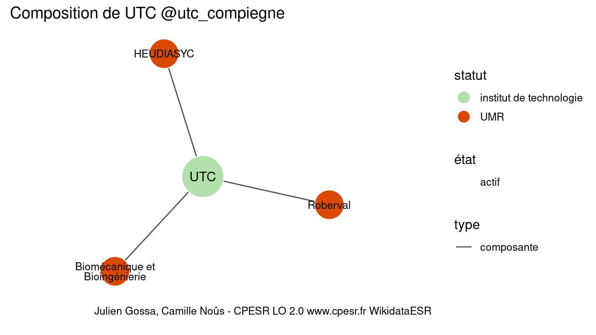
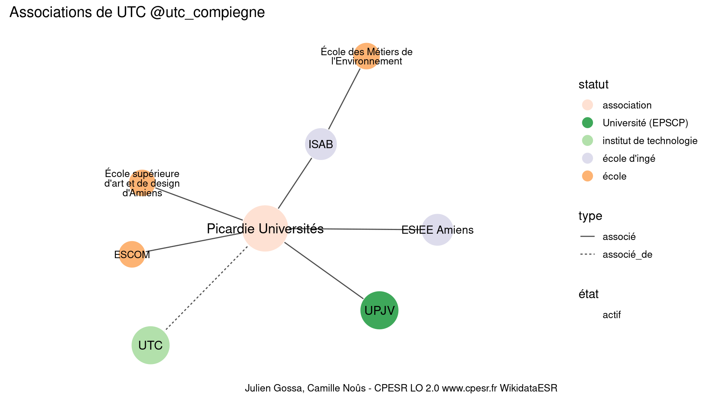

Warnings wikidataESR pour : UTC @utc_compiegne(01/10/2023
================

- Edition wikidata : [Q622906](https://www.wikidata.org/wiki/Q622906)
- Guide d'édition : [wikidataESR](https://github.com/cpesr/wikidataESR/)

- Discussion sur le guide d'édition : [github](https://github.com/cpesr/wikidataESR/issues)


## histoire 

 

Problèmes détectés dans les entités :

|entité                                           |alias |statut                  |message              |
|:------------------------------------------------|:-----|:-----------------------|:--------------------|
|[Q622906](https://www.wikidata.org/wiki/Q622906) |UTC   |institut de technologie |Statut trop imprécis |

 


Erreur : les données sont probablement trop partielles.
```
Error in wdesr_ggplot_graph(df, node_size = node_size, label_sizes = label_sizes, : Empty ESR graph: something went wrong with the graph production parameters

``` 


## composition 

 

Problèmes détectés dans les entités :

|entité                                               |alias                         |statut                  |message                |
|:----------------------------------------------------|:-----------------------------|:-----------------------|:----------------------|
|[Q622906](https://www.wikidata.org/wiki/Q622906)     |UTC                           |institut de technologie |Statut trop imprécis   |
|[Q30262282](https://www.wikidata.org/wiki/Q30262282) |Biomécanique et Bioingénierie |UMR                     |Alias manquant ou long |

 


## associations 

 

Problèmes détectés dans les entités :

|entité                                           |alias |statut                  |message              |
|:------------------------------------------------|:-----|:-----------------------|:--------------------|
|[Q622906](https://www.wikidata.org/wiki/Q622906) |UTC   |institut de technologie |Statut trop imprécis |

 


Erreur : les données sont probablement trop partielles.
```
Error in wdesr_ggplot_graph(df, node_size = node_size, label_sizes = label_sizes, : Empty ESR graph: something went wrong with the graph production parameters

``` 

