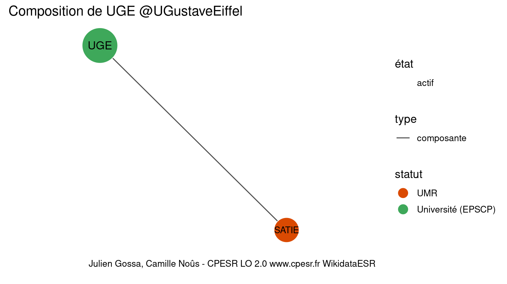

Warnings wikidataESR pour : UGE @UGustaveEiffel(10/11/2022
================

- Edition wikidata : [Q65153823](https://www.wikidata.org/wiki/Q65153823)
- Guide d'édition : [wikidataESR](https://github.com/cpesr/wikidataESR/)

- Discussion sur le guide d'édition : [github](https://github.com/cpesr/wikidataESR/issues)


## histoire 

 

Problèmes détectés dans les entités :

|entité                                             |alias   |statut |message                     |
|:--------------------------------------------------|:-------|:------|:---------------------------|
|[Q3152297](https://www.wikidata.org/wiki/Q3152297) |IFSTTAR |EPST   |Date de fondation manquante |

Problèmes détectés dans les relations :

|depuis                                               |vers                                               |type         |message              |
|:----------------------------------------------------|:--------------------------------------------------|:------------|:--------------------|
|[Q65153823](https://www.wikidata.org/wiki/Q65153823) |[Q501207](https://www.wikidata.org/wiki/Q501207)   |prédécesseur |Date(s) manquante(s) |
|[Q65153823](https://www.wikidata.org/wiki/Q65153823) |[Q3152297](https://www.wikidata.org/wiki/Q3152297) |prédécesseur |Date(s) manquante(s) |

NB : les dates manquantes pour les relations de composante ne sont pas remontées. 


## composition 

 

 


## associations 

 

 


Erreur : les données sont probablement trop partielles.
```
Error in wdesr_ggplot_graph(df, node_size = node_size, label_sizes = label_sizes, : Empty ESR graph: something went wrong with the graph production parameters

``` 

