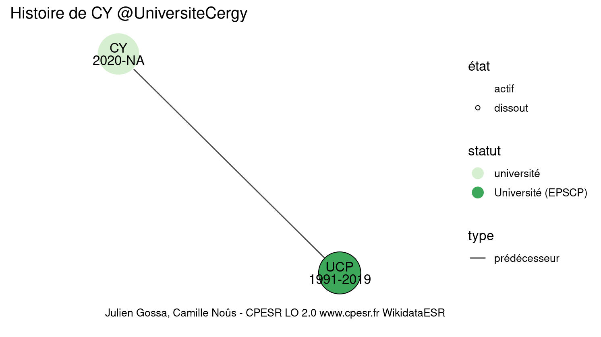

Warnings wikidataESR pour : CY @UniversiteCergy(10/11/2022
================

- Edition wikidata : [Q74452784](https://www.wikidata.org/wiki/Q74452784)
- Guide d'édition : [wikidataESR](https://github.com/cpesr/wikidataESR/)

- Discussion sur le guide d'édition : [github](https://github.com/cpesr/wikidataESR/issues)


## histoire 

 

Problèmes détectés dans les entités :

|entité                                               |alias |statut     |message              |
|:----------------------------------------------------|:-----|:----------|:--------------------|
|[Q74452784](https://www.wikidata.org/wiki/Q74452784) |CY    |université |Statut trop imprécis |

 


Erreur : les données sont probablement trop partielles.
```
Error in wdesr_ggplot_graph(df, node_size = node_size, label_sizes = label_sizes, : Empty ESR graph: something went wrong with the graph production parameters

``` 


## composition 

 

Problèmes détectés dans les entités :

|entité                                               |alias |statut      |message              |
|:----------------------------------------------------|:-----|:-----------|:--------------------|
|[Q74452784](https://www.wikidata.org/wiki/Q74452784) |CY    |université  |Statut trop imprécis |
|[Q30262310](https://www.wikidata.org/wiki/Q30262310) |LDAR  |site        |Statut trop imprécis |
|[Q51784727](https://www.wikidata.org/wiki/Q51784727) |AGM   |laboratoire |Statut trop imprécis |
|[Q51780993](https://www.wikidata.org/wiki/Q51780993) |LERMA |laboratoire |Statut trop imprécis |

 


## associations 

 

Problèmes détectés dans les entités :

|entité                                               |alias                         |statut          |message                |
|:----------------------------------------------------|:-----------------------------|:---------------|:----------------------|
|[Q74452784](https://www.wikidata.org/wiki/Q74452784) |CY                            |université      |Statut trop imprécis   |
|[Q84701260](https://www.wikidata.org/wiki/Q84701260) |CY Arts et Humanités          |graduate school |Alias manquant ou long |
|[Q84701863](https://www.wikidata.org/wiki/Q84701863) |CY Droit et Science Politique |graduate school |Alias manquant ou long |

Problèmes détectés dans les relations :

|depuis                                               |vers                                                 |type    |message              |
|:----------------------------------------------------|:----------------------------------------------------|:-------|:--------------------|
|[Q74452784](https://www.wikidata.org/wiki/Q74452784) |[Q84701260](https://www.wikidata.org/wiki/Q84701260) |associé |Date(s) manquante(s) |
|[Q74452784](https://www.wikidata.org/wiki/Q74452784) |[Q84701600](https://www.wikidata.org/wiki/Q84701600) |associé |Date(s) manquante(s) |
|[Q74452784](https://www.wikidata.org/wiki/Q74452784) |[Q84701863](https://www.wikidata.org/wiki/Q84701863) |associé |Date(s) manquante(s) |

NB : les dates manquantes pour les relations de composante ne sont pas remontées. 

