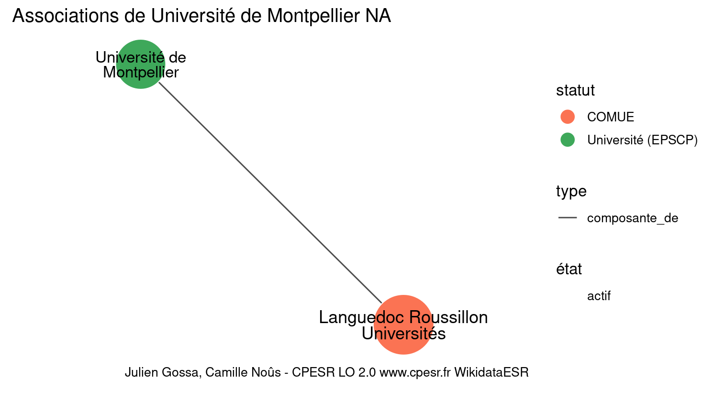

Warnings wikidataESR pour : Université de Montpellier NA(01/10/2023
================

- Edition wikidata : [Q776223](https://www.wikidata.org/wiki/Q776223)
- Guide d'édition : [wikidataESR](https://github.com/cpesr/wikidataESR/)

- Discussion sur le guide d'édition : [github](https://github.com/cpesr/wikidataESR/issues)

## histoire 

 

Problèmes détectés dans les entités :

|entité                                               |alias                           |statut             |message                |
|:----------------------------------------------------|:-------------------------------|:------------------|:----------------------|
|[Q776223](https://www.wikidata.org/wiki/Q776223)     |Université de Montpellier       |Université (EPSCP) |Alias manquant ou long |
|[Q903888](https://www.wikidata.org/wiki/Q903888)     |université Montpellier I        |Université (EPSCP) |Alias manquant ou long |
|[Q64690423](https://www.wikidata.org/wiki/Q64690423) |université de Montpellier       |Université (EPSCP) |Alias manquant ou long |
|[Q54933118](https://www.wikidata.org/wiki/Q54933118) |Studium Generale de Montpellier |studia generalia   |Alias manquant ou long |

 

## composition 

 

Problèmes détectés dans les entités :

|entité                                               |alias                                                                           |statut                 |message                     |
|:----------------------------------------------------|:-------------------------------------------------------------------------------|:----------------------|:---------------------------|
|[Q776223](https://www.wikidata.org/wiki/Q776223)     |Université de Montpellier                                                       |Université (EPSCP)     |Alias manquant ou long      |
|[Q30262154](https://www.wikidata.org/wiki/Q30262154) |Amélioration Génétique et Adaptation des Plantes Méditerranéennes et Tropicales |site                   |Statut trop imprécis        |
|[Q30262154](https://www.wikidata.org/wiki/Q30262154) |Amélioration Génétique et Adaptation des Plantes Méditerranéennes et Tropicales |site                   |Alias manquant ou long      |
|[Q30262268](https://www.wikidata.org/wiki/Q30262268) |IATE                                                                            |site                   |Statut trop imprécis        |
|[Q30261465](https://www.wikidata.org/wiki/Q30261465) |IRMB                                                                            |site                   |Statut trop imprécis        |
|[Q30261477](https://www.wikidata.org/wiki/Q30261477) |Institut Montpelliérain Alexander Grothendieck                                  |UMR                    |Alias manquant ou long      |
|[Q30261483](https://www.wikidata.org/wiki/Q30261483) |LSTM                                                                            |site                   |Statut trop imprécis        |
|[Q30262229](https://www.wikidata.org/wiki/Q30262229) |Equipe Rhizogenèse                                                              |site                   |Statut trop imprécis        |
|[Q30262229](https://www.wikidata.org/wiki/Q30262229) |Equipe Rhizogenèse                                                              |site                   |Date de fondation manquante |
|[Q3214420](https://www.wikidata.org/wiki/Q3214420)   |LIRMM                                                                           |institut de recherche  |Statut trop imprécis        |
|[Q43896975](https://www.wikidata.org/wiki/Q43896975) |IRCM                                                                            |institut de recherche  |Statut trop imprécis        |
|[Q20724586](https://www.wikidata.org/wiki/Q20724586) |Faculté dentaire                                                                |institut universitaire |Statut trop imprécis        |

 

## associations 

 

Problèmes détectés dans les entités :

|entité                                             |alias                            |statut             |message                |
|:--------------------------------------------------|:--------------------------------|:------------------|:----------------------|
|[Q776223](https://www.wikidata.org/wiki/Q776223)   |Université de Montpellier        |Université (EPSCP) |Alias manquant ou long |
|[Q2476558](https://www.wikidata.org/wiki/Q2476558) |Languedoc Roussillon Universités |COMUE              |Alias manquant ou long |

 

