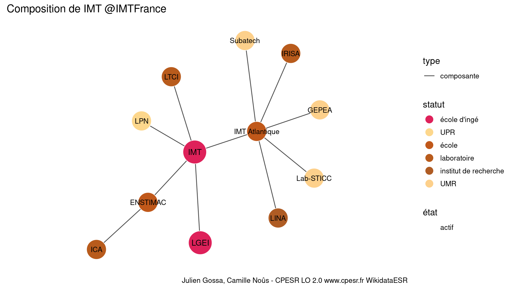

Warnings wikidataESR pour : Institut Mines-Télécom, au périmètre des écoles IMT Atlantique, Lille Douai, Albi, Alès, Mines Saint-Étienne et Institut Mines-Télécom Business school @IMTFrance(13/11/2021
================

- Edition wikidata : [Q7885718](https://www.wikidata.org/wiki/Q7885718)
- Guide d'édition : [wikidataESR](https://github.com/cpesr/wikidataESR/)

- Discussion sur le guide d'édition : [github](https://github.com/cpesr/wikidataESR/issues)


## histoire 

 

Problèmes détectés dans les entités :

|entité                                             |alias |statut       |message              |
|:--------------------------------------------------|:-----|:------------|:--------------------|
|[Q7885718](https://www.wikidata.org/wiki/Q7885718) |IMT   |école d'ingé |Statut trop imprécis |

 


Erreur : les données sont probablement trop partielles.
```
Error in wdesr_ggplot_graph(df, node_size = node_size, label_sizes = label_sizes, : Empty ESR graph: something went wrong with the graph production parameters

``` 


## composition 

 

Problèmes détectés dans les entités :

|entité                                               |alias          |statut                |message              |
|:----------------------------------------------------|:--------------|:---------------------|:--------------------|
|[Q7885718](https://www.wikidata.org/wiki/Q7885718)   |IMT            |école d'ingé          |Statut trop imprécis |
|[Q3577934](https://www.wikidata.org/wiki/Q3577934)   |ENSTIMAC       |école                 |Statut trop imprécis |
|[Q30297078](https://www.wikidata.org/wiki/Q30297078) |ICA            |laboratoire           |Statut trop imprécis |
|[Q30262371](https://www.wikidata.org/wiki/Q30262371) |LTCI           |laboratoire           |Statut trop imprécis |
|[Q27962533](https://www.wikidata.org/wiki/Q27962533) |IMT Atlantique |école                 |Statut trop imprécis |
|[Q3152091](https://www.wikidata.org/wiki/Q3152091)   |IRISA          |laboratoire           |Statut trop imprécis |
|[Q3214422](https://www.wikidata.org/wiki/Q3214422)   |LINA           |institut de recherche |Statut trop imprécis |

 


## associations 

 

Problèmes détectés dans les entités :

|entité                                               |alias  |statut       |message              |
|:----------------------------------------------------|:------|:------------|:--------------------|
|[Q7885718](https://www.wikidata.org/wiki/Q7885718)   |IMT    |école d'ingé |Statut trop imprécis |
|[Q48759778](https://www.wikidata.org/wiki/Q48759778) |NewUni |EPE          |Préférer Q77979904   |

 

