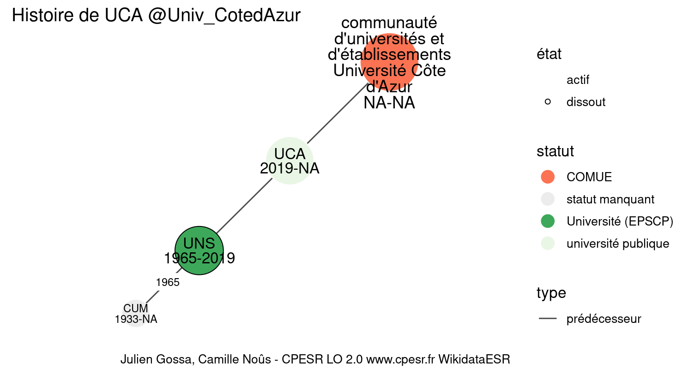

Warnings wikidataESR pour : UCA @Univ_CotedAzur(10/11/2022
================

- Edition wikidata : [Q80186910](https://www.wikidata.org/wiki/Q80186910)
- Guide d'édition : [wikidataESR](https://github.com/cpesr/wikidataESR/)

- Discussion sur le guide d'édition : [github](https://github.com/cpesr/wikidataESR/issues)

## histoire 

 

Problèmes détectés dans les entités :

|entité                                                 |alias                                                               |statut              |message                                                    |
|:------------------------------------------------------|:-------------------------------------------------------------------|:-------------------|:----------------------------------------------------------|
|[Q19370961](https://www.wikidata.org/wiki/Q19370961)   |UCA                                                                 |université publique |Statut trop imprécis                                       |
|[Q2946106](https://www.wikidata.org/wiki/Q2946106)     |CUM                                                                 |statut manquant     |Absence de propriété P31 (instance_of/nature de l'élément) |
|[Q112862651](https://www.wikidata.org/wiki/Q112862651) |communauté d'universités et d'établissements Université Côte d'Azur |COMUE               |Alias manquant ou long                                     |
|[Q112862651](https://www.wikidata.org/wiki/Q112862651) |communauté d'universités et d'établissements Université Côte d'Azur |COMUE               |Date de fondation manquante                                |

Problèmes détectés dans les relations :

|depuis                                               |vers                                                   |type         |message              |
|:----------------------------------------------------|:------------------------------------------------------|:------------|:--------------------|
|[Q19370961](https://www.wikidata.org/wiki/Q19370961) |[Q1198571](https://www.wikidata.org/wiki/Q1198571)     |prédécesseur |Date(s) manquante(s) |
|[Q19370961](https://www.wikidata.org/wiki/Q19370961) |[Q112862651](https://www.wikidata.org/wiki/Q112862651) |prédécesseur |Date(s) manquante(s) |

NB : les dates manquantes pour les relations de composante ne sont pas remontées. 

## composition 

 

Problèmes détectés dans les entités :

|entité                                               |alias                                                 |statut                            |message                     |
|:----------------------------------------------------|:-----------------------------------------------------|:---------------------------------|:---------------------------|
|[Q19370961](https://www.wikidata.org/wiki/Q19370961) |UCA                                                   |université publique               |Statut trop imprécis        |
|[Q30279727](https://www.wikidata.org/wiki/Q30279727) |hôpital L'Archet de Nice                              |site                              |Statut trop imprécis        |
|[Q30279727](https://www.wikidata.org/wiki/Q30279727) |hôpital L'Archet de Nice                              |site                              |Alias manquant ou long      |
|[Q30280962](https://www.wikidata.org/wiki/Q30280962) |Hôpital Saint Roch                                    |organisation de santé             |Statut trop imprécis        |
|[Q30280962](https://www.wikidata.org/wiki/Q30280962) |Hôpital Saint Roch                                    |organisation de santé             |Date de fondation manquante |
|[Q30262862](https://www.wikidata.org/wiki/Q30262862) |hôpital Pasteur                                       |organisation de santé             |Statut trop imprécis        |
|[Q30262862](https://www.wikidata.org/wiki/Q30262862) |hôpital Pasteur                                       |organisation de santé             |Date de fondation manquante |
|[Q2991466](https://www.wikidata.org/wiki/Q2991466)   |OCA                                                   |observatoire astronomique         |Date de fondation manquante |
|[Q30299486](https://www.wikidata.org/wiki/Q30299486) |CRISAM                                                |laboratoire                       |Statut trop imprécis        |
|[Q3578444](https://www.wikidata.org/wiki/Q3578444)   |École Supérieure de Danse de Cannes Rosella Hightower |école de danse                    |Alias manquant ou long      |
|[Q2994578](https://www.wikidata.org/wiki/Q2994578)   |Conservatoire de Nice                                 |CRR                               |Alias manquant ou long      |
|[Q2994578](https://www.wikidata.org/wiki/Q2994578)   |Conservatoire de Nice                                 |CRR                               |Date de fondation manquante |
|[Q3578463](https://www.wikidata.org/wiki/Q3578463)   |ESRA                                                  |institut d'enseignement supérieur |Statut trop imprécis        |
|[Q59576162](https://www.wikidata.org/wiki/Q59576162) |The SDS                                               |institut d'enseignement supérieur |Statut trop imprécis        |

Problèmes détectés dans les relations :

|depuis                                               |vers                                                 |type       |message           |
|:----------------------------------------------------|:----------------------------------------------------|:----------|:-----------------|
|[Q19370961](https://www.wikidata.org/wiki/Q19370961) |[Q1107189](https://www.wikidata.org/wiki/Q1107189)   |composante |Relation multiple |
|[Q19370961](https://www.wikidata.org/wiki/Q19370961) |[Q1107189](https://www.wikidata.org/wiki/Q1107189)   |composante |Relation multiple |
|[Q19370961](https://www.wikidata.org/wiki/Q19370961) |[Q1107189](https://www.wikidata.org/wiki/Q1107189)   |composante |Relation multiple |
|[Q19370961](https://www.wikidata.org/wiki/Q19370961) |[Q1107189](https://www.wikidata.org/wiki/Q1107189)   |composante |Relation multiple |
|[Q19370961](https://www.wikidata.org/wiki/Q19370961) |[Q2991466](https://www.wikidata.org/wiki/Q2991466)   |composante |Relation multiple |
|[Q19370961](https://www.wikidata.org/wiki/Q19370961) |[Q2991466](https://www.wikidata.org/wiki/Q2991466)   |composante |Relation multiple |
|[Q19370961](https://www.wikidata.org/wiki/Q19370961) |[Q2991466](https://www.wikidata.org/wiki/Q2991466)   |composante |Relation multiple |
|[Q19370961](https://www.wikidata.org/wiki/Q19370961) |[Q2991466](https://www.wikidata.org/wiki/Q2991466)   |composante |Relation multiple |
|[Q19370961](https://www.wikidata.org/wiki/Q19370961) |[Q54862344](https://www.wikidata.org/wiki/Q54862344) |composante |Relation multiple |
|[Q19370961](https://www.wikidata.org/wiki/Q19370961) |[Q54862344](https://www.wikidata.org/wiki/Q54862344) |composante |Relation multiple |
|[Q19370961](https://www.wikidata.org/wiki/Q19370961) |[Q54862344](https://www.wikidata.org/wiki/Q54862344) |composante |Relation multiple |
|[Q19370961](https://www.wikidata.org/wiki/Q19370961) |[Q54862344](https://www.wikidata.org/wiki/Q54862344) |composante |Relation multiple |
|[Q2991466](https://www.wikidata.org/wiki/Q2991466)   |[Q30261495](https://www.wikidata.org/wiki/Q30261495) |composante |Relation multiple |
|[Q2991466](https://www.wikidata.org/wiki/Q2991466)   |[Q30261495](https://www.wikidata.org/wiki/Q30261495) |composante |Relation multiple |
|[Q2991466](https://www.wikidata.org/wiki/Q2991466)   |[Q30261495](https://www.wikidata.org/wiki/Q30261495) |composante |Relation multiple |
|[Q2991466](https://www.wikidata.org/wiki/Q2991466)   |[Q30261495](https://www.wikidata.org/wiki/Q30261495) |composante |Relation multiple |
|[Q2991466](https://www.wikidata.org/wiki/Q2991466)   |[Q30262518](https://www.wikidata.org/wiki/Q30262518) |composante |Relation multiple |
|[Q2991466](https://www.wikidata.org/wiki/Q2991466)   |[Q30262518](https://www.wikidata.org/wiki/Q30262518) |composante |Relation multiple |
|[Q2991466](https://www.wikidata.org/wiki/Q2991466)   |[Q30262518](https://www.wikidata.org/wiki/Q30262518) |composante |Relation multiple |
|[Q2991466](https://www.wikidata.org/wiki/Q2991466)   |[Q30262518](https://www.wikidata.org/wiki/Q30262518) |composante |Relation multiple |

NB : les dates manquantes pour les relations de composante ne sont pas remontées. 

## associations 

 

Problèmes détectés dans les entités :

|entité                                               |alias |statut              |message              |
|:----------------------------------------------------|:-----|:-------------------|:--------------------|
|[Q19370961](https://www.wikidata.org/wiki/Q19370961) |UCA   |université publique |Statut trop imprécis |

Problèmes détectés dans les relations :

|depuis                                               |vers                                               |type       |message              |
|:----------------------------------------------------|:--------------------------------------------------|:----------|:--------------------|
|[Q19370961](https://www.wikidata.org/wiki/Q19370961) |[Q2822318](https://www.wikidata.org/wiki/Q2822318) |associé_de |Date(s) manquante(s) |

NB : les dates manquantes pour les relations de composante ne sont pas remontées. 

