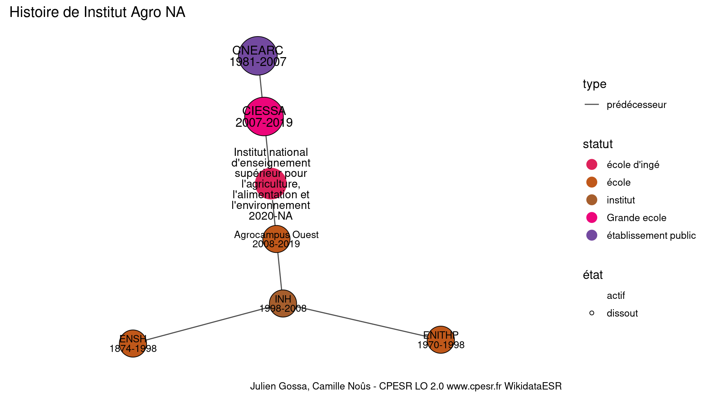

Warnings wikidataESR pour : Institut Agro (30/12/2021
================

- Edition wikidata : [Q81433122](https://www.wikidata.org/wiki/Q81433122)
- Guide d'édition : [wikidataESR](https://github.com/cpesr/wikidataESR/)

- Discussion sur le guide d'édition : [github](https://github.com/cpesr/wikidataESR/issues)


## histoire 

 

Problèmes détectés dans les entités :

|entité                                               |alias                                                                                            |statut               |message                                |
|:----------------------------------------------------|:------------------------------------------------------------------------------------------------|:--------------------|:--------------------------------------|
|[Q81433122](https://www.wikidata.org/wiki/Q81433122) |Institut national d'enseignement supérieur pour l'agriculture, l'alimentation et l'environnement |école d'ingé         |Statut trop imprécis                   |
|[Q81433122](https://www.wikidata.org/wiki/Q81433122) |Institut national d'enseignement supérieur pour l'agriculture, l'alimentation et l'environnement |école d'ingé         |Alias manquant ou long                 |
|[Q3152599](https://www.wikidata.org/wiki/Q3152599)   |Agrocampus Ouest                                                                                 |école                |Statut trop imprécis                   |
|[Q3152379](https://www.wikidata.org/wiki/Q3152379)   |INH                                                                                              |institut             |Statut trop imprécis                   |
|[Q3578198](https://www.wikidata.org/wiki/Q3578198)   |ENSH                                                                                             |école                |Statut trop imprécis                   |
|[Q21683734](https://www.wikidata.org/wiki/Q21683734) |ENITHP                                                                                           |école                |Statut trop imprécis                   |
|[Q2945808](https://www.wikidata.org/wiki/Q2945808)   |CIESSA                                                                                           |Grande ecole         |Réserver aux écoles non contemporaines |
|[Q2421302](https://www.wikidata.org/wiki/Q2421302)   |CNEARC                                                                                           |établissement public |Statut trop imprécis                   |

Problèmes détectés dans les relations :

|from                                                 |to                                                   |type         |message              |
|:----------------------------------------------------|:----------------------------------------------------|:------------|:--------------------|
|[Q81433122](https://www.wikidata.org/wiki/Q81433122) |[Q3152599](https://www.wikidata.org/wiki/Q3152599)   |prédécesseur |Date(s) manquante(s) |
|[Q81433122](https://www.wikidata.org/wiki/Q81433122) |[Q2945808](https://www.wikidata.org/wiki/Q2945808)   |prédécesseur |Date(s) manquante(s) |
|[Q3152599](https://www.wikidata.org/wiki/Q3152599)   |[Q3152379](https://www.wikidata.org/wiki/Q3152379)   |prédécesseur |Date(s) manquante(s) |
|[Q3152379](https://www.wikidata.org/wiki/Q3152379)   |[Q3578198](https://www.wikidata.org/wiki/Q3578198)   |prédécesseur |Date(s) manquante(s) |
|[Q3152379](https://www.wikidata.org/wiki/Q3152379)   |[Q21683734](https://www.wikidata.org/wiki/Q21683734) |prédécesseur |Date(s) manquante(s) |
|[Q2945808](https://www.wikidata.org/wiki/Q2945808)   |[Q2421302](https://www.wikidata.org/wiki/Q2421302)   |prédécesseur |Date(s) manquante(s) |

NB : les dates manquantes pour les relations de composante ne sont pas remontées. 


## composition 

 

Problèmes détectés dans les entités :

|entité                                               |alias                                                                                            |statut       |message                |
|:----------------------------------------------------|:------------------------------------------------------------------------------------------------|:------------|:----------------------|
|[Q81433122](https://www.wikidata.org/wiki/Q81433122) |Institut national d'enseignement supérieur pour l'agriculture, l'alimentation et l'environnement |école d'ingé |Statut trop imprécis   |
|[Q81433122](https://www.wikidata.org/wiki/Q81433122) |Institut national d'enseignement supérieur pour l'agriculture, l'alimentation et l'environnement |école d'ingé |Alias manquant ou long |

 


Erreur : les données sont probablement trop partielles.
```
Error in wdesr_ggplot_graph(df, node_size = node_size, label_sizes = label_sizes, : Empty ESR graph: something went wrong with the graph production parameters

``` 


## associations 

 

Problèmes détectés dans les entités :

|entité                                               |alias                                                                                            |statut       |message                |
|:----------------------------------------------------|:------------------------------------------------------------------------------------------------|:------------|:----------------------|
|[Q81433122](https://www.wikidata.org/wiki/Q81433122) |Institut national d'enseignement supérieur pour l'agriculture, l'alimentation et l'environnement |école d'ingé |Statut trop imprécis   |
|[Q81433122](https://www.wikidata.org/wiki/Q81433122) |Institut national d'enseignement supérieur pour l'agriculture, l'alimentation et l'environnement |école d'ingé |Alias manquant ou long |

 


Erreur : les données sont probablement trop partielles.
```
Error in wdesr_ggplot_graph(df, node_size = node_size, label_sizes = label_sizes, : Empty ESR graph: something went wrong with the graph production parameters

``` 

