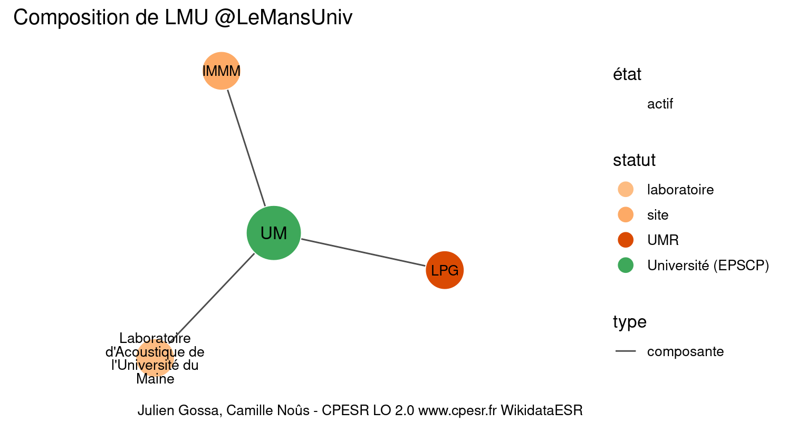

Warnings wikidataESR pour : LMU @LeMansUniv(01/09/2022
================

- Edition wikidata : [Q834825](https://www.wikidata.org/wiki/Q834825)
- Guide d'édition : [wikidataESR](https://github.com/cpesr/wikidataESR/)

- Discussion sur le guide d'édition : [github](https://github.com/cpesr/wikidataESR/issues)


## histoire 

 

 


Erreur : les données sont probablement trop partielles.
```
Error in wdesr_ggplot_graph(df, node_size = node_size, label_sizes = label_sizes, : Empty ESR graph: something went wrong with the graph production parameters

``` 


## composition 

 

Problèmes détectés dans les entités :

|entité                                               |alias                                             |statut      |message                |
|:----------------------------------------------------|:-------------------------------------------------|:-----------|:----------------------|
|[Q50040154](https://www.wikidata.org/wiki/Q50040154) |IMMM                                              |site        |Statut trop imprécis   |
|[Q51785486](https://www.wikidata.org/wiki/Q51785486) |Laboratoire d'Acoustique de l'Université du Maine |laboratoire |Statut trop imprécis   |
|[Q51785486](https://www.wikidata.org/wiki/Q51785486) |Laboratoire d'Acoustique de l'Université du Maine |laboratoire |Alias manquant ou long |

 


## associations 

 

 


Erreur : les données sont probablement trop partielles.
```
Error in wdesr_ggplot_graph(df, node_size = node_size, label_sizes = label_sizes, : Empty ESR graph: something went wrong with the graph production parameters

``` 

