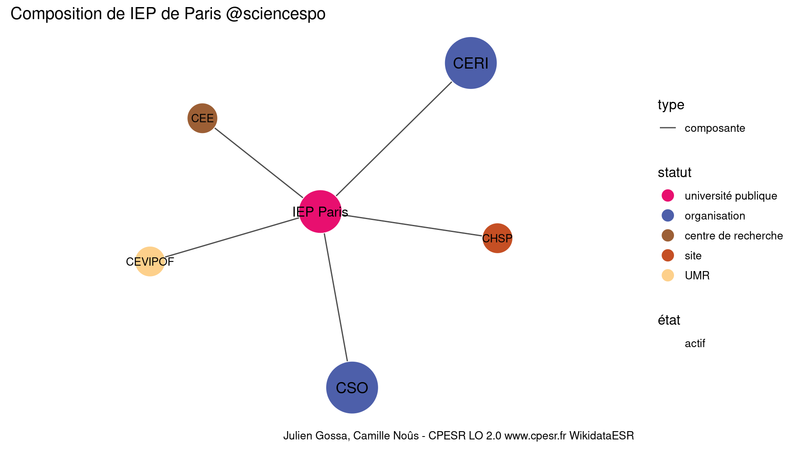

Warnings wikidataESR pour : IEP de Paris @sciencespo(01/09/2022
================

- Edition wikidata : [Q859363](https://www.wikidata.org/wiki/Q859363)
- Guide d'édition : [wikidataESR](https://github.com/cpesr/wikidataESR/)

- Discussion sur le guide d'édition : [github](https://github.com/cpesr/wikidataESR/issues)

## histoire 

 

Problèmes détectés dans les entités :

|entité                                           |alias     |statut                 |message              |
|:------------------------------------------------|:---------|:----------------------|:--------------------|
|[Q859363](https://www.wikidata.org/wiki/Q859363) |IEP Paris |université publique    |Statut trop imprécis |
|[Q273553](https://www.wikidata.org/wiki/Q273553) |ELSP      |institut universitaire |Statut trop imprécis |

Problèmes détectés dans les relations :

|depuis                                           |vers                                             |type         |message              |
|:------------------------------------------------|:------------------------------------------------|:------------|:--------------------|
|[Q859363](https://www.wikidata.org/wiki/Q859363) |[Q273553](https://www.wikidata.org/wiki/Q273553) |prédécesseur |Date(s) manquante(s) |

NB : les dates manquantes pour les relations de composante ne sont pas remontées. 

## composition 

 

Problèmes détectés dans les entités :

|entité                                             |alias     |statut              |message              |
|:--------------------------------------------------|:---------|:-------------------|:--------------------|
|[Q859363](https://www.wikidata.org/wiki/Q859363)   |IEP Paris |université publique |Statut trop imprécis |
|[Q2945203](https://www.wikidata.org/wiki/Q2945203) |CERI      |organisation        |Statut trop imprécis |
|[Q2945214](https://www.wikidata.org/wiki/Q2945214) |CEE       |centre de recherche |Statut trop imprécis |
|[Q2945109](https://www.wikidata.org/wiki/Q2945109) |CHSP      |site                |Statut trop imprécis |
|[Q2945496](https://www.wikidata.org/wiki/Q2945496) |CSO       |organisation        |Statut trop imprécis |

 

## associations 

 

Problèmes détectés dans les entités :

|entité                                           |alias     |statut              |message              |
|:------------------------------------------------|:---------|:-------------------|:--------------------|
|[Q859363](https://www.wikidata.org/wiki/Q859363) |IEP Paris |université publique |Statut trop imprécis |

Problèmes détectés dans les relations :

|depuis                                           |vers                                               |type      |message              |
|:------------------------------------------------|:--------------------------------------------------|:---------|:--------------------|
|[Q859363](https://www.wikidata.org/wiki/Q859363) |[Q2994760](https://www.wikidata.org/wiki/Q2994760) |affilié_à |Date(s) manquante(s) |

NB : les dates manquantes pour les relations de composante ne sont pas remontées. 

