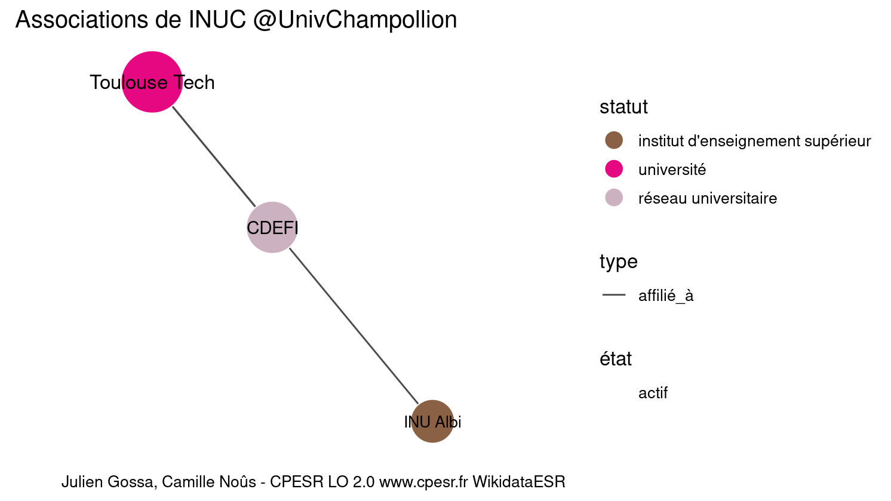

Warnings wikidataESR pour : INUC @UnivChampollion(01/09/2022
================

- Edition wikidata : [Q929515](https://www.wikidata.org/wiki/Q929515)
- Guide d'édition : [wikidataESR](https://github.com/cpesr/wikidataESR/)

- Discussion sur le guide d'édition : [github](https://github.com/cpesr/wikidataESR/issues)


## histoire 

 

Problèmes détectés dans les entités :

|entité                                           |alias    |statut                            |message              |
|:------------------------------------------------|:--------|:---------------------------------|:--------------------|
|[Q929515](https://www.wikidata.org/wiki/Q929515) |INU Albi |institut d'enseignement supérieur |Statut trop imprécis |

 


Erreur : les données sont probablement trop partielles.
```
Error in wdesr_ggplot_graph(df, node_size = node_size, label_sizes = label_sizes, : Empty ESR graph: something went wrong with the graph production parameters

``` 


## composition 

 

Problèmes détectés dans les entités :

|entité                                           |alias    |statut                            |message              |
|:------------------------------------------------|:--------|:---------------------------------|:--------------------|
|[Q929515](https://www.wikidata.org/wiki/Q929515) |INU Albi |institut d'enseignement supérieur |Statut trop imprécis |

 


Erreur : les données sont probablement trop partielles.
```
Error in wdesr_ggplot_graph(df, node_size = node_size, label_sizes = label_sizes, : Empty ESR graph: something went wrong with the graph production parameters

``` 


## associations 

 

Problèmes détectés dans les entités :

|entité                                             |alias         |statut                            |message              |
|:--------------------------------------------------|:-------------|:---------------------------------|:--------------------|
|[Q929515](https://www.wikidata.org/wiki/Q929515)   |INU Albi      |institut d'enseignement supérieur |Statut trop imprécis |
|[Q3299074](https://www.wikidata.org/wiki/Q3299074) |Toulouse Tech |université                        |Statut trop imprécis |

Problèmes détectés dans les relations :

|depuis                                             |vers                                               |type      |message              |
|:--------------------------------------------------|:--------------------------------------------------|:---------|:--------------------|
|[Q929515](https://www.wikidata.org/wiki/Q929515)   |[Q3299074](https://www.wikidata.org/wiki/Q3299074) |affilié_à |Date(s) manquante(s) |
|[Q3299074](https://www.wikidata.org/wiki/Q3299074) |[Q2992899](https://www.wikidata.org/wiki/Q2992899) |affilié_à |Date(s) manquante(s) |

NB : les dates manquantes pour les relations de composante ne sont pas remontées. 

