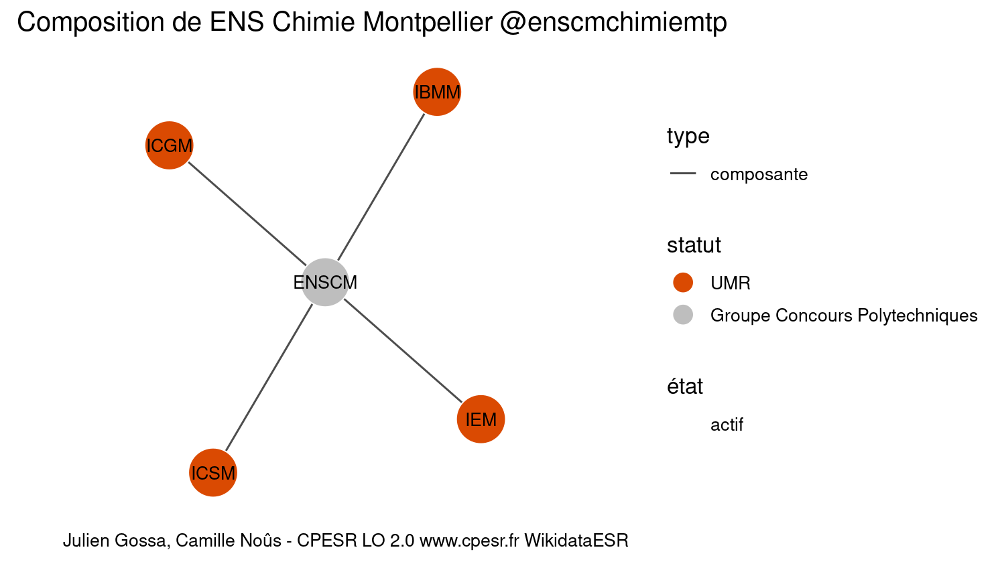
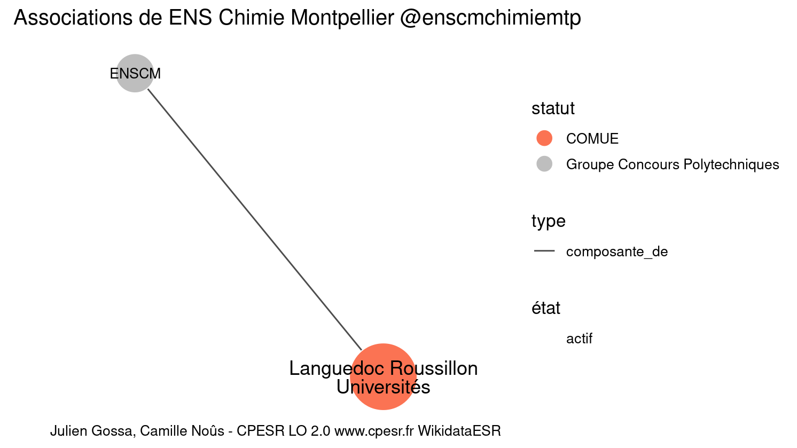

Warnings wikidataESR pour : ENS Chimie Montpellier @enscmchimiemtp(10/11/2022
================

- Edition wikidata : [Q948420](https://www.wikidata.org/wiki/Q948420)
- Guide d'édition : [wikidataESR](https://github.com/cpesr/wikidataESR/)

- Discussion sur le guide d'édition : [github](https://github.com/cpesr/wikidataESR/issues)


## histoire 

 

 


Erreur : les données sont probablement trop partielles.
```
Error in wdesr_ggplot_graph(df, node_size = node_size, label_sizes = label_sizes, : Empty ESR graph: something went wrong with the graph production parameters

``` 


## composition 

 

 


## associations 

 

Problèmes détectés dans les entités :

|entité                                             |alias                            |statut |message                |
|:--------------------------------------------------|:--------------------------------|:------|:----------------------|
|[Q2476558](https://www.wikidata.org/wiki/Q2476558) |Languedoc Roussillon Universités |COMUE  |Alias manquant ou long |

 

