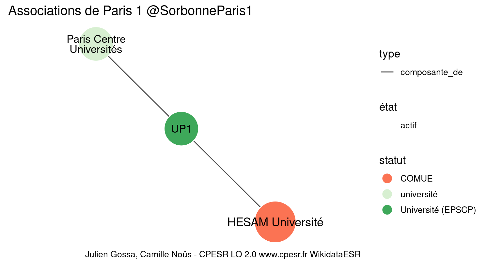

Warnings wikidataESR pour : Paris 1 @SorbonneParis1(01/10/2023
================

- Edition wikidata : [Q999763](https://www.wikidata.org/wiki/Q999763)
- Guide d'édition : [wikidataESR](https://github.com/cpesr/wikidataESR/)

- Discussion sur le guide d'édition : [github](https://github.com/cpesr/wikidataESR/issues)

## histoire 

 

Problèmes détectés dans les entités :

|entité                                               |alias                                          |statut           |message                |
|:----------------------------------------------------|:----------------------------------------------|:----------------|:----------------------|
|[Q3064325](https://www.wikidata.org/wiki/Q3064325)   |faculté de lettres de Paris                    |composante       |Alias manquant ou long |
|[Q3064321](https://www.wikidata.org/wiki/Q3064321)   |Faculté des arts de Paris                      |composante       |Alias manquant ou long |
|[Q20749407](https://www.wikidata.org/wiki/Q20749407) |Faculté de droit de Paris                      |composante       |Alias manquant ou long |
|[Q20749406](https://www.wikidata.org/wiki/Q20749406) |faculté de droit de Paris                      |faculté de droit |Alias manquant ou long |
|[Q20749392](https://www.wikidata.org/wiki/Q20749392) |Constantissima juris canonici facultas (Paris) |composante       |Alias manquant ou long |

Problèmes détectés dans les relations :

|depuis                                               |vers                                                 |type         |message              |
|:----------------------------------------------------|:----------------------------------------------------|:------------|:--------------------|
|[Q3064325](https://www.wikidata.org/wiki/Q3064325)   |[Q3064321](https://www.wikidata.org/wiki/Q3064321)   |prédécesseur |Date(s) manquante(s) |
|[Q20749407](https://www.wikidata.org/wiki/Q20749407) |[Q20749406](https://www.wikidata.org/wiki/Q20749406) |prédécesseur |Date(s) manquante(s) |
|[Q20749406](https://www.wikidata.org/wiki/Q20749406) |[Q20749392](https://www.wikidata.org/wiki/Q20749392) |prédécesseur |Date(s) manquante(s) |

NB : les dates manquantes pour les relations de composante ne sont pas remontées. 

## composition 

 

Problèmes détectés dans les entités :

|entité                                               |alias                                                   |statut                |message                |
|:----------------------------------------------------|:-------------------------------------------------------|:---------------------|:----------------------|
|[Q16643681](https://www.wikidata.org/wiki/Q16643681) |IHPST                                                   |laboratoire           |Statut trop imprécis   |
|[Q30262271](https://www.wikidata.org/wiki/Q30262271) |Collège International des Sciences du Territoire        |site                  |Statut trop imprécis   |
|[Q30262271](https://www.wikidata.org/wiki/Q30262271) |Collège International des Sciences du Territoire        |site                  |Alias manquant ou long |
|[Q30262398](https://www.wikidata.org/wiki/Q30262398) |Orient et Méditerranée, Textes - Archéologie - Histoire |UMR                   |Alias manquant ou long |
|[Q2945114](https://www.wikidata.org/wiki/Q2945114)   |CHS                                                     |institut de recherche |Statut trop imprécis   |
|[Q2944853](https://www.wikidata.org/wiki/Q2944853)   |centre Pierre-Mendès-France                             |immeuble              |Alias manquant ou long |

 

## associations 

 

Problèmes détectés dans les entités :

|entité                                             |alias                    |statut     |message                |
|:--------------------------------------------------|:------------------------|:----------|:----------------------|
|[Q3365251](https://www.wikidata.org/wiki/Q3365251) |Paris Centre Universités |université |Statut trop imprécis   |
|[Q3365251](https://www.wikidata.org/wiki/Q3365251) |Paris Centre Universités |université |Alias manquant ou long |

 

