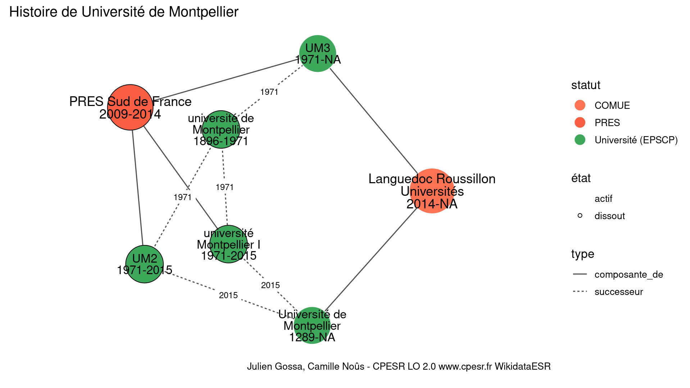

Warnings wikidataESR pour : Université de Montpellier(18/11/2021
================

- Edition wikidata : [Q64690423](https://www.wikidata.org/wiki/Q64690423)
- Guide d'édition : [wikidataESR](https://github.com/cpesr/wikidataESR/)

- Discussion sur le guide d'édition : [github](https://github.com/cpesr/wikidataESR/issues)

## histoire 

 

Problèmes détectés dans les entités :

|entité                                               |alias                            |statut             |message                |
|:----------------------------------------------------|:--------------------------------|:------------------|:----------------------|
|[Q64690423](https://www.wikidata.org/wiki/Q64690423) |université de Montpellier        |Université (EPSCP) |Alias manquant ou long |
|[Q903888](https://www.wikidata.org/wiki/Q903888)     |université Montpellier I         |Université (EPSCP) |Alias manquant ou long |
|[Q776223](https://www.wikidata.org/wiki/Q776223)     |Université de Montpellier        |Université (EPSCP) |Alias manquant ou long |
|[Q2476558](https://www.wikidata.org/wiki/Q2476558)   |Languedoc Roussillon Universités |COMUE              |Alias manquant ou long |

 

