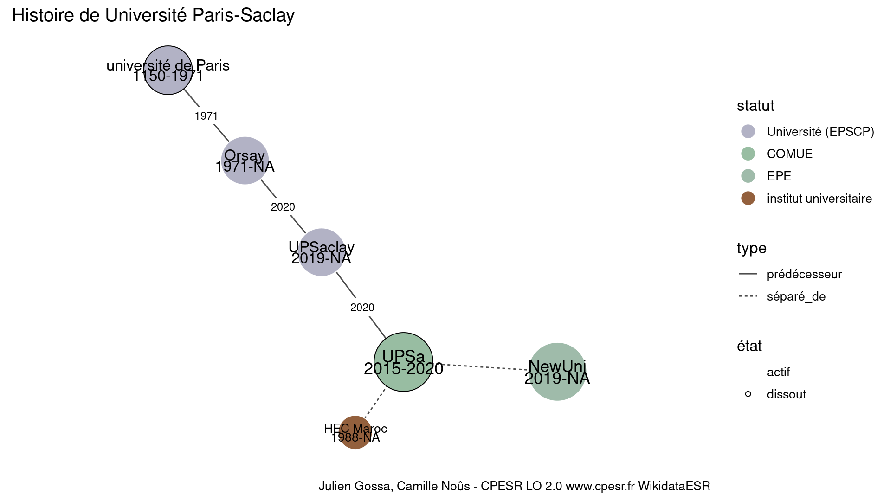
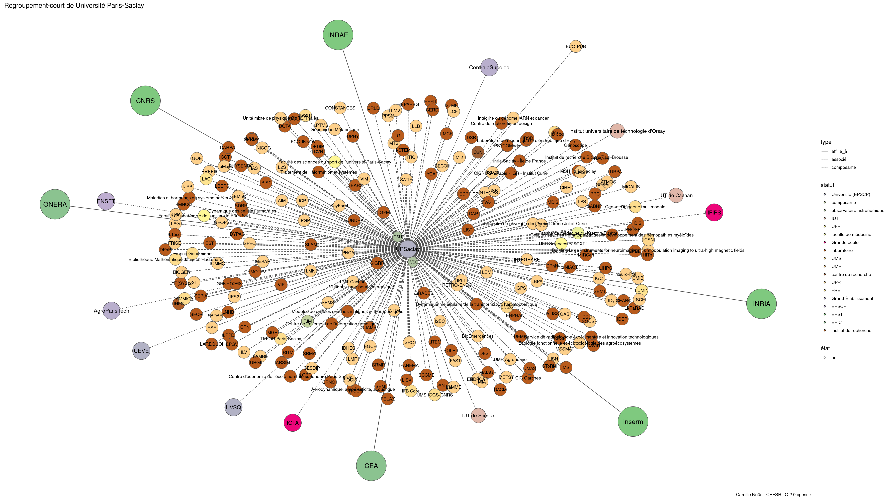
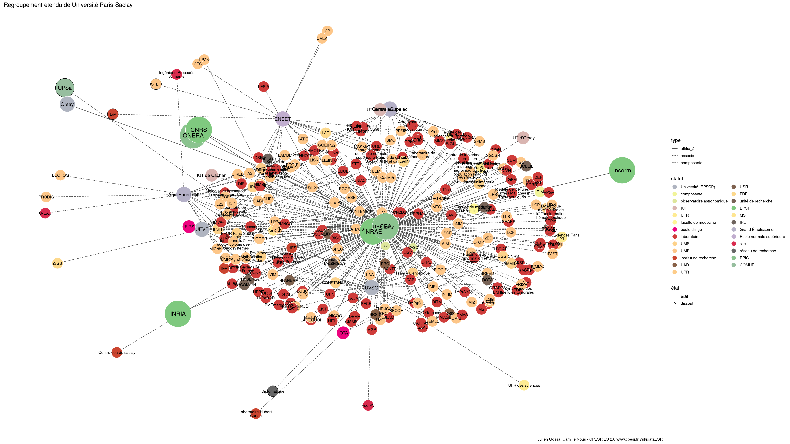

Warnings wikidataESR pour : Université Paris-Saclay(01/10/2023
================

- Edition wikidata : [Q109409389](https://www.wikidata.org/wiki/Q109409389)
- Guide d'édition : [wikidataESR](https://github.com/cpesr/wikidataESR/)

- Discussion sur le guide d'édition : [github](https://github.com/cpesr/wikidataESR/issues)


## histoire 

 

Problèmes détectés dans les entités :

|entité                                               |alias     |statut                 |message              |
|:----------------------------------------------------|:---------|:----------------------|:--------------------|
|[Q48759778](https://www.wikidata.org/wiki/Q48759778) |NewUni    |EPE                    |Préférer Q77979904   |
|[Q3577932](https://www.wikidata.org/wiki/Q3577932)   |HEC Maroc |institut universitaire |Statut trop imprécis |

Problèmes détectés dans les relations :

|depuis                                               |vers                                                 |type      |message              |
|:----------------------------------------------------|:----------------------------------------------------|:---------|:--------------------|
|[Q13531686](https://www.wikidata.org/wiki/Q13531686) |[Q48759778](https://www.wikidata.org/wiki/Q48759778) |séparé_de |Date(s) manquante(s) |
|[Q13531686](https://www.wikidata.org/wiki/Q13531686) |[Q3577932](https://www.wikidata.org/wiki/Q3577932)   |séparé_de |Date(s) manquante(s) |

NB : les dates manquantes pour les relations de composante ne sont pas remontées. 


## regroupement-court 

 

Problèmes détectés dans les entités :

|entité                                                 |alias                                                                                               |statut                |message                |
|:------------------------------------------------------|:---------------------------------------------------------------------------------------------------|:---------------------|:----------------------|
|[Q107460661](https://www.wikidata.org/wiki/Q107460661) |Faculté des sciences du sport de l'université Paris-Saclay                                          |UFR                   |Alias manquant ou long |
|[Q98112081](https://www.wikidata.org/wiki/Q98112081)   |UFR Sciences Paris XI                                                                               |UFR                   |Alias manquant ou long |
|[Q90272039](https://www.wikidata.org/wiki/Q90272039)   |Faculté de médecine du Kremlin-Bicêtre                                                              |UER médicale          |Alias manquant ou long |
|[Q107167255](https://www.wikidata.org/wiki/Q107167255) |Faculté de pharmacie de l'université Paris Sud                                                      |UFR                   |Alias manquant ou long |
|[Q3578308](https://www.wikidata.org/wiki/Q3578308)     |IFIPS                                                                                               |école d'ingé          |Statut trop imprécis   |
|[Q109580163](https://www.wikidata.org/wiki/Q109580163) |Aérodynamique, aéroélasticité, acoustique                                                           |laboratoire           |Statut trop imprécis   |
|[Q109580163](https://www.wikidata.org/wiki/Q109580163) |Aérodynamique, aéroélasticité, acoustique                                                           |laboratoire           |Alias manquant ou long |
|[Q30262143](https://www.wikidata.org/wiki/Q30262143)   |ALISS                                                                                               |laboratoire           |Statut trop imprécis   |
|[Q51780589](https://www.wikidata.org/wiki/Q51780589)   |Bibliothèque Mathématique Jacques Hadamard                                                          |UMS                   |Alias manquant ou long |
|[Q51782185](https://www.wikidata.org/wiki/Q51782185)   |BioÉmergences                                                                                       |laboratoire           |Statut trop imprécis   |
|[Q109580532](https://www.wikidata.org/wiki/Q109580532) |Building large instruments for neuroimaging : from population imaging to ultra-high magnetic fields |UMR                   |Alias manquant ou long |
|[Q109583924](https://www.wikidata.org/wiki/Q109583924) |CSHMyelo                                                                                            |laboratoire           |Statut trop imprécis   |
|[Q3151940](https://www.wikidata.org/wiki/Q3151940)     |C2N                                                                                                 |institut de recherche |Statut trop imprécis   |
|[Q109584042](https://www.wikidata.org/wiki/Q109584042) |CRD                                                                                                 |laboratoire           |Statut trop imprécis   |
|[Q30262232](https://www.wikidata.org/wiki/Q30262232)   |CESP                                                                                                |laboratoire           |Statut trop imprécis   |
|[Q109584110](https://www.wikidata.org/wiki/Q109584110) |CRLD                                                                                                |laboratoire           |Statut trop imprécis   |
|[Q51781591](https://www.wikidata.org/wiki/Q51781591)   |VIP                                                                                                 |laboratoire           |Statut trop imprécis   |
|[Q109584378](https://www.wikidata.org/wiki/Q109584378) |Centre de traitement de l'information génétique                                                     |laboratoire           |Statut trop imprécis   |
|[Q109584378](https://www.wikidata.org/wiki/Q109584378) |Centre de traitement de l'information génétique                                                     |laboratoire           |Alias manquant ou long |
|[Q109584455](https://www.wikidata.org/wiki/Q109584455) |CVN                                                                                                 |laboratoire           |Statut trop imprécis   |
|[Q109584482](https://www.wikidata.org/wiki/Q109584482) |Centre d'économie de l'école normale supérieure Paris-Saclay                                        |laboratoire           |Statut trop imprécis   |
|[Q109584482](https://www.wikidata.org/wiki/Q109584482) |Centre d'économie de l'école normale supérieure Paris-Saclay                                        |laboratoire           |Alias manquant ou long |
|[Q109584557](https://www.wikidata.org/wiki/Q109584557) |EPEE                                                                                                |laboratoire           |Statut trop imprécis   |
|[Q51785320](https://www.wikidata.org/wiki/Q51785320)   |CERDI                                                                                               |laboratoire           |Statut trop imprécis   |
|[Q29624201](https://www.wikidata.org/wiki/Q29624201)   |CEMOTEV                                                                                             |laboratoire           |Statut trop imprécis   |
|[Q47008419](https://www.wikidata.org/wiki/Q47008419)   |CHCSC                                                                                               |laboratoire           |Statut trop imprécis   |
|[Q109586954](https://www.wikidata.org/wiki/Q109586954) |Centre d'imagerie multimodale                                                                       |UMS                   |Alias manquant ou long |
|[Q109587042](https://www.wikidata.org/wiki/Q109587042) |CRNGH                                                                                               |laboratoire           |Statut trop imprécis   |
|[Q51783587](https://www.wikidata.org/wiki/Q51783587)   |CPN                                                                                                 |laboratoire           |Statut trop imprécis   |
|[Q109587096](https://www.wikidata.org/wiki/Q109587096) |CCT                                                                                                 |laboratoire           |Statut trop imprécis   |
|[Q109587112](https://www.wikidata.org/wiki/Q109587112) |CIC Garches                                                                                         |laboratoire           |Statut trop imprécis   |
|[Q109587130](https://www.wikidata.org/wiki/Q109587130) |CIC - biothérapie - IGR - Institut Curie                                                            |laboratoire           |Statut trop imprécis   |
|[Q109587130](https://www.wikidata.org/wiki/Q109587130) |CIC - biothérapie - IGR - Institut Curie                                                            |laboratoire           |Alias manquant ou long |
|[Q51784186](https://www.wikidata.org/wiki/Q51784186)   |CIAMS                                                                                               |laboratoire           |Statut trop imprécis   |
|[Q51779969](https://www.wikidata.org/wiki/Q51779969)   |CEARC                                                                                               |laboratoire           |Statut trop imprécis   |
|[Q52604715](https://www.wikidata.org/wiki/Q52604715)   |DAP                                                                                                 |laboratoire           |Statut trop imprécis   |
|[Q109587430](https://www.wikidata.org/wiki/Q109587430) |DPhN                                                                                                |laboratoire           |Statut trop imprécis   |
|[Q109590316](https://www.wikidata.org/wiki/Q109590316) |DEDIP                                                                                               |laboratoire           |Statut trop imprécis   |
|[Q52604639](https://www.wikidata.org/wiki/Q52604639)   |DACM                                                                                                |laboratoire           |Statut trop imprécis   |
|[Q52605393](https://www.wikidata.org/wiki/Q52605393)   |DIS                                                                                                 |laboratoire           |Statut trop imprécis   |
|[Q51785421](https://www.wikidata.org/wiki/Q51785421)   |DAVID                                                                                               |laboratoire           |Statut trop imprécis   |
|[Q109590356](https://www.wikidata.org/wiki/Q109590356) |DSR                                                                                                 |laboratoire           |Statut trop imprécis   |
|[Q109590507](https://www.wikidata.org/wiki/Q109590507) |Dynamique des cellules tumorales                                                                    |laboratoire           |Statut trop imprécis   |
|[Q109590507](https://www.wikidata.org/wiki/Q109590507) |Dynamique des cellules tumorales                                                                    |laboratoire           |Alias manquant ou long |
|[Q109613823](https://www.wikidata.org/wiki/Q109613823) |Dynamique moléculaire de la transformation hématopoïétique                                          |laboratoire           |Statut trop imprécis   |
|[Q109613823](https://www.wikidata.org/wiki/Q109613823) |Dynamique moléculaire de la transformation hématopoïétique                                          |laboratoire           |Alias manquant ou long |
|[Q51781188](https://www.wikidata.org/wiki/Q51781188)   |DYPAC                                                                                               |laboratoire           |Statut trop imprécis   |
|[Q51782089](https://www.wikidata.org/wiki/Q51782089)   |Écologie fonctionnelle et écotoxicologie des agroécosystèmes                                        |UMR                   |Alias manquant ou long |
|[Q109614005](https://www.wikidata.org/wiki/Q109614005) |DEMR                                                                                                |laboratoire           |Statut trop imprécis   |
|[Q109614029](https://www.wikidata.org/wiki/Q109614029) |ERPHAN                                                                                              |laboratoire           |Statut trop imprécis   |
|[Q51780517](https://www.wikidata.org/wiki/Q51780517)   |EPGV                                                                                                |laboratoire           |Statut trop imprécis   |
|[Q109614136](https://www.wikidata.org/wiki/Q109614136) |EST                                                                                                 |laboratoire           |Statut trop imprécis   |
|[Q51785052](https://www.wikidata.org/wiki/Q51785052)   |Génomique Métabolique                                                                               |UMR                   |Alias manquant ou long |
|[Q3100800](https://www.wikidata.org/wiki/Q3100800)     |Genoscope                                                                                           |laboratoire           |Statut trop imprécis   |
|[Q109614346](https://www.wikidata.org/wiki/Q109614346) |GRADES                                                                                              |laboratoire           |Statut trop imprécis   |
|[Q51781994](https://www.wikidata.org/wiki/Q51781994)   |HITh                                                                                                |laboratoire           |Statut trop imprécis   |
|[Q109614407](https://www.wikidata.org/wiki/Q109614407) |HYCAR                                                                                               |laboratoire           |Statut trop imprécis   |
|[Q109614419](https://www.wikidata.org/wiki/Q109614419) |HPPIT                                                                                               |laboratoire           |Statut trop imprécis   |
|[Q51781565](https://www.wikidata.org/wiki/Q51781565)   |IMVA-HB                                                                                             |laboratoire           |Statut trop imprécis   |
|[Q51781503](https://www.wikidata.org/wiki/Q51781503)   |IBISC                                                                                               |laboratoire           |Statut trop imprécis   |
|[Q18156000](https://www.wikidata.org/wiki/Q18156000)   |Inria Saclay - Île de France                                                                        |laboratoire           |Statut trop imprécis   |
|[Q18156000](https://www.wikidata.org/wiki/Q18156000)   |Inria Saclay - Île de France                                                                        |laboratoire           |Alias manquant ou long |
|[Q51781588](https://www.wikidata.org/wiki/Q51781588)   |Institut de recherche Bicêtre/Paul-Brousse                                                          |laboratoire           |Statut trop imprécis   |
|[Q51781588](https://www.wikidata.org/wiki/Q51781588)   |Institut de recherche Bicêtre/Paul-Brousse                                                          |laboratoire           |Alias manquant ou long |
|[Q51782564](https://www.wikidata.org/wiki/Q51782564)   |I.Tésé                                                                                              |laboratoire           |Statut trop imprécis   |
|[Q52606886](https://www.wikidata.org/wiki/Q52606886)   |I-STEM                                                                                              |laboratoire           |Statut trop imprécis   |
|[Q51781269](https://www.wikidata.org/wiki/Q51781269)   |IEDP                                                                                                |laboratoire           |Statut trop imprécis   |
|[Q3133097](https://www.wikidata.org/wiki/Q3133097)     |IDEST                                                                                               |laboratoire           |Statut trop imprécis   |
|[Q51780838](https://www.wikidata.org/wiki/Q51780838)   |IDEP                                                                                                |laboratoire           |Statut trop imprécis   |
|[Q109620211](https://www.wikidata.org/wiki/Q109620211) |Intégrité du génome, ARN et cancer                                                                  |UMR                   |Alias manquant ou long |
|[Q51782141](https://www.wikidata.org/wiki/Q51782141)   |SToRM                                                                                               |laboratoire           |Statut trop imprécis   |
|[Q109620268](https://www.wikidata.org/wiki/Q109620268) |LAAB                                                                                                |laboratoire           |Statut trop imprécis   |
|[Q29625240](https://www.wikidata.org/wiki/Q29625240)   |DANTE                                                                                               |laboratoire           |Statut trop imprécis   |
|[Q51780035](https://www.wikidata.org/wiki/Q51780035)   |LGBC                                                                                                |laboratoire           |Statut trop imprécis   |
|[Q51786239](https://www.wikidata.org/wiki/Q51786239)   |LGPM                                                                                                |laboratoire           |Statut trop imprécis   |
|[Q109620444](https://www.wikidata.org/wiki/Q109620444) |Laboratoire de mécanique et d'énergétique d'Évry                                                    |laboratoire           |Statut trop imprécis   |
|[Q109620444](https://www.wikidata.org/wiki/Q109620444) |Laboratoire de mécanique et d'énergétique d'Évry                                                    |laboratoire           |Alias manquant ou long |
|[Q109620502](https://www.wikidata.org/wiki/Q109620502) |LAREQUOI                                                                                            |laboratoire           |Statut trop imprécis   |
|[Q19945120](https://www.wikidata.org/wiki/Q19945120)   |LARSIM                                                                                              |laboratoire           |Statut trop imprécis   |
|[Q109620610](https://www.wikidata.org/wiki/Q109620610) |LI-PaRAD                                                                                            |laboratoire           |Statut trop imprécis   |
|[Q29606460](https://www.wikidata.org/wiki/Q29606460)   |LISV                                                                                                |laboratoire           |Statut trop imprécis   |
|[Q51781442](https://www.wikidata.org/wiki/Q51781442)   |LIST                                                                                                |laboratoire           |Statut trop imprécis   |
|[Q109620633](https://www.wikidata.org/wiki/Q109620633) |LIHPC                                                                                               |laboratoire           |Statut trop imprécis   |
|[Q109620641](https://www.wikidata.org/wiki/Q109620641) |LITEM                                                                                               |laboratoire           |Statut trop imprécis   |
|[Q109620651](https://www.wikidata.org/wiki/Q109620651) |GENHOTEL                                                                                            |laboratoire           |Statut trop imprécis   |
|[Q30262363](https://www.wikidata.org/wiki/Q30262363)   |LGI                                                                                                 |laboratoire           |Statut trop imprécis   |
|[Q109620707](https://www.wikidata.org/wiki/Q109620707) |LMCE                                                                                                |laboratoire           |Statut trop imprécis   |
|[Q30282357](https://www.wikidata.org/wiki/Q30282357)   |LNHB                                                                                                |laboratoire           |Statut trop imprécis   |
|[Q51781731](https://www.wikidata.org/wiki/Q51781731)   |LPPD                                                                                                |laboratoire           |Statut trop imprécis   |
|[Q51785279](https://www.wikidata.org/wiki/Q51785279)   |LURPA                                                                                               |laboratoire           |Statut trop imprécis   |
|[Q51785301](https://www.wikidata.org/wiki/Q51785301)   |LYP(SYS)2                                                                                           |laboratoire           |Statut trop imprécis   |
|[Q109620862](https://www.wikidata.org/wiki/Q109620862) |Maladies et hormones du système nerveux                                                             |laboratoire           |Statut trop imprécis   |
|[Q109620862](https://www.wikidata.org/wiki/Q109620862) |Maladies et hormones du système nerveux                                                             |laboratoire           |Alias manquant ou long |
|[Q51785046](https://www.wikidata.org/wiki/Q51785046)   |MS                                                                                                  |laboratoire           |Statut trop imprécis   |
|[Q52605228](https://www.wikidata.org/wiki/Q52605228)   |DMAS                                                                                                |laboratoire           |Statut trop imprécis   |
|[Q51784880](https://www.wikidata.org/wiki/Q51784880)   |MAIAGE                                                                                              |laboratoire           |Statut trop imprécis   |
|[Q51780222](https://www.wikidata.org/wiki/Q51780222)   |MICS                                                                                                |laboratoire           |Statut trop imprécis   |
|[Q51781653](https://www.wikidata.org/wiki/Q51781653)   |MGP                                                                                                 |laboratoire           |Statut trop imprécis   |
|[Q51782153](https://www.wikidata.org/wiki/Q51782153)   |Modèle de Cellules Souches Malignes et Thérapeutiques                                               |laboratoire           |Statut trop imprécis   |
|[Q51782153](https://www.wikidata.org/wiki/Q51782153)   |Modèle de Cellules Souches Malignes et Thérapeutiques                                               |laboratoire           |Alias manquant ou long |
|[Q109621193](https://www.wikidata.org/wiki/Q109621193) |MIRCen                                                                                              |laboratoire           |Statut trop imprécis   |
|[Q109621213](https://www.wikidata.org/wiki/Q109621213) |Multi-physique pour l'énergétique                                                                   |laboratoire           |Statut trop imprécis   |
|[Q109621213](https://www.wikidata.org/wiki/Q109621213) |Multi-physique pour l'énergétique                                                                   |laboratoire           |Alias manquant ou long |
|[Q51781581](https://www.wikidata.org/wiki/Q51781581)   |HEPAREG                                                                                             |laboratoire           |Statut trop imprécis   |
|[Q51781538](https://www.wikidata.org/wiki/Q51781538)   |PMNCO                                                                                               |laboratoire           |Statut trop imprécis   |
|[Q51782610](https://www.wikidata.org/wiki/Q51782610)   |RaMo-IT                                                                                             |laboratoire           |Statut trop imprécis   |
|[Q51784750](https://www.wikidata.org/wiki/Q51784750)   |RITM                                                                                                |laboratoire           |Statut trop imprécis   |
|[Q51783930](https://www.wikidata.org/wiki/Q51783930)   |RISCQ                                                                                               |laboratoire           |Statut trop imprécis   |
|[Q109621568](https://www.wikidata.org/wiki/Q109621568) |SAAJ                                                                                                |laboratoire           |Statut trop imprécis   |
|[Q109621596](https://www.wikidata.org/wiki/Q109621596) |SCCME                                                                                               |laboratoire           |Statut trop imprécis   |
|[Q109621617](https://www.wikidata.org/wiki/Q109621617) |Service de radiobiologie expérimentale et innovation technologiques                                 |laboratoire           |Statut trop imprécis   |
|[Q109621617](https://www.wikidata.org/wiki/Q109621617) |Service de radiobiologie expérimentale et innovation technologiques                                 |laboratoire           |Alias manquant ou long |
|[Q109621628](https://www.wikidata.org/wiki/Q109621628) |SRMP                                                                                                |laboratoire           |Statut trop imprécis   |
|[Q109621639](https://www.wikidata.org/wiki/Q109621639) |SRMA                                                                                                |laboratoire           |Statut trop imprécis   |
|[Q109621650](https://www.wikidata.org/wiki/Q109621650) |STMF                                                                                                |laboratoire           |Statut trop imprécis   |
|[Q109621661](https://www.wikidata.org/wiki/Q109621661) |SEMI                                                                                                |laboratoire           |Statut trop imprécis   |
|[Q109621679](https://www.wikidata.org/wiki/Q109621679) |SEPIA                                                                                               |laboratoire           |Statut trop imprécis   |
|[Q109621690](https://www.wikidata.org/wiki/Q109621690) |SERMA                                                                                               |laboratoire           |Statut trop imprécis   |
|[Q109621715](https://www.wikidata.org/wiki/Q109621715) |SECR                                                                                                |laboratoire           |Statut trop imprécis   |
|[Q109621741](https://www.wikidata.org/wiki/Q109621741) |SEARS                                                                                               |laboratoire           |Statut trop imprécis   |
|[Q109621749](https://www.wikidata.org/wiki/Q109621749) |SEMT                                                                                                |laboratoire           |Statut trop imprécis   |
|[Q109621757](https://www.wikidata.org/wiki/Q109621757) |SDRR                                                                                                |laboratoire           |Statut trop imprécis   |
|[Q109621764](https://www.wikidata.org/wiki/Q109621764) |SIGRR                                                                                               |laboratoire           |Statut trop imprécis   |
|[Q51780281](https://www.wikidata.org/wiki/Q51780281)   |CARPAT                                                                                              |laboratoire           |Statut trop imprécis   |
|[Q109621817](https://www.wikidata.org/wiki/Q109621817) |SABNP                                                                                               |laboratoire           |Statut trop imprécis   |
|[Q109621839](https://www.wikidata.org/wiki/Q109621839) |SONDRA                                                                                              |laboratoire           |Statut trop imprécis   |
|[Q109621847](https://www.wikidata.org/wiki/Q109621847) |SLAM                                                                                                |laboratoire           |Statut trop imprécis   |
|[Q52605521](https://www.wikidata.org/wiki/Q52605521)   |DTIS                                                                                                |laboratoire           |Statut trop imprécis   |
|[Q109621930](https://www.wikidata.org/wiki/Q109621930) |UNIACT                                                                                              |laboratoire           |Statut trop imprécis   |
|[Q51780102](https://www.wikidata.org/wiki/Q51780102)   |URGI                                                                                                |laboratoire           |Statut trop imprécis   |
|[Q51781787](https://www.wikidata.org/wiki/Q51781787)   |ECO-INNOV                                                                                           |laboratoire           |Statut trop imprécis   |
|[Q898448](https://www.wikidata.org/wiki/Q898448)       |IOTA                                                                                                |école d'ingé          |Statut trop imprécis   |
|[Q1156553](https://www.wikidata.org/wiki/Q1156553)     |IHES                                                                                                |institut de recherche |Statut trop imprécis   |

Problèmes détectés dans les relations :

|depuis                                                 |vers                                                 |type      |message              |
|:------------------------------------------------------|:----------------------------------------------------|:---------|:--------------------|
|[Q109409389](https://www.wikidata.org/wiki/Q109409389) |[Q19203245](https://www.wikidata.org/wiki/Q19203245) |associé   |Date(s) manquante(s) |
|[Q109409389](https://www.wikidata.org/wiki/Q109409389) |[Q273604](https://www.wikidata.org/wiki/Q273604)     |associé   |Date(s) manquante(s) |
|[Q109409389](https://www.wikidata.org/wiki/Q109409389) |[Q898448](https://www.wikidata.org/wiki/Q898448)     |associé   |Date(s) manquante(s) |
|[Q109409389](https://www.wikidata.org/wiki/Q109409389) |[Q1637105](https://www.wikidata.org/wiki/Q1637105)   |associé   |Date(s) manquante(s) |
|[Q109409389](https://www.wikidata.org/wiki/Q109409389) |[Q186638](https://www.wikidata.org/wiki/Q186638)     |associé   |Date(s) manquante(s) |
|[Q109409389](https://www.wikidata.org/wiki/Q109409389) |[Q1531014](https://www.wikidata.org/wiki/Q1531014)   |associé   |Date(s) manquante(s) |
|[Q109409389](https://www.wikidata.org/wiki/Q109409389) |[Q280413](https://www.wikidata.org/wiki/Q280413)     |affilié_à |Date(s) manquante(s) |
|[Q109409389](https://www.wikidata.org/wiki/Q109409389) |[Q1474517](https://www.wikidata.org/wiki/Q1474517)   |affilié_à |Date(s) manquante(s) |
|[Q109409389](https://www.wikidata.org/wiki/Q109409389) |[Q70571774](https://www.wikidata.org/wiki/Q70571774) |affilié_à |Date(s) manquante(s) |
|[Q109409389](https://www.wikidata.org/wiki/Q109409389) |[Q1146208](https://www.wikidata.org/wiki/Q1146208)   |affilié_à |Date(s) manquante(s) |
|[Q109409389](https://www.wikidata.org/wiki/Q109409389) |[Q868550](https://www.wikidata.org/wiki/Q868550)     |affilié_à |Date(s) manquante(s) |
|[Q109409389](https://www.wikidata.org/wiki/Q109409389) |[Q2007769](https://www.wikidata.org/wiki/Q2007769)   |affilié_à |Date(s) manquante(s) |
|[Q109409389](https://www.wikidata.org/wiki/Q109409389) |[Q1156553](https://www.wikidata.org/wiki/Q1156553)   |affilié_à |Date(s) manquante(s) |

NB : les dates manquantes pour les relations de composante ne sont pas remontées. 


## regroupement-etendu 

 

Problèmes détectés dans les entités :

|entité                                                 |alias                                                                                               |statut                |message                     |
|:------------------------------------------------------|:---------------------------------------------------------------------------------------------------|:---------------------|:---------------------------|
|[Q107460661](https://www.wikidata.org/wiki/Q107460661) |Faculté des sciences du sport de l'université Paris-Saclay                                          |UFR                   |Alias manquant ou long      |
|[Q98112081](https://www.wikidata.org/wiki/Q98112081)   |UFR Sciences Paris XI                                                                               |UFR                   |Alias manquant ou long      |
|[Q90272039](https://www.wikidata.org/wiki/Q90272039)   |Faculté de médecine du Kremlin-Bicêtre                                                              |UER médicale          |Alias manquant ou long      |
|[Q107167255](https://www.wikidata.org/wiki/Q107167255) |Faculté de pharmacie de l'université Paris Sud                                                      |UFR                   |Alias manquant ou long      |
|[Q3578308](https://www.wikidata.org/wiki/Q3578308)     |IFIPS                                                                                               |école d'ingé          |Statut trop imprécis        |
|[Q109580163](https://www.wikidata.org/wiki/Q109580163) |Aérodynamique, aéroélasticité, acoustique                                                           |laboratoire           |Statut trop imprécis        |
|[Q109580163](https://www.wikidata.org/wiki/Q109580163) |Aérodynamique, aéroélasticité, acoustique                                                           |laboratoire           |Alias manquant ou long      |
|[Q30262143](https://www.wikidata.org/wiki/Q30262143)   |ALISS                                                                                               |laboratoire           |Statut trop imprécis        |
|[Q51780589](https://www.wikidata.org/wiki/Q51780589)   |Bibliothèque Mathématique Jacques Hadamard                                                          |UMS                   |Alias manquant ou long      |
|[Q51782185](https://www.wikidata.org/wiki/Q51782185)   |BioÉmergences                                                                                       |laboratoire           |Statut trop imprécis        |
|[Q109580532](https://www.wikidata.org/wiki/Q109580532) |Building large instruments for neuroimaging : from population imaging to ultra-high magnetic fields |UMR                   |Alias manquant ou long      |
|[Q109583924](https://www.wikidata.org/wiki/Q109583924) |CSHMyelo                                                                                            |laboratoire           |Statut trop imprécis        |
|[Q3151940](https://www.wikidata.org/wiki/Q3151940)     |C2N                                                                                                 |institut de recherche |Statut trop imprécis        |
|[Q109584042](https://www.wikidata.org/wiki/Q109584042) |CRD                                                                                                 |laboratoire           |Statut trop imprécis        |
|[Q30262232](https://www.wikidata.org/wiki/Q30262232)   |CESP                                                                                                |laboratoire           |Statut trop imprécis        |
|[Q109584110](https://www.wikidata.org/wiki/Q109584110) |CRLD                                                                                                |laboratoire           |Statut trop imprécis        |
|[Q51781591](https://www.wikidata.org/wiki/Q51781591)   |VIP                                                                                                 |laboratoire           |Statut trop imprécis        |
|[Q109584378](https://www.wikidata.org/wiki/Q109584378) |Centre de traitement de l'information génétique                                                     |laboratoire           |Statut trop imprécis        |
|[Q109584378](https://www.wikidata.org/wiki/Q109584378) |Centre de traitement de l'information génétique                                                     |laboratoire           |Alias manquant ou long      |
|[Q109584455](https://www.wikidata.org/wiki/Q109584455) |CVN                                                                                                 |laboratoire           |Statut trop imprécis        |
|[Q109584482](https://www.wikidata.org/wiki/Q109584482) |Centre d'économie de l'école normale supérieure Paris-Saclay                                        |laboratoire           |Statut trop imprécis        |
|[Q109584482](https://www.wikidata.org/wiki/Q109584482) |Centre d'économie de l'école normale supérieure Paris-Saclay                                        |laboratoire           |Alias manquant ou long      |
|[Q109584557](https://www.wikidata.org/wiki/Q109584557) |EPEE                                                                                                |laboratoire           |Statut trop imprécis        |
|[Q51785320](https://www.wikidata.org/wiki/Q51785320)   |CERDI                                                                                               |laboratoire           |Statut trop imprécis        |
|[Q29624201](https://www.wikidata.org/wiki/Q29624201)   |CEMOTEV                                                                                             |laboratoire           |Statut trop imprécis        |
|[Q47008419](https://www.wikidata.org/wiki/Q47008419)   |CHCSC                                                                                               |laboratoire           |Statut trop imprécis        |
|[Q109586954](https://www.wikidata.org/wiki/Q109586954) |Centre d'imagerie multimodale                                                                       |UMS                   |Alias manquant ou long      |
|[Q109587042](https://www.wikidata.org/wiki/Q109587042) |CRNGH                                                                                               |laboratoire           |Statut trop imprécis        |
|[Q51783587](https://www.wikidata.org/wiki/Q51783587)   |CPN                                                                                                 |laboratoire           |Statut trop imprécis        |
|[Q109587096](https://www.wikidata.org/wiki/Q109587096) |CCT                                                                                                 |laboratoire           |Statut trop imprécis        |
|[Q109587112](https://www.wikidata.org/wiki/Q109587112) |CIC Garches                                                                                         |laboratoire           |Statut trop imprécis        |
|[Q109587130](https://www.wikidata.org/wiki/Q109587130) |CIC - biothérapie - IGR - Institut Curie                                                            |laboratoire           |Statut trop imprécis        |
|[Q109587130](https://www.wikidata.org/wiki/Q109587130) |CIC - biothérapie - IGR - Institut Curie                                                            |laboratoire           |Alias manquant ou long      |
|[Q51784186](https://www.wikidata.org/wiki/Q51784186)   |CIAMS                                                                                               |laboratoire           |Statut trop imprécis        |
|[Q51779969](https://www.wikidata.org/wiki/Q51779969)   |CEARC                                                                                               |laboratoire           |Statut trop imprécis        |
|[Q52604715](https://www.wikidata.org/wiki/Q52604715)   |DAP                                                                                                 |laboratoire           |Statut trop imprécis        |
|[Q109587430](https://www.wikidata.org/wiki/Q109587430) |DPhN                                                                                                |laboratoire           |Statut trop imprécis        |
|[Q109590316](https://www.wikidata.org/wiki/Q109590316) |DEDIP                                                                                               |laboratoire           |Statut trop imprécis        |
|[Q52604639](https://www.wikidata.org/wiki/Q52604639)   |DACM                                                                                                |laboratoire           |Statut trop imprécis        |
|[Q52605393](https://www.wikidata.org/wiki/Q52605393)   |DIS                                                                                                 |laboratoire           |Statut trop imprécis        |
|[Q51785421](https://www.wikidata.org/wiki/Q51785421)   |DAVID                                                                                               |laboratoire           |Statut trop imprécis        |
|[Q109590356](https://www.wikidata.org/wiki/Q109590356) |DSR                                                                                                 |laboratoire           |Statut trop imprécis        |
|[Q109590507](https://www.wikidata.org/wiki/Q109590507) |Dynamique des cellules tumorales                                                                    |laboratoire           |Statut trop imprécis        |
|[Q109590507](https://www.wikidata.org/wiki/Q109590507) |Dynamique des cellules tumorales                                                                    |laboratoire           |Alias manquant ou long      |
|[Q109613823](https://www.wikidata.org/wiki/Q109613823) |Dynamique moléculaire de la transformation hématopoïétique                                          |laboratoire           |Statut trop imprécis        |
|[Q109613823](https://www.wikidata.org/wiki/Q109613823) |Dynamique moléculaire de la transformation hématopoïétique                                          |laboratoire           |Alias manquant ou long      |
|[Q51781188](https://www.wikidata.org/wiki/Q51781188)   |DYPAC                                                                                               |laboratoire           |Statut trop imprécis        |
|[Q51782089](https://www.wikidata.org/wiki/Q51782089)   |Écologie fonctionnelle et écotoxicologie des agroécosystèmes                                        |UMR                   |Alias manquant ou long      |
|[Q109614005](https://www.wikidata.org/wiki/Q109614005) |DEMR                                                                                                |laboratoire           |Statut trop imprécis        |
|[Q109614029](https://www.wikidata.org/wiki/Q109614029) |ERPHAN                                                                                              |laboratoire           |Statut trop imprécis        |
|[Q51780517](https://www.wikidata.org/wiki/Q51780517)   |EPGV                                                                                                |laboratoire           |Statut trop imprécis        |
|[Q109614136](https://www.wikidata.org/wiki/Q109614136) |EST                                                                                                 |laboratoire           |Statut trop imprécis        |
|[Q51785052](https://www.wikidata.org/wiki/Q51785052)   |Génomique Métabolique                                                                               |UMR                   |Alias manquant ou long      |
|[Q3100800](https://www.wikidata.org/wiki/Q3100800)     |Genoscope                                                                                           |laboratoire           |Statut trop imprécis        |
|[Q109614346](https://www.wikidata.org/wiki/Q109614346) |GRADES                                                                                              |laboratoire           |Statut trop imprécis        |
|[Q51781994](https://www.wikidata.org/wiki/Q51781994)   |HITh                                                                                                |laboratoire           |Statut trop imprécis        |
|[Q109614407](https://www.wikidata.org/wiki/Q109614407) |HYCAR                                                                                               |laboratoire           |Statut trop imprécis        |
|[Q109614419](https://www.wikidata.org/wiki/Q109614419) |HPPIT                                                                                               |laboratoire           |Statut trop imprécis        |
|[Q51781565](https://www.wikidata.org/wiki/Q51781565)   |IMVA-HB                                                                                             |laboratoire           |Statut trop imprécis        |
|[Q51781503](https://www.wikidata.org/wiki/Q51781503)   |IBISC                                                                                               |laboratoire           |Statut trop imprécis        |
|[Q18156000](https://www.wikidata.org/wiki/Q18156000)   |Inria Saclay - Île de France                                                                        |laboratoire           |Statut trop imprécis        |
|[Q18156000](https://www.wikidata.org/wiki/Q18156000)   |Inria Saclay - Île de France                                                                        |laboratoire           |Alias manquant ou long      |
|[Q51781588](https://www.wikidata.org/wiki/Q51781588)   |Institut de recherche Bicêtre/Paul-Brousse                                                          |laboratoire           |Statut trop imprécis        |
|[Q51781588](https://www.wikidata.org/wiki/Q51781588)   |Institut de recherche Bicêtre/Paul-Brousse                                                          |laboratoire           |Alias manquant ou long      |
|[Q51782564](https://www.wikidata.org/wiki/Q51782564)   |I.Tésé                                                                                              |laboratoire           |Statut trop imprécis        |
|[Q52606886](https://www.wikidata.org/wiki/Q52606886)   |I-STEM                                                                                              |laboratoire           |Statut trop imprécis        |
|[Q51781269](https://www.wikidata.org/wiki/Q51781269)   |IEDP                                                                                                |laboratoire           |Statut trop imprécis        |
|[Q3133097](https://www.wikidata.org/wiki/Q3133097)     |IDEST                                                                                               |laboratoire           |Statut trop imprécis        |
|[Q51780838](https://www.wikidata.org/wiki/Q51780838)   |IDEP                                                                                                |laboratoire           |Statut trop imprécis        |
|[Q109620211](https://www.wikidata.org/wiki/Q109620211) |Intégrité du génome, ARN et cancer                                                                  |UMR                   |Alias manquant ou long      |
|[Q51782141](https://www.wikidata.org/wiki/Q51782141)   |SToRM                                                                                               |laboratoire           |Statut trop imprécis        |
|[Q109620268](https://www.wikidata.org/wiki/Q109620268) |LAAB                                                                                                |laboratoire           |Statut trop imprécis        |
|[Q29625240](https://www.wikidata.org/wiki/Q29625240)   |DANTE                                                                                               |laboratoire           |Statut trop imprécis        |
|[Q51780035](https://www.wikidata.org/wiki/Q51780035)   |LGBC                                                                                                |laboratoire           |Statut trop imprécis        |
|[Q51786239](https://www.wikidata.org/wiki/Q51786239)   |LGPM                                                                                                |laboratoire           |Statut trop imprécis        |
|[Q109620444](https://www.wikidata.org/wiki/Q109620444) |Laboratoire de mécanique et d'énergétique d'Évry                                                    |laboratoire           |Statut trop imprécis        |
|[Q109620444](https://www.wikidata.org/wiki/Q109620444) |Laboratoire de mécanique et d'énergétique d'Évry                                                    |laboratoire           |Alias manquant ou long      |
|[Q109620502](https://www.wikidata.org/wiki/Q109620502) |LAREQUOI                                                                                            |laboratoire           |Statut trop imprécis        |
|[Q19945120](https://www.wikidata.org/wiki/Q19945120)   |LARSIM                                                                                              |laboratoire           |Statut trop imprécis        |
|[Q109620610](https://www.wikidata.org/wiki/Q109620610) |LI-PaRAD                                                                                            |laboratoire           |Statut trop imprécis        |
|[Q29606460](https://www.wikidata.org/wiki/Q29606460)   |LISV                                                                                                |laboratoire           |Statut trop imprécis        |
|[Q51781442](https://www.wikidata.org/wiki/Q51781442)   |LIST                                                                                                |laboratoire           |Statut trop imprécis        |
|[Q109620633](https://www.wikidata.org/wiki/Q109620633) |LIHPC                                                                                               |laboratoire           |Statut trop imprécis        |
|[Q109620641](https://www.wikidata.org/wiki/Q109620641) |LITEM                                                                                               |laboratoire           |Statut trop imprécis        |
|[Q109620651](https://www.wikidata.org/wiki/Q109620651) |GENHOTEL                                                                                            |laboratoire           |Statut trop imprécis        |
|[Q30262363](https://www.wikidata.org/wiki/Q30262363)   |LGI                                                                                                 |laboratoire           |Statut trop imprécis        |
|[Q109620707](https://www.wikidata.org/wiki/Q109620707) |LMCE                                                                                                |laboratoire           |Statut trop imprécis        |
|[Q30282357](https://www.wikidata.org/wiki/Q30282357)   |LNHB                                                                                                |laboratoire           |Statut trop imprécis        |
|[Q51781731](https://www.wikidata.org/wiki/Q51781731)   |LPPD                                                                                                |laboratoire           |Statut trop imprécis        |
|[Q51785279](https://www.wikidata.org/wiki/Q51785279)   |LURPA                                                                                               |laboratoire           |Statut trop imprécis        |
|[Q51785301](https://www.wikidata.org/wiki/Q51785301)   |LYP(SYS)2                                                                                           |laboratoire           |Statut trop imprécis        |
|[Q109620862](https://www.wikidata.org/wiki/Q109620862) |Maladies et hormones du système nerveux                                                             |laboratoire           |Statut trop imprécis        |
|[Q109620862](https://www.wikidata.org/wiki/Q109620862) |Maladies et hormones du système nerveux                                                             |laboratoire           |Alias manquant ou long      |
|[Q51785046](https://www.wikidata.org/wiki/Q51785046)   |MS                                                                                                  |laboratoire           |Statut trop imprécis        |
|[Q52605228](https://www.wikidata.org/wiki/Q52605228)   |DMAS                                                                                                |laboratoire           |Statut trop imprécis        |
|[Q51784880](https://www.wikidata.org/wiki/Q51784880)   |MAIAGE                                                                                              |laboratoire           |Statut trop imprécis        |
|[Q51780222](https://www.wikidata.org/wiki/Q51780222)   |MICS                                                                                                |laboratoire           |Statut trop imprécis        |
|[Q51781653](https://www.wikidata.org/wiki/Q51781653)   |MGP                                                                                                 |laboratoire           |Statut trop imprécis        |
|[Q51782153](https://www.wikidata.org/wiki/Q51782153)   |Modèle de Cellules Souches Malignes et Thérapeutiques                                               |laboratoire           |Statut trop imprécis        |
|[Q51782153](https://www.wikidata.org/wiki/Q51782153)   |Modèle de Cellules Souches Malignes et Thérapeutiques                                               |laboratoire           |Alias manquant ou long      |
|[Q109621193](https://www.wikidata.org/wiki/Q109621193) |MIRCen                                                                                              |laboratoire           |Statut trop imprécis        |
|[Q109621213](https://www.wikidata.org/wiki/Q109621213) |Multi-physique pour l'énergétique                                                                   |laboratoire           |Statut trop imprécis        |
|[Q109621213](https://www.wikidata.org/wiki/Q109621213) |Multi-physique pour l'énergétique                                                                   |laboratoire           |Alias manquant ou long      |
|[Q51781581](https://www.wikidata.org/wiki/Q51781581)   |HEPAREG                                                                                             |laboratoire           |Statut trop imprécis        |
|[Q51781538](https://www.wikidata.org/wiki/Q51781538)   |PMNCO                                                                                               |laboratoire           |Statut trop imprécis        |
|[Q51782610](https://www.wikidata.org/wiki/Q51782610)   |RaMo-IT                                                                                             |laboratoire           |Statut trop imprécis        |
|[Q51784750](https://www.wikidata.org/wiki/Q51784750)   |RITM                                                                                                |laboratoire           |Statut trop imprécis        |
|[Q51783930](https://www.wikidata.org/wiki/Q51783930)   |RISCQ                                                                                               |laboratoire           |Statut trop imprécis        |
|[Q109621568](https://www.wikidata.org/wiki/Q109621568) |SAAJ                                                                                                |laboratoire           |Statut trop imprécis        |
|[Q109621596](https://www.wikidata.org/wiki/Q109621596) |SCCME                                                                                               |laboratoire           |Statut trop imprécis        |
|[Q109621617](https://www.wikidata.org/wiki/Q109621617) |Service de radiobiologie expérimentale et innovation technologiques                                 |laboratoire           |Statut trop imprécis        |
|[Q109621617](https://www.wikidata.org/wiki/Q109621617) |Service de radiobiologie expérimentale et innovation technologiques                                 |laboratoire           |Alias manquant ou long      |
|[Q109621628](https://www.wikidata.org/wiki/Q109621628) |SRMP                                                                                                |laboratoire           |Statut trop imprécis        |
|[Q109621639](https://www.wikidata.org/wiki/Q109621639) |SRMA                                                                                                |laboratoire           |Statut trop imprécis        |
|[Q109621650](https://www.wikidata.org/wiki/Q109621650) |STMF                                                                                                |laboratoire           |Statut trop imprécis        |
|[Q109621661](https://www.wikidata.org/wiki/Q109621661) |SEMI                                                                                                |laboratoire           |Statut trop imprécis        |
|[Q109621679](https://www.wikidata.org/wiki/Q109621679) |SEPIA                                                                                               |laboratoire           |Statut trop imprécis        |
|[Q109621690](https://www.wikidata.org/wiki/Q109621690) |SERMA                                                                                               |laboratoire           |Statut trop imprécis        |
|[Q109621715](https://www.wikidata.org/wiki/Q109621715) |SECR                                                                                                |laboratoire           |Statut trop imprécis        |
|[Q109621741](https://www.wikidata.org/wiki/Q109621741) |SEARS                                                                                               |laboratoire           |Statut trop imprécis        |
|[Q109621749](https://www.wikidata.org/wiki/Q109621749) |SEMT                                                                                                |laboratoire           |Statut trop imprécis        |
|[Q109621757](https://www.wikidata.org/wiki/Q109621757) |SDRR                                                                                                |laboratoire           |Statut trop imprécis        |
|[Q109621764](https://www.wikidata.org/wiki/Q109621764) |SIGRR                                                                                               |laboratoire           |Statut trop imprécis        |
|[Q51780281](https://www.wikidata.org/wiki/Q51780281)   |CARPAT                                                                                              |laboratoire           |Statut trop imprécis        |
|[Q109621817](https://www.wikidata.org/wiki/Q109621817) |SABNP                                                                                               |laboratoire           |Statut trop imprécis        |
|[Q109621839](https://www.wikidata.org/wiki/Q109621839) |SONDRA                                                                                              |laboratoire           |Statut trop imprécis        |
|[Q109621847](https://www.wikidata.org/wiki/Q109621847) |SLAM                                                                                                |laboratoire           |Statut trop imprécis        |
|[Q52605521](https://www.wikidata.org/wiki/Q52605521)   |DTIS                                                                                                |laboratoire           |Statut trop imprécis        |
|[Q109621930](https://www.wikidata.org/wiki/Q109621930) |UNIACT                                                                                              |laboratoire           |Statut trop imprécis        |
|[Q51780102](https://www.wikidata.org/wiki/Q51780102)   |URGI                                                                                                |laboratoire           |Statut trop imprécis        |
|[Q51781787](https://www.wikidata.org/wiki/Q51781787)   |ECO-INNOV                                                                                           |laboratoire           |Statut trop imprécis        |
|[Q3214388](https://www.wikidata.org/wiki/Q3214388)     |Lsv                                                                                                 |institut de recherche |Statut trop imprécis        |
|[Q109583955](https://www.wikidata.org/wiki/Q109583955) |CB                                                                                                  |UMR                   |Date de fondation manquante |
|[Q898448](https://www.wikidata.org/wiki/Q898448)       |IOTA                                                                                                |école d'ingé          |Statut trop imprécis        |
|[Q15407445](https://www.wikidata.org/wiki/Q15407445)   |Laboratoire Hubert-Curien                                                                           |institut de recherche |Statut trop imprécis        |
|[Q15407445](https://www.wikidata.org/wiki/Q15407445)   |Laboratoire Hubert-Curien                                                                           |institut de recherche |Alias manquant ou long      |
|[Q30262248](https://www.wikidata.org/wiki/Q30262248)   |G-EAU                                                                                               |site                  |Statut trop imprécis        |
|[Q30262478](https://www.wikidata.org/wiki/Q30262478)   |Ingénierie Procédés Aliments                                                                        |site                  |Statut trop imprécis        |
|[Q30262478](https://www.wikidata.org/wiki/Q30262478)   |Ingénierie Procédés Aliments                                                                        |site                  |Alias manquant ou long      |
|[Q30262256](https://www.wikidata.org/wiki/Q30262256)   |Fed PV                                                                                              |site                  |Statut trop imprécis        |
|[Q3214440](https://www.wikidata.org/wiki/Q3214440)     |LESIA                                                                                               |laboratoire           |Statut trop imprécis        |
|[Q104773040](https://www.wikidata.org/wiki/Q104773040) |UFR des sciences                                                                                    |UFR                   |Date de fondation manquante |
|[Q1156553](https://www.wikidata.org/wiki/Q1156553)     |IHES                                                                                                |institut de recherche |Statut trop imprécis        |
|[Q4393524](https://www.wikidata.org/wiki/Q4393524)     |Centre cea de saclay                                                                                |institut de recherche |Statut trop imprécis        |
|[Q4393524](https://www.wikidata.org/wiki/Q4393524)     |Centre cea de saclay                                                                                |institut de recherche |Alias manquant ou long      |

Problèmes détectés dans les relations :

|depuis                                                 |vers                                                 |type      |message              |
|:------------------------------------------------------|:----------------------------------------------------|:---------|:--------------------|
|[Q3214478](https://www.wikidata.org/wiki/Q3214478)     |[Q280413](https://www.wikidata.org/wiki/Q280413)     |affilié_à |Date(s) manquante(s) |
|[Q3214478](https://www.wikidata.org/wiki/Q3214478)     |[Q1480643](https://www.wikidata.org/wiki/Q1480643)   |affilié_à |Date(s) manquante(s) |
|[Q109409389](https://www.wikidata.org/wiki/Q109409389) |[Q19203245](https://www.wikidata.org/wiki/Q19203245) |associé   |Date(s) manquante(s) |
|[Q109409389](https://www.wikidata.org/wiki/Q109409389) |[Q273604](https://www.wikidata.org/wiki/Q273604)     |associé   |Date(s) manquante(s) |
|[Q109409389](https://www.wikidata.org/wiki/Q109409389) |[Q898448](https://www.wikidata.org/wiki/Q898448)     |associé   |Date(s) manquante(s) |
|[Q109409389](https://www.wikidata.org/wiki/Q109409389) |[Q1637105](https://www.wikidata.org/wiki/Q1637105)   |associé   |Date(s) manquante(s) |
|[Q109409389](https://www.wikidata.org/wiki/Q109409389) |[Q186638](https://www.wikidata.org/wiki/Q186638)     |associé   |Date(s) manquante(s) |
|[Q109409389](https://www.wikidata.org/wiki/Q109409389) |[Q1531014](https://www.wikidata.org/wiki/Q1531014)   |associé   |Date(s) manquante(s) |
|[Q109409389](https://www.wikidata.org/wiki/Q109409389) |[Q280413](https://www.wikidata.org/wiki/Q280413)     |affilié_à |Date(s) manquante(s) |
|[Q109409389](https://www.wikidata.org/wiki/Q109409389) |[Q1474517](https://www.wikidata.org/wiki/Q1474517)   |affilié_à |Date(s) manquante(s) |
|[Q109409389](https://www.wikidata.org/wiki/Q109409389) |[Q70571774](https://www.wikidata.org/wiki/Q70571774) |affilié_à |Date(s) manquante(s) |
|[Q109409389](https://www.wikidata.org/wiki/Q109409389) |[Q1146208](https://www.wikidata.org/wiki/Q1146208)   |affilié_à |Date(s) manquante(s) |
|[Q109409389](https://www.wikidata.org/wiki/Q109409389) |[Q868550](https://www.wikidata.org/wiki/Q868550)     |affilié_à |Date(s) manquante(s) |
|[Q109409389](https://www.wikidata.org/wiki/Q109409389) |[Q2007769](https://www.wikidata.org/wiki/Q2007769)   |affilié_à |Date(s) manquante(s) |
|[Q109409389](https://www.wikidata.org/wiki/Q109409389) |[Q1156553](https://www.wikidata.org/wiki/Q1156553)   |affilié_à |Date(s) manquante(s) |

NB : les dates manquantes pour les relations de composante ne sont pas remontées. 


## regroupement-superetendu 

 


Erreur : les données sont probablement trop partielles.
```
Error in query(url, "pcontent", clean_response, query_param = query_param, : The API returned an error: missingtitle - The page you specified doesn't exist.

``` 

