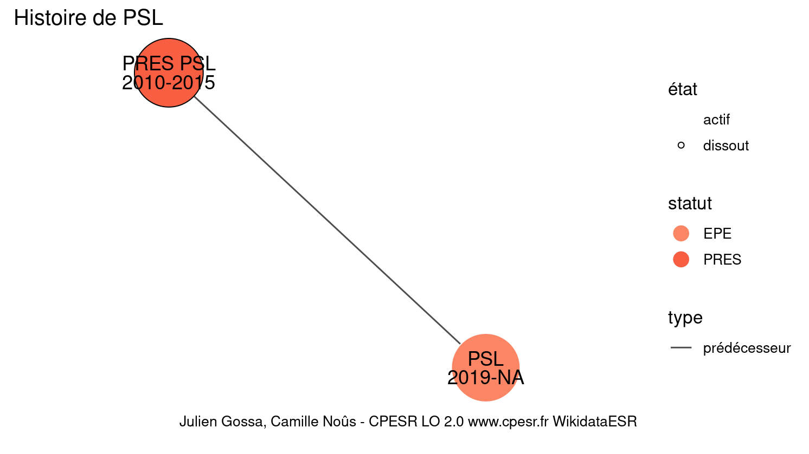
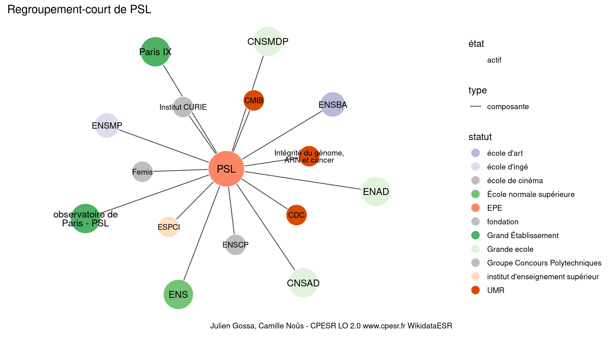

Warnings wikidataESR pour : PSL(01/10/2023
================

- Edition wikidata : [Q1163431](https://www.wikidata.org/wiki/Q1163431)
- Guide d'édition : [wikidataESR](https://github.com/cpesr/wikidataESR/)

- Discussion sur le guide d'édition : [github](https://github.com/cpesr/wikidataESR/issues)


## histoire 

 

Problèmes détectés dans les entités :

|entité                                             |alias |statut |message            |
|:--------------------------------------------------|:-----|:------|:------------------|
|[Q1163431](https://www.wikidata.org/wiki/Q1163431) |PSL   |EPE    |Préférer Q77979904 |

Problèmes détectés dans les relations :

|depuis                                             |vers                                                 |type         |message              |
|:--------------------------------------------------|:----------------------------------------------------|:------------|:--------------------|
|[Q1163431](https://www.wikidata.org/wiki/Q1163431) |[Q64813494](https://www.wikidata.org/wiki/Q64813494) |prédécesseur |Date(s) manquante(s) |

NB : les dates manquantes pour les relations de composante ne sont pas remontées. 


## regroupement-court 

 

Problèmes détectés dans les entités :

|entité                                                 |alias                              |statut                            |message                                |
|:------------------------------------------------------|:----------------------------------|:---------------------------------|:--------------------------------------|
|[Q1163431](https://www.wikidata.org/wiki/Q1163431)     |PSL                                |EPE                               |Préférer Q77979904                     |
|[Q273638](https://www.wikidata.org/wiki/Q273638)       |ESPCI                              |institut d'enseignement supérieur |Statut trop imprécis                   |
|[Q461340](https://www.wikidata.org/wiki/Q461340)       |observatoire de Paris - PSL        |Grand Établissement               |Alias manquant ou long                 |
|[Q1189954](https://www.wikidata.org/wiki/Q1189954)     |ENSMP                              |école d'ingé                      |Statut trop imprécis                   |
|[Q1127387](https://www.wikidata.org/wiki/Q1127387)     |CNSAD                              |Grande ecole                      |Réserver aux écoles non contemporaines |
|[Q463055](https://www.wikidata.org/wiki/Q463055)       |CNSMDP                             |Grande ecole                      |Réserver aux écoles non contemporaines |
|[Q1135990](https://www.wikidata.org/wiki/Q1135990)     |ENAD                               |Grande ecole                      |Réserver aux écoles non contemporaines |
|[Q109620211](https://www.wikidata.org/wiki/Q109620211) |Intégrité du génome, ARN et cancer |UMR                               |Alias manquant ou long                 |

 


## regroupement-etendu 

 

Problèmes détectés dans les entités :

|entité                                                 |alias                                                            |statut                            |message                                |
|:------------------------------------------------------|:----------------------------------------------------------------|:---------------------------------|:--------------------------------------|
|[Q1163431](https://www.wikidata.org/wiki/Q1163431)     |PSL                                                              |EPE                               |Préférer Q77979904                     |
|[Q30262256](https://www.wikidata.org/wiki/Q30262256)   |Fed PV                                                           |site                              |Statut trop imprécis                   |
|[Q16643681](https://www.wikidata.org/wiki/Q16643681)   |IHPST                                                            |laboratoire                       |Statut trop imprécis                   |
|[Q3214375](https://www.wikidata.org/wiki/Q3214375)     |LKB                                                              |institut de recherche             |Statut trop imprécis                   |
|[Q30262347](https://www.wikidata.org/wiki/Q30262347)   |Laboratoire des biomolécules                                     |UMR                               |Alias manquant ou long                 |
|[Q651337](https://www.wikidata.org/wiki/Q651337)       |Institut Jean Nicod                                              |institut de recherche             |Statut trop imprécis                   |
|[Q62925843](https://www.wikidata.org/wiki/Q62925843)   |Département de physique de l'École normale supérieure            |département universitaire         |Alias manquant ou long                 |
|[Q62925843](https://www.wikidata.org/wiki/Q62925843)   |Département de physique de l'École normale supérieure            |département universitaire         |Date de fondation manquante            |
|[Q273638](https://www.wikidata.org/wiki/Q273638)       |ESPCI                                                            |institut d'enseignement supérieur |Statut trop imprécis                   |
|[Q30262279](https://www.wikidata.org/wiki/Q30262279)   |Laboratoire de Chimie Organique                                  |site                              |Statut trop imprécis                   |
|[Q30262279](https://www.wikidata.org/wiki/Q30262279)   |Laboratoire de Chimie Organique                                  |site                              |Alias manquant ou long                 |
|[Q30262279](https://www.wikidata.org/wiki/Q30262279)   |Laboratoire de Chimie Organique                                  |site                              |Date de fondation manquante            |
|[Q30262290](https://www.wikidata.org/wiki/Q30262290)   |Laboratory Colloïdes et Matériaux Divisés                        |site                              |Statut trop imprécis                   |
|[Q30262290](https://www.wikidata.org/wiki/Q30262290)   |Laboratory Colloïdes et Matériaux Divisés                        |site                              |Alias manquant ou long                 |
|[Q3151760](https://www.wikidata.org/wiki/Q3151760)     |Institut Langevin                                                |institut de recherche             |Statut trop imprécis                   |
|[Q2913547](https://www.wikidata.org/wiki/Q2913547)     |UMR 7534                                                         |laboratoire                       |Statut trop imprécis                   |
|[Q30262539](https://www.wikidata.org/wiki/Q30262539)   |LEDA                                                             |site                              |Statut trop imprécis                   |
|[Q461340](https://www.wikidata.org/wiki/Q461340)       |observatoire de Paris - PSL                                      |Grand Établissement               |Alias manquant ou long                 |
|[Q2868555](https://www.wikidata.org/wiki/Q2868555)     |APC                                                              |institut de recherche             |Statut trop imprécis                   |
|[Q3152052](https://www.wikidata.org/wiki/Q3152052)     |IMCCE                                                            |institut de recherche             |Statut trop imprécis                   |
|[Q3214440](https://www.wikidata.org/wiki/Q3214440)     |LESIA                                                            |laboratoire                       |Statut trop imprécis                   |
|[Q35155796](https://www.wikidata.org/wiki/Q35155796)   |Grand equatorial coudé de Paris                                  |télescope optique                 |Alias manquant ou long                 |
|[Q35155796](https://www.wikidata.org/wiki/Q35155796)   |Grand equatorial coudé de Paris                                  |télescope optique                 |Date de fondation manquante            |
|[Q78478594](https://www.wikidata.org/wiki/Q78478594)   |Lunette Arago                                                    |télescope optique                 |Date de fondation manquante            |
|[Q1189954](https://www.wikidata.org/wiki/Q1189954)     |ENSMP                                                            |école d'ingé                      |Statut trop imprécis                   |
|[Q30262187](https://www.wikidata.org/wiki/Q30262187)   |GEOSCIENCE                                                       |site                              |Statut trop imprécis                   |
|[Q30262191](https://www.wikidata.org/wiki/Q30262191)   |CGS                                                              |institut de recherche             |Statut trop imprécis                   |
|[Q30262201](https://www.wikidata.org/wiki/Q30262201)   |CRI                                                              |site                              |Statut trop imprécis                   |
|[Q30262213](https://www.wikidata.org/wiki/Q30262213)   |Centre Procédés, Energies Renouvelables et Systèmes Energétiques |site                              |Statut trop imprécis                   |
|[Q30262213](https://www.wikidata.org/wiki/Q30262213)   |Centre Procédés, Energies Renouvelables et Systèmes Energétiques |site                              |Alias manquant ou long                 |
|[Q30262213](https://www.wikidata.org/wiki/Q30262213)   |Centre Procédés, Energies Renouvelables et Systèmes Energétiques |site                              |Date de fondation manquante            |
|[Q1127387](https://www.wikidata.org/wiki/Q1127387)     |CNSAD                                                            |Grande ecole                      |Réserver aux écoles non contemporaines |
|[Q463055](https://www.wikidata.org/wiki/Q463055)       |CNSMDP                                                           |Grande ecole                      |Réserver aux écoles non contemporaines |
|[Q108699753](https://www.wikidata.org/wiki/Q108699753) |Médiathèque Hector-Berlioz                                       |médiathèque                       |Alias manquant ou long                 |
|[Q1135990](https://www.wikidata.org/wiki/Q1135990)     |ENAD                                                             |Grande ecole                      |Réserver aux écoles non contemporaines |
|[Q3361154](https://www.wikidata.org/wiki/Q3361154)     |palais des Études                                                |bâtisse                           |Date de fondation manquante            |
|[Q109586954](https://www.wikidata.org/wiki/Q109586954) |Centre d'imagerie multimodale                                    |UMS                               |Alias manquant ou long                 |
|[Q109620211](https://www.wikidata.org/wiki/Q109620211) |Intégrité du génome, ARN et cancer                               |UMR                               |Alias manquant ou long                 |

Problèmes détectés dans les relations :

|depuis                                           |vers                                                   |type      |message              |
|:------------------------------------------------|:------------------------------------------------------|:---------|:--------------------|
|[Q273638](https://www.wikidata.org/wiki/Q273638) |[Q2992903](https://www.wikidata.org/wiki/Q2992903)     |affilié_à |Date(s) manquante(s) |
|[Q273638](https://www.wikidata.org/wiki/Q273638) |[Q1344278](https://www.wikidata.org/wiki/Q1344278)     |affilié_à |Date(s) manquante(s) |
|[Q461340](https://www.wikidata.org/wiki/Q461340) |[Q35155796](https://www.wikidata.org/wiki/Q35155796)   |associé   |Date(s) manquante(s) |
|[Q461340](https://www.wikidata.org/wiki/Q461340) |[Q78478594](https://www.wikidata.org/wiki/Q78478594)   |associé   |Date(s) manquante(s) |
|[Q463055](https://www.wikidata.org/wiki/Q463055) |[Q108699753](https://www.wikidata.org/wiki/Q108699753) |associé   |Date(s) manquante(s) |
|[Q273593](https://www.wikidata.org/wiki/Q273593) |[Q3361154](https://www.wikidata.org/wiki/Q3361154)     |associé   |Date(s) manquante(s) |

NB : les dates manquantes pour les relations de composante ne sont pas remontées. 


## regroupement-superetendu 

 


Erreur : les données sont probablement trop partielles.
```
Error in query(url, "pcontent", clean_response, query_param = query_param, : The API returned an error: missingtitle - The page you specified doesn't exist.

``` 

