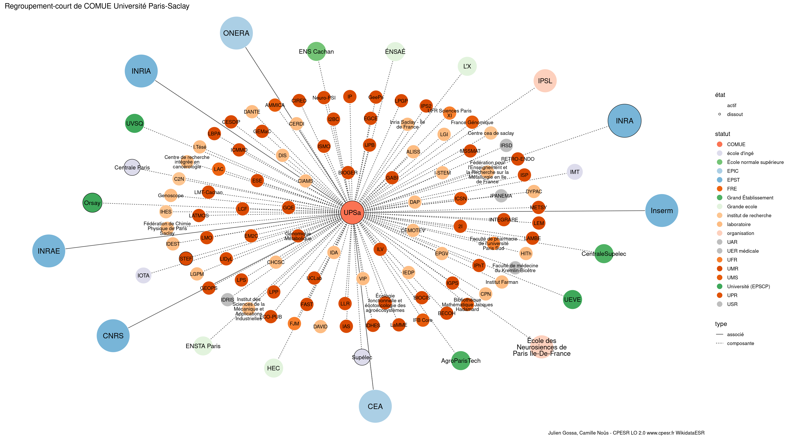

Warnings wikidataESR pour : COMUE Université Paris-Saclay(01/10/2023
================

- Edition wikidata : [Q13531686](https://www.wikidata.org/wiki/Q13531686)
- Guide d'édition : [wikidataESR](https://github.com/cpesr/wikidataESR/)

- Discussion sur le guide d'édition : [github](https://github.com/cpesr/wikidataESR/issues)


## histoire 

 

Problèmes détectés dans les entités :

|entité                                               |alias     |statut                 |message              |
|:----------------------------------------------------|:---------|:----------------------|:--------------------|
|[Q48759778](https://www.wikidata.org/wiki/Q48759778) |NewUni    |EPE                    |Préférer Q77979904   |
|[Q3577932](https://www.wikidata.org/wiki/Q3577932)   |HEC Maroc |institut universitaire |Statut trop imprécis |

Problèmes détectés dans les relations :

|depuis                                               |vers                                                 |type      |message              |
|:----------------------------------------------------|:----------------------------------------------------|:---------|:--------------------|
|[Q13531686](https://www.wikidata.org/wiki/Q13531686) |[Q48759778](https://www.wikidata.org/wiki/Q48759778) |séparé_de |Date(s) manquante(s) |
|[Q13531686](https://www.wikidata.org/wiki/Q13531686) |[Q3577932](https://www.wikidata.org/wiki/Q3577932)   |séparé_de |Date(s) manquante(s) |

NB : les dates manquantes pour les relations de composante ne sont pas remontées. 


## regroupement-court 

 

Problèmes détectés dans les entités :

|entité                                                 |alias                                                                              |statut                |message                                |
|:------------------------------------------------------|:----------------------------------------------------------------------------------|:---------------------|:--------------------------------------|
|[Q4393524](https://www.wikidata.org/wiki/Q4393524)     |Centre cea de saclay                                                               |institut de recherche |Statut trop imprécis                   |
|[Q4393524](https://www.wikidata.org/wiki/Q4393524)     |Centre cea de saclay                                                               |institut de recherche |Alias manquant ou long                 |
|[Q30262363](https://www.wikidata.org/wiki/Q30262363)   |LGI                                                                                |laboratoire           |Statut trop imprécis                   |
|[Q1156553](https://www.wikidata.org/wiki/Q1156553)     |IHES                                                                               |institut de recherche |Statut trop imprécis                   |
|[Q273447](https://www.wikidata.org/wiki/Q273447)       |Centrale Paris                                                                     |école d'ingé          |Statut trop imprécis                   |
|[Q273535](https://www.wikidata.org/wiki/Q273535)       |HEC                                                                                |Grande ecole          |Réserver aux écoles non contemporaines |
|[Q273626](https://www.wikidata.org/wiki/Q273626)       |L'X                                                                                |Grande ecole          |Réserver aux écoles non contemporaines |
|[Q838454](https://www.wikidata.org/wiki/Q838454)       |ENSTA Paris                                                                        |Grande ecole          |Réserver aux écoles non contemporaines |
|[Q273493](https://www.wikidata.org/wiki/Q273493)       |Supélec                                                                            |école d'ingé          |Statut trop imprécis                   |
|[Q1275372](https://www.wikidata.org/wiki/Q1275372)     |ÉNSAÉ                                                                              |Grande ecole          |Réserver aux écoles non contemporaines |
|[Q7885718](https://www.wikidata.org/wiki/Q7885718)     |IMT                                                                                |école d'ingé          |Statut trop imprécis                   |
|[Q898448](https://www.wikidata.org/wiki/Q898448)       |IOTA                                                                               |école d'ingé          |Statut trop imprécis                   |
|[Q30262143](https://www.wikidata.org/wiki/Q30262143)   |ALISS                                                                              |laboratoire           |Statut trop imprécis                   |
|[Q98112081](https://www.wikidata.org/wiki/Q98112081)   |UFR Sciences Paris XI                                                              |UFR                   |Alias manquant ou long                 |
|[Q90272039](https://www.wikidata.org/wiki/Q90272039)   |Faculté de médecine du Kremlin-Bicêtre                                             |UER médicale          |Alias manquant ou long                 |
|[Q107167255](https://www.wikidata.org/wiki/Q107167255) |Faculté de pharmacie de l'université Paris Sud                                     |UFR                   |Alias manquant ou long                 |
|[Q51780589](https://www.wikidata.org/wiki/Q51780589)   |Bibliothèque Mathématique Jacques Hadamard                                         |UMS                   |Alias manquant ou long                 |
|[Q29624201](https://www.wikidata.org/wiki/Q29624201)   |CEMOTEV                                                                            |laboratoire           |Statut trop imprécis                   |
|[Q51785320](https://www.wikidata.org/wiki/Q51785320)   |CERDI                                                                              |laboratoire           |Statut trop imprécis                   |
|[Q3151940](https://www.wikidata.org/wiki/Q3151940)     |C2N                                                                                |institut de recherche |Statut trop imprécis                   |
|[Q51782140](https://www.wikidata.org/wiki/Q51782140)   |Centre de recherche intégrée en cancérologie                                       |laboratoire           |Statut trop imprécis                   |
|[Q51782140](https://www.wikidata.org/wiki/Q51782140)   |Centre de recherche intégrée en cancérologie                                       |laboratoire           |Alias manquant ou long                 |
|[Q51781591](https://www.wikidata.org/wiki/Q51781591)   |VIP                                                                                |laboratoire           |Statut trop imprécis                   |
|[Q47008419](https://www.wikidata.org/wiki/Q47008419)   |CHCSC                                                                              |laboratoire           |Statut trop imprécis                   |
|[Q51783587](https://www.wikidata.org/wiki/Q51783587)   |CPN                                                                                |laboratoire           |Statut trop imprécis                   |
|[Q51784186](https://www.wikidata.org/wiki/Q51784186)   |CIAMS                                                                              |laboratoire           |Statut trop imprécis                   |
|[Q51785421](https://www.wikidata.org/wiki/Q51785421)   |DAVID                                                                              |laboratoire           |Statut trop imprécis                   |
|[Q51781188](https://www.wikidata.org/wiki/Q51781188)   |DYPAC                                                                              |laboratoire           |Statut trop imprécis                   |
|[Q52604715](https://www.wikidata.org/wiki/Q52604715)   |DAP                                                                                |laboratoire           |Statut trop imprécis                   |
|[Q52605393](https://www.wikidata.org/wiki/Q52605393)   |DIS                                                                                |laboratoire           |Statut trop imprécis                   |
|[Q36875103](https://www.wikidata.org/wiki/Q36875103)   |École des Neurosiences de Paris Ile-De-France                                      |organisation          |Statut trop imprécis                   |
|[Q36875103](https://www.wikidata.org/wiki/Q36875103)   |École des Neurosiences de Paris Ile-De-France                                      |organisation          |Alias manquant ou long                 |
|[Q51782089](https://www.wikidata.org/wiki/Q51782089)   |Écologie fonctionnelle et écotoxicologie des agroécosystèmes                       |UMR                   |Alias manquant ou long                 |
|[Q51780517](https://www.wikidata.org/wiki/Q51780517)   |EPGV                                                                               |laboratoire           |Statut trop imprécis                   |
|[Q51783989](https://www.wikidata.org/wiki/Q51783989)   |Fédération de Chimie Physique de Paris Saclay                                      |laboratoire           |Statut trop imprécis                   |
|[Q51783989](https://www.wikidata.org/wiki/Q51783989)   |Fédération de Chimie Physique de Paris Saclay                                      |laboratoire           |Alias manquant ou long                 |
|[Q51782010](https://www.wikidata.org/wiki/Q51782010)   |Fédération pour l'Enseignement et la Recherche sur la Métallurgie en Ile de France |laboratoire           |Statut trop imprécis                   |
|[Q51782010](https://www.wikidata.org/wiki/Q51782010)   |Fédération pour l'Enseignement et la Recherche sur la Métallurgie en Ile de France |laboratoire           |Alias manquant ou long                 |
|[Q3100800](https://www.wikidata.org/wiki/Q3100800)     |Genoscope                                                                          |laboratoire           |Statut trop imprécis                   |
|[Q51785052](https://www.wikidata.org/wiki/Q51785052)   |Génomique Métabolique                                                              |UMR                   |Alias manquant ou long                 |
|[Q51781994](https://www.wikidata.org/wiki/Q51781994)   |HITh                                                                               |laboratoire           |Statut trop imprécis                   |
|[Q18156000](https://www.wikidata.org/wiki/Q18156000)   |Inria Saclay - Île de France                                                       |laboratoire           |Statut trop imprécis                   |
|[Q18156000](https://www.wikidata.org/wiki/Q18156000)   |Inria Saclay - Île de France                                                       |laboratoire           |Alias manquant ou long                 |
|[Q51780703](https://www.wikidata.org/wiki/Q51780703)   |IDA                                                                                |laboratoire           |Statut trop imprécis                   |
|[Q51781269](https://www.wikidata.org/wiki/Q51781269)   |IEDP                                                                               |laboratoire           |Statut trop imprécis                   |
|[Q51782564](https://www.wikidata.org/wiki/Q51782564)   |I.Tésé                                                                             |laboratoire           |Statut trop imprécis                   |
|[Q52606886](https://www.wikidata.org/wiki/Q52606886)   |I-STEM                                                                             |laboratoire           |Statut trop imprécis                   |
|[Q51783924](https://www.wikidata.org/wiki/Q51783924)   |Institut des Sciences de la Mécanique et Applications Industrielles                |laboratoire           |Statut trop imprécis                   |
|[Q51783924](https://www.wikidata.org/wiki/Q51783924)   |Institut des Sciences de la Mécanique et Applications Industrielles                |laboratoire           |Alias manquant ou long                 |
|[Q3133097](https://www.wikidata.org/wiki/Q3133097)     |IDEST                                                                              |laboratoire           |Statut trop imprécis                   |
|[Q51781563](https://www.wikidata.org/wiki/Q51781563)   |Institut Farman                                                                    |laboratoire           |Statut trop imprécis                   |
|[Q3151794](https://www.wikidata.org/wiki/Q3151794)     |IPSL                                                                               |organisation          |Statut trop imprécis                   |
|[Q29625240](https://www.wikidata.org/wiki/Q29625240)   |DANTE                                                                              |laboratoire           |Statut trop imprécis                   |
|[Q51786239](https://www.wikidata.org/wiki/Q51786239)   |LGPM                                                                               |laboratoire           |Statut trop imprécis                   |

Problèmes détectés dans les relations :

|depuis                                               |vers                                                 |type       |message              |
|:----------------------------------------------------|:----------------------------------------------------|:----------|:--------------------|
|[Q13531686](https://www.wikidata.org/wiki/Q13531686) |[Q1146208](https://www.wikidata.org/wiki/Q1146208)   |composante |Relation multiple    |
|[Q13531686](https://www.wikidata.org/wiki/Q13531686) |[Q1146208](https://www.wikidata.org/wiki/Q1146208)   |associé    |Relation multiple    |
|[Q13531686](https://www.wikidata.org/wiki/Q13531686) |[Q2007769](https://www.wikidata.org/wiki/Q2007769)   |composante |Relation multiple    |
|[Q13531686](https://www.wikidata.org/wiki/Q13531686) |[Q2007769](https://www.wikidata.org/wiki/Q2007769)   |associé    |Relation multiple    |
|[Q13531686](https://www.wikidata.org/wiki/Q13531686) |[Q30262143](https://www.wikidata.org/wiki/Q30262143) |composante |Relation multiple    |
|[Q13531686](https://www.wikidata.org/wiki/Q13531686) |[Q30262143](https://www.wikidata.org/wiki/Q30262143) |composante |Relation multiple    |
|[Q13531686](https://www.wikidata.org/wiki/Q13531686) |[Q52606352](https://www.wikidata.org/wiki/Q52606352) |composante |Relation multiple    |
|[Q13531686](https://www.wikidata.org/wiki/Q13531686) |[Q52606352](https://www.wikidata.org/wiki/Q52606352) |composante |Relation multiple    |
|[Q13531686](https://www.wikidata.org/wiki/Q13531686) |[Q868550](https://www.wikidata.org/wiki/Q868550)     |composante |Relation multiple    |
|[Q13531686](https://www.wikidata.org/wiki/Q13531686) |[Q868550](https://www.wikidata.org/wiki/Q868550)     |associé    |Relation multiple    |
|[Q13531686](https://www.wikidata.org/wiki/Q13531686) |[Q280413](https://www.wikidata.org/wiki/Q280413)     |associé    |Date(s) manquante(s) |
|[Q13531686](https://www.wikidata.org/wiki/Q13531686) |[Q1146208](https://www.wikidata.org/wiki/Q1146208)   |associé    |Date(s) manquante(s) |
|[Q13531686](https://www.wikidata.org/wiki/Q13531686) |[Q70571774](https://www.wikidata.org/wiki/Q70571774) |associé    |Date(s) manquante(s) |
|[Q13531686](https://www.wikidata.org/wiki/Q13531686) |[Q1474517](https://www.wikidata.org/wiki/Q1474517)   |associé    |Date(s) manquante(s) |
|[Q13531686](https://www.wikidata.org/wiki/Q13531686) |[Q868550](https://www.wikidata.org/wiki/Q868550)     |associé    |Date(s) manquante(s) |
|[Q13531686](https://www.wikidata.org/wiki/Q13531686) |[Q2007769](https://www.wikidata.org/wiki/Q2007769)   |associé    |Date(s) manquante(s) |

NB : les dates manquantes pour les relations de composante ne sont pas remontées. 


## regroupement-etendu 

 

Problèmes détectés dans les entités :

|entité                                                 |alias                                                                              |statut                 |message                                |
|:------------------------------------------------------|:----------------------------------------------------------------------------------|:----------------------|:--------------------------------------|
|[Q4393524](https://www.wikidata.org/wiki/Q4393524)     |Centre cea de saclay                                                               |institut de recherche  |Statut trop imprécis                   |
|[Q4393524](https://www.wikidata.org/wiki/Q4393524)     |Centre cea de saclay                                                               |institut de recherche  |Alias manquant ou long                 |
|[Q30262524](https://www.wikidata.org/wiki/Q30262524)   |Systèmes Membranaires, Photobiologie, Stress et Détoxication                       |UMR                    |Alias manquant ou long                 |
|[Q30262363](https://www.wikidata.org/wiki/Q30262363)   |LGI                                                                                |laboratoire            |Statut trop imprécis                   |
|[Q1156553](https://www.wikidata.org/wiki/Q1156553)     |IHES                                                                               |institut de recherche  |Statut trop imprécis                   |
|[Q51780589](https://www.wikidata.org/wiki/Q51780589)   |Bibliothèque Mathématique Jacques Hadamard                                         |UMS                    |Alias manquant ou long                 |
|[Q30262248](https://www.wikidata.org/wiki/Q30262248)   |G-EAU                                                                              |site                   |Statut trop imprécis                   |
|[Q30262478](https://www.wikidata.org/wiki/Q30262478)   |Ingénierie Procédés Aliments                                                       |site                   |Statut trop imprécis                   |
|[Q30262478](https://www.wikidata.org/wiki/Q30262478)   |Ingénierie Procédés Aliments                                                       |site                   |Alias manquant ou long                 |
|[Q51782089](https://www.wikidata.org/wiki/Q51782089)   |Écologie fonctionnelle et écotoxicologie des agroécosystèmes                       |UMR                    |Alias manquant ou long                 |
|[Q273447](https://www.wikidata.org/wiki/Q273447)       |Centrale Paris                                                                     |école d'ingé           |Statut trop imprécis                   |
|[Q30262166](https://www.wikidata.org/wiki/Q30262166)   |Paris Biotech Santé                                                                |site                   |Statut trop imprécis                   |
|[Q273535](https://www.wikidata.org/wiki/Q273535)       |HEC                                                                                |Grande ecole           |Réserver aux écoles non contemporaines |
|[Q59535271](https://www.wikidata.org/wiki/Q59535271)   |École des hautes études commerciales de Paris au Qatar                             |institution éducative  |Statut trop imprécis                   |
|[Q59535271](https://www.wikidata.org/wiki/Q59535271)   |École des hautes études commerciales de Paris au Qatar                             |institution éducative  |Alias manquant ou long                 |
|[Q1023349](https://www.wikidata.org/wiki/Q1023349)     |Community of European management Schools                                           |institut universitaire |Statut trop imprécis                   |
|[Q1023349](https://www.wikidata.org/wiki/Q1023349)     |Community of European management Schools                                           |institut universitaire |Alias manquant ou long                 |
|[Q273626](https://www.wikidata.org/wiki/Q273626)       |L'X                                                                                |Grande ecole           |Réserver aux écoles non contemporaines |
|[Q16008922](https://www.wikidata.org/wiki/Q16008922)   |CMAP                                                                               |institut de recherche  |Statut trop imprécis                   |
|[Q3214506](https://www.wikidata.org/wiki/Q3214506)     |LULI                                                                               |laboratoire            |Statut trop imprécis                   |
|[Q30262191](https://www.wikidata.org/wiki/Q30262191)   |CGS                                                                                |institut de recherche  |Statut trop imprécis                   |
|[Q30262256](https://www.wikidata.org/wiki/Q30262256)   |Fed PV                                                                             |site                   |Statut trop imprécis                   |
|[Q16009025](https://www.wikidata.org/wiki/Q16009025)   |LIX                                                                                |laboratoire            |Statut trop imprécis                   |
|[Q3214388](https://www.wikidata.org/wiki/Q3214388)     |Lsv                                                                                |institut de recherche  |Statut trop imprécis                   |
|[Q109583955](https://www.wikidata.org/wiki/Q109583955) |CB                                                                                 |UMR                    |Date de fondation manquante            |
|[Q109584042](https://www.wikidata.org/wiki/Q109584042) |CRD                                                                                |laboratoire            |Statut trop imprécis                   |
|[Q109584482](https://www.wikidata.org/wiki/Q109584482) |Centre d'économie de l'école normale supérieure Paris-Saclay                       |laboratoire            |Statut trop imprécis                   |
|[Q109584482](https://www.wikidata.org/wiki/Q109584482) |Centre d'économie de l'école normale supérieure Paris-Saclay                       |laboratoire            |Alias manquant ou long                 |
|[Q51785279](https://www.wikidata.org/wiki/Q51785279)   |LURPA                                                                              |laboratoire            |Statut trop imprécis                   |
|[Q838454](https://www.wikidata.org/wiki/Q838454)       |ENSTA Paris                                                                        |Grande ecole           |Réserver aux écoles non contemporaines |
|[Q273493](https://www.wikidata.org/wiki/Q273493)       |Supélec                                                                            |école d'ingé           |Statut trop imprécis                   |
|[Q24731172](https://www.wikidata.org/wiki/Q24731172)   |LMOPS                                                                              |laboratoire            |Statut trop imprécis                   |
|[Q1275372](https://www.wikidata.org/wiki/Q1275372)     |ÉNSAÉ                                                                              |Grande ecole           |Réserver aux écoles non contemporaines |
|[Q7885718](https://www.wikidata.org/wiki/Q7885718)     |IMT                                                                                |école d'ingé           |Statut trop imprécis                   |
|[Q3577934](https://www.wikidata.org/wiki/Q3577934)     |ENSTIMAC                                                                           |école                  |Statut trop imprécis                   |
|[Q30262371](https://www.wikidata.org/wiki/Q30262371)   |LTCI                                                                               |laboratoire            |Statut trop imprécis                   |
|[Q27962533](https://www.wikidata.org/wiki/Q27962533)   |IMT Atlantique                                                                     |école                  |Statut trop imprécis                   |
|[Q3577938](https://www.wikidata.org/wiki/Q3577938)     |LGEI                                                                               |école d'ingé           |Statut trop imprécis                   |
|[Q898448](https://www.wikidata.org/wiki/Q898448)       |IOTA                                                                               |école d'ingé           |Statut trop imprécis                   |
|[Q15407445](https://www.wikidata.org/wiki/Q15407445)   |Laboratoire Hubert-Curien                                                          |institut de recherche  |Statut trop imprécis                   |
|[Q15407445](https://www.wikidata.org/wiki/Q15407445)   |Laboratoire Hubert-Curien                                                          |institut de recherche  |Alias manquant ou long                 |
|[Q3214435](https://www.wikidata.org/wiki/Q3214435)     |LIMSI                                                                              |laboratoire            |Statut trop imprécis                   |
|[Q30299434](https://www.wikidata.org/wiki/Q30299434)   |I2BM                                                                               |agence publique        |Statut trop imprécis                   |
|[Q3151940](https://www.wikidata.org/wiki/Q3151940)     |C2N                                                                                |institut de recherche  |Statut trop imprécis                   |
|[Q2945499](https://www.wikidata.org/wiki/Q2945499)     |CSNSM                                                                              |centre de recherche    |Statut trop imprécis                   |
|[Q30261458](https://www.wikidata.org/wiki/Q30261458)   |Physiopathologie et Innovation Thérapeutique                                       |site                   |Statut trop imprécis                   |
|[Q30261458](https://www.wikidata.org/wiki/Q30261458)   |Physiopathologie et Innovation Thérapeutique                                       |site                   |Alias manquant ou long                 |
|[Q3214459](https://www.wikidata.org/wiki/Q3214459)     |LAL                                                                                |institut de recherche  |Statut trop imprécis                   |
|[Q3152052](https://www.wikidata.org/wiki/Q3152052)     |IMCCE                                                                              |institut de recherche  |Statut trop imprécis                   |
|[Q30262197](https://www.wikidata.org/wiki/Q30262197)   |Laboratoire de Biologie Moleculaire du Gène chez les Extremophiles                 |site                   |Statut trop imprécis                   |
|[Q30262197](https://www.wikidata.org/wiki/Q30262197)   |Laboratoire de Biologie Moleculaire du Gène chez les Extremophiles                 |site                   |Alias manquant ou long                 |
|[Q30262197](https://www.wikidata.org/wiki/Q30262197)   |Laboratoire de Biologie Moleculaire du Gène chez les Extremophiles                 |site                   |Date de fondation manquante            |
|[Q30262232](https://www.wikidata.org/wiki/Q30262232)   |CESP                                                                               |laboratoire            |Statut trop imprécis                   |
|[Q30262346](https://www.wikidata.org/wiki/Q30262346)   |Vectorologie et Thérapeutiques Anticancéreuses                                     |UMR                    |Alias manquant ou long                 |
|[Q30262424](https://www.wikidata.org/wiki/Q30262424)   |ICPH                                                                               |site                   |Statut trop imprécis                   |
|[Q30262427](https://www.wikidata.org/wiki/Q30262427)   |Singnalisation et physiopathologie cardiaque                                       |site                   |Statut trop imprécis                   |
|[Q30262427](https://www.wikidata.org/wiki/Q30262427)   |Singnalisation et physiopathologie cardiaque                                       |site                   |Alias manquant ou long                 |
|[Q30262427](https://www.wikidata.org/wiki/Q30262427)   |Singnalisation et physiopathologie cardiaque                                       |site                   |Date de fondation manquante            |
|[Q3214481](https://www.wikidata.org/wiki/Q3214481)     |LRI                                                                                |laboratoire            |Statut trop imprécis                   |
|[Q3152061](https://www.wikidata.org/wiki/Q3152061)     |IPNO                                                                               |laboratoire            |Statut trop imprécis                   |
|[Q50040720](https://www.wikidata.org/wiki/Q50040720)   |Stress Génotoxique et Cancer                                                       |site                   |Statut trop imprécis                   |
|[Q50040720](https://www.wikidata.org/wiki/Q50040720)   |Stress Génotoxique et Cancer                                                       |site                   |Alias manquant ou long                 |
|[Q50040741](https://www.wikidata.org/wiki/Q50040741)   |Stabilité Génétique et Oncogenèse                                                  |site                   |Statut trop imprécis                   |
|[Q50040741](https://www.wikidata.org/wiki/Q50040741)   |Stabilité Génétique et Oncogenèse                                                  |site                   |Alias manquant ou long                 |
|[Q3214440](https://www.wikidata.org/wiki/Q3214440)     |LESIA                                                                              |laboratoire            |Statut trop imprécis                   |
|[Q104773040](https://www.wikidata.org/wiki/Q104773040) |UFR des sciences                                                                   |UFR                    |Date de fondation manquante            |
|[Q51781591](https://www.wikidata.org/wiki/Q51781591)   |VIP                                                                                |laboratoire            |Statut trop imprécis                   |
|[Q29624201](https://www.wikidata.org/wiki/Q29624201)   |CEMOTEV                                                                            |laboratoire            |Statut trop imprécis                   |
|[Q47008419](https://www.wikidata.org/wiki/Q47008419)   |CHCSC                                                                              |laboratoire            |Statut trop imprécis                   |
|[Q109587112](https://www.wikidata.org/wiki/Q109587112) |CIC Garches                                                                        |laboratoire            |Statut trop imprécis                   |
|[Q51779969](https://www.wikidata.org/wiki/Q51779969)   |CEARC                                                                              |laboratoire            |Statut trop imprécis                   |
|[Q51785421](https://www.wikidata.org/wiki/Q51785421)   |DAVID                                                                              |laboratoire            |Statut trop imprécis                   |
|[Q51781188](https://www.wikidata.org/wiki/Q51781188)   |DYPAC                                                                              |laboratoire            |Statut trop imprécis                   |
|[Q109614029](https://www.wikidata.org/wiki/Q109614029) |ERPHAN                                                                             |laboratoire            |Statut trop imprécis                   |
|[Q109620268](https://www.wikidata.org/wiki/Q109620268) |LAAB                                                                               |laboratoire            |Statut trop imprécis                   |
|[Q29625240](https://www.wikidata.org/wiki/Q29625240)   |DANTE                                                                              |laboratoire            |Statut trop imprécis                   |
|[Q51780035](https://www.wikidata.org/wiki/Q51780035)   |LGBC                                                                               |laboratoire            |Statut trop imprécis                   |
|[Q109620502](https://www.wikidata.org/wiki/Q109620502) |LAREQUOI                                                                           |laboratoire            |Statut trop imprécis                   |
|[Q109620610](https://www.wikidata.org/wiki/Q109620610) |LI-PaRAD                                                                           |laboratoire            |Statut trop imprécis                   |
|[Q29606460](https://www.wikidata.org/wiki/Q29606460)   |LISV                                                                               |laboratoire            |Statut trop imprécis                   |
|[Q51781731](https://www.wikidata.org/wiki/Q51781731)   |LPPD                                                                               |laboratoire            |Statut trop imprécis                   |
|[Q51783930](https://www.wikidata.org/wiki/Q51783930)   |RISCQ                                                                              |laboratoire            |Statut trop imprécis                   |
|[Q30262143](https://www.wikidata.org/wiki/Q30262143)   |ALISS                                                                              |laboratoire            |Statut trop imprécis                   |
|[Q98112081](https://www.wikidata.org/wiki/Q98112081)   |UFR Sciences Paris XI                                                              |UFR                    |Alias manquant ou long                 |
|[Q90272039](https://www.wikidata.org/wiki/Q90272039)   |Faculté de médecine du Kremlin-Bicêtre                                             |UER médicale           |Alias manquant ou long                 |
|[Q107167255](https://www.wikidata.org/wiki/Q107167255) |Faculté de pharmacie de l'université Paris Sud                                     |UFR                    |Alias manquant ou long                 |
|[Q109584455](https://www.wikidata.org/wiki/Q109584455) |CVN                                                                                |laboratoire            |Statut trop imprécis                   |
|[Q51786239](https://www.wikidata.org/wiki/Q51786239)   |LGPM                                                                               |laboratoire            |Statut trop imprécis                   |
|[Q51780222](https://www.wikidata.org/wiki/Q51780222)   |MICS                                                                               |laboratoire            |Statut trop imprécis                   |
|[Q109621839](https://www.wikidata.org/wiki/Q109621839) |SONDRA                                                                             |laboratoire            |Statut trop imprécis                   |
|[Q109584110](https://www.wikidata.org/wiki/Q109584110) |CRLD                                                                               |laboratoire            |Statut trop imprécis                   |
|[Q109584557](https://www.wikidata.org/wiki/Q109584557) |EPEE                                                                               |laboratoire            |Statut trop imprécis                   |
|[Q51783587](https://www.wikidata.org/wiki/Q51783587)   |CPN                                                                                |laboratoire            |Statut trop imprécis                   |
|[Q51785052](https://www.wikidata.org/wiki/Q51785052)   |Génomique Métabolique                                                              |UMR                    |Alias manquant ou long                 |
|[Q51781503](https://www.wikidata.org/wiki/Q51781503)   |IBISC                                                                              |laboratoire            |Statut trop imprécis                   |
|[Q52606886](https://www.wikidata.org/wiki/Q52606886)   |I-STEM                                                                             |laboratoire            |Statut trop imprécis                   |
|[Q109620444](https://www.wikidata.org/wiki/Q109620444) |Laboratoire de mécanique et d'énergétique d'Évry                                   |laboratoire            |Statut trop imprécis                   |
|[Q109620444](https://www.wikidata.org/wiki/Q109620444) |Laboratoire de mécanique et d'énergétique d'Évry                                   |laboratoire            |Alias manquant ou long                 |
|[Q109620641](https://www.wikidata.org/wiki/Q109620641) |LITEM                                                                              |laboratoire            |Statut trop imprécis                   |
|[Q109620651](https://www.wikidata.org/wiki/Q109620651) |GENHOTEL                                                                           |laboratoire            |Statut trop imprécis                   |
|[Q109621817](https://www.wikidata.org/wiki/Q109621817) |SABNP                                                                              |laboratoire            |Statut trop imprécis                   |
|[Q51785320](https://www.wikidata.org/wiki/Q51785320)   |CERDI                                                                              |laboratoire            |Statut trop imprécis                   |
|[Q51782140](https://www.wikidata.org/wiki/Q51782140)   |Centre de recherche intégrée en cancérologie                                       |laboratoire            |Statut trop imprécis                   |
|[Q51782140](https://www.wikidata.org/wiki/Q51782140)   |Centre de recherche intégrée en cancérologie                                       |laboratoire            |Alias manquant ou long                 |
|[Q51784186](https://www.wikidata.org/wiki/Q51784186)   |CIAMS                                                                              |laboratoire            |Statut trop imprécis                   |
|[Q52604715](https://www.wikidata.org/wiki/Q52604715)   |DAP                                                                                |laboratoire            |Statut trop imprécis                   |
|[Q52605393](https://www.wikidata.org/wiki/Q52605393)   |DIS                                                                                |laboratoire            |Statut trop imprécis                   |
|[Q36875103](https://www.wikidata.org/wiki/Q36875103)   |École des Neurosiences de Paris Ile-De-France                                      |organisation           |Statut trop imprécis                   |
|[Q36875103](https://www.wikidata.org/wiki/Q36875103)   |École des Neurosiences de Paris Ile-De-France                                      |organisation           |Alias manquant ou long                 |
|[Q51780517](https://www.wikidata.org/wiki/Q51780517)   |EPGV                                                                               |laboratoire            |Statut trop imprécis                   |
|[Q51783989](https://www.wikidata.org/wiki/Q51783989)   |Fédération de Chimie Physique de Paris Saclay                                      |laboratoire            |Statut trop imprécis                   |
|[Q51783989](https://www.wikidata.org/wiki/Q51783989)   |Fédération de Chimie Physique de Paris Saclay                                      |laboratoire            |Alias manquant ou long                 |
|[Q51782010](https://www.wikidata.org/wiki/Q51782010)   |Fédération pour l'Enseignement et la Recherche sur la Métallurgie en Ile de France |laboratoire            |Statut trop imprécis                   |
|[Q51782010](https://www.wikidata.org/wiki/Q51782010)   |Fédération pour l'Enseignement et la Recherche sur la Métallurgie en Ile de France |laboratoire            |Alias manquant ou long                 |
|[Q3100800](https://www.wikidata.org/wiki/Q3100800)     |Genoscope                                                                          |laboratoire            |Statut trop imprécis                   |
|[Q51781994](https://www.wikidata.org/wiki/Q51781994)   |HITh                                                                               |laboratoire            |Statut trop imprécis                   |
|[Q18156000](https://www.wikidata.org/wiki/Q18156000)   |Inria Saclay - Île de France                                                       |laboratoire            |Statut trop imprécis                   |
|[Q18156000](https://www.wikidata.org/wiki/Q18156000)   |Inria Saclay - Île de France                                                       |laboratoire            |Alias manquant ou long                 |
|[Q51780703](https://www.wikidata.org/wiki/Q51780703)   |IDA                                                                                |laboratoire            |Statut trop imprécis                   |
|[Q51781269](https://www.wikidata.org/wiki/Q51781269)   |IEDP                                                                               |laboratoire            |Statut trop imprécis                   |
|[Q51782564](https://www.wikidata.org/wiki/Q51782564)   |I.Tésé                                                                             |laboratoire            |Statut trop imprécis                   |
|[Q51783924](https://www.wikidata.org/wiki/Q51783924)   |Institut des Sciences de la Mécanique et Applications Industrielles                |laboratoire            |Statut trop imprécis                   |
|[Q51783924](https://www.wikidata.org/wiki/Q51783924)   |Institut des Sciences de la Mécanique et Applications Industrielles                |laboratoire            |Alias manquant ou long                 |
|[Q3133097](https://www.wikidata.org/wiki/Q3133097)     |IDEST                                                                              |laboratoire            |Statut trop imprécis                   |
|[Q51781563](https://www.wikidata.org/wiki/Q51781563)   |Institut Farman                                                                    |laboratoire            |Statut trop imprécis                   |
|[Q3151794](https://www.wikidata.org/wiki/Q3151794)     |IPSL                                                                               |organisation           |Statut trop imprécis                   |

Problèmes détectés dans les relations :

|depuis                                               |vers                                                   |type       |message              |
|:----------------------------------------------------|:------------------------------------------------------|:----------|:--------------------|
|[Q13531686](https://www.wikidata.org/wiki/Q13531686) |[Q1146208](https://www.wikidata.org/wiki/Q1146208)     |composante |Relation multiple    |
|[Q13531686](https://www.wikidata.org/wiki/Q13531686) |[Q1146208](https://www.wikidata.org/wiki/Q1146208)     |associé    |Relation multiple    |
|[Q13531686](https://www.wikidata.org/wiki/Q13531686) |[Q2007769](https://www.wikidata.org/wiki/Q2007769)     |composante |Relation multiple    |
|[Q13531686](https://www.wikidata.org/wiki/Q13531686) |[Q2007769](https://www.wikidata.org/wiki/Q2007769)     |associé    |Relation multiple    |
|[Q13531686](https://www.wikidata.org/wiki/Q13531686) |[Q868550](https://www.wikidata.org/wiki/Q868550)       |composante |Relation multiple    |
|[Q13531686](https://www.wikidata.org/wiki/Q13531686) |[Q868550](https://www.wikidata.org/wiki/Q868550)       |associé    |Relation multiple    |
|[Q13531686](https://www.wikidata.org/wiki/Q13531686) |[Q30262143](https://www.wikidata.org/wiki/Q30262143)   |composante |Relation multiple    |
|[Q13531686](https://www.wikidata.org/wiki/Q13531686) |[Q30262143](https://www.wikidata.org/wiki/Q30262143)   |composante |Relation multiple    |
|[Q13531686](https://www.wikidata.org/wiki/Q13531686) |[Q52606352](https://www.wikidata.org/wiki/Q52606352)   |composante |Relation multiple    |
|[Q13531686](https://www.wikidata.org/wiki/Q13531686) |[Q52606352](https://www.wikidata.org/wiki/Q52606352)   |composante |Relation multiple    |
|[Q1637105](https://www.wikidata.org/wiki/Q1637105)   |[Q109409389](https://www.wikidata.org/wiki/Q109409389) |affilié_à  |Date(s) manquante(s) |
|[Q273535](https://www.wikidata.org/wiki/Q273535)     |[Q1023349](https://www.wikidata.org/wiki/Q1023349)     |affilié_à  |Date(s) manquante(s) |
|[Q273626](https://www.wikidata.org/wiki/Q273626)     |[Q1344278](https://www.wikidata.org/wiki/Q1344278)     |affilié_à  |Date(s) manquante(s) |
|[Q13531686](https://www.wikidata.org/wiki/Q13531686) |[Q280413](https://www.wikidata.org/wiki/Q280413)       |associé    |Date(s) manquante(s) |
|[Q13531686](https://www.wikidata.org/wiki/Q13531686) |[Q1146208](https://www.wikidata.org/wiki/Q1146208)     |associé    |Date(s) manquante(s) |
|[Q13531686](https://www.wikidata.org/wiki/Q13531686) |[Q70571774](https://www.wikidata.org/wiki/Q70571774)   |associé    |Date(s) manquante(s) |
|[Q13531686](https://www.wikidata.org/wiki/Q13531686) |[Q1474517](https://www.wikidata.org/wiki/Q1474517)     |associé    |Date(s) manquante(s) |
|[Q13531686](https://www.wikidata.org/wiki/Q13531686) |[Q868550](https://www.wikidata.org/wiki/Q868550)       |associé    |Date(s) manquante(s) |
|[Q13531686](https://www.wikidata.org/wiki/Q13531686) |[Q2007769](https://www.wikidata.org/wiki/Q2007769)     |associé    |Date(s) manquante(s) |

NB : les dates manquantes pour les relations de composante ne sont pas remontées. 


## regroupement-superetendu 

 


Erreur : les données sont probablement trop partielles.
```
Error in query(url, "pcontent", clean_response, query_param = query_param, : The API returned an error: missingtitle - The page you specified doesn't exist.

``` 

