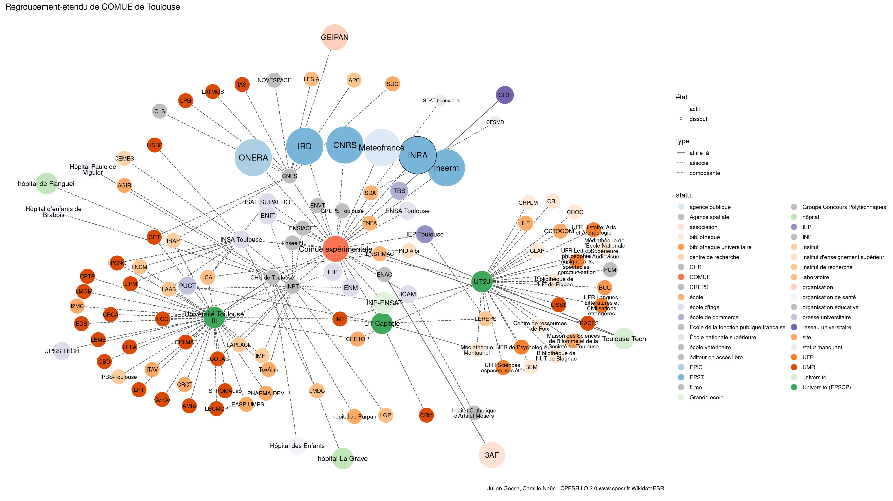

Warnings wikidataESR pour : COMUE de Toulouse(01/09/2022
================

- Edition wikidata : [Q20669873](https://www.wikidata.org/wiki/Q20669873)
- Guide d'édition : [wikidataESR](https://github.com/cpesr/wikidataESR/)

- Discussion sur le guide d'édition : [github](https://github.com/cpesr/wikidataESR/issues)


## histoire 

 

 


Erreur : les données sont probablement trop partielles.
```
Error in wdesr_ggplot_graph(df, node_size = node_size, label_sizes = label_sizes, : Empty ESR graph: something went wrong with the graph production parameters

``` 


## regroupement-court 

 

Problèmes détectés dans les entités :

|entité                                               |alias                   |statut                            |message                                |
|:----------------------------------------------------|:-----------------------|:---------------------------------|:--------------------------------------|
|[Q858979](https://www.wikidata.org/wiki/Q858979)     |INSA Toulouse           |école d'ingé                      |Statut trop imprécis                   |
|[Q3577934](https://www.wikidata.org/wiki/Q3577934)   |ENSTIMAC                |école                             |Statut trop imprécis                   |
|[Q590201](https://www.wikidata.org/wiki/Q590201)     |université Toulouse I   |Université (EPSCP)                |Alias manquant ou long                 |
|[Q1273188](https://www.wikidata.org/wiki/Q1273188)   |Université Toulouse III |Université (EPSCP)                |Alias manquant ou long                 |
|[Q3578172](https://www.wikidata.org/wiki/Q3578172)   |INP-ENSAT               |Grande ecole                      |Réserver aux écoles non contemporaines |
|[Q3578096](https://www.wikidata.org/wiki/Q3578096)   |ENIT                    |école d'ingé                      |Statut trop imprécis                   |
|[Q3578126](https://www.wikidata.org/wiki/Q3578126)   |ENM                     |école d'ingé                      |Statut trop imprécis                   |
|[Q3577767](https://www.wikidata.org/wiki/Q3577767)   |EIP                     |école d'ingé                      |Statut trop imprécis                   |
|[Q155446](https://www.wikidata.org/wiki/Q155446)     |ISAE SUPAERO            |école d'ingé                      |Statut trop imprécis                   |
|[Q3578191](https://www.wikidata.org/wiki/Q3578191)   |ENSA Toulouse           |École nationale supérieure        |Confusion avec les ENS                 |
|[Q3578119](https://www.wikidata.org/wiki/Q3578119)   |ENFA                    |école                             |Statut trop imprécis                   |
|[Q929515](https://www.wikidata.org/wiki/Q929515)     |INU Albi                |institut d'enseignement supérieur |Statut trop imprécis                   |
|[Q54409652](https://www.wikidata.org/wiki/Q54409652) |CREPS Toulouse          |CREPS                             |Date de fondation manquante            |
|[Q3151859](https://www.wikidata.org/wiki/Q3151859)   |ICAM                    |école d'ingé                      |Statut trop imprécis                   |
|[Q941853](https://www.wikidata.org/wiki/Q941853)     |ISDAT                   |école                             |Statut trop imprécis                   |
|[Q2910510](https://www.wikidata.org/wiki/Q2910510)   |IRD                     |EPST                              |Date de fondation manquante            |
|[Q1810406](https://www.wikidata.org/wiki/Q1810406)   |Meteofrance             |agence publique                   |Statut trop imprécis                   |
|[Q2945774](https://www.wikidata.org/wiki/Q2945774)   |CHU de Toulouse         |CHR                               |Date de fondation manquante            |

 


## regroupement-etendu 

 

Problèmes détectés dans les entités :

|entité                                                 |alias                                                       |statut                            |message                                                    |
|:------------------------------------------------------|:-----------------------------------------------------------|:---------------------------------|:----------------------------------------------------------|
|[Q2910510](https://www.wikidata.org/wiki/Q2910510)     |IRD                                                         |EPST                              |Date de fondation manquante                                |
|[Q1810406](https://www.wikidata.org/wiki/Q1810406)     |Meteofrance                                                 |agence publique                   |Statut trop imprécis                                       |
|[Q858979](https://www.wikidata.org/wiki/Q858979)       |INSA Toulouse                                               |école d'ingé                      |Statut trop imprécis                                       |
|[Q3214408](https://www.wikidata.org/wiki/Q3214408)     |LAAS                                                        |institut de recherche             |Statut trop imprécis                                       |
|[Q13421865](https://www.wikidata.org/wiki/Q13421865)   |LNCMI                                                       |institut de recherche             |Statut trop imprécis                                       |
|[Q30297078](https://www.wikidata.org/wiki/Q30297078)   |ICA                                                         |laboratoire                       |Statut trop imprécis                                       |
|[Q3577934](https://www.wikidata.org/wiki/Q3577934)     |ENSTIMAC                                                    |école                             |Statut trop imprécis                                       |
|[Q3299074](https://www.wikidata.org/wiki/Q3299074)     |Toulouse Tech                                               |université                        |Statut trop imprécis                                       |
|[Q30262372](https://www.wikidata.org/wiki/Q30262372)   |Maison des Sciences de l'Homme et de la Société de Toulouse |site                              |Statut trop imprécis                                       |
|[Q30262372](https://www.wikidata.org/wiki/Q30262372)   |Maison des Sciences de l'Homme et de la Société de Toulouse |site                              |Alias manquant ou long                                     |
|[Q30262487](https://www.wikidata.org/wiki/Q30262487)   |OCTOGONE                                                    |site                              |Statut trop imprécis                                       |
|[Q30274354](https://www.wikidata.org/wiki/Q30274354)   |ILF                                                         |site                              |Statut trop imprécis                                       |
|[Q50040723](https://www.wikidata.org/wiki/Q50040723)   |CERTOP                                                      |site                              |Statut trop imprécis                                       |
|[Q63790134](https://www.wikidata.org/wiki/Q63790134)   |LEREPS                                                      |institut de recherche             |Statut trop imprécis                                       |
|[Q590201](https://www.wikidata.org/wiki/Q590201)       |université Toulouse I                                       |Université (EPSCP)                |Alias manquant ou long                                     |
|[Q1273188](https://www.wikidata.org/wiki/Q1273188)     |Université Toulouse III                                     |Université (EPSCP)                |Alias manquant ou long                                     |
|[Q30282448](https://www.wikidata.org/wiki/Q30282448)   |ToxAlim                                                     |site                              |Statut trop imprécis                                       |
|[Q18214944](https://www.wikidata.org/wiki/Q18214944)   |IPBS-Toulouse                                               |institut                          |Statut trop imprécis                                       |
|[Q3152055](https://www.wikidata.org/wiki/Q3152055)     |IMFT                                                        |institut                          |Statut trop imprécis                                       |
|[Q3152090](https://www.wikidata.org/wiki/Q3152090)     |IRAP                                                        |institut                          |Statut trop imprécis                                       |
|[Q30261394](https://www.wikidata.org/wiki/Q30261394)   |I2MC                                                        |site                              |Statut trop imprécis                                       |
|[Q6467240](https://www.wikidata.org/wiki/Q6467240)     |LAPLACE                                                     |institut de recherche             |Statut trop imprécis                                       |
|[Q30262476](https://www.wikidata.org/wiki/Q30262476)   |LEASP-UMRS                                                  |site                              |Statut trop imprécis                                       |
|[Q30262476](https://www.wikidata.org/wiki/Q30262476)   |LEASP-UMRS                                                  |site                              |Date de fondation manquante                                |
|[Q30262496](https://www.wikidata.org/wiki/Q30262496)   |PHARMA-DEV                                                  |site                              |Statut trop imprécis                                       |
|[Q30264420](https://www.wikidata.org/wiki/Q30264420)   |CRCT                                                        |site                              |Statut trop imprécis                                       |
|[Q50040742](https://www.wikidata.org/wiki/Q50040742)   |ITAV                                                        |site                              |Statut trop imprécis                                       |
|[Q97188708](https://www.wikidata.org/wiki/Q97188708)   |UPSSITECH                                                   |école d'ingé                      |Statut trop imprécis                                       |
|[Q30262161](https://www.wikidata.org/wiki/Q30262161)   |AGIR                                                        |site                              |Statut trop imprécis                                       |
|[Q30262161](https://www.wikidata.org/wiki/Q30262161)   |AGIR                                                        |site                              |Date de fondation manquante                                |
|[Q30262355](https://www.wikidata.org/wiki/Q30262355)   |LGP                                                         |laboratoire                       |Statut trop imprécis                                       |
|[Q3578172](https://www.wikidata.org/wiki/Q3578172)     |INP-ENSAT                                                   |Grande ecole                      |Réserver aux écoles non contemporaines                     |
|[Q3578096](https://www.wikidata.org/wiki/Q3578096)     |ENIT                                                        |école d'ingé                      |Statut trop imprécis                                       |
|[Q3578126](https://www.wikidata.org/wiki/Q3578126)     |ENM                                                         |école d'ingé                      |Statut trop imprécis                                       |
|[Q3577767](https://www.wikidata.org/wiki/Q3577767)     |EIP                                                         |école d'ingé                      |Statut trop imprécis                                       |
|[Q155446](https://www.wikidata.org/wiki/Q155446)       |ISAE SUPAERO                                                |école d'ingé                      |Statut trop imprécis                                       |
|[Q1052501](https://www.wikidata.org/wiki/Q1052501)     |3AF                                                         |association                       |Statut trop imprécis                                       |
|[Q3578191](https://www.wikidata.org/wiki/Q3578191)     |ENSA Toulouse                                               |École nationale supérieure        |Confusion avec les ENS                                     |
|[Q3578119](https://www.wikidata.org/wiki/Q3578119)     |ENFA                                                        |école                             |Statut trop imprécis                                       |
|[Q929515](https://www.wikidata.org/wiki/Q929515)       |INU Albi                                                    |institut d'enseignement supérieur |Statut trop imprécis                                       |
|[Q54409652](https://www.wikidata.org/wiki/Q54409652)   |CREPS Toulouse                                              |CREPS                             |Date de fondation manquante                                |
|[Q3151859](https://www.wikidata.org/wiki/Q3151859)     |ICAM                                                        |école d'ingé                      |Statut trop imprécis                                       |
|[Q100956175](https://www.wikidata.org/wiki/Q100956175) |Institut Catholique d'Arts et Métiers                       |organisation éducative            |Alias manquant ou long                                     |
|[Q941853](https://www.wikidata.org/wiki/Q941853)       |ISDAT                                                       |école                             |Statut trop imprécis                                       |
|[Q21628657](https://www.wikidata.org/wiki/Q21628657)   |ISDAT beaux-arts                                            |statut manquant                   |Absence de propriété P31 (instance_of/nature de l'élément) |
|[Q21631190](https://www.wikidata.org/wiki/Q21631190)   |CESMD                                                       |statut manquant                   |Absence de propriété P31 (instance_of/nature de l'élément) |
|[Q2868555](https://www.wikidata.org/wiki/Q2868555)     |APC                                                         |institut de recherche             |Statut trop imprécis                                       |
|[Q30262529](https://www.wikidata.org/wiki/Q30262529)   |SUC                                                         |site                              |Statut trop imprécis                                       |
|[Q2982763](https://www.wikidata.org/wiki/Q2982763)     |Collecte Localisation Satellite                             |firme                             |Alias manquant ou long                                     |
|[Q3214440](https://www.wikidata.org/wiki/Q3214440)     |LESIA                                                       |laboratoire                       |Statut trop imprécis                                       |
|[Q954782](https://www.wikidata.org/wiki/Q954782)       |GEIPAN                                                      |organisation                      |Statut trop imprécis                                       |
|[Q2945774](https://www.wikidata.org/wiki/Q2945774)     |CHU de Toulouse                                             |CHR                               |Date de fondation manquante                                |
|[Q3145280](https://www.wikidata.org/wiki/Q3145280)     |hôpital La Grave                                            |hôpital                           |Préférer CHU                                               |
|[Q3145280](https://www.wikidata.org/wiki/Q3145280)     |hôpital La Grave                                            |hôpital                           |Date de fondation manquante                                |
|[Q30279855](https://www.wikidata.org/wiki/Q30279855)   |Hôpital des Enfants                                         |organisation de santé             |Statut trop imprécis                                       |
|[Q30279955](https://www.wikidata.org/wiki/Q30279955)   |Hôpital Paule de Viguier                                    |organisation de santé             |Statut trop imprécis                                       |
|[Q30279955](https://www.wikidata.org/wiki/Q30279955)   |Hôpital Paule de Viguier                                    |organisation de santé             |Alias manquant ou long                                     |
|[Q16508277](https://www.wikidata.org/wiki/Q16508277)   |hôpital de Purpan                                           |site                              |Statut trop imprécis                                       |
|[Q16508277](https://www.wikidata.org/wiki/Q16508277)   |hôpital de Purpan                                           |site                              |Date de fondation manquante                                |
|[Q18745239](https://www.wikidata.org/wiki/Q18745239)   |hôpital de Rangueil                                         |hôpital                           |Préférer CHU                                               |
|[Q18745239](https://www.wikidata.org/wiki/Q18745239)   |hôpital de Rangueil                                         |hôpital                           |Date de fondation manquante                                |
|[Q30281410](https://www.wikidata.org/wiki/Q30281410)   |Hôpital d’enfants de Brabois                                |organisation de santé             |Statut trop imprécis                                       |
|[Q30281410](https://www.wikidata.org/wiki/Q30281410)   |Hôpital d’enfants de Brabois                                |organisation de santé             |Alias manquant ou long                                     |

Problèmes détectés dans les relations :

|depuis                                             |vers                                                 |type      |message              |
|:--------------------------------------------------|:----------------------------------------------------|:---------|:--------------------|
|[Q3577934](https://www.wikidata.org/wiki/Q3577934) |[Q3299074](https://www.wikidata.org/wiki/Q3299074)   |affilié_à |Date(s) manquante(s) |
|[Q3152453](https://www.wikidata.org/wiki/Q3152453) |[Q2583993](https://www.wikidata.org/wiki/Q2583993)   |associé   |Date(s) manquante(s) |
|[Q3152453](https://www.wikidata.org/wiki/Q3152453) |[Q3578248](https://www.wikidata.org/wiki/Q3578248)   |associé   |Date(s) manquante(s) |
|[Q3152453](https://www.wikidata.org/wiki/Q3152453) |[Q3578172](https://www.wikidata.org/wiki/Q3578172)   |associé   |Date(s) manquante(s) |
|[Q3152453](https://www.wikidata.org/wiki/Q3152453) |[Q3578096](https://www.wikidata.org/wiki/Q3578096)   |associé   |Date(s) manquante(s) |
|[Q3152453](https://www.wikidata.org/wiki/Q3152453) |[Q3578126](https://www.wikidata.org/wiki/Q3578126)   |associé   |Date(s) manquante(s) |
|[Q3152453](https://www.wikidata.org/wiki/Q3152453) |[Q3577767](https://www.wikidata.org/wiki/Q3577767)   |associé   |Date(s) manquante(s) |
|[Q174335](https://www.wikidata.org/wiki/Q174335)   |[Q1052501](https://www.wikidata.org/wiki/Q1052501)   |affilié_à |Date(s) manquante(s) |
|[Q929515](https://www.wikidata.org/wiki/Q929515)   |[Q3299074](https://www.wikidata.org/wiki/Q3299074)   |affilié_à |Date(s) manquante(s) |
|[Q941853](https://www.wikidata.org/wiki/Q941853)   |[Q21628657](https://www.wikidata.org/wiki/Q21628657) |associé   |Date(s) manquante(s) |
|[Q941853](https://www.wikidata.org/wiki/Q941853)   |[Q21631190](https://www.wikidata.org/wiki/Q21631190) |associé   |Date(s) manquante(s) |
|[Q3117393](https://www.wikidata.org/wiki/Q3117393) |[Q2992903](https://www.wikidata.org/wiki/Q2992903)   |affilié_à |Date(s) manquante(s) |
|[Q2945774](https://www.wikidata.org/wiki/Q2945774) |[Q1273188](https://www.wikidata.org/wiki/Q1273188)   |affilié_à |Date(s) manquante(s) |

NB : les dates manquantes pour les relations de composante ne sont pas remontées. 


## regroupement-superetendu 

 


Erreur : les données sont probablement trop partielles.
```
Error in query(url, "pcontent", clean_response, query_param = query_param, : The API returned an error: missingtitle - The page you specified doesn't exist.

``` 

