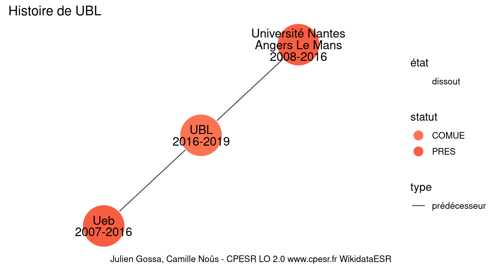

Warnings wikidataESR pour : UBL(18/11/2021
================

- Edition wikidata : [Q21994834](https://www.wikidata.org/wiki/Q21994834)
- Guide d'édition : [wikidataESR](https://github.com/cpesr/wikidataESR/)

- Discussion sur le guide d'édition : [github](https://github.com/cpesr/wikidataESR/issues)

## histoire 

 

Problèmes détectés dans les entités :

|entité                                             |alias                            |statut |message                |
|:--------------------------------------------------|:--------------------------------|:------|:----------------------|
|[Q3551459](https://www.wikidata.org/wiki/Q3551459) |Université Nantes Angers Le Mans |PRES   |Alias manquant ou long |

Problèmes détectés dans les relations :

|from                                                 |to                                                 |type         |message              |
|:----------------------------------------------------|:--------------------------------------------------|:------------|:--------------------|
|[Q21994834](https://www.wikidata.org/wiki/Q21994834) |[Q3551779](https://www.wikidata.org/wiki/Q3551779) |prédécesseur |Date(s) manquante(s) |
|[Q21994834](https://www.wikidata.org/wiki/Q21994834) |[Q3551459](https://www.wikidata.org/wiki/Q3551459) |prédécesseur |Date(s) manquante(s) |

NB : les dates manquantes pour les relations de composante ne sont pas remontées. 

## regroupement-court 

 

 

## regroupement-etendu 

 

Problèmes détectés dans les entités :

|entité                                               |alias                                                                                             |statut       |message                     |
|:----------------------------------------------------|:-------------------------------------------------------------------------------------------------|:------------|:---------------------------|
|[Q30262426](https://www.wikidata.org/wiki/Q30262426) |SOPAM                                                                                             |site         |Statut trop imprécis        |
|[Q50040154](https://www.wikidata.org/wiki/Q50040154) |IMMM                                                                                              |site         |Statut trop imprécis        |
|[Q51785486](https://www.wikidata.org/wiki/Q51785486) |Laboratoire d'Acoustique de l'Université du Maine                                                 |laboratoire  |Statut trop imprécis        |
|[Q51785486](https://www.wikidata.org/wiki/Q51785486) |Laboratoire d'Acoustique de l'Université du Maine                                                 |laboratoire  |Alias manquant ou long      |
|[Q30262354](https://www.wikidata.org/wiki/Q30262354) |M2S                                                                                               |site         |Statut trop imprécis        |
|[Q3550803](https://www.wikidata.org/wiki/Q3550803)   |Unité de Formation et de Recherche d'Arts, lettres, Communication de l'Université Rennes 2        |UFR          |Alias manquant ou long      |
|[Q2945394](https://www.wikidata.org/wiki/Q2945394)   |CRBC                                                                                              |laboratoire  |Statut trop imprécis        |
|[Q3550823](https://www.wikidata.org/wiki/Q3550823)   |unité de formation et de recherche de sciences sociales de l'université Rennes 2                  |UFR          |Alias manquant ou long      |
|[Q3550821](https://www.wikidata.org/wiki/Q3550821)   |unité de formation et de recherche de sciences humaines de l'université de Rennes 2               |UFR          |Alias manquant ou long      |
|[Q3064270](https://www.wikidata.org/wiki/Q3064270)   |Faculté de langues étrangères de Rennes                                                           |composante   |Alias manquant ou long      |
|[Q3550802](https://www.wikidata.org/wiki/Q3550802)   |Unité de Formation et de Recherche d'Activités Physiques et Sportives de l'Université de Rennes 2 |UFR          |Alias manquant ou long      |
|[Q3550802](https://www.wikidata.org/wiki/Q3550802)   |Unité de Formation et de Recherche d'Activités Physiques et Sportives de l'Université de Rennes 2 |UFR          |Date de fondation manquante |
|[Q3152091](https://www.wikidata.org/wiki/Q3152091)   |IRISA                                                                                             |laboratoire  |Statut trop imprécis        |
|[Q30261433](https://www.wikidata.org/wiki/Q30261433) |Institut de Recherche en Santé, Environnement et Travail                                          |organisation |Statut trop imprécis        |
|[Q30261433](https://www.wikidata.org/wiki/Q30261433) |Institut de Recherche en Santé, Environnement et Travail                                          |organisation |Alias manquant ou long      |
|[Q30261470](https://www.wikidata.org/wiki/Q30261470) |IGEPP                                                                                             |organisation |Statut trop imprécis        |
|[Q30261492](https://www.wikidata.org/wiki/Q30261492) |LPGP                                                                                              |organisation |Statut trop imprécis        |
|[Q30261536](https://www.wikidata.org/wiki/Q30261536) |Foie, Métabolismes et Cancer                                                                      |organisation |Statut trop imprécis        |
|[Q30261536](https://www.wikidata.org/wiki/Q30261536) |Foie, Métabolismes et Cancer                                                                      |organisation |Alias manquant ou long      |
|[Q30262366](https://www.wikidata.org/wiki/Q30262366) |LTSI                                                                                              |organisation |Statut trop imprécis        |

Problèmes détectés dans les relations :

|from                                             |to                                                 |type       |message              |
|:------------------------------------------------|:--------------------------------------------------|:----------|:--------------------|
|[Q459026](https://www.wikidata.org/wiki/Q459026) |[Q3550803](https://www.wikidata.org/wiki/Q3550803) |composante |Relation multiple    |
|[Q459026](https://www.wikidata.org/wiki/Q459026) |[Q3550803](https://www.wikidata.org/wiki/Q3550803) |associé    |Relation multiple    |
|[Q459026](https://www.wikidata.org/wiki/Q459026) |[Q3550803](https://www.wikidata.org/wiki/Q3550803) |associé    |Date(s) manquante(s) |
|[Q459026](https://www.wikidata.org/wiki/Q459026) |[Q3550823](https://www.wikidata.org/wiki/Q3550823) |associé    |Date(s) manquante(s) |
|[Q459026](https://www.wikidata.org/wiki/Q459026) |[Q3550821](https://www.wikidata.org/wiki/Q3550821) |associé    |Date(s) manquante(s) |
|[Q459026](https://www.wikidata.org/wiki/Q459026) |[Q3064270](https://www.wikidata.org/wiki/Q3064270) |associé    |Date(s) manquante(s) |
|[Q459026](https://www.wikidata.org/wiki/Q459026) |[Q3550802](https://www.wikidata.org/wiki/Q3550802) |associé    |Date(s) manquante(s) |

NB : les dates manquantes pour les relations de composante ne sont pas remontées. 

## regroupement-superetendu 

 

Problèmes détectés dans les entités :

|entité                                               |alias                                                                                             |statut       |message                     |
|:----------------------------------------------------|:-------------------------------------------------------------------------------------------------|:------------|:---------------------------|
|[Q30262426](https://www.wikidata.org/wiki/Q30262426) |SOPAM                                                                                             |site         |Statut trop imprécis        |
|[Q50040154](https://www.wikidata.org/wiki/Q50040154) |IMMM                                                                                              |site         |Statut trop imprécis        |
|[Q51785486](https://www.wikidata.org/wiki/Q51785486) |Laboratoire d'Acoustique de l'Université du Maine                                                 |laboratoire  |Statut trop imprécis        |
|[Q51785486](https://www.wikidata.org/wiki/Q51785486) |Laboratoire d'Acoustique de l'Université du Maine                                                 |laboratoire  |Alias manquant ou long      |
|[Q30262354](https://www.wikidata.org/wiki/Q30262354) |M2S                                                                                               |site         |Statut trop imprécis        |
|[Q3550803](https://www.wikidata.org/wiki/Q3550803)   |Unité de Formation et de Recherche d'Arts, lettres, Communication de l'Université Rennes 2        |UFR          |Alias manquant ou long      |
|[Q2945394](https://www.wikidata.org/wiki/Q2945394)   |CRBC                                                                                              |laboratoire  |Statut trop imprécis        |
|[Q3550823](https://www.wikidata.org/wiki/Q3550823)   |unité de formation et de recherche de sciences sociales de l'université Rennes 2                  |UFR          |Alias manquant ou long      |
|[Q3550821](https://www.wikidata.org/wiki/Q3550821)   |unité de formation et de recherche de sciences humaines de l'université de Rennes 2               |UFR          |Alias manquant ou long      |
|[Q3064270](https://www.wikidata.org/wiki/Q3064270)   |Faculté de langues étrangères de Rennes                                                           |composante   |Alias manquant ou long      |
|[Q3550802](https://www.wikidata.org/wiki/Q3550802)   |Unité de Formation et de Recherche d'Activités Physiques et Sportives de l'Université de Rennes 2 |UFR          |Alias manquant ou long      |
|[Q3550802](https://www.wikidata.org/wiki/Q3550802)   |Unité de Formation et de Recherche d'Activités Physiques et Sportives de l'Université de Rennes 2 |UFR          |Date de fondation manquante |
|[Q3152091](https://www.wikidata.org/wiki/Q3152091)   |IRISA                                                                                             |laboratoire  |Statut trop imprécis        |
|[Q30261433](https://www.wikidata.org/wiki/Q30261433) |Institut de Recherche en Santé, Environnement et Travail                                          |organisation |Statut trop imprécis        |
|[Q30261433](https://www.wikidata.org/wiki/Q30261433) |Institut de Recherche en Santé, Environnement et Travail                                          |organisation |Alias manquant ou long      |
|[Q30261470](https://www.wikidata.org/wiki/Q30261470) |IGEPP                                                                                             |organisation |Statut trop imprécis        |
|[Q30261492](https://www.wikidata.org/wiki/Q30261492) |LPGP                                                                                              |organisation |Statut trop imprécis        |
|[Q30261536](https://www.wikidata.org/wiki/Q30261536) |Foie, Métabolismes et Cancer                                                                      |organisation |Statut trop imprécis        |
|[Q30261536](https://www.wikidata.org/wiki/Q30261536) |Foie, Métabolismes et Cancer                                                                      |organisation |Alias manquant ou long      |
|[Q30262366](https://www.wikidata.org/wiki/Q30262366) |LTSI                                                                                              |organisation |Statut trop imprécis        |

Problèmes détectés dans les relations :

|from                                             |to                                                 |type       |message              |
|:------------------------------------------------|:--------------------------------------------------|:----------|:--------------------|
|[Q459026](https://www.wikidata.org/wiki/Q459026) |[Q3550803](https://www.wikidata.org/wiki/Q3550803) |composante |Relation multiple    |
|[Q459026](https://www.wikidata.org/wiki/Q459026) |[Q3550803](https://www.wikidata.org/wiki/Q3550803) |associé    |Relation multiple    |
|[Q459026](https://www.wikidata.org/wiki/Q459026) |[Q3550803](https://www.wikidata.org/wiki/Q3550803) |associé    |Date(s) manquante(s) |
|[Q459026](https://www.wikidata.org/wiki/Q459026) |[Q3550823](https://www.wikidata.org/wiki/Q3550823) |associé    |Date(s) manquante(s) |
|[Q459026](https://www.wikidata.org/wiki/Q459026) |[Q3550821](https://www.wikidata.org/wiki/Q3550821) |associé    |Date(s) manquante(s) |
|[Q459026](https://www.wikidata.org/wiki/Q459026) |[Q3064270](https://www.wikidata.org/wiki/Q3064270) |associé    |Date(s) manquante(s) |
|[Q459026](https://www.wikidata.org/wiki/Q459026) |[Q3550802](https://www.wikidata.org/wiki/Q3550802) |associé    |Date(s) manquante(s) |

NB : les dates manquantes pour les relations de composante ne sont pas remontées. 

