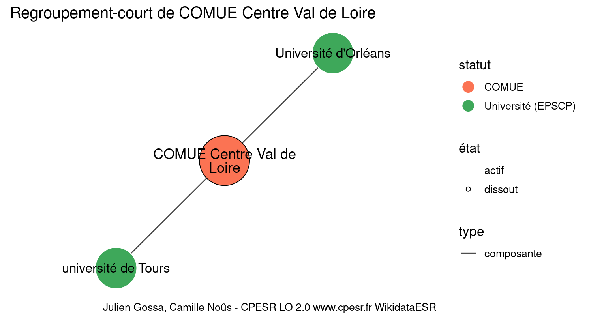
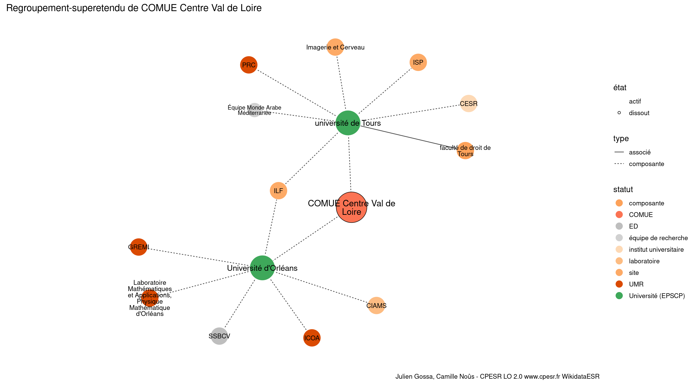

Warnings wikidataESR pour : COMUE Centre Val de Loire(01/09/2022
================

- Edition wikidata : [Q2944885](https://www.wikidata.org/wiki/Q2944885)
- Guide d'édition : [wikidataESR](https://github.com/cpesr/wikidataESR/)

- Discussion sur le guide d'édition : [github](https://github.com/cpesr/wikidataESR/issues)


## histoire 

 

Problèmes détectés dans les entités :

|entité                                             |alias                     |statut |message                |
|:--------------------------------------------------|:-------------------------|:------|:----------------------|
|[Q2944885](https://www.wikidata.org/wiki/Q2944885) |COMUE Centre Val de Loire |COMUE  |Alias manquant ou long |

 


Erreur : les données sont probablement trop partielles.
```
Error in wdesr_ggplot_graph(df, node_size = node_size, label_sizes = label_sizes, : Empty ESR graph: something went wrong with the graph production parameters

``` 


## regroupement-court 

 

Problèmes détectés dans les entités :

|entité                                             |alias                     |statut             |message                |
|:--------------------------------------------------|:-------------------------|:------------------|:----------------------|
|[Q2944885](https://www.wikidata.org/wiki/Q2944885) |COMUE Centre Val de Loire |COMUE              |Alias manquant ou long |
|[Q13334](https://www.wikidata.org/wiki/Q13334)     |Université d'Orléans      |Université (EPSCP) |Alias manquant ou long |

 


## regroupement-etendu 

 

Problèmes détectés dans les entités :

|entité                                               |alias                                                                      |statut                 |message                     |
|:----------------------------------------------------|:--------------------------------------------------------------------------|:----------------------|:---------------------------|
|[Q2944885](https://www.wikidata.org/wiki/Q2944885)   |COMUE Centre Val de Loire                                                  |COMUE                  |Alias manquant ou long      |
|[Q13334](https://www.wikidata.org/wiki/Q13334)       |Université d'Orléans                                                       |Université (EPSCP)     |Alias manquant ou long      |
|[Q45132720](https://www.wikidata.org/wiki/Q45132720) |SSBCV                                                                      |ED                     |Date de fondation manquante |
|[Q30262340](https://www.wikidata.org/wiki/Q30262340) |Laboratoire Mathématiques et Applications, Physique Mathématique d'Orléans |UMR                    |Alias manquant ou long      |
|[Q30274354](https://www.wikidata.org/wiki/Q30274354) |ILF                                                                        |site                   |Statut trop imprécis        |
|[Q51784186](https://www.wikidata.org/wiki/Q51784186) |CIAMS                                                                      |laboratoire            |Statut trop imprécis        |
|[Q30282483](https://www.wikidata.org/wiki/Q30282483) |ISP                                                                        |site                   |Statut trop imprécis        |
|[Q30261614](https://www.wikidata.org/wiki/Q30261614) |Imagerie et Cerveau                                                        |site                   |Statut trop imprécis        |
|[Q2945233](https://www.wikidata.org/wiki/Q2945233)   |CESR                                                                       |institut universitaire |Statut trop imprécis        |
|[Q30262225](https://www.wikidata.org/wiki/Q30262225) |Équipe Monde Arabe Méditerranée                                            |équipe de recherche    |Alias manquant ou long      |
|[Q30262225](https://www.wikidata.org/wiki/Q30262225) |Équipe Monde Arabe Méditerranée                                            |équipe de recherche    |Alias manquant ou long      |
|[Q30262225](https://www.wikidata.org/wiki/Q30262225) |Équipe Monde Arabe Méditerranée                                            |équipe de recherche    |Date de fondation manquante |
|[Q30262225](https://www.wikidata.org/wiki/Q30262225) |Équipe Monde Arabe Méditerranée                                            |équipe de recherche    |Date de fondation manquante |
|[Q93421025](https://www.wikidata.org/wiki/Q93421025) |faculté de droit de Tours                                                  |composante             |Alias manquant ou long      |
|[Q93421025](https://www.wikidata.org/wiki/Q93421025) |faculté de droit de Tours                                                  |composante             |Date de fondation manquante |

Problèmes détectés dans les relations :

|depuis                                           |vers                                                 |type    |message              |
|:------------------------------------------------|:----------------------------------------------------|:-------|:--------------------|
|[Q494335](https://www.wikidata.org/wiki/Q494335) |[Q93421025](https://www.wikidata.org/wiki/Q93421025) |associé |Date(s) manquante(s) |

NB : les dates manquantes pour les relations de composante ne sont pas remontées. 


## regroupement-superetendu 

 

Problèmes détectés dans les entités :

|entité                                               |alias                                                                      |statut                 |message                     |
|:----------------------------------------------------|:--------------------------------------------------------------------------|:----------------------|:---------------------------|
|[Q2944885](https://www.wikidata.org/wiki/Q2944885)   |COMUE Centre Val de Loire                                                  |COMUE                  |Alias manquant ou long      |
|[Q13334](https://www.wikidata.org/wiki/Q13334)       |Université d'Orléans                                                       |Université (EPSCP)     |Alias manquant ou long      |
|[Q45132720](https://www.wikidata.org/wiki/Q45132720) |SSBCV                                                                      |ED                     |Date de fondation manquante |
|[Q30262340](https://www.wikidata.org/wiki/Q30262340) |Laboratoire Mathématiques et Applications, Physique Mathématique d'Orléans |UMR                    |Alias manquant ou long      |
|[Q30274354](https://www.wikidata.org/wiki/Q30274354) |ILF                                                                        |site                   |Statut trop imprécis        |
|[Q51784186](https://www.wikidata.org/wiki/Q51784186) |CIAMS                                                                      |laboratoire            |Statut trop imprécis        |
|[Q30282483](https://www.wikidata.org/wiki/Q30282483) |ISP                                                                        |site                   |Statut trop imprécis        |
|[Q30261614](https://www.wikidata.org/wiki/Q30261614) |Imagerie et Cerveau                                                        |site                   |Statut trop imprécis        |
|[Q2945233](https://www.wikidata.org/wiki/Q2945233)   |CESR                                                                       |institut universitaire |Statut trop imprécis        |
|[Q30262225](https://www.wikidata.org/wiki/Q30262225) |Équipe Monde Arabe Méditerranée                                            |équipe de recherche    |Alias manquant ou long      |
|[Q30262225](https://www.wikidata.org/wiki/Q30262225) |Équipe Monde Arabe Méditerranée                                            |équipe de recherche    |Alias manquant ou long      |
|[Q30262225](https://www.wikidata.org/wiki/Q30262225) |Équipe Monde Arabe Méditerranée                                            |équipe de recherche    |Date de fondation manquante |
|[Q30262225](https://www.wikidata.org/wiki/Q30262225) |Équipe Monde Arabe Méditerranée                                            |équipe de recherche    |Date de fondation manquante |
|[Q93421025](https://www.wikidata.org/wiki/Q93421025) |faculté de droit de Tours                                                  |composante             |Alias manquant ou long      |
|[Q93421025](https://www.wikidata.org/wiki/Q93421025) |faculté de droit de Tours                                                  |composante             |Date de fondation manquante |

Problèmes détectés dans les relations :

|depuis                                           |vers                                                 |type    |message              |
|:------------------------------------------------|:----------------------------------------------------|:-------|:--------------------|
|[Q494335](https://www.wikidata.org/wiki/Q494335) |[Q93421025](https://www.wikidata.org/wiki/Q93421025) |associé |Date(s) manquante(s) |

NB : les dates manquantes pour les relations de composante ne sont pas remontées. 

