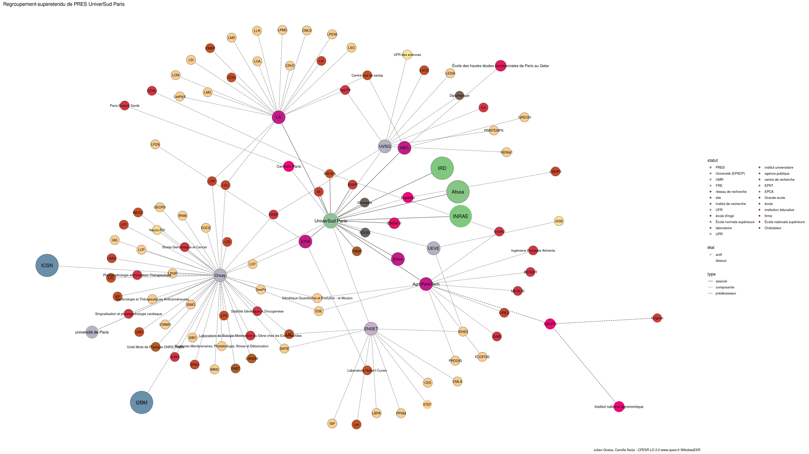

Warnings wikidataESR pour : PRES UniverSud Paris(18/11/2021
================

- Edition wikidata : [Q3248808](https://www.wikidata.org/wiki/Q3248808)
- Guide d'édition : [wikidataESR](https://github.com/cpesr/wikidataESR/)

- Discussion sur le guide d'édition : [github](https://github.com/cpesr/wikidataESR/issues)


## histoire 

 

 


Erreur : les données sont probablement trop partielles.
```
Error in wdesr_ggplot_graph(df, node_size = node_size, label_sizes = label_sizes, : Empty ESR graph: something went wrong with the graph production parameters

``` 


## regroupement-court 

 

Problèmes détectés dans les entités :

|entité                                             |alias          |statut                     |message                                |
|:--------------------------------------------------|:--------------|:--------------------------|:--------------------------------------|
|[Q273447](https://www.wikidata.org/wiki/Q273447)   |Centrale Paris |école d'ingé               |Statut trop imprécis                   |
|[Q273493](https://www.wikidata.org/wiki/Q273493)   |Supélec        |école d'ingé               |Statut trop imprécis                   |
|[Q273600](https://www.wikidata.org/wiki/Q273600)   |Enva           |Grande ecole               |Réserver aux écoles non contemporaines |
|[Q3578260](https://www.wikidata.org/wiki/Q3578260) |ENSP           |école                      |Statut trop imprécis                   |
|[Q3152425](https://www.wikidata.org/wiki/Q3152425) |IRSTEA         |institut de recherche      |Statut trop imprécis                   |
|[Q3152425](https://www.wikidata.org/wiki/Q3152425) |IRSTEA         |institut de recherche      |Date de fondation manquante            |
|[Q2826644](https://www.wikidata.org/wiki/Q2826644) |Afssa          |EPCA                       |Date de fondation manquante            |
|[Q3546585](https://www.wikidata.org/wiki/Q3546585) |TMSP           |institut universitaire     |Statut trop imprécis                   |
|[Q3578204](https://www.wikidata.org/wiki/Q3578204) |IIE            |école                      |Statut trop imprécis                   |
|[Q273535](https://www.wikidata.org/wiki/Q273535)   |HEC            |Grande ecole               |Réserver aux écoles non contemporaines |
|[Q273626](https://www.wikidata.org/wiki/Q273626)   |L'X            |Grande ecole               |Réserver aux écoles non contemporaines |
|[Q898448](https://www.wikidata.org/wiki/Q898448)   |IOTA           |Grande ecole               |Réserver aux écoles non contemporaines |
|[Q1050988](https://www.wikidata.org/wiki/Q1050988) |ENSA-V         |École nationale supérieure |Confusion avec les ENS                 |
|[Q112513](https://www.wikidata.org/wiki/Q112513)   |SOLEIL         |laboratoire                |Statut trop imprécis                   |
|[Q2910510](https://www.wikidata.org/wiki/Q2910510) |IRD            |EPST                       |Date de fondation manquante            |

Problèmes détectés dans les relations :

|from                                               |to                                                 |type    |message              |
|:--------------------------------------------------|:--------------------------------------------------|:-------|:--------------------|
|[Q3248808](https://www.wikidata.org/wiki/Q3248808) |[Q1637105](https://www.wikidata.org/wiki/Q1637105) |associé |Date(s) manquante(s) |
|[Q3248808](https://www.wikidata.org/wiki/Q3248808) |[Q273600](https://www.wikidata.org/wiki/Q273600)   |associé |Date(s) manquante(s) |
|[Q3248808](https://www.wikidata.org/wiki/Q3248808) |[Q3578260](https://www.wikidata.org/wiki/Q3578260) |associé |Date(s) manquante(s) |
|[Q3248808](https://www.wikidata.org/wiki/Q3248808) |[Q1665106](https://www.wikidata.org/wiki/Q1665106) |associé |Date(s) manquante(s) |
|[Q3248808](https://www.wikidata.org/wiki/Q3248808) |[Q3152425](https://www.wikidata.org/wiki/Q3152425) |associé |Date(s) manquante(s) |
|[Q3248808](https://www.wikidata.org/wiki/Q3248808) |[Q2826644](https://www.wikidata.org/wiki/Q2826644) |associé |Date(s) manquante(s) |
|[Q3248808](https://www.wikidata.org/wiki/Q3248808) |[Q3546585](https://www.wikidata.org/wiki/Q3546585) |associé |Date(s) manquante(s) |
|[Q3248808](https://www.wikidata.org/wiki/Q3248808) |[Q3123008](https://www.wikidata.org/wiki/Q3123008) |associé |Date(s) manquante(s) |
|[Q3248808](https://www.wikidata.org/wiki/Q3248808) |[Q3578204](https://www.wikidata.org/wiki/Q3578204) |associé |Date(s) manquante(s) |
|[Q3248808](https://www.wikidata.org/wiki/Q3248808) |[Q273535](https://www.wikidata.org/wiki/Q273535)   |associé |Date(s) manquante(s) |
|[Q3248808](https://www.wikidata.org/wiki/Q3248808) |[Q273626](https://www.wikidata.org/wiki/Q273626)   |associé |Date(s) manquante(s) |
|[Q3248808](https://www.wikidata.org/wiki/Q3248808) |[Q898448](https://www.wikidata.org/wiki/Q898448)   |associé |Date(s) manquante(s) |
|[Q3248808](https://www.wikidata.org/wiki/Q3248808) |[Q1050988](https://www.wikidata.org/wiki/Q1050988) |associé |Date(s) manquante(s) |
|[Q3248808](https://www.wikidata.org/wiki/Q3248808) |[Q112513](https://www.wikidata.org/wiki/Q112513)   |associé |Date(s) manquante(s) |
|[Q3248808](https://www.wikidata.org/wiki/Q3248808) |[Q2910510](https://www.wikidata.org/wiki/Q2910510) |associé |Date(s) manquante(s) |

NB : les dates manquantes pour les relations de composante ne sont pas remontées. 


## regroupement-etendu 

 

Problèmes détectés dans les entités :

|entité                                                 |alias                                                              |statut                     |message                                |
|:------------------------------------------------------|:------------------------------------------------------------------|:--------------------------|:--------------------------------------|
|[Q3214435](https://www.wikidata.org/wiki/Q3214435)     |LIMSI                                                              |laboratoire                |Statut trop imprécis                   |
|[Q30299434](https://www.wikidata.org/wiki/Q30299434)   |I2BM                                                               |agence publique            |Statut trop imprécis                   |
|[Q3151940](https://www.wikidata.org/wiki/Q3151940)     |IEF                                                                |institut de recherche      |Statut trop imprécis                   |
|[Q2945499](https://www.wikidata.org/wiki/Q2945499)     |CSNSM                                                              |centre de recherche        |Statut trop imprécis                   |
|[Q30261458](https://www.wikidata.org/wiki/Q30261458)   |Physiopathologie et Innovation Thérapeutique                       |site                       |Statut trop imprécis                   |
|[Q30261458](https://www.wikidata.org/wiki/Q30261458)   |Physiopathologie et Innovation Thérapeutique                       |site                       |Alias manquant ou long                 |
|[Q3214459](https://www.wikidata.org/wiki/Q3214459)     |LAL                                                                |institut de recherche      |Statut trop imprécis                   |
|[Q3152052](https://www.wikidata.org/wiki/Q3152052)     |IMCCE                                                              |institut de recherche      |Statut trop imprécis                   |
|[Q16511698](https://www.wikidata.org/wiki/Q16511698)   |Unité mixte de physique CNRS/Thalès                                |UMR                        |Alias manquant ou long                 |
|[Q3214506](https://www.wikidata.org/wiki/Q3214506)     |LULI                                                               |laboratoire                |Statut trop imprécis                   |
|[Q30262197](https://www.wikidata.org/wiki/Q30262197)   |Laboratoire de Biologie Moleculaire du Gène chez les Extremophiles |site                       |Statut trop imprécis                   |
|[Q30262197](https://www.wikidata.org/wiki/Q30262197)   |Laboratoire de Biologie Moleculaire du Gène chez les Extremophiles |site                       |Alias manquant ou long                 |
|[Q30262197](https://www.wikidata.org/wiki/Q30262197)   |Laboratoire de Biologie Moleculaire du Gène chez les Extremophiles |site                       |Date de fondation manquante            |
|[Q30262232](https://www.wikidata.org/wiki/Q30262232)   |CESP                                                               |laboratoire                |Statut trop imprécis                   |
|[Q3074480](https://www.wikidata.org/wiki/Q3074480)     |FAST                                                               |institut universitaire     |Statut trop imprécis                   |
|[Q30262346](https://www.wikidata.org/wiki/Q30262346)   |Vectorologie et Thérapeutiques Anticancéreuses                     |UMR                        |Alias manquant ou long                 |
|[Q30262424](https://www.wikidata.org/wiki/Q30262424)   |ICPH                                                               |site                       |Statut trop imprécis                   |
|[Q30262427](https://www.wikidata.org/wiki/Q30262427)   |Singnalisation et physiopathologie cardiaque                       |site                       |Statut trop imprécis                   |
|[Q30262427](https://www.wikidata.org/wiki/Q30262427)   |Singnalisation et physiopathologie cardiaque                       |site                       |Alias manquant ou long                 |
|[Q30262427](https://www.wikidata.org/wiki/Q30262427)   |Singnalisation et physiopathologie cardiaque                       |site                       |Date de fondation manquante            |
|[Q30262524](https://www.wikidata.org/wiki/Q30262524)   |Systèmes Membranaires, Photobiologie, Stress et Détoxication       |UMR                        |Alias manquant ou long                 |
|[Q3214481](https://www.wikidata.org/wiki/Q3214481)     |LRI                                                                |laboratoire                |Statut trop imprécis                   |
|[Q3152061](https://www.wikidata.org/wiki/Q3152061)     |IPNO                                                               |laboratoire                |Statut trop imprécis                   |
|[Q50040720](https://www.wikidata.org/wiki/Q50040720)   |Stress Génotoxique et Cancer                                       |site                       |Statut trop imprécis                   |
|[Q50040720](https://www.wikidata.org/wiki/Q50040720)   |Stress Génotoxique et Cancer                                       |site                       |Alias manquant ou long                 |
|[Q50040741](https://www.wikidata.org/wiki/Q50040741)   |Stabilité Génétique et Oncogenèse                                  |site                       |Statut trop imprécis                   |
|[Q50040741](https://www.wikidata.org/wiki/Q50040741)   |Stabilité Génétique et Oncogenèse                                  |site                       |Alias manquant ou long                 |
|[Q30262256](https://www.wikidata.org/wiki/Q30262256)   |Fed PV                                                             |site                       |Statut trop imprécis                   |
|[Q104773040](https://www.wikidata.org/wiki/Q104773040) |UFR des sciences                                                   |UFR                        |Date de fondation manquante            |
|[Q109580465](https://www.wikidata.org/wiki/Q109580465) |BREED                                                              |UMR                        |Date de fondation manquante            |
|[Q109584141](https://www.wikidata.org/wiki/Q109584141) |VIP                                                                |laboratoire                |Statut trop imprécis                   |
|[Q109584141](https://www.wikidata.org/wiki/Q109584141) |VIP                                                                |laboratoire                |Date de fondation manquante            |
|[Q29624201](https://www.wikidata.org/wiki/Q29624201)   |CEMOTEV                                                            |laboratoire                |Statut trop imprécis                   |
|[Q47008419](https://www.wikidata.org/wiki/Q47008419)   |CHCSC                                                              |laboratoire                |Statut trop imprécis                   |
|[Q109587112](https://www.wikidata.org/wiki/Q109587112) |CIC Garches                                                        |laboratoire                |Statut trop imprécis                   |
|[Q109587112](https://www.wikidata.org/wiki/Q109587112) |CIC Garches                                                        |laboratoire                |Date de fondation manquante            |
|[Q109587149](https://www.wikidata.org/wiki/Q109587149) |CONSTANCES                                                         |UMR                        |Date de fondation manquante            |
|[Q51779969](https://www.wikidata.org/wiki/Q51779969)   |CEARC                                                              |laboratoire                |Statut trop imprécis                   |
|[Q51785421](https://www.wikidata.org/wiki/Q51785421)   |DAVID                                                              |laboratoire                |Statut trop imprécis                   |
|[Q51781188](https://www.wikidata.org/wiki/Q51781188)   |DYPAC                                                              |laboratoire                |Statut trop imprécis                   |
|[Q109614029](https://www.wikidata.org/wiki/Q109614029) |ERPHAN                                                             |laboratoire                |Statut trop imprécis                   |
|[Q109614029](https://www.wikidata.org/wiki/Q109614029) |ERPHAN                                                             |laboratoire                |Date de fondation manquante            |
|[Q51782948](https://www.wikidata.org/wiki/Q51782948)   |IPANEMA                                                            |laboratoire                |Statut trop imprécis                   |
|[Q109620268](https://www.wikidata.org/wiki/Q109620268) |LAAB                                                               |laboratoire                |Statut trop imprécis                   |
|[Q109620268](https://www.wikidata.org/wiki/Q109620268) |LAAB                                                               |laboratoire                |Date de fondation manquante            |
|[Q29625240](https://www.wikidata.org/wiki/Q29625240)   |DANTE                                                              |laboratoire                |Statut trop imprécis                   |
|[Q29625240](https://www.wikidata.org/wiki/Q29625240)   |DANTE                                                              |laboratoire                |Date de fondation manquante            |
|[Q51780035](https://www.wikidata.org/wiki/Q51780035)   |LGBC                                                               |laboratoire                |Statut trop imprécis                   |
|[Q109620502](https://www.wikidata.org/wiki/Q109620502) |LAREQUOI                                                           |laboratoire                |Statut trop imprécis                   |
|[Q109620502](https://www.wikidata.org/wiki/Q109620502) |LAREQUOI                                                           |laboratoire                |Date de fondation manquante            |
|[Q109620610](https://www.wikidata.org/wiki/Q109620610) |LI-PaRAD                                                           |laboratoire                |Statut trop imprécis                   |
|[Q109620610](https://www.wikidata.org/wiki/Q109620610) |LI-PaRAD                                                           |laboratoire                |Date de fondation manquante            |
|[Q29606460](https://www.wikidata.org/wiki/Q29606460)   |LISV                                                               |laboratoire                |Statut trop imprécis                   |
|[Q109620763](https://www.wikidata.org/wiki/Q109620763) |LPPD                                                               |laboratoire                |Statut trop imprécis                   |
|[Q109620763](https://www.wikidata.org/wiki/Q109620763) |LPPD                                                               |laboratoire                |Date de fondation manquante            |
|[Q51780617](https://www.wikidata.org/wiki/Q51780617)   |MDlS                                                               |laboratoire                |Statut trop imprécis                   |
|[Q51780617](https://www.wikidata.org/wiki/Q51780617)   |MDlS                                                               |laboratoire                |Date de fondation manquante            |
|[Q109620837](https://www.wikidata.org/wiki/Q109620837) |MSH Paris-Saclay                                                   |laboratoire                |Statut trop imprécis                   |
|[Q109620837](https://www.wikidata.org/wiki/Q109620837) |MSH Paris-Saclay                                                   |laboratoire                |Date de fondation manquante            |
|[Q51783930](https://www.wikidata.org/wiki/Q51783930)   |RISCQ                                                              |laboratoire                |Statut trop imprécis                   |
|[Q3214388](https://www.wikidata.org/wiki/Q3214388)     |Lsv                                                                |institut de recherche      |Statut trop imprécis                   |
|[Q109583955](https://www.wikidata.org/wiki/Q109583955) |CB                                                                 |UMR                        |Date de fondation manquante            |
|[Q109584042](https://www.wikidata.org/wiki/Q109584042) |Centre de recherche en design                                      |laboratoire                |Statut trop imprécis                   |
|[Q109584042](https://www.wikidata.org/wiki/Q109584042) |Centre de recherche en design                                      |laboratoire                |Alias manquant ou long                 |
|[Q109584042](https://www.wikidata.org/wiki/Q109584042) |Centre de recherche en design                                      |laboratoire                |Date de fondation manquante            |
|[Q109584482](https://www.wikidata.org/wiki/Q109584482) |Centre d'économie de l'école normale supérieure Paris-Saclay       |laboratoire                |Statut trop imprécis                   |
|[Q109584482](https://www.wikidata.org/wiki/Q109584482) |Centre d'économie de l'école normale supérieure Paris-Saclay       |laboratoire                |Alias manquant ou long                 |
|[Q109584482](https://www.wikidata.org/wiki/Q109584482) |Centre d'économie de l'école normale supérieure Paris-Saclay       |laboratoire                |Date de fondation manquante            |
|[Q109620107](https://www.wikidata.org/wiki/Q109620107) |IPa                                                                |UMS                        |Date de fondation manquante            |
|[Q109620694](https://www.wikidata.org/wiki/Q109620694) |LUMIN                                                              |FRE                        |Date de fondation manquante            |
|[Q109042513](https://www.wikidata.org/wiki/Q109042513) |LMF                                                                |UMR                        |Date de fondation manquante            |
|[Q51785279](https://www.wikidata.org/wiki/Q51785279)   |LURPA                                                              |laboratoire                |Statut trop imprécis                   |
|[Q109621540](https://www.wikidata.org/wiki/Q109621540) |RELAX                                                              |laboratoire                |Statut trop imprécis                   |
|[Q109621540](https://www.wikidata.org/wiki/Q109621540) |RELAX                                                              |laboratoire                |Date de fondation manquante            |
|[Q109621856](https://www.wikidata.org/wiki/Q109621856) |SATIE                                                              |UMR                        |Date de fondation manquante            |
|[Q273447](https://www.wikidata.org/wiki/Q273447)       |Centrale Paris                                                     |école d'ingé               |Statut trop imprécis                   |
|[Q30262166](https://www.wikidata.org/wiki/Q30262166)   |Paris Biotech Santé                                                |site                       |Statut trop imprécis                   |
|[Q273493](https://www.wikidata.org/wiki/Q273493)       |Supélec                                                            |école d'ingé               |Statut trop imprécis                   |
|[Q24731172](https://www.wikidata.org/wiki/Q24731172)   |LMOPS                                                              |laboratoire                |Statut trop imprécis                   |
|[Q109584110](https://www.wikidata.org/wiki/Q109584110) |CRLD                                                               |laboratoire                |Statut trop imprécis                   |
|[Q109584110](https://www.wikidata.org/wiki/Q109584110) |CRLD                                                               |laboratoire                |Date de fondation manquante            |
|[Q109584557](https://www.wikidata.org/wiki/Q109584557) |EPEE                                                               |laboratoire                |Statut trop imprécis                   |
|[Q109584557](https://www.wikidata.org/wiki/Q109584557) |EPEE                                                               |laboratoire                |Date de fondation manquante            |
|[Q51783587](https://www.wikidata.org/wiki/Q51783587)   |CPN                                                                |laboratoire                |Statut trop imprécis                   |
|[Q51785052](https://www.wikidata.org/wiki/Q51785052)   |Génomique Métabolique                                              |UMR                        |Alias manquant ou long                 |
|[Q51781503](https://www.wikidata.org/wiki/Q51781503)   |IBISC                                                              |laboratoire                |Statut trop imprécis                   |
|[Q52606886](https://www.wikidata.org/wiki/Q52606886)   |I-STEM                                                             |laboratoire                |Statut trop imprécis                   |
|[Q52606886](https://www.wikidata.org/wiki/Q52606886)   |I-STEM                                                             |laboratoire                |Date de fondation manquante            |
|[Q109620334](https://www.wikidata.org/wiki/Q109620334) |LBEPS                                                              |laboratoire                |Statut trop imprécis                   |
|[Q109620334](https://www.wikidata.org/wiki/Q109620334) |LBEPS                                                              |laboratoire                |Date de fondation manquante            |
|[Q109620444](https://www.wikidata.org/wiki/Q109620444) |Laboratoire de mécanique et d'énergétique d'Évry                   |laboratoire                |Statut trop imprécis                   |
|[Q109620444](https://www.wikidata.org/wiki/Q109620444) |Laboratoire de mécanique et d'énergétique d'Évry                   |laboratoire                |Alias manquant ou long                 |
|[Q109620444](https://www.wikidata.org/wiki/Q109620444) |Laboratoire de mécanique et d'énergétique d'Évry                   |laboratoire                |Date de fondation manquante            |
|[Q109620641](https://www.wikidata.org/wiki/Q109620641) |LITEM                                                              |laboratoire                |Statut trop imprécis                   |
|[Q109620641](https://www.wikidata.org/wiki/Q109620641) |LITEM                                                              |laboratoire                |Date de fondation manquante            |
|[Q109620651](https://www.wikidata.org/wiki/Q109620651) |GENHOTEL                                                           |laboratoire                |Statut trop imprécis                   |
|[Q109620651](https://www.wikidata.org/wiki/Q109620651) |GENHOTEL                                                           |laboratoire                |Date de fondation manquante            |
|[Q109621817](https://www.wikidata.org/wiki/Q109621817) |SABNP                                                              |laboratoire                |Statut trop imprécis                   |
|[Q109621817](https://www.wikidata.org/wiki/Q109621817) |SABNP                                                              |laboratoire                |Date de fondation manquante            |
|[Q2826644](https://www.wikidata.org/wiki/Q2826644)     |Afssa                                                              |EPCA                       |Date de fondation manquante            |
|[Q2910510](https://www.wikidata.org/wiki/Q2910510)     |IRD                                                                |EPST                       |Date de fondation manquante            |
|[Q30262248](https://www.wikidata.org/wiki/Q30262248)   |G-EAU                                                              |site                       |Statut trop imprécis                   |
|[Q30262478](https://www.wikidata.org/wiki/Q30262478)   |Ingénierie Procédés Aliments                                       |site                       |Statut trop imprécis                   |
|[Q30262478](https://www.wikidata.org/wiki/Q30262478)   |Ingénierie Procédés Aliments                                       |site                       |Alias manquant ou long                 |
|[Q51782089](https://www.wikidata.org/wiki/Q51782089)   |Écologie fonctionnelle et écotoxicologie des agroécosystèmes       |UMR                        |Alias manquant ou long                 |
|[Q109621296](https://www.wikidata.org/wiki/Q109621296) |SayFood                                                            |UMR                        |Date de fondation manquante            |
|[Q109621897](https://www.wikidata.org/wiki/Q109621897) |UMR Agronomie                                                      |UMR                        |Date de fondation manquante            |
|[Q273600](https://www.wikidata.org/wiki/Q273600)       |Enva                                                               |Grande ecole               |Réserver aux écoles non contemporaines |
|[Q3578260](https://www.wikidata.org/wiki/Q3578260)     |ENSP                                                               |école                      |Statut trop imprécis                   |
|[Q3152425](https://www.wikidata.org/wiki/Q3152425)     |IRSTEA                                                             |institut de recherche      |Statut trop imprécis                   |
|[Q3152425](https://www.wikidata.org/wiki/Q3152425)     |IRSTEA                                                             |institut de recherche      |Date de fondation manquante            |
|[Q30274367](https://www.wikidata.org/wiki/Q30274367)   |OTHU                                                               |site                       |Statut trop imprécis                   |
|[Q3546585](https://www.wikidata.org/wiki/Q3546585)     |TMSP                                                               |institut universitaire     |Statut trop imprécis                   |
|[Q3578204](https://www.wikidata.org/wiki/Q3578204)     |IIE                                                                |école                      |Statut trop imprécis                   |
|[Q273535](https://www.wikidata.org/wiki/Q273535)       |HEC                                                                |Grande ecole               |Réserver aux écoles non contemporaines |
|[Q4393524](https://www.wikidata.org/wiki/Q4393524)     |Centre cea de saclay                                               |institut de recherche      |Statut trop imprécis                   |
|[Q4393524](https://www.wikidata.org/wiki/Q4393524)     |Centre cea de saclay                                               |institut de recherche      |Alias manquant ou long                 |
|[Q4393524](https://www.wikidata.org/wiki/Q4393524)     |Centre cea de saclay                                               |institut de recherche      |Date de fondation manquante            |
|[Q59535271](https://www.wikidata.org/wiki/Q59535271)   |École des hautes études commerciales de Paris au Qatar             |institution éducative      |Statut trop imprécis                   |
|[Q59535271](https://www.wikidata.org/wiki/Q59535271)   |École des hautes études commerciales de Paris au Qatar             |institution éducative      |Alias manquant ou long                 |
|[Q1023349](https://www.wikidata.org/wiki/Q1023349)     |Community of European management Schools                           |institut universitaire     |Statut trop imprécis                   |
|[Q1023349](https://www.wikidata.org/wiki/Q1023349)     |Community of European management Schools                           |institut universitaire     |Alias manquant ou long                 |
|[Q273626](https://www.wikidata.org/wiki/Q273626)       |L'X                                                                |Grande ecole               |Réserver aux écoles non contemporaines |
|[Q16008922](https://www.wikidata.org/wiki/Q16008922)   |CMAP                                                               |institut de recherche      |Statut trop imprécis                   |
|[Q30262191](https://www.wikidata.org/wiki/Q30262191)   |CGS                                                                |institut de recherche      |Statut trop imprécis                   |
|[Q16009025](https://www.wikidata.org/wiki/Q16009025)   |LIX                                                                |laboratoire                |Statut trop imprécis                   |
|[Q898448](https://www.wikidata.org/wiki/Q898448)       |IOTA                                                               |Grande ecole               |Réserver aux écoles non contemporaines |
|[Q15407445](https://www.wikidata.org/wiki/Q15407445)   |Laboratoire Hubert-Curien                                          |institut de recherche      |Statut trop imprécis                   |
|[Q15407445](https://www.wikidata.org/wiki/Q15407445)   |Laboratoire Hubert-Curien                                          |institut de recherche      |Alias manquant ou long                 |
|[Q109621906](https://www.wikidata.org/wiki/Q109621906) |UMS IOGS-CNRS                                                      |UMS                        |Date de fondation manquante            |
|[Q1050988](https://www.wikidata.org/wiki/Q1050988)     |ENSA-V                                                             |École nationale supérieure |Confusion avec les ENS                 |
|[Q112513](https://www.wikidata.org/wiki/Q112513)       |SOLEIL                                                             |laboratoire                |Statut trop imprécis                   |

Problèmes détectés dans les relations :

|from                                               |to                                                   |type       |message              |
|:--------------------------------------------------|:----------------------------------------------------|:----------|:--------------------|
|[Q1637105](https://www.wikidata.org/wiki/Q1637105) |[Q30262186](https://www.wikidata.org/wiki/Q30262186) |composante |Relation multiple    |
|[Q1637105](https://www.wikidata.org/wiki/Q1637105) |[Q30262186](https://www.wikidata.org/wiki/Q30262186) |composante |Relation multiple    |
|[Q3248808](https://www.wikidata.org/wiki/Q3248808) |[Q1637105](https://www.wikidata.org/wiki/Q1637105)   |associé    |Date(s) manquante(s) |
|[Q3248808](https://www.wikidata.org/wiki/Q3248808) |[Q273600](https://www.wikidata.org/wiki/Q273600)     |associé    |Date(s) manquante(s) |
|[Q3248808](https://www.wikidata.org/wiki/Q3248808) |[Q3578260](https://www.wikidata.org/wiki/Q3578260)   |associé    |Date(s) manquante(s) |
|[Q3248808](https://www.wikidata.org/wiki/Q3248808) |[Q1665106](https://www.wikidata.org/wiki/Q1665106)   |associé    |Date(s) manquante(s) |
|[Q3248808](https://www.wikidata.org/wiki/Q3248808) |[Q3152425](https://www.wikidata.org/wiki/Q3152425)   |associé    |Date(s) manquante(s) |
|[Q3248808](https://www.wikidata.org/wiki/Q3248808) |[Q2826644](https://www.wikidata.org/wiki/Q2826644)   |associé    |Date(s) manquante(s) |
|[Q3248808](https://www.wikidata.org/wiki/Q3248808) |[Q3546585](https://www.wikidata.org/wiki/Q3546585)   |associé    |Date(s) manquante(s) |
|[Q3248808](https://www.wikidata.org/wiki/Q3248808) |[Q3123008](https://www.wikidata.org/wiki/Q3123008)   |associé    |Date(s) manquante(s) |
|[Q3248808](https://www.wikidata.org/wiki/Q3248808) |[Q3578204](https://www.wikidata.org/wiki/Q3578204)   |associé    |Date(s) manquante(s) |
|[Q3248808](https://www.wikidata.org/wiki/Q3248808) |[Q273535](https://www.wikidata.org/wiki/Q273535)     |associé    |Date(s) manquante(s) |
|[Q3248808](https://www.wikidata.org/wiki/Q3248808) |[Q273626](https://www.wikidata.org/wiki/Q273626)     |associé    |Date(s) manquante(s) |
|[Q3248808](https://www.wikidata.org/wiki/Q3248808) |[Q898448](https://www.wikidata.org/wiki/Q898448)     |associé    |Date(s) manquante(s) |
|[Q3248808](https://www.wikidata.org/wiki/Q3248808) |[Q1050988](https://www.wikidata.org/wiki/Q1050988)   |associé    |Date(s) manquante(s) |
|[Q3248808](https://www.wikidata.org/wiki/Q3248808) |[Q112513](https://www.wikidata.org/wiki/Q112513)     |associé    |Date(s) manquante(s) |
|[Q3248808](https://www.wikidata.org/wiki/Q3248808) |[Q2910510](https://www.wikidata.org/wiki/Q2910510)   |associé    |Date(s) manquante(s) |
|[Q273535](https://www.wikidata.org/wiki/Q273535)   |[Q1023349](https://www.wikidata.org/wiki/Q1023349)   |affilié_à  |Date(s) manquante(s) |
|[Q273626](https://www.wikidata.org/wiki/Q273626)   |[Q1344278](https://www.wikidata.org/wiki/Q1344278)   |affilié_à  |Date(s) manquante(s) |

NB : les dates manquantes pour les relations de composante ne sont pas remontées. 


## regroupement-superetendu 

 

Problèmes détectés dans les entités :

|entité                                                 |alias                                                              |statut                            |message                                |
|:------------------------------------------------------|:------------------------------------------------------------------|:---------------------------------|:--------------------------------------|
|[Q3214435](https://www.wikidata.org/wiki/Q3214435)     |LIMSI                                                              |laboratoire                       |Statut trop imprécis                   |
|[Q30299434](https://www.wikidata.org/wiki/Q30299434)   |I2BM                                                               |agence publique                   |Statut trop imprécis                   |
|[Q3151940](https://www.wikidata.org/wiki/Q3151940)     |IEF                                                                |institut de recherche             |Statut trop imprécis                   |
|[Q2945499](https://www.wikidata.org/wiki/Q2945499)     |CSNSM                                                              |centre de recherche               |Statut trop imprécis                   |
|[Q30261458](https://www.wikidata.org/wiki/Q30261458)   |Physiopathologie et Innovation Thérapeutique                       |site                              |Statut trop imprécis                   |
|[Q30261458](https://www.wikidata.org/wiki/Q30261458)   |Physiopathologie et Innovation Thérapeutique                       |site                              |Alias manquant ou long                 |
|[Q3214459](https://www.wikidata.org/wiki/Q3214459)     |LAL                                                                |institut de recherche             |Statut trop imprécis                   |
|[Q3152052](https://www.wikidata.org/wiki/Q3152052)     |IMCCE                                                              |institut de recherche             |Statut trop imprécis                   |
|[Q16511698](https://www.wikidata.org/wiki/Q16511698)   |Unité mixte de physique CNRS/Thalès                                |UMR                               |Alias manquant ou long                 |
|[Q3214506](https://www.wikidata.org/wiki/Q3214506)     |LULI                                                               |laboratoire                       |Statut trop imprécis                   |
|[Q30262197](https://www.wikidata.org/wiki/Q30262197)   |Laboratoire de Biologie Moleculaire du Gène chez les Extremophiles |site                              |Statut trop imprécis                   |
|[Q30262197](https://www.wikidata.org/wiki/Q30262197)   |Laboratoire de Biologie Moleculaire du Gène chez les Extremophiles |site                              |Alias manquant ou long                 |
|[Q30262197](https://www.wikidata.org/wiki/Q30262197)   |Laboratoire de Biologie Moleculaire du Gène chez les Extremophiles |site                              |Date de fondation manquante            |
|[Q30262232](https://www.wikidata.org/wiki/Q30262232)   |CESP                                                               |laboratoire                       |Statut trop imprécis                   |
|[Q3074480](https://www.wikidata.org/wiki/Q3074480)     |FAST                                                               |institut universitaire            |Statut trop imprécis                   |
|[Q30262346](https://www.wikidata.org/wiki/Q30262346)   |Vectorologie et Thérapeutiques Anticancéreuses                     |UMR                               |Alias manquant ou long                 |
|[Q30262424](https://www.wikidata.org/wiki/Q30262424)   |ICPH                                                               |site                              |Statut trop imprécis                   |
|[Q30262427](https://www.wikidata.org/wiki/Q30262427)   |Singnalisation et physiopathologie cardiaque                       |site                              |Statut trop imprécis                   |
|[Q30262427](https://www.wikidata.org/wiki/Q30262427)   |Singnalisation et physiopathologie cardiaque                       |site                              |Alias manquant ou long                 |
|[Q30262427](https://www.wikidata.org/wiki/Q30262427)   |Singnalisation et physiopathologie cardiaque                       |site                              |Date de fondation manquante            |
|[Q30262524](https://www.wikidata.org/wiki/Q30262524)   |Systèmes Membranaires, Photobiologie, Stress et Détoxication       |UMR                               |Alias manquant ou long                 |
|[Q3214481](https://www.wikidata.org/wiki/Q3214481)     |LRI                                                                |laboratoire                       |Statut trop imprécis                   |
|[Q3152061](https://www.wikidata.org/wiki/Q3152061)     |IPNO                                                               |laboratoire                       |Statut trop imprécis                   |
|[Q50040720](https://www.wikidata.org/wiki/Q50040720)   |Stress Génotoxique et Cancer                                       |site                              |Statut trop imprécis                   |
|[Q50040720](https://www.wikidata.org/wiki/Q50040720)   |Stress Génotoxique et Cancer                                       |site                              |Alias manquant ou long                 |
|[Q50040741](https://www.wikidata.org/wiki/Q50040741)   |Stabilité Génétique et Oncogenèse                                  |site                              |Statut trop imprécis                   |
|[Q50040741](https://www.wikidata.org/wiki/Q50040741)   |Stabilité Génétique et Oncogenèse                                  |site                              |Alias manquant ou long                 |
|[Q30262256](https://www.wikidata.org/wiki/Q30262256)   |Fed PV                                                             |site                              |Statut trop imprécis                   |
|[Q104773040](https://www.wikidata.org/wiki/Q104773040) |UFR des sciences                                                   |UFR                               |Date de fondation manquante            |
|[Q109580465](https://www.wikidata.org/wiki/Q109580465) |BREED                                                              |UMR                               |Date de fondation manquante            |
|[Q109584141](https://www.wikidata.org/wiki/Q109584141) |VIP                                                                |laboratoire                       |Statut trop imprécis                   |
|[Q109584141](https://www.wikidata.org/wiki/Q109584141) |VIP                                                                |laboratoire                       |Date de fondation manquante            |
|[Q29624201](https://www.wikidata.org/wiki/Q29624201)   |CEMOTEV                                                            |laboratoire                       |Statut trop imprécis                   |
|[Q47008419](https://www.wikidata.org/wiki/Q47008419)   |CHCSC                                                              |laboratoire                       |Statut trop imprécis                   |
|[Q109587112](https://www.wikidata.org/wiki/Q109587112) |CIC Garches                                                        |laboratoire                       |Statut trop imprécis                   |
|[Q109587112](https://www.wikidata.org/wiki/Q109587112) |CIC Garches                                                        |laboratoire                       |Date de fondation manquante            |
|[Q109587149](https://www.wikidata.org/wiki/Q109587149) |CONSTANCES                                                         |UMR                               |Date de fondation manquante            |
|[Q51779969](https://www.wikidata.org/wiki/Q51779969)   |CEARC                                                              |laboratoire                       |Statut trop imprécis                   |
|[Q51785421](https://www.wikidata.org/wiki/Q51785421)   |DAVID                                                              |laboratoire                       |Statut trop imprécis                   |
|[Q51781188](https://www.wikidata.org/wiki/Q51781188)   |DYPAC                                                              |laboratoire                       |Statut trop imprécis                   |
|[Q109614029](https://www.wikidata.org/wiki/Q109614029) |ERPHAN                                                             |laboratoire                       |Statut trop imprécis                   |
|[Q109614029](https://www.wikidata.org/wiki/Q109614029) |ERPHAN                                                             |laboratoire                       |Date de fondation manquante            |
|[Q51782948](https://www.wikidata.org/wiki/Q51782948)   |IPANEMA                                                            |laboratoire                       |Statut trop imprécis                   |
|[Q109620268](https://www.wikidata.org/wiki/Q109620268) |LAAB                                                               |laboratoire                       |Statut trop imprécis                   |
|[Q109620268](https://www.wikidata.org/wiki/Q109620268) |LAAB                                                               |laboratoire                       |Date de fondation manquante            |
|[Q29625240](https://www.wikidata.org/wiki/Q29625240)   |DANTE                                                              |laboratoire                       |Statut trop imprécis                   |
|[Q29625240](https://www.wikidata.org/wiki/Q29625240)   |DANTE                                                              |laboratoire                       |Date de fondation manquante            |
|[Q51780035](https://www.wikidata.org/wiki/Q51780035)   |LGBC                                                               |laboratoire                       |Statut trop imprécis                   |
|[Q109620502](https://www.wikidata.org/wiki/Q109620502) |LAREQUOI                                                           |laboratoire                       |Statut trop imprécis                   |
|[Q109620502](https://www.wikidata.org/wiki/Q109620502) |LAREQUOI                                                           |laboratoire                       |Date de fondation manquante            |
|[Q109620610](https://www.wikidata.org/wiki/Q109620610) |LI-PaRAD                                                           |laboratoire                       |Statut trop imprécis                   |
|[Q109620610](https://www.wikidata.org/wiki/Q109620610) |LI-PaRAD                                                           |laboratoire                       |Date de fondation manquante            |
|[Q29606460](https://www.wikidata.org/wiki/Q29606460)   |LISV                                                               |laboratoire                       |Statut trop imprécis                   |
|[Q109620763](https://www.wikidata.org/wiki/Q109620763) |LPPD                                                               |laboratoire                       |Statut trop imprécis                   |
|[Q109620763](https://www.wikidata.org/wiki/Q109620763) |LPPD                                                               |laboratoire                       |Date de fondation manquante            |
|[Q51780617](https://www.wikidata.org/wiki/Q51780617)   |MDlS                                                               |laboratoire                       |Statut trop imprécis                   |
|[Q51780617](https://www.wikidata.org/wiki/Q51780617)   |MDlS                                                               |laboratoire                       |Date de fondation manquante            |
|[Q109620837](https://www.wikidata.org/wiki/Q109620837) |MSH Paris-Saclay                                                   |laboratoire                       |Statut trop imprécis                   |
|[Q109620837](https://www.wikidata.org/wiki/Q109620837) |MSH Paris-Saclay                                                   |laboratoire                       |Date de fondation manquante            |
|[Q51783930](https://www.wikidata.org/wiki/Q51783930)   |RISCQ                                                              |laboratoire                       |Statut trop imprécis                   |
|[Q3214388](https://www.wikidata.org/wiki/Q3214388)     |Lsv                                                                |institut de recherche             |Statut trop imprécis                   |
|[Q109583955](https://www.wikidata.org/wiki/Q109583955) |CB                                                                 |UMR                               |Date de fondation manquante            |
|[Q109584042](https://www.wikidata.org/wiki/Q109584042) |Centre de recherche en design                                      |laboratoire                       |Statut trop imprécis                   |
|[Q109584042](https://www.wikidata.org/wiki/Q109584042) |Centre de recherche en design                                      |laboratoire                       |Alias manquant ou long                 |
|[Q109584042](https://www.wikidata.org/wiki/Q109584042) |Centre de recherche en design                                      |laboratoire                       |Date de fondation manquante            |
|[Q109584482](https://www.wikidata.org/wiki/Q109584482) |Centre d'économie de l'école normale supérieure Paris-Saclay       |laboratoire                       |Statut trop imprécis                   |
|[Q109584482](https://www.wikidata.org/wiki/Q109584482) |Centre d'économie de l'école normale supérieure Paris-Saclay       |laboratoire                       |Alias manquant ou long                 |
|[Q109584482](https://www.wikidata.org/wiki/Q109584482) |Centre d'économie de l'école normale supérieure Paris-Saclay       |laboratoire                       |Date de fondation manquante            |
|[Q109620107](https://www.wikidata.org/wiki/Q109620107) |IPa                                                                |UMS                               |Date de fondation manquante            |
|[Q109620694](https://www.wikidata.org/wiki/Q109620694) |LUMIN                                                              |FRE                               |Date de fondation manquante            |
|[Q109042513](https://www.wikidata.org/wiki/Q109042513) |LMF                                                                |UMR                               |Date de fondation manquante            |
|[Q51785279](https://www.wikidata.org/wiki/Q51785279)   |LURPA                                                              |laboratoire                       |Statut trop imprécis                   |
|[Q109621540](https://www.wikidata.org/wiki/Q109621540) |RELAX                                                              |laboratoire                       |Statut trop imprécis                   |
|[Q109621540](https://www.wikidata.org/wiki/Q109621540) |RELAX                                                              |laboratoire                       |Date de fondation manquante            |
|[Q109621856](https://www.wikidata.org/wiki/Q109621856) |SATIE                                                              |UMR                               |Date de fondation manquante            |
|[Q273447](https://www.wikidata.org/wiki/Q273447)       |Centrale Paris                                                     |école d'ingé                      |Statut trop imprécis                   |
|[Q30262166](https://www.wikidata.org/wiki/Q30262166)   |Paris Biotech Santé                                                |site                              |Statut trop imprécis                   |
|[Q273493](https://www.wikidata.org/wiki/Q273493)       |Supélec                                                            |école d'ingé                      |Statut trop imprécis                   |
|[Q24731172](https://www.wikidata.org/wiki/Q24731172)   |LMOPS                                                              |laboratoire                       |Statut trop imprécis                   |
|[Q109584110](https://www.wikidata.org/wiki/Q109584110) |CRLD                                                               |laboratoire                       |Statut trop imprécis                   |
|[Q109584110](https://www.wikidata.org/wiki/Q109584110) |CRLD                                                               |laboratoire                       |Date de fondation manquante            |
|[Q109584557](https://www.wikidata.org/wiki/Q109584557) |EPEE                                                               |laboratoire                       |Statut trop imprécis                   |
|[Q109584557](https://www.wikidata.org/wiki/Q109584557) |EPEE                                                               |laboratoire                       |Date de fondation manquante            |
|[Q51783587](https://www.wikidata.org/wiki/Q51783587)   |CPN                                                                |laboratoire                       |Statut trop imprécis                   |
|[Q51785052](https://www.wikidata.org/wiki/Q51785052)   |Génomique Métabolique                                              |UMR                               |Alias manquant ou long                 |
|[Q51781503](https://www.wikidata.org/wiki/Q51781503)   |IBISC                                                              |laboratoire                       |Statut trop imprécis                   |
|[Q52606886](https://www.wikidata.org/wiki/Q52606886)   |I-STEM                                                             |laboratoire                       |Statut trop imprécis                   |
|[Q52606886](https://www.wikidata.org/wiki/Q52606886)   |I-STEM                                                             |laboratoire                       |Date de fondation manquante            |
|[Q109620334](https://www.wikidata.org/wiki/Q109620334) |LBEPS                                                              |laboratoire                       |Statut trop imprécis                   |
|[Q109620334](https://www.wikidata.org/wiki/Q109620334) |LBEPS                                                              |laboratoire                       |Date de fondation manquante            |
|[Q109620444](https://www.wikidata.org/wiki/Q109620444) |Laboratoire de mécanique et d'énergétique d'Évry                   |laboratoire                       |Statut trop imprécis                   |
|[Q109620444](https://www.wikidata.org/wiki/Q109620444) |Laboratoire de mécanique et d'énergétique d'Évry                   |laboratoire                       |Alias manquant ou long                 |
|[Q109620444](https://www.wikidata.org/wiki/Q109620444) |Laboratoire de mécanique et d'énergétique d'Évry                   |laboratoire                       |Date de fondation manquante            |
|[Q109620641](https://www.wikidata.org/wiki/Q109620641) |LITEM                                                              |laboratoire                       |Statut trop imprécis                   |
|[Q109620641](https://www.wikidata.org/wiki/Q109620641) |LITEM                                                              |laboratoire                       |Date de fondation manquante            |
|[Q109620651](https://www.wikidata.org/wiki/Q109620651) |GENHOTEL                                                           |laboratoire                       |Statut trop imprécis                   |
|[Q109620651](https://www.wikidata.org/wiki/Q109620651) |GENHOTEL                                                           |laboratoire                       |Date de fondation manquante            |
|[Q109621817](https://www.wikidata.org/wiki/Q109621817) |SABNP                                                              |laboratoire                       |Statut trop imprécis                   |
|[Q109621817](https://www.wikidata.org/wiki/Q109621817) |SABNP                                                              |laboratoire                       |Date de fondation manquante            |
|[Q2826644](https://www.wikidata.org/wiki/Q2826644)     |Afssa                                                              |EPCA                              |Date de fondation manquante            |
|[Q2910510](https://www.wikidata.org/wiki/Q2910510)     |IRD                                                                |EPST                              |Date de fondation manquante            |
|[Q30262248](https://www.wikidata.org/wiki/Q30262248)   |G-EAU                                                              |site                              |Statut trop imprécis                   |
|[Q30262478](https://www.wikidata.org/wiki/Q30262478)   |Ingénierie Procédés Aliments                                       |site                              |Statut trop imprécis                   |
|[Q30262478](https://www.wikidata.org/wiki/Q30262478)   |Ingénierie Procédés Aliments                                       |site                              |Alias manquant ou long                 |
|[Q51782089](https://www.wikidata.org/wiki/Q51782089)   |Écologie fonctionnelle et écotoxicologie des agroécosystèmes       |UMR                               |Alias manquant ou long                 |
|[Q109621296](https://www.wikidata.org/wiki/Q109621296) |SayFood                                                            |UMR                               |Date de fondation manquante            |
|[Q109621897](https://www.wikidata.org/wiki/Q109621897) |UMR Agronomie                                                      |UMR                               |Date de fondation manquante            |
|[Q273600](https://www.wikidata.org/wiki/Q273600)       |Enva                                                               |Grande ecole                      |Réserver aux écoles non contemporaines |
|[Q3578260](https://www.wikidata.org/wiki/Q3578260)     |ENSP                                                               |école                             |Statut trop imprécis                   |
|[Q3152425](https://www.wikidata.org/wiki/Q3152425)     |IRSTEA                                                             |institut de recherche             |Statut trop imprécis                   |
|[Q3152425](https://www.wikidata.org/wiki/Q3152425)     |IRSTEA                                                             |institut de recherche             |Date de fondation manquante            |
|[Q30274367](https://www.wikidata.org/wiki/Q30274367)   |OTHU                                                               |site                              |Statut trop imprécis                   |
|[Q3546585](https://www.wikidata.org/wiki/Q3546585)     |TMSP                                                               |institut universitaire            |Statut trop imprécis                   |
|[Q3578204](https://www.wikidata.org/wiki/Q3578204)     |IIE                                                                |école                             |Statut trop imprécis                   |
|[Q273535](https://www.wikidata.org/wiki/Q273535)       |HEC                                                                |Grande ecole                      |Réserver aux écoles non contemporaines |
|[Q4393524](https://www.wikidata.org/wiki/Q4393524)     |Centre cea de saclay                                               |institut de recherche             |Statut trop imprécis                   |
|[Q4393524](https://www.wikidata.org/wiki/Q4393524)     |Centre cea de saclay                                               |institut de recherche             |Alias manquant ou long                 |
|[Q4393524](https://www.wikidata.org/wiki/Q4393524)     |Centre cea de saclay                                               |institut de recherche             |Date de fondation manquante            |
|[Q59535271](https://www.wikidata.org/wiki/Q59535271)   |École des hautes études commerciales de Paris au Qatar             |institution éducative             |Statut trop imprécis                   |
|[Q59535271](https://www.wikidata.org/wiki/Q59535271)   |École des hautes études commerciales de Paris au Qatar             |institution éducative             |Alias manquant ou long                 |
|[Q1023349](https://www.wikidata.org/wiki/Q1023349)     |Community of European management Schools                           |institut universitaire            |Statut trop imprécis                   |
|[Q1023349](https://www.wikidata.org/wiki/Q1023349)     |Community of European management Schools                           |institut universitaire            |Alias manquant ou long                 |
|[Q273626](https://www.wikidata.org/wiki/Q273626)       |L'X                                                                |Grande ecole                      |Réserver aux écoles non contemporaines |
|[Q16008922](https://www.wikidata.org/wiki/Q16008922)   |CMAP                                                               |institut de recherche             |Statut trop imprécis                   |
|[Q30262191](https://www.wikidata.org/wiki/Q30262191)   |CGS                                                                |institut de recherche             |Statut trop imprécis                   |
|[Q16009025](https://www.wikidata.org/wiki/Q16009025)   |LIX                                                                |laboratoire                       |Statut trop imprécis                   |
|[Q273638](https://www.wikidata.org/wiki/Q273638)       |ESPCI                                                              |institut d'enseignement supérieur |Statut trop imprécis                   |
|[Q30262279](https://www.wikidata.org/wiki/Q30262279)   |Laboratoire de Chimie Organique                                    |site                              |Statut trop imprécis                   |
|[Q30262279](https://www.wikidata.org/wiki/Q30262279)   |Laboratoire de Chimie Organique                                    |site                              |Alias manquant ou long                 |
|[Q30262279](https://www.wikidata.org/wiki/Q30262279)   |Laboratoire de Chimie Organique                                    |site                              |Date de fondation manquante            |
|[Q30262290](https://www.wikidata.org/wiki/Q30262290)   |Laboratory Colloïdes et Matériaux Divisés                          |site                              |Statut trop imprécis                   |
|[Q30262290](https://www.wikidata.org/wiki/Q30262290)   |Laboratory Colloïdes et Matériaux Divisés                          |site                              |Alias manquant ou long                 |
|[Q3151760](https://www.wikidata.org/wiki/Q3151760)     |Institut Langevin                                                  |institut de recherche             |Statut trop imprécis                   |
|[Q1163431](https://www.wikidata.org/wiki/Q1163431)     |PSL                                                                |EPE                               |Préférer Q77979904                     |
|[Q16643681](https://www.wikidata.org/wiki/Q16643681)   |IHPST                                                              |laboratoire                       |Statut trop imprécis                   |
|[Q3214375](https://www.wikidata.org/wiki/Q3214375)     |LKB                                                                |institut de recherche             |Statut trop imprécis                   |
|[Q30262347](https://www.wikidata.org/wiki/Q30262347)   |Laboratoire des biomolécules                                       |UMR                               |Alias manquant ou long                 |
|[Q651337](https://www.wikidata.org/wiki/Q651337)       |Institut Jean Nicod                                                |institut de recherche             |Statut trop imprécis                   |
|[Q62925843](https://www.wikidata.org/wiki/Q62925843)   |Département de physique de l'École normale supérieure              |département universitaire         |Alias manquant ou long                 |
|[Q62925843](https://www.wikidata.org/wiki/Q62925843)   |Département de physique de l'École normale supérieure              |département universitaire         |Date de fondation manquante            |
|[Q2913547](https://www.wikidata.org/wiki/Q2913547)     |UMR 7534                                                           |laboratoire                       |Statut trop imprécis                   |
|[Q30262539](https://www.wikidata.org/wiki/Q30262539)   |LEDA                                                               |site                              |Statut trop imprécis                   |
|[Q461340](https://www.wikidata.org/wiki/Q461340)       |Observatoire de Paris - PSL                                        |Grand Établissement               |Alias manquant ou long                 |
|[Q2868555](https://www.wikidata.org/wiki/Q2868555)     |APC                                                                |institut de recherche             |Statut trop imprécis                   |
|[Q3151749](https://www.wikidata.org/wiki/Q3151749)     |IJM                                                                |laboratoire                       |Statut trop imprécis                   |
|[Q30261427](https://www.wikidata.org/wiki/Q30261427)   |LVTS                                                               |site                              |Statut trop imprécis                   |
|[Q30261444](https://www.wikidata.org/wiki/Q30261444)   |Centre de Recherche sur l'Inflammation                             |site                              |Statut trop imprécis                   |
|[Q30261444](https://www.wikidata.org/wiki/Q30261444)   |Centre de Recherche sur l'Inflammation                             |site                              |Alias manquant ou long                 |
|[Q30261455](https://www.wikidata.org/wiki/Q30261455)   |Skin Research Center                                               |site                              |Statut trop imprécis                   |
|[Q30261455](https://www.wikidata.org/wiki/Q30261455)   |Skin Research Center                                               |site                              |Alias manquant ou long                 |
|[Q30261457](https://www.wikidata.org/wiki/Q30261457)   |Physiopathologie et Épidémiologie des Maladies Respiratoires       |site                              |Statut trop imprécis                   |
|[Q30261457](https://www.wikidata.org/wiki/Q30261457)   |Physiopathologie et Épidémiologie des Maladies Respiratoires       |site                              |Alias manquant ou long                 |
|[Q3152049](https://www.wikidata.org/wiki/Q3152049)     |IMJ-PRG                                                            |institut                          |Statut trop imprécis                   |
|[Q30261570](https://www.wikidata.org/wiki/Q30261570)   |Expression Génétique Microbienne                                   |FRE                               |Alias manquant ou long                 |
|[Q30261576](https://www.wikidata.org/wiki/Q30261576)   |CLILLAC-ARP                                                        |site                              |Statut trop imprécis                   |
|[Q3214402](https://www.wikidata.org/wiki/Q3214402)     |LITP                                                               |institut de recherche             |Statut trop imprécis                   |
|[Q3214366](https://www.wikidata.org/wiki/Q3214366)     |ICT                                                                |institut de recherche             |Statut trop imprécis                   |
|[Q30262271](https://www.wikidata.org/wiki/Q30262271)   |Collège International des Sciences du Territoire                   |site                              |Statut trop imprécis                   |
|[Q30262271](https://www.wikidata.org/wiki/Q30262271)   |Collège International des Sciences du Territoire                   |site                              |Alias manquant ou long                 |
|[Q30262310](https://www.wikidata.org/wiki/Q30262310)   |LDAR                                                               |site                              |Statut trop imprécis                   |
|[Q3214479](https://www.wikidata.org/wiki/Q3214479)     |LPMA                                                               |institut de recherche             |Statut trop imprécis                   |
|[Q3214369](https://www.wikidata.org/wiki/Q3214369)     |LJLL                                                               |institut de recherche             |Statut trop imprécis                   |
|[Q3402795](https://www.wikidata.org/wiki/Q3402795)     |PPS                                                                |institut universitaire            |Statut trop imprécis                   |
|[Q30262507](https://www.wikidata.org/wiki/Q30262507)   |Epigénétique et Destin Cellulaire                                  |UMR                               |Alias manquant ou long                 |
|[Q30264372](https://www.wikidata.org/wiki/Q30264372)   |Centre de compétences nanosciences Île-de-France                   |site                              |Statut trop imprécis                   |
|[Q30264372](https://www.wikidata.org/wiki/Q30264372)   |Centre de compétences nanosciences Île-de-France                   |site                              |Alias manquant ou long                 |
|[Q51783269](https://www.wikidata.org/wiki/Q51783269)   |IRIF                                                               |institut de recherche             |Statut trop imprécis                   |
|[Q35155796](https://www.wikidata.org/wiki/Q35155796)   |Grand equatorial coudé de Paris                                    |télescope optique                 |Alias manquant ou long                 |
|[Q35155796](https://www.wikidata.org/wiki/Q35155796)   |Grand equatorial coudé de Paris                                    |télescope optique                 |Date de fondation manquante            |
|[Q78478594](https://www.wikidata.org/wiki/Q78478594)   |Lunette Arago                                                      |télescope optique                 |Date de fondation manquante            |
|[Q1189954](https://www.wikidata.org/wiki/Q1189954)     |ENSMP                                                              |école d'ingé                      |Statut trop imprécis                   |
|[Q30262187](https://www.wikidata.org/wiki/Q30262187)   |GEOSCIENCE                                                         |site                              |Statut trop imprécis                   |
|[Q30262201](https://www.wikidata.org/wiki/Q30262201)   |CRI                                                                |site                              |Statut trop imprécis                   |
|[Q30262213](https://www.wikidata.org/wiki/Q30262213)   |Centre Procédés, Energies Renouvelables et Systèmes Energétiques   |site                              |Statut trop imprécis                   |
|[Q30262213](https://www.wikidata.org/wiki/Q30262213)   |Centre Procédés, Energies Renouvelables et Systèmes Energétiques   |site                              |Alias manquant ou long                 |
|[Q30262213](https://www.wikidata.org/wiki/Q30262213)   |Centre Procédés, Energies Renouvelables et Systèmes Energétiques   |site                              |Date de fondation manquante            |
|[Q2994538](https://www.wikidata.org/wiki/Q2994538)     |CNSMD                                                              |école supérieure de musique       |Date de fondation manquante            |
|[Q1135990](https://www.wikidata.org/wiki/Q1135990)     |ENAD                                                               |Grande ecole                      |Réserver aux écoles non contemporaines |
|[Q3361154](https://www.wikidata.org/wiki/Q3361154)     |palais des Études                                                  |bâtisse                           |Date de fondation manquante            |
|[Q109586954](https://www.wikidata.org/wiki/Q109586954) |Centre d'imagerie multimodale                                      |UMS                               |Alias manquant ou long                 |
|[Q109586954](https://www.wikidata.org/wiki/Q109586954) |Centre d'imagerie multimodale                                      |UMS                               |Date de fondation manquante            |
|[Q109587071](https://www.wikidata.org/wiki/Q109587071) |CMIB                                                               |UMR                               |Date de fondation manquante            |
|[Q109620211](https://www.wikidata.org/wiki/Q109620211) |Intégrité du génome, ARN et cancer                                 |UMR                               |Alias manquant ou long                 |
|[Q109620211](https://www.wikidata.org/wiki/Q109620211) |Intégrité du génome, ARN et cancer                                 |UMR                               |Date de fondation manquante            |
|[Q109621785](https://www.wikidata.org/wiki/Q109621785) |SRC                                                                |UMR                               |Date de fondation manquante            |
|[Q273523](https://www.wikidata.org/wiki/Q273523)       |ENPC                                                               |école d'ingé                      |Statut trop imprécis                   |
|[Q6038970](https://www.wikidata.org/wiki/Q6038970)     |LIGM                                                               |institut                          |Statut trop imprécis                   |
|[Q2570220](https://www.wikidata.org/wiki/Q2570220)     |ENSAM                                                              |Grande ecole                      |Réserver aux écoles non contemporaines |
|[Q15967309](https://www.wikidata.org/wiki/Q15967309)   |I2M                                                                |laboratoire                       |Statut trop imprécis                   |
|[Q16508582](https://www.wikidata.org/wiki/Q16508582)   |LSIS                                                               |laboratoire                       |Statut trop imprécis                   |
|[Q30262481](https://www.wikidata.org/wiki/Q30262481)   |GEORGIATECH                                                        |site                              |Statut trop imprécis                   |
|[Q15918389](https://www.wikidata.org/wiki/Q15918389)   |IRENAV                                                             |institut                          |Statut trop imprécis                   |
|[Q2311820](https://www.wikidata.org/wiki/Q2311820)     |ENST                                                               |Grande ecole                      |Réserver aux écoles non contemporaines |
|[Q7885718](https://www.wikidata.org/wiki/Q7885718)     |IMT                                                                |école d'ingé                      |Statut trop imprécis                   |
|[Q3577934](https://www.wikidata.org/wiki/Q3577934)     |ENSTIMAC                                                           |école                             |Statut trop imprécis                   |
|[Q30297078](https://www.wikidata.org/wiki/Q30297078)   |ICA                                                                |laboratoire                       |Statut trop imprécis                   |
|[Q3299074](https://www.wikidata.org/wiki/Q3299074)     |Toulouse Tech                                                      |université                        |Statut trop imprécis                   |
|[Q30262371](https://www.wikidata.org/wiki/Q30262371)   |LTCI                                                               |laboratoire                       |Statut trop imprécis                   |
|[Q27962533](https://www.wikidata.org/wiki/Q27962533)   |IMT Atlantique                                                     |école                             |Statut trop imprécis                   |
|[Q3152091](https://www.wikidata.org/wiki/Q3152091)     |IRISA                                                              |laboratoire                       |Statut trop imprécis                   |
|[Q3214422](https://www.wikidata.org/wiki/Q3214422)     |LINA                                                               |institut de recherche             |Statut trop imprécis                   |
|[Q2460307](https://www.wikidata.org/wiki/Q2460307)     |ENSTB                                                              |école                             |Statut trop imprécis                   |
|[Q3152769](https://www.wikidata.org/wiki/Q3152769)     |Institut Universitaire Européen de la Mer                          |institut                          |Statut trop imprécis                   |
|[Q3152769](https://www.wikidata.org/wiki/Q3152769)     |Institut Universitaire Européen de la Mer                          |institut                          |Alias manquant ou long                 |
|[Q33122110](https://www.wikidata.org/wiki/Q33122110)   |LabexMER                                                           |site                              |Statut trop imprécis                   |
|[Q3152003](https://www.wikidata.org/wiki/Q3152003)     |Institut de Géoarchitecture                                        |école d'urbanisme                 |Alias manquant ou long                 |
|[Q3152003](https://www.wikidata.org/wiki/Q3152003)     |Institut de Géoarchitecture                                        |école d'urbanisme                 |Date de fondation manquante            |
|[Q3151888](https://www.wikidata.org/wiki/Q3151888)     |IAE Brest                                                          |institut universitaire            |Statut trop imprécis                   |
|[Q38372677](https://www.wikidata.org/wiki/Q38372677)   |faculté des lettres et sciences humaines Victor Segalen            |composante                        |Alias manquant ou long                 |
|[Q2945394](https://www.wikidata.org/wiki/Q2945394)     |CRBC                                                               |laboratoire                       |Statut trop imprécis                   |
|[Q3578240](https://www.wikidata.org/wiki/Q3578240)     |ENSIETA                                                            |école                             |Statut trop imprécis                   |
|[Q273564](https://www.wikidata.org/wiki/Q273564)       |ENIB                                                               |Grande ecole                      |Réserver aux écoles non contemporaines |
|[Q24935922](https://www.wikidata.org/wiki/Q24935922)   |Institut des sciences de l'information et de leurs interactions    |institut de recherche             |Statut trop imprécis                   |
|[Q24935922](https://www.wikidata.org/wiki/Q24935922)   |Institut des sciences de l'information et de leurs interactions    |institut de recherche             |Alias manquant ou long                 |
|[Q24935922](https://www.wikidata.org/wiki/Q24935922)   |Institut des sciences de l'information et de leurs interactions    |institut de recherche             |Date de fondation manquante            |
|[Q3214408](https://www.wikidata.org/wiki/Q3214408)     |LAAS                                                               |institut de recherche             |Statut trop imprécis                   |
|[Q3214404](https://www.wikidata.org/wiki/Q3214404)     |LIG                                                                |institut de recherche             |Statut trop imprécis                   |
|[Q3214427](https://www.wikidata.org/wiki/Q3214427)     |LIP6                                                               |laboratoire                       |Statut trop imprécis                   |
|[Q2945401](https://www.wikidata.org/wiki/Q2945401)     |CRAN                                                               |laboratoire                       |Statut trop imprécis                   |
|[Q2945399](https://www.wikidata.org/wiki/Q2945399)     |Creatis                                                            |laboratoire                       |Statut trop imprécis                   |
|[Q3117752](https://www.wikidata.org/wiki/Q3117752)     |Greyc                                                              |institut de recherche             |Statut trop imprécis                   |
|[Q3214420](https://www.wikidata.org/wiki/Q3214420)     |LIRMM                                                              |institut de recherche             |Statut trop imprécis                   |
|[Q828518](https://www.wikidata.org/wiki/Q828518)       |IN2P3                                                              |agence publique                   |Statut trop imprécis                   |
|[Q3214403](https://www.wikidata.org/wiki/Q3214403)     |LAPP                                                               |laboratoire                       |Statut trop imprécis                   |
|[Q30294860](https://www.wikidata.org/wiki/Q30294860)   |LMA                                                                |site                              |Statut trop imprécis                   |
|[Q3152464](https://www.wikidata.org/wiki/Q3152464)     |IPHC                                                               |laboratoire                       |Statut trop imprécis                   |
|[Q3214473](https://www.wikidata.org/wiki/Q3214473)     |LPCC                                                               |laboratoire                       |Statut trop imprécis                   |
|[Q3214474](https://www.wikidata.org/wiki/Q3214474)     |Laboratoire de physique corpusculaire de clermont-ferrand          |laboratoire                       |Statut trop imprécis                   |
|[Q3214474](https://www.wikidata.org/wiki/Q3214474)     |Laboratoire de physique corpusculaire de clermont-ferrand          |laboratoire                       |Alias manquant ou long                 |
|[Q6459743](https://www.wikidata.org/wiki/Q6459743)     |LPSC                                                               |institut de recherche             |Statut trop imprécis                   |
|[Q30261426](https://www.wikidata.org/wiki/Q30261426)   |l'Unité de Recherche de l'Institut du Thorax                       |UMR                               |Alias manquant ou long                 |
|[Q30262452](https://www.wikidata.org/wiki/Q30262452)   |Laboratoire de Thérapie Génique                                    |site                              |Statut trop imprécis                   |
|[Q30262452](https://www.wikidata.org/wiki/Q30262452)   |Laboratoire de Thérapie Génique                                    |site                              |Alias manquant ou long                 |
|[Q1275372](https://www.wikidata.org/wiki/Q1275372)     |ÉNSAÉ                                                              |Grande ecole                      |Réserver aux écoles non contemporaines |
|[Q838454](https://www.wikidata.org/wiki/Q838454)       |ENSTA Paris                                                        |Grande ecole                      |Réserver aux écoles non contemporaines |
|[Q898448](https://www.wikidata.org/wiki/Q898448)       |IOTA                                                               |Grande ecole                      |Réserver aux écoles non contemporaines |
|[Q15407445](https://www.wikidata.org/wiki/Q15407445)   |Laboratoire Hubert-Curien                                          |institut de recherche             |Statut trop imprécis                   |
|[Q15407445](https://www.wikidata.org/wiki/Q15407445)   |Laboratoire Hubert-Curien                                          |institut de recherche             |Alias manquant ou long                 |
|[Q109621906](https://www.wikidata.org/wiki/Q109621906) |UMS IOGS-CNRS                                                      |UMS                               |Date de fondation manquante            |
|[Q1050988](https://www.wikidata.org/wiki/Q1050988)     |ENSA-V                                                             |École nationale supérieure        |Confusion avec les ENS                 |
|[Q112513](https://www.wikidata.org/wiki/Q112513)       |SOLEIL                                                             |laboratoire                       |Statut trop imprécis                   |

Problèmes détectés dans les relations :

|from                                                 |to                                                   |type       |message              |
|:----------------------------------------------------|:----------------------------------------------------|:----------|:--------------------|
|[Q1637105](https://www.wikidata.org/wiki/Q1637105)   |[Q30262186](https://www.wikidata.org/wiki/Q30262186) |composante |Relation multiple    |
|[Q1637105](https://www.wikidata.org/wiki/Q1637105)   |[Q30262186](https://www.wikidata.org/wiki/Q30262186) |composante |Relation multiple    |
|[Q3214478](https://www.wikidata.org/wiki/Q3214478)   |[Q280413](https://www.wikidata.org/wiki/Q280413)     |affilié_à  |Date(s) manquante(s) |
|[Q3248808](https://www.wikidata.org/wiki/Q3248808)   |[Q1637105](https://www.wikidata.org/wiki/Q1637105)   |associé    |Date(s) manquante(s) |
|[Q3248808](https://www.wikidata.org/wiki/Q3248808)   |[Q273600](https://www.wikidata.org/wiki/Q273600)     |associé    |Date(s) manquante(s) |
|[Q3248808](https://www.wikidata.org/wiki/Q3248808)   |[Q3578260](https://www.wikidata.org/wiki/Q3578260)   |associé    |Date(s) manquante(s) |
|[Q3248808](https://www.wikidata.org/wiki/Q3248808)   |[Q1665106](https://www.wikidata.org/wiki/Q1665106)   |associé    |Date(s) manquante(s) |
|[Q3248808](https://www.wikidata.org/wiki/Q3248808)   |[Q3152425](https://www.wikidata.org/wiki/Q3152425)   |associé    |Date(s) manquante(s) |
|[Q3248808](https://www.wikidata.org/wiki/Q3248808)   |[Q2826644](https://www.wikidata.org/wiki/Q2826644)   |associé    |Date(s) manquante(s) |
|[Q3248808](https://www.wikidata.org/wiki/Q3248808)   |[Q3546585](https://www.wikidata.org/wiki/Q3546585)   |associé    |Date(s) manquante(s) |
|[Q3248808](https://www.wikidata.org/wiki/Q3248808)   |[Q3123008](https://www.wikidata.org/wiki/Q3123008)   |associé    |Date(s) manquante(s) |
|[Q3248808](https://www.wikidata.org/wiki/Q3248808)   |[Q3578204](https://www.wikidata.org/wiki/Q3578204)   |associé    |Date(s) manquante(s) |
|[Q3248808](https://www.wikidata.org/wiki/Q3248808)   |[Q273535](https://www.wikidata.org/wiki/Q273535)     |associé    |Date(s) manquante(s) |
|[Q3248808](https://www.wikidata.org/wiki/Q3248808)   |[Q273626](https://www.wikidata.org/wiki/Q273626)     |associé    |Date(s) manquante(s) |
|[Q3248808](https://www.wikidata.org/wiki/Q3248808)   |[Q898448](https://www.wikidata.org/wiki/Q898448)     |associé    |Date(s) manquante(s) |
|[Q3248808](https://www.wikidata.org/wiki/Q3248808)   |[Q1050988](https://www.wikidata.org/wiki/Q1050988)   |associé    |Date(s) manquante(s) |
|[Q3248808](https://www.wikidata.org/wiki/Q3248808)   |[Q112513](https://www.wikidata.org/wiki/Q112513)     |associé    |Date(s) manquante(s) |
|[Q3248808](https://www.wikidata.org/wiki/Q3248808)   |[Q2910510](https://www.wikidata.org/wiki/Q2910510)   |associé    |Date(s) manquante(s) |
|[Q273535](https://www.wikidata.org/wiki/Q273535)     |[Q1023349](https://www.wikidata.org/wiki/Q1023349)   |affilié_à  |Date(s) manquante(s) |
|[Q273626](https://www.wikidata.org/wiki/Q273626)     |[Q1344278](https://www.wikidata.org/wiki/Q1344278)   |affilié_à  |Date(s) manquante(s) |
|[Q273638](https://www.wikidata.org/wiki/Q273638)     |[Q1163431](https://www.wikidata.org/wiki/Q1163431)   |affilié_à  |Date(s) manquante(s) |
|[Q2868555](https://www.wikidata.org/wiki/Q2868555)   |[Q1235608](https://www.wikidata.org/wiki/Q1235608)   |affilié_à  |Date(s) manquante(s) |
|[Q461340](https://www.wikidata.org/wiki/Q461340)     |[Q35155796](https://www.wikidata.org/wiki/Q35155796) |associé    |Date(s) manquante(s) |
|[Q461340](https://www.wikidata.org/wiki/Q461340)     |[Q78478594](https://www.wikidata.org/wiki/Q78478594) |associé    |Date(s) manquante(s) |
|[Q273593](https://www.wikidata.org/wiki/Q273593)     |[Q3361154](https://www.wikidata.org/wiki/Q3361154)   |associé    |Date(s) manquante(s) |
|[Q2311820](https://www.wikidata.org/wiki/Q2311820)   |[Q7885718](https://www.wikidata.org/wiki/Q7885718)   |affilié_à  |Date(s) manquante(s) |
|[Q3577934](https://www.wikidata.org/wiki/Q3577934)   |[Q3299074](https://www.wikidata.org/wiki/Q3299074)   |affilié_à  |Date(s) manquante(s) |
|[Q3299074](https://www.wikidata.org/wiki/Q3299074)   |[Q2992899](https://www.wikidata.org/wiki/Q2992899)   |affilié_à  |Date(s) manquante(s) |
|[Q30262172](https://www.wikidata.org/wiki/Q30262172) |[Q280413](https://www.wikidata.org/wiki/Q280413)     |affilié_à  |Date(s) manquante(s) |
|[Q30262172](https://www.wikidata.org/wiki/Q30262172) |[Q2460307](https://www.wikidata.org/wiki/Q2460307)   |affilié_à  |Date(s) manquante(s) |
|[Q30262172](https://www.wikidata.org/wiki/Q30262172) |[Q1857334](https://www.wikidata.org/wiki/Q1857334)   |affilié_à  |Date(s) manquante(s) |
|[Q30262172](https://www.wikidata.org/wiki/Q30262172) |[Q1125958](https://www.wikidata.org/wiki/Q1125958)   |affilié_à  |Date(s) manquante(s) |
|[Q30262172](https://www.wikidata.org/wiki/Q30262172) |[Q3578240](https://www.wikidata.org/wiki/Q3578240)   |affilié_à  |Date(s) manquante(s) |
|[Q30262172](https://www.wikidata.org/wiki/Q30262172) |[Q273564](https://www.wikidata.org/wiki/Q273564)     |affilié_à  |Date(s) manquante(s) |
|[Q30262172](https://www.wikidata.org/wiki/Q30262172) |[Q24935922](https://www.wikidata.org/wiki/Q24935922) |affilié_à  |Date(s) manquante(s) |
|[Q30262316](https://www.wikidata.org/wiki/Q30262316) |[Q828518](https://www.wikidata.org/wiki/Q828518)     |affilié_à  |Date(s) manquante(s) |
|[Q30262316](https://www.wikidata.org/wiki/Q30262316) |[Q259388](https://www.wikidata.org/wiki/Q259388)     |affilié_à  |Date(s) manquante(s) |
|[Q30262316](https://www.wikidata.org/wiki/Q30262316) |[Q280413](https://www.wikidata.org/wiki/Q280413)     |affilié_à  |Date(s) manquante(s) |

NB : les dates manquantes pour les relations de composante ne sont pas remontées. 

