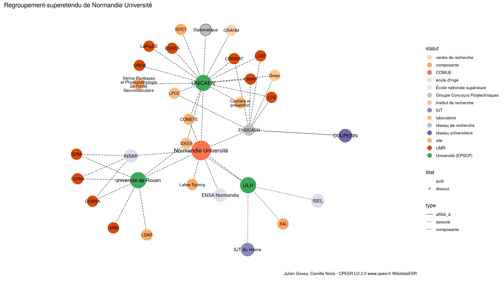

Warnings wikidataESR pour : Normandie Université(14/11/2021
================

- Edition wikidata : [Q3343880](https://www.wikidata.org/wiki/Q3343880)
- Guide d'édition : [wikidataESR](https://github.com/cpesr/wikidataESR/)

- Discussion sur le guide d'édition : [github](https://github.com/cpesr/wikidataESR/issues)

## regroupement-court 

 

Problèmes détectés dans les entités :

|entité                                               |alias                |statut                     |message                     |
|:----------------------------------------------------|:--------------------|:--------------------------|:---------------------------|
|[Q3343880](https://www.wikidata.org/wiki/Q3343880)   |Normandie Université |COMUE                      |Alias manquant ou long      |
|[Q43896457](https://www.wikidata.org/wiki/Q43896457) |COMETE               |site                       |Statut trop imprécis        |
|[Q1665112](https://www.wikidata.org/wiki/Q1665112)   |INSA Rouen           |école d'ingé               |Statut trop imprécis        |
|[Q33122108](https://www.wikidata.org/wiki/Q33122108) |Labex Synorg         |site                       |Statut trop imprécis        |
|[Q33122108](https://www.wikidata.org/wiki/Q33122108) |Labex Synorg         |site                       |Date de fondation manquante |
|[Q3578182](https://www.wikidata.org/wiki/Q3578182)   |ENSA Normandie       |École nationale supérieure |Confusion avec les ENS      |

 

## regroupement-etendu 

 

Problèmes détectés dans les entités :

|entité                                               |alias                                                           |statut                     |message                     |
|:----------------------------------------------------|:---------------------------------------------------------------|:--------------------------|:---------------------------|
|[Q3343880](https://www.wikidata.org/wiki/Q3343880)   |Normandie Université                                            |COMUE                      |Alias manquant ou long      |
|[Q23001757](https://www.wikidata.org/wiki/Q23001757) |IDEES                                                           |laboratoire                |Statut trop imprécis        |
|[Q3117752](https://www.wikidata.org/wiki/Q3117752)   |Greyc                                                           |institut de recherche      |Statut trop imprécis        |
|[Q3214473](https://www.wikidata.org/wiki/Q3214473)   |LPCC                                                            |laboratoire                |Statut trop imprécis        |
|[Q30262446](https://www.wikidata.org/wiki/Q30262446) |Sérine Protéases et Physiopathologie de l'Unité Neurovasculaire |site                       |Statut trop imprécis        |
|[Q30262446](https://www.wikidata.org/wiki/Q30262446) |Sérine Protéases et Physiopathologie de l'Unité Neurovasculaire |site                       |Alias manquant ou long      |
|[Q43896457](https://www.wikidata.org/wiki/Q43896457) |COMETE                                                          |site                       |Statut trop imprécis        |
|[Q50035313](https://www.wikidata.org/wiki/Q50035313) |Cancers et prévention                                           |site                       |Statut trop imprécis        |
|[Q50035313](https://www.wikidata.org/wiki/Q50035313) |Cancers et prévention                                           |site                       |Alias manquant ou long      |
|[Q50040735](https://www.wikidata.org/wiki/Q50040735) |ISTCT                                                           |site                       |Statut trop imprécis        |
|[Q30262310](https://www.wikidata.org/wiki/Q30262310) |LDAR                                                            |site                       |Statut trop imprécis        |
|[Q1665112](https://www.wikidata.org/wiki/Q1665112)   |INSA Rouen                                                      |école d'ingé               |Statut trop imprécis        |
|[Q33122108](https://www.wikidata.org/wiki/Q33122108) |Labex Synorg                                                    |site                       |Statut trop imprécis        |
|[Q33122108](https://www.wikidata.org/wiki/Q33122108) |Labex Synorg                                                    |site                       |Date de fondation manquante |
|[Q3578182](https://www.wikidata.org/wiki/Q3578182)   |ENSA Normandie                                                  |École nationale supérieure |Confusion avec les ENS      |

 

## regroupement-superetendu 

 

Problèmes détectés dans les entités :

|entité                                               |alias                                                           |statut                     |message                     |
|:----------------------------------------------------|:---------------------------------------------------------------|:--------------------------|:---------------------------|
|[Q3343880](https://www.wikidata.org/wiki/Q3343880)   |Normandie Université                                            |COMUE                      |Alias manquant ou long      |
|[Q23001757](https://www.wikidata.org/wiki/Q23001757) |IDEES                                                           |laboratoire                |Statut trop imprécis        |
|[Q3117752](https://www.wikidata.org/wiki/Q3117752)   |Greyc                                                           |institut de recherche      |Statut trop imprécis        |
|[Q3214473](https://www.wikidata.org/wiki/Q3214473)   |LPCC                                                            |laboratoire                |Statut trop imprécis        |
|[Q30262446](https://www.wikidata.org/wiki/Q30262446) |Sérine Protéases et Physiopathologie de l'Unité Neurovasculaire |site                       |Statut trop imprécis        |
|[Q30262446](https://www.wikidata.org/wiki/Q30262446) |Sérine Protéases et Physiopathologie de l'Unité Neurovasculaire |site                       |Alias manquant ou long      |
|[Q43896457](https://www.wikidata.org/wiki/Q43896457) |COMETE                                                          |site                       |Statut trop imprécis        |
|[Q50035313](https://www.wikidata.org/wiki/Q50035313) |Cancers et prévention                                           |site                       |Statut trop imprécis        |
|[Q50035313](https://www.wikidata.org/wiki/Q50035313) |Cancers et prévention                                           |site                       |Alias manquant ou long      |
|[Q50040735](https://www.wikidata.org/wiki/Q50040735) |ISTCT                                                           |site                       |Statut trop imprécis        |
|[Q30262310](https://www.wikidata.org/wiki/Q30262310) |LDAR                                                            |site                       |Statut trop imprécis        |
|[Q1665112](https://www.wikidata.org/wiki/Q1665112)   |INSA Rouen                                                      |école d'ingé               |Statut trop imprécis        |
|[Q33122108](https://www.wikidata.org/wiki/Q33122108) |Labex Synorg                                                    |site                       |Statut trop imprécis        |
|[Q33122108](https://www.wikidata.org/wiki/Q33122108) |Labex Synorg                                                    |site                       |Date de fondation manquante |
|[Q3578182](https://www.wikidata.org/wiki/Q3578182)   |ENSA Normandie                                                  |École nationale supérieure |Confusion avec les ENS      |
|[Q64712815](https://www.wikidata.org/wiki/Q64712815) |Normandie Université                                            |PRES                       |Alias manquant ou long      |

Problèmes détectés dans les relations :

|from                                               |to                                                   |type         |message              |
|:--------------------------------------------------|:----------------------------------------------------|:------------|:--------------------|
|[Q3343880](https://www.wikidata.org/wiki/Q3343880) |[Q64712815](https://www.wikidata.org/wiki/Q64712815) |prédécesseur |Date(s) manquante(s) |

NB : les dates manquantes pour les relations de composante ne sont pas remontées. 

