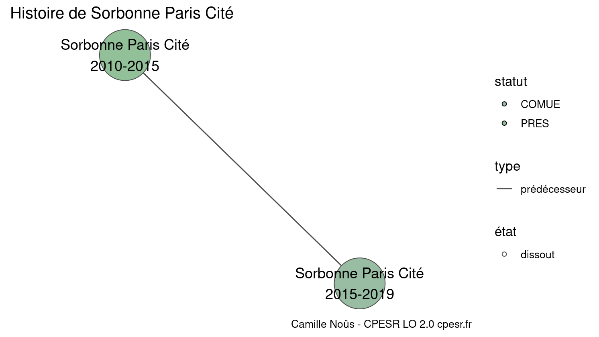

Warnings wikidataESR pour : Sorbonne Paris Cité(18/11/2021
================

- Edition wikidata : [Q3491149](https://www.wikidata.org/wiki/Q3491149)
- Guide d'édition : [wikidataESR](https://github.com/cpesr/wikidataESR/)

- Discussion sur le guide d'édition : [github](https://github.com/cpesr/wikidataESR/issues)

## histoire 

 

Problèmes détectés dans les relations :

|from                                               |to                                                   |type         |message              |
|:--------------------------------------------------|:----------------------------------------------------|:------------|:--------------------|
|[Q3491149](https://www.wikidata.org/wiki/Q3491149) |[Q64785525](https://www.wikidata.org/wiki/Q64785525) |prédécesseur |Date(s) manquante(s) |

NB : les dates manquantes pour les relations de composante ne sont pas remontées. 

## regroupement-court 

 

Problèmes détectés dans les entités :

|entité                                             |alias     |statut                |message              |
|:--------------------------------------------------|:---------|:---------------------|:--------------------|
|[Q1587855](https://www.wikidata.org/wiki/Q1587855) |EHESP     |école                 |Statut trop imprécis |
|[Q859363](https://www.wikidata.org/wiki/Q859363)   |IEP Paris |université publique   |Statut trop imprécis |
|[Q1430113](https://www.wikidata.org/wiki/Q1430113) |CULOV     |université            |Statut trop imprécis |
|[Q3152060](https://www.wikidata.org/wiki/Q3152060) |IPGP      |institut de recherche |Statut trop imprécis |

 

## regroupement-etendu 

 

Problèmes détectés dans les entités :

|entité                                                 |alias                                                           |statut                 |message                     |
|:------------------------------------------------------|:---------------------------------------------------------------|:----------------------|:---------------------------|
|[Q1587855](https://www.wikidata.org/wiki/Q1587855)     |EHESP                                                           |école                  |Statut trop imprécis        |
|[Q859363](https://www.wikidata.org/wiki/Q859363)       |IEP Paris                                                       |université publique    |Statut trop imprécis        |
|[Q2945203](https://www.wikidata.org/wiki/Q2945203)     |CERI                                                            |organisation           |Statut trop imprécis        |
|[Q2945214](https://www.wikidata.org/wiki/Q2945214)     |CEE                                                             |centre de recherche    |Statut trop imprécis        |
|[Q2945109](https://www.wikidata.org/wiki/Q2945109)     |CHSP                                                            |site                   |Statut trop imprécis        |
|[Q2945496](https://www.wikidata.org/wiki/Q2945496)     |CSO                                                             |organisation           |Statut trop imprécis        |
|[Q1430113](https://www.wikidata.org/wiki/Q1430113)     |CULOV                                                           |université             |Statut trop imprécis        |
|[Q30261522](https://www.wikidata.org/wiki/Q30261522)   |Mondes Iranien et Indien                                        |UMR                    |Alias manquant ou long      |
|[Q85721214](https://www.wikidata.org/wiki/Q85721214)   |PLO                                                             |presse universitaire   |Date de fondation manquante |
|[Q51779986](https://www.wikidata.org/wiki/Q51779986)   |PLIDAM                                                          |laboratoire            |Statut trop imprécis        |
|[Q3152060](https://www.wikidata.org/wiki/Q3152060)     |IPGP                                                            |institut de recherche  |Statut trop imprécis        |
|[Q6467244](https://www.wikidata.org/wiki/Q6467244)     |LPP                                                             |laboratoire            |Statut trop imprécis        |
|[Q2945455](https://www.wikidata.org/wiki/Q2945455)     |CERLIS                                                          |institut de recherche  |Statut trop imprécis        |
|[Q3402566](https://www.wikidata.org/wiki/Q3402566)     |Presses Sorbonne Nouvelle                                       |presse universitaire   |Alias manquant ou long      |
|[Q51781407](https://www.wikidata.org/wiki/Q51781407)   |CRP19                                                           |laboratoire            |Statut trop imprécis        |
|[Q51784574](https://www.wikidata.org/wiki/Q51784574)   |DILTEC                                                          |laboratoire            |Statut trop imprécis        |
|[Q51782248](https://www.wikidata.org/wiki/Q51782248)   |CIM                                                             |laboratoire            |Statut trop imprécis        |
|[Q51782284](https://www.wikidata.org/wiki/Q51782284)   |CERC                                                            |laboratoire            |Statut trop imprécis        |
|[Q106600593](https://www.wikidata.org/wiki/Q106600593) |CERAM                                                           |laboratoire            |Statut trop imprécis        |
|[Q106600593](https://www.wikidata.org/wiki/Q106600593) |CERAM                                                           |laboratoire            |Date de fondation manquante |
|[Q51780809](https://www.wikidata.org/wiki/Q51780809)   |FIRL                                                            |laboratoire            |Statut trop imprécis        |
|[Q51782327](https://www.wikidata.org/wiki/Q51782327)   |CEAO                                                            |laboratoire            |Statut trop imprécis        |
|[Q51784317](https://www.wikidata.org/wiki/Q51784317)   |CREC                                                            |laboratoire            |Statut trop imprécis        |
|[Q51785182](https://www.wikidata.org/wiki/Q51785182)   |CREDA                                                           |laboratoire            |Statut trop imprécis        |
|[Q51785156](https://www.wikidata.org/wiki/Q51785156)   |CREPAL                                                          |laboratoire            |Statut trop imprécis        |
|[Q51778803](https://www.wikidata.org/wiki/Q51778803)   |CRIAL                                                           |laboratoire            |Statut trop imprécis        |
|[Q51780512](https://www.wikidata.org/wiki/Q51780512)   |LECEMO                                                          |laboratoire            |Statut trop imprécis        |
|[Q51782255](https://www.wikidata.org/wiki/Q51782255)   |IRCAV                                                           |laboratoire            |Statut trop imprécis        |
|[Q51780504](https://www.wikidata.org/wiki/Q51780504)   |IRET                                                            |laboratoire            |Statut trop imprécis        |
|[Q51781363](https://www.wikidata.org/wiki/Q51781363)   |LIRA                                                            |laboratoire            |Statut trop imprécis        |
|[Q106689317](https://www.wikidata.org/wiki/Q106689317) |EA 7546                                                         |laboratoire            |Statut trop imprécis        |
|[Q51784564](https://www.wikidata.org/wiki/Q51784564)   |CLESTHIA-Langage, Systèmes, Discours                            |laboratoire            |Statut trop imprécis        |
|[Q51784564](https://www.wikidata.org/wiki/Q51784564)   |CLESTHIA-Langage, Systèmes, Discours                            |laboratoire            |Alias manquant ou long      |
|[Q51784300](https://www.wikidata.org/wiki/Q51784300)   |HTL                                                             |laboratoire            |Statut trop imprécis        |
|[Q108337571](https://www.wikidata.org/wiki/Q108337571) |GREI                                                            |laboratoire            |Statut trop imprécis        |
|[Q30281522](https://www.wikidata.org/wiki/Q30281522)   |CRC                                                             |site                   |Statut trop imprécis        |
|[Q30288028](https://www.wikidata.org/wiki/Q30288028)   |CIC de Nantes                                                   |institut de recherche  |Statut trop imprécis        |
|[Q3151728](https://www.wikidata.org/wiki/Q3151728)     |Institut Cochin                                                 |institut               |Statut trop imprécis        |
|[Q30261430](https://www.wikidata.org/wiki/Q30261430)   |IHU Imagine                                                     |site                   |Statut trop imprécis        |
|[Q30261454](https://www.wikidata.org/wiki/Q30261454)   |PARCC                                                           |site                   |Statut trop imprécis        |
|[Q30261620](https://www.wikidata.org/wiki/Q30261620)   |LATI                                                            |site                   |Statut trop imprécis        |
|[Q30262166](https://www.wikidata.org/wiki/Q30262166)   |Paris Biotech Santé                                             |site                   |Statut trop imprécis        |
|[Q30262323](https://www.wikidata.org/wiki/Q30262323)   |Neurophysiologie et nouvelles microscopies                      |laboratoire            |Statut trop imprécis        |
|[Q30262323](https://www.wikidata.org/wiki/Q30262323)   |Neurophysiologie et nouvelles microscopies                      |laboratoire            |Alias manquant ou long      |
|[Q30262393](https://www.wikidata.org/wiki/Q30262393)   |MERIT                                                           |site                   |Statut trop imprécis        |
|[Q30262446](https://www.wikidata.org/wiki/Q30262446)   |Sérine Protéases et Physiopathologie de l'Unité Neurovasculaire |site                   |Statut trop imprécis        |
|[Q30262446](https://www.wikidata.org/wiki/Q30262446)   |Sérine Protéases et Physiopathologie de l'Unité Neurovasculaire |site                   |Alias manquant ou long      |
|[Q30262463](https://www.wikidata.org/wiki/Q30262463)   |Toxicologie Pharmacologie et Signalisation Cellulaire           |site                   |Statut trop imprécis        |
|[Q30262463](https://www.wikidata.org/wiki/Q30262463)   |Toxicologie Pharmacologie et Signalisation Cellulaire           |site                   |Alias manquant ou long      |
|[Q2945444](https://www.wikidata.org/wiki/Q2945444)     |CERMES                                                          |laboratoire            |Statut trop imprécis        |
|[Q3151749](https://www.wikidata.org/wiki/Q3151749)     |IJM                                                             |laboratoire            |Statut trop imprécis        |
|[Q2868555](https://www.wikidata.org/wiki/Q2868555)     |APC                                                             |institut de recherche  |Statut trop imprécis        |
|[Q30261427](https://www.wikidata.org/wiki/Q30261427)   |LVTS                                                            |site                   |Statut trop imprécis        |
|[Q30261444](https://www.wikidata.org/wiki/Q30261444)   |Centre de Recherche sur l'Inflammation                          |site                   |Statut trop imprécis        |
|[Q30261444](https://www.wikidata.org/wiki/Q30261444)   |Centre de Recherche sur l'Inflammation                          |site                   |Alias manquant ou long      |
|[Q30261455](https://www.wikidata.org/wiki/Q30261455)   |Skin Research Center                                            |site                   |Statut trop imprécis        |
|[Q30261455](https://www.wikidata.org/wiki/Q30261455)   |Skin Research Center                                            |site                   |Alias manquant ou long      |
|[Q30261457](https://www.wikidata.org/wiki/Q30261457)   |Physiopathologie et Épidémiologie des Maladies Respiratoires    |site                   |Statut trop imprécis        |
|[Q30261457](https://www.wikidata.org/wiki/Q30261457)   |Physiopathologie et Épidémiologie des Maladies Respiratoires    |site                   |Alias manquant ou long      |
|[Q3152049](https://www.wikidata.org/wiki/Q3152049)     |IMJ-PRG                                                         |institut               |Statut trop imprécis        |
|[Q30261570](https://www.wikidata.org/wiki/Q30261570)   |Expression Génétique Microbienne                                |FRE                    |Alias manquant ou long      |
|[Q30261576](https://www.wikidata.org/wiki/Q30261576)   |CLILLAC-ARP                                                     |site                   |Statut trop imprécis        |
|[Q3214402](https://www.wikidata.org/wiki/Q3214402)     |LITP                                                            |institut de recherche  |Statut trop imprécis        |
|[Q3214366](https://www.wikidata.org/wiki/Q3214366)     |ICT                                                             |institut de recherche  |Statut trop imprécis        |
|[Q30262271](https://www.wikidata.org/wiki/Q30262271)   |Collège International des Sciences du Territoire                |site                   |Statut trop imprécis        |
|[Q30262271](https://www.wikidata.org/wiki/Q30262271)   |Collège International des Sciences du Territoire                |site                   |Alias manquant ou long      |
|[Q30262310](https://www.wikidata.org/wiki/Q30262310)   |LDAR                                                            |site                   |Statut trop imprécis        |
|[Q3214479](https://www.wikidata.org/wiki/Q3214479)     |LPMA                                                            |institut de recherche  |Statut trop imprécis        |
|[Q3214369](https://www.wikidata.org/wiki/Q3214369)     |LJLL                                                            |institut de recherche  |Statut trop imprécis        |
|[Q3402795](https://www.wikidata.org/wiki/Q3402795)     |PPS                                                             |institut universitaire |Statut trop imprécis        |
|[Q30262507](https://www.wikidata.org/wiki/Q30262507)   |Epigénétique et Destin Cellulaire                               |UMR                    |Alias manquant ou long      |
|[Q30264372](https://www.wikidata.org/wiki/Q30264372)   |Centre de compétences nanosciences Île-de-France                |site                   |Statut trop imprécis        |
|[Q30264372](https://www.wikidata.org/wiki/Q30264372)   |Centre de compétences nanosciences Île-de-France                |site                   |Alias manquant ou long      |
|[Q3151760](https://www.wikidata.org/wiki/Q3151760)     |Institut Langevin                                               |institut de recherche  |Statut trop imprécis        |
|[Q51783269](https://www.wikidata.org/wiki/Q51783269)   |IRIF                                                            |institut de recherche  |Statut trop imprécis        |
|[Q28530728](https://www.wikidata.org/wiki/Q28530728)   |Épidémiologie Nutritionnelle                                    |laboratoire            |Statut trop imprécis        |
|[Q28530728](https://www.wikidata.org/wiki/Q28530728)   |Épidémiologie Nutritionnelle                                    |laboratoire            |Alias manquant ou long      |

Problèmes détectés dans les relations :

|from                                             |to                                                 |type      |message              |
|:------------------------------------------------|:--------------------------------------------------|:---------|:--------------------|
|[Q859363](https://www.wikidata.org/wiki/Q859363) |[Q2994760](https://www.wikidata.org/wiki/Q2994760) |affilié_à |Date(s) manquante(s) |

NB : les dates manquantes pour les relations de composante ne sont pas remontées. 

## regroupement-superetendu 

 

Problèmes détectés dans les entités :

|entité                                                 |alias                                                           |statut                 |message                     |
|:------------------------------------------------------|:---------------------------------------------------------------|:----------------------|:---------------------------|
|[Q1587855](https://www.wikidata.org/wiki/Q1587855)     |EHESP                                                           |école                  |Statut trop imprécis        |
|[Q859363](https://www.wikidata.org/wiki/Q859363)       |IEP Paris                                                       |université publique    |Statut trop imprécis        |
|[Q2945203](https://www.wikidata.org/wiki/Q2945203)     |CERI                                                            |organisation           |Statut trop imprécis        |
|[Q2945214](https://www.wikidata.org/wiki/Q2945214)     |CEE                                                             |centre de recherche    |Statut trop imprécis        |
|[Q2945109](https://www.wikidata.org/wiki/Q2945109)     |CHSP                                                            |site                   |Statut trop imprécis        |
|[Q2945496](https://www.wikidata.org/wiki/Q2945496)     |CSO                                                             |organisation           |Statut trop imprécis        |
|[Q1430113](https://www.wikidata.org/wiki/Q1430113)     |CULOV                                                           |université             |Statut trop imprécis        |
|[Q30261522](https://www.wikidata.org/wiki/Q30261522)   |Mondes Iranien et Indien                                        |UMR                    |Alias manquant ou long      |
|[Q85721214](https://www.wikidata.org/wiki/Q85721214)   |PLO                                                             |presse universitaire   |Date de fondation manquante |
|[Q51779986](https://www.wikidata.org/wiki/Q51779986)   |PLIDAM                                                          |laboratoire            |Statut trop imprécis        |
|[Q3152060](https://www.wikidata.org/wiki/Q3152060)     |IPGP                                                            |institut de recherche  |Statut trop imprécis        |
|[Q6467244](https://www.wikidata.org/wiki/Q6467244)     |LPP                                                             |laboratoire            |Statut trop imprécis        |
|[Q2945455](https://www.wikidata.org/wiki/Q2945455)     |CERLIS                                                          |institut de recherche  |Statut trop imprécis        |
|[Q3402566](https://www.wikidata.org/wiki/Q3402566)     |Presses Sorbonne Nouvelle                                       |presse universitaire   |Alias manquant ou long      |
|[Q51781407](https://www.wikidata.org/wiki/Q51781407)   |CRP19                                                           |laboratoire            |Statut trop imprécis        |
|[Q51784574](https://www.wikidata.org/wiki/Q51784574)   |DILTEC                                                          |laboratoire            |Statut trop imprécis        |
|[Q51782248](https://www.wikidata.org/wiki/Q51782248)   |CIM                                                             |laboratoire            |Statut trop imprécis        |
|[Q51782284](https://www.wikidata.org/wiki/Q51782284)   |CERC                                                            |laboratoire            |Statut trop imprécis        |
|[Q106600593](https://www.wikidata.org/wiki/Q106600593) |CERAM                                                           |laboratoire            |Statut trop imprécis        |
|[Q106600593](https://www.wikidata.org/wiki/Q106600593) |CERAM                                                           |laboratoire            |Date de fondation manquante |
|[Q51780809](https://www.wikidata.org/wiki/Q51780809)   |FIRL                                                            |laboratoire            |Statut trop imprécis        |
|[Q51782327](https://www.wikidata.org/wiki/Q51782327)   |CEAO                                                            |laboratoire            |Statut trop imprécis        |
|[Q51784317](https://www.wikidata.org/wiki/Q51784317)   |CREC                                                            |laboratoire            |Statut trop imprécis        |
|[Q51785182](https://www.wikidata.org/wiki/Q51785182)   |CREDA                                                           |laboratoire            |Statut trop imprécis        |
|[Q51785156](https://www.wikidata.org/wiki/Q51785156)   |CREPAL                                                          |laboratoire            |Statut trop imprécis        |
|[Q51778803](https://www.wikidata.org/wiki/Q51778803)   |CRIAL                                                           |laboratoire            |Statut trop imprécis        |
|[Q51780512](https://www.wikidata.org/wiki/Q51780512)   |LECEMO                                                          |laboratoire            |Statut trop imprécis        |
|[Q51782255](https://www.wikidata.org/wiki/Q51782255)   |IRCAV                                                           |laboratoire            |Statut trop imprécis        |
|[Q51780504](https://www.wikidata.org/wiki/Q51780504)   |IRET                                                            |laboratoire            |Statut trop imprécis        |
|[Q51781363](https://www.wikidata.org/wiki/Q51781363)   |LIRA                                                            |laboratoire            |Statut trop imprécis        |
|[Q106689317](https://www.wikidata.org/wiki/Q106689317) |EA 7546                                                         |laboratoire            |Statut trop imprécis        |
|[Q51784564](https://www.wikidata.org/wiki/Q51784564)   |CLESTHIA-Langage, Systèmes, Discours                            |laboratoire            |Statut trop imprécis        |
|[Q51784564](https://www.wikidata.org/wiki/Q51784564)   |CLESTHIA-Langage, Systèmes, Discours                            |laboratoire            |Alias manquant ou long      |
|[Q51784300](https://www.wikidata.org/wiki/Q51784300)   |HTL                                                             |laboratoire            |Statut trop imprécis        |
|[Q108337571](https://www.wikidata.org/wiki/Q108337571) |GREI                                                            |laboratoire            |Statut trop imprécis        |
|[Q30281522](https://www.wikidata.org/wiki/Q30281522)   |CRC                                                             |site                   |Statut trop imprécis        |
|[Q30288028](https://www.wikidata.org/wiki/Q30288028)   |CIC de Nantes                                                   |institut de recherche  |Statut trop imprécis        |
|[Q3151728](https://www.wikidata.org/wiki/Q3151728)     |Institut Cochin                                                 |institut               |Statut trop imprécis        |
|[Q30261430](https://www.wikidata.org/wiki/Q30261430)   |IHU Imagine                                                     |site                   |Statut trop imprécis        |
|[Q30261454](https://www.wikidata.org/wiki/Q30261454)   |PARCC                                                           |site                   |Statut trop imprécis        |
|[Q30261620](https://www.wikidata.org/wiki/Q30261620)   |LATI                                                            |site                   |Statut trop imprécis        |
|[Q30262166](https://www.wikidata.org/wiki/Q30262166)   |Paris Biotech Santé                                             |site                   |Statut trop imprécis        |
|[Q30262323](https://www.wikidata.org/wiki/Q30262323)   |Neurophysiologie et nouvelles microscopies                      |laboratoire            |Statut trop imprécis        |
|[Q30262323](https://www.wikidata.org/wiki/Q30262323)   |Neurophysiologie et nouvelles microscopies                      |laboratoire            |Alias manquant ou long      |
|[Q30262393](https://www.wikidata.org/wiki/Q30262393)   |MERIT                                                           |site                   |Statut trop imprécis        |
|[Q30262446](https://www.wikidata.org/wiki/Q30262446)   |Sérine Protéases et Physiopathologie de l'Unité Neurovasculaire |site                   |Statut trop imprécis        |
|[Q30262446](https://www.wikidata.org/wiki/Q30262446)   |Sérine Protéases et Physiopathologie de l'Unité Neurovasculaire |site                   |Alias manquant ou long      |
|[Q30262463](https://www.wikidata.org/wiki/Q30262463)   |Toxicologie Pharmacologie et Signalisation Cellulaire           |site                   |Statut trop imprécis        |
|[Q30262463](https://www.wikidata.org/wiki/Q30262463)   |Toxicologie Pharmacologie et Signalisation Cellulaire           |site                   |Alias manquant ou long      |
|[Q2945444](https://www.wikidata.org/wiki/Q2945444)     |CERMES                                                          |laboratoire            |Statut trop imprécis        |
|[Q3151749](https://www.wikidata.org/wiki/Q3151749)     |IJM                                                             |laboratoire            |Statut trop imprécis        |
|[Q2868555](https://www.wikidata.org/wiki/Q2868555)     |APC                                                             |institut de recherche  |Statut trop imprécis        |
|[Q30261427](https://www.wikidata.org/wiki/Q30261427)   |LVTS                                                            |site                   |Statut trop imprécis        |
|[Q30261444](https://www.wikidata.org/wiki/Q30261444)   |Centre de Recherche sur l'Inflammation                          |site                   |Statut trop imprécis        |
|[Q30261444](https://www.wikidata.org/wiki/Q30261444)   |Centre de Recherche sur l'Inflammation                          |site                   |Alias manquant ou long      |
|[Q30261455](https://www.wikidata.org/wiki/Q30261455)   |Skin Research Center                                            |site                   |Statut trop imprécis        |
|[Q30261455](https://www.wikidata.org/wiki/Q30261455)   |Skin Research Center                                            |site                   |Alias manquant ou long      |
|[Q30261457](https://www.wikidata.org/wiki/Q30261457)   |Physiopathologie et Épidémiologie des Maladies Respiratoires    |site                   |Statut trop imprécis        |
|[Q30261457](https://www.wikidata.org/wiki/Q30261457)   |Physiopathologie et Épidémiologie des Maladies Respiratoires    |site                   |Alias manquant ou long      |
|[Q3152049](https://www.wikidata.org/wiki/Q3152049)     |IMJ-PRG                                                         |institut               |Statut trop imprécis        |
|[Q30261570](https://www.wikidata.org/wiki/Q30261570)   |Expression Génétique Microbienne                                |FRE                    |Alias manquant ou long      |
|[Q30261576](https://www.wikidata.org/wiki/Q30261576)   |CLILLAC-ARP                                                     |site                   |Statut trop imprécis        |
|[Q3214402](https://www.wikidata.org/wiki/Q3214402)     |LITP                                                            |institut de recherche  |Statut trop imprécis        |
|[Q3214366](https://www.wikidata.org/wiki/Q3214366)     |ICT                                                             |institut de recherche  |Statut trop imprécis        |
|[Q30262271](https://www.wikidata.org/wiki/Q30262271)   |Collège International des Sciences du Territoire                |site                   |Statut trop imprécis        |
|[Q30262271](https://www.wikidata.org/wiki/Q30262271)   |Collège International des Sciences du Territoire                |site                   |Alias manquant ou long      |
|[Q30262310](https://www.wikidata.org/wiki/Q30262310)   |LDAR                                                            |site                   |Statut trop imprécis        |
|[Q3214479](https://www.wikidata.org/wiki/Q3214479)     |LPMA                                                            |institut de recherche  |Statut trop imprécis        |
|[Q3214369](https://www.wikidata.org/wiki/Q3214369)     |LJLL                                                            |institut de recherche  |Statut trop imprécis        |
|[Q3402795](https://www.wikidata.org/wiki/Q3402795)     |PPS                                                             |institut universitaire |Statut trop imprécis        |
|[Q30262507](https://www.wikidata.org/wiki/Q30262507)   |Epigénétique et Destin Cellulaire                               |UMR                    |Alias manquant ou long      |
|[Q30264372](https://www.wikidata.org/wiki/Q30264372)   |Centre de compétences nanosciences Île-de-France                |site                   |Statut trop imprécis        |
|[Q30264372](https://www.wikidata.org/wiki/Q30264372)   |Centre de compétences nanosciences Île-de-France                |site                   |Alias manquant ou long      |
|[Q3151760](https://www.wikidata.org/wiki/Q3151760)     |Institut Langevin                                               |institut de recherche  |Statut trop imprécis        |
|[Q51783269](https://www.wikidata.org/wiki/Q51783269)   |IRIF                                                            |institut de recherche  |Statut trop imprécis        |
|[Q28530728](https://www.wikidata.org/wiki/Q28530728)   |Épidémiologie Nutritionnelle                                    |laboratoire            |Statut trop imprécis        |
|[Q28530728](https://www.wikidata.org/wiki/Q28530728)   |Épidémiologie Nutritionnelle                                    |laboratoire            |Alias manquant ou long      |

Problèmes détectés dans les relations :

|from                                             |to                                                 |type      |message              |
|:------------------------------------------------|:--------------------------------------------------|:---------|:--------------------|
|[Q859363](https://www.wikidata.org/wiki/Q859363) |[Q2994760](https://www.wikidata.org/wiki/Q2994760) |affilié_à |Date(s) manquante(s) |

NB : les dates manquantes pour les relations de composante ne sont pas remontées. 

