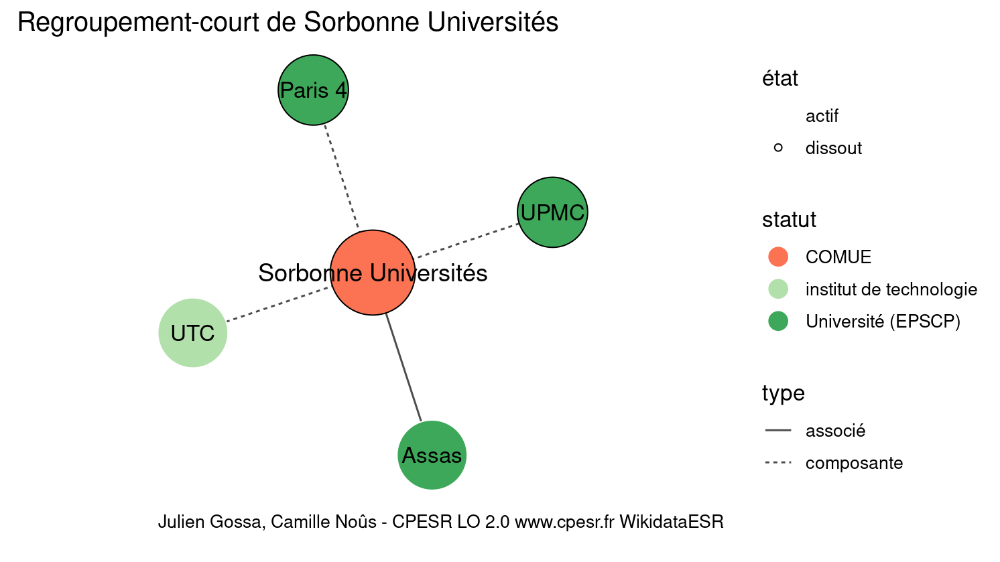

Warnings wikidataESR pour : Sorbonne Universités(14/11/2021
================

- Edition wikidata : [Q3491150](https://www.wikidata.org/wiki/Q3491150)
- Guide d'édition : [wikidataESR](https://github.com/cpesr/wikidataESR/)

- Discussion sur le guide d'édition : [github](https://github.com/cpesr/wikidataESR/issues)

## regroupement-court 

 

Problèmes détectés dans les entités :

|entité                                             |alias                |statut                  |message                |
|:--------------------------------------------------|:--------------------|:-----------------------|:----------------------|
|[Q3491150](https://www.wikidata.org/wiki/Q3491150) |Sorbonne Universités |COMUE                   |Alias manquant ou long |
|[Q622906](https://www.wikidata.org/wiki/Q622906)   |UTC                  |institut de technologie |Statut trop imprécis   |

Problèmes détectés dans les relations :

|from                                               |to                                               |type    |message              |
|:--------------------------------------------------|:------------------------------------------------|:-------|:--------------------|
|[Q3491150](https://www.wikidata.org/wiki/Q3491150) |[Q662976](https://www.wikidata.org/wiki/Q662976) |associé |Date(s) manquante(s) |

NB : les dates manquantes pour les relations de composante ne sont pas remontées. 

## regroupement-etendu 

 

Problèmes détectés dans les entités :

|entité                                               |alias                                                                                            |statut                  |message                     |
|:----------------------------------------------------|:------------------------------------------------------------------------------------------------|:-----------------------|:---------------------------|
|[Q3491150](https://www.wikidata.org/wiki/Q3491150)   |Sorbonne Universités                                                                             |COMUE                   |Alias manquant ou long      |
|[Q3152211](https://www.wikidata.org/wiki/Q3152211)   |ICM                                                                                              |institut de recherche   |Statut trop imprécis        |
|[Q3214375](https://www.wikidata.org/wiki/Q3214375)   |LKB                                                                                              |institut de recherche   |Statut trop imprécis        |
|[Q30262347](https://www.wikidata.org/wiki/Q30262347) |Laboratoire des biomolécules                                                                     |UMR                     |Alias manquant ou long      |
|[Q3152052](https://www.wikidata.org/wiki/Q3152052)   |IMCCE                                                                                            |institut de recherche   |Statut trop imprécis        |
|[Q16652997](https://www.wikidata.org/wiki/Q16652997) |LPP                                                                                              |laboratoire             |Statut trop imprécis        |
|[Q3214506](https://www.wikidata.org/wiki/Q3214506)   |LULI                                                                                             |laboratoire             |Statut trop imprécis        |
|[Q3152049](https://www.wikidata.org/wiki/Q3152049)   |IMJ-PRG                                                                                          |institut                |Statut trop imprécis        |
|[Q3214479](https://www.wikidata.org/wiki/Q3214479)   |LPMA                                                                                             |institut de recherche   |Statut trop imprécis        |
|[Q3214369](https://www.wikidata.org/wiki/Q3214369)   |LJLL                                                                                             |institut de recherche   |Statut trop imprécis        |
|[Q30281522](https://www.wikidata.org/wiki/Q30281522) |CRC                                                                                              |site                    |Statut trop imprécis        |
|[Q30281636](https://www.wikidata.org/wiki/Q30281636) |Institut de Myologie                                                                             |FRE                     |Alias manquant ou long      |
|[Q30261398](https://www.wikidata.org/wiki/Q30261398) |IFM                                                                                              |site                    |Statut trop imprécis        |
|[Q1130982](https://www.wikidata.org/wiki/Q1130982)   |IHP                                                                                              |institut de recherche   |Statut trop imprécis        |
|[Q30261497](https://www.wikidata.org/wiki/Q30261497) |Dynamique de l'Information Génétique : Bases Fondamentales et Cancer                             |UMR                     |Alias manquant ou long      |
|[Q30261513](https://www.wikidata.org/wiki/Q30261513) |Physiologie Membranaire et Moléculaire du Chloroplaste                                           |UMR                     |Alias manquant ou long      |
|[Q3214427](https://www.wikidata.org/wiki/Q3214427)   |LIP6                                                                                             |laboratoire             |Statut trop imprécis        |
|[Q30261609](https://www.wikidata.org/wiki/Q30261609) |Laboratoire de Biologie du Développement                                                         |UMR                     |Alias manquant ou long      |
|[Q30262133](https://www.wikidata.org/wiki/Q30262133) |Laboratoire de Biologie Intégrative des Modèles Marins                                           |UMR                     |Alias manquant ou long      |
|[Q2013017](https://www.wikidata.org/wiki/Q2013017)   |OOB                                                                                              |laboratoire             |Statut trop imprécis        |
|[Q30262199](https://www.wikidata.org/wiki/Q30262199) |CIMI                                                                                             |site                    |Statut trop imprécis        |
|[Q30262249](https://www.wikidata.org/wiki/Q30262249) |EBEA                                                                                             |site                    |Statut trop imprécis        |
|[Q30262270](https://www.wikidata.org/wiki/Q30262270) |Laboratoire de Biologie du Développement de Villefranche-Sur-Mer                                 |UMR                     |Alias manquant ou long      |
|[Q30262338](https://www.wikidata.org/wiki/Q30262338) |LSTA                                                                                             |FRE                     |Date de fondation manquante |
|[Q30262376](https://www.wikidata.org/wiki/Q30262376) |Laboratoire Jean-Perrin                                                                          |laboratoire             |Statut trop imprécis        |
|[Q30262376](https://www.wikidata.org/wiki/Q30262376) |Laboratoire Jean-Perrin                                                                          |laboratoire             |Alias manquant ou long      |
|[Q30262430](https://www.wikidata.org/wiki/Q30262430) |Remodelage et réparation du tissu rénal                                                          |site                    |Statut trop imprécis        |
|[Q30262430](https://www.wikidata.org/wiki/Q30262430) |Remodelage et réparation du tissu rénal                                                          |site                    |Alias manquant ou long      |
|[Q30262442](https://www.wikidata.org/wiki/Q30262442) |Systematics, Adaptation, Evolution                                                               |site                    |Statut trop imprécis        |
|[Q30262442](https://www.wikidata.org/wiki/Q30262442) |Systematics, Adaptation, Evolution                                                               |site                    |Alias manquant ou long      |
|[Q30262442](https://www.wikidata.org/wiki/Q30262442) |Systematics, Adaptation, Evolution                                                               |site                    |Date de fondation manquante |
|[Q30262470](https://www.wikidata.org/wiki/Q30262470) |Unité Mixte Internationnale de Modélisation Mathématique et Informatiques des Systèmes Complèxes |site                    |Statut trop imprécis        |
|[Q30262470](https://www.wikidata.org/wiki/Q30262470) |Unité Mixte Internationnale de Modélisation Mathématique et Informatiques des Systèmes Complèxes |site                    |Alias manquant ou long      |
|[Q30262470](https://www.wikidata.org/wiki/Q30262470) |Unité Mixte Internationnale de Modélisation Mathématique et Informatiques des Systèmes Complèxes |site                    |Date de fondation manquante |
|[Q30263178](https://www.wikidata.org/wiki/Q30263178) |CDR SA                                                                                           |site                    |Statut trop imprécis        |
|[Q33121447](https://www.wikidata.org/wiki/Q33121447) |LBBM                                                                                             |site                    |Statut trop imprécis        |
|[Q30262398](https://www.wikidata.org/wiki/Q30262398) |Orient et Méditerranée, Textes - Archéologie - Histoire                                          |UMR                     |Alias manquant ou long      |
|[Q2945497](https://www.wikidata.org/wiki/Q2945497)   |CESSP                                                                                            |centre de recherche     |Statut trop imprécis        |
|[Q2944794](https://www.wikidata.org/wiki/Q2944794)   |CRHAM                                                                                            |laboratoire             |Statut trop imprécis        |
|[Q622906](https://www.wikidata.org/wiki/Q622906)     |UTC                                                                                              |institut de technologie |Statut trop imprécis        |
|[Q30262282](https://www.wikidata.org/wiki/Q30262282) |Biomécanique et Bioingénierie                                                                    |UMR                     |Alias manquant ou long      |

Problèmes détectés dans les relations :

|from                                               |to                                                   |type       |message              |
|:--------------------------------------------------|:----------------------------------------------------|:----------|:--------------------|
|[Q1144549](https://www.wikidata.org/wiki/Q1144549) |[Q30262518](https://www.wikidata.org/wiki/Q30262518) |composante |Relation multiple    |
|[Q1144549](https://www.wikidata.org/wiki/Q1144549) |[Q30262518](https://www.wikidata.org/wiki/Q30262518) |composante |Relation multiple    |
|[Q3491150](https://www.wikidata.org/wiki/Q3491150) |[Q662976](https://www.wikidata.org/wiki/Q662976)     |associé    |Date(s) manquante(s) |

NB : les dates manquantes pour les relations de composante ne sont pas remontées. 

## regroupement-superetendu 

 

Problèmes détectés dans les entités :

|entité                                                 |alias                                                                                            |statut                  |message                                                    |
|:------------------------------------------------------|:------------------------------------------------------------------------------------------------|:-----------------------|:----------------------------------------------------------|
|[Q3491150](https://www.wikidata.org/wiki/Q3491150)     |Sorbonne Universités                                                                             |COMUE                   |Alias manquant ou long                                     |
|[Q3152211](https://www.wikidata.org/wiki/Q3152211)     |ICM                                                                                              |institut de recherche   |Statut trop imprécis                                       |
|[Q3214375](https://www.wikidata.org/wiki/Q3214375)     |LKB                                                                                              |institut de recherche   |Statut trop imprécis                                       |
|[Q30262347](https://www.wikidata.org/wiki/Q30262347)   |Laboratoire des biomolécules                                                                     |UMR                     |Alias manquant ou long                                     |
|[Q3152052](https://www.wikidata.org/wiki/Q3152052)     |IMCCE                                                                                            |institut de recherche   |Statut trop imprécis                                       |
|[Q16652997](https://www.wikidata.org/wiki/Q16652997)   |LPP                                                                                              |laboratoire             |Statut trop imprécis                                       |
|[Q3214506](https://www.wikidata.org/wiki/Q3214506)     |LULI                                                                                             |laboratoire             |Statut trop imprécis                                       |
|[Q3152049](https://www.wikidata.org/wiki/Q3152049)     |IMJ-PRG                                                                                          |institut                |Statut trop imprécis                                       |
|[Q3214479](https://www.wikidata.org/wiki/Q3214479)     |LPMA                                                                                             |institut de recherche   |Statut trop imprécis                                       |
|[Q3214369](https://www.wikidata.org/wiki/Q3214369)     |LJLL                                                                                             |institut de recherche   |Statut trop imprécis                                       |
|[Q30281522](https://www.wikidata.org/wiki/Q30281522)   |CRC                                                                                              |site                    |Statut trop imprécis                                       |
|[Q30281636](https://www.wikidata.org/wiki/Q30281636)   |Institut de Myologie                                                                             |FRE                     |Alias manquant ou long                                     |
|[Q30261398](https://www.wikidata.org/wiki/Q30261398)   |IFM                                                                                              |site                    |Statut trop imprécis                                       |
|[Q1130982](https://www.wikidata.org/wiki/Q1130982)     |IHP                                                                                              |institut de recherche   |Statut trop imprécis                                       |
|[Q30261497](https://www.wikidata.org/wiki/Q30261497)   |Dynamique de l'Information Génétique : Bases Fondamentales et Cancer                             |UMR                     |Alias manquant ou long                                     |
|[Q30261513](https://www.wikidata.org/wiki/Q30261513)   |Physiologie Membranaire et Moléculaire du Chloroplaste                                           |UMR                     |Alias manquant ou long                                     |
|[Q3214427](https://www.wikidata.org/wiki/Q3214427)     |LIP6                                                                                             |laboratoire             |Statut trop imprécis                                       |
|[Q30261609](https://www.wikidata.org/wiki/Q30261609)   |Laboratoire de Biologie du Développement                                                         |UMR                     |Alias manquant ou long                                     |
|[Q30262133](https://www.wikidata.org/wiki/Q30262133)   |Laboratoire de Biologie Intégrative des Modèles Marins                                           |UMR                     |Alias manquant ou long                                     |
|[Q2013017](https://www.wikidata.org/wiki/Q2013017)     |OOB                                                                                              |laboratoire             |Statut trop imprécis                                       |
|[Q30262199](https://www.wikidata.org/wiki/Q30262199)   |CIMI                                                                                             |site                    |Statut trop imprécis                                       |
|[Q30262249](https://www.wikidata.org/wiki/Q30262249)   |EBEA                                                                                             |site                    |Statut trop imprécis                                       |
|[Q30262270](https://www.wikidata.org/wiki/Q30262270)   |Laboratoire de Biologie du Développement de Villefranche-Sur-Mer                                 |UMR                     |Alias manquant ou long                                     |
|[Q30262338](https://www.wikidata.org/wiki/Q30262338)   |LSTA                                                                                             |FRE                     |Date de fondation manquante                                |
|[Q30262376](https://www.wikidata.org/wiki/Q30262376)   |Laboratoire Jean-Perrin                                                                          |laboratoire             |Statut trop imprécis                                       |
|[Q30262376](https://www.wikidata.org/wiki/Q30262376)   |Laboratoire Jean-Perrin                                                                          |laboratoire             |Alias manquant ou long                                     |
|[Q30262430](https://www.wikidata.org/wiki/Q30262430)   |Remodelage et réparation du tissu rénal                                                          |site                    |Statut trop imprécis                                       |
|[Q30262430](https://www.wikidata.org/wiki/Q30262430)   |Remodelage et réparation du tissu rénal                                                          |site                    |Alias manquant ou long                                     |
|[Q30262442](https://www.wikidata.org/wiki/Q30262442)   |Systematics, Adaptation, Evolution                                                               |site                    |Statut trop imprécis                                       |
|[Q30262442](https://www.wikidata.org/wiki/Q30262442)   |Systematics, Adaptation, Evolution                                                               |site                    |Alias manquant ou long                                     |
|[Q30262442](https://www.wikidata.org/wiki/Q30262442)   |Systematics, Adaptation, Evolution                                                               |site                    |Date de fondation manquante                                |
|[Q30262470](https://www.wikidata.org/wiki/Q30262470)   |Unité Mixte Internationnale de Modélisation Mathématique et Informatiques des Systèmes Complèxes |site                    |Statut trop imprécis                                       |
|[Q30262470](https://www.wikidata.org/wiki/Q30262470)   |Unité Mixte Internationnale de Modélisation Mathématique et Informatiques des Systèmes Complèxes |site                    |Alias manquant ou long                                     |
|[Q30262470](https://www.wikidata.org/wiki/Q30262470)   |Unité Mixte Internationnale de Modélisation Mathématique et Informatiques des Systèmes Complèxes |site                    |Date de fondation manquante                                |
|[Q30263178](https://www.wikidata.org/wiki/Q30263178)   |CDR SA                                                                                           |site                    |Statut trop imprécis                                       |
|[Q33121447](https://www.wikidata.org/wiki/Q33121447)   |LBBM                                                                                             |site                    |Statut trop imprécis                                       |
|[Q3064332](https://www.wikidata.org/wiki/Q3064332)     |Faculté de Science de Paris                                                                      |composante              |Alias manquant ou long                                     |
|[Q104777601](https://www.wikidata.org/wiki/Q104777601) |École de médecine de Paris                                                                       |statut manquant         |Absence de propriété P31 (instance_of/nature de l'élément) |
|[Q104777601](https://www.wikidata.org/wiki/Q104777601) |École de médecine de Paris                                                                       |statut manquant         |Alias manquant ou long                                     |
|[Q104777601](https://www.wikidata.org/wiki/Q104777601) |École de médecine de Paris                                                                       |statut manquant         |Date de fondation manquante                                |
|[Q30262398](https://www.wikidata.org/wiki/Q30262398)   |Orient et Méditerranée, Textes - Archéologie - Histoire                                          |UMR                     |Alias manquant ou long                                     |
|[Q2945497](https://www.wikidata.org/wiki/Q2945497)     |CESSP                                                                                            |centre de recherche     |Statut trop imprécis                                       |
|[Q2944794](https://www.wikidata.org/wiki/Q2944794)     |CRHAM                                                                                            |laboratoire             |Statut trop imprécis                                       |
|[Q3064325](https://www.wikidata.org/wiki/Q3064325)     |Faculté des lettres de Paris                                                                     |composante              |Alias manquant ou long                                     |
|[Q3064321](https://www.wikidata.org/wiki/Q3064321)     |Faculté des arts de Paris                                                                        |institut universitaire  |Statut trop imprécis                                       |
|[Q3064321](https://www.wikidata.org/wiki/Q3064321)     |Faculté des arts de Paris                                                                        |institut universitaire  |Alias manquant ou long                                     |
|[Q622906](https://www.wikidata.org/wiki/Q622906)       |UTC                                                                                              |institut de technologie |Statut trop imprécis                                       |
|[Q30262282](https://www.wikidata.org/wiki/Q30262282)   |Biomécanique et Bioingénierie                                                                    |UMR                     |Alias manquant ou long                                     |
|[Q20749407](https://www.wikidata.org/wiki/Q20749407)   |Faculté de droit de Paris                                                                        |composante              |Alias manquant ou long                                     |
|[Q20749406](https://www.wikidata.org/wiki/Q20749406)   |faculté de droit de Paris                                                                        |faculté de droit        |Alias manquant ou long                                     |

Problèmes détectés dans les relations :

|from                                                 |to                                                     |type         |message              |
|:----------------------------------------------------|:------------------------------------------------------|:------------|:--------------------|
|[Q1144549](https://www.wikidata.org/wiki/Q1144549)   |[Q30262518](https://www.wikidata.org/wiki/Q30262518)   |composante   |Relation multiple    |
|[Q1144549](https://www.wikidata.org/wiki/Q1144549)   |[Q30262518](https://www.wikidata.org/wiki/Q30262518)   |composante   |Relation multiple    |
|[Q3064277](https://www.wikidata.org/wiki/Q3064277)   |[Q104777601](https://www.wikidata.org/wiki/Q104777601) |prédécesseur |Date(s) manquante(s) |
|[Q3064325](https://www.wikidata.org/wiki/Q3064325)   |[Q3064321](https://www.wikidata.org/wiki/Q3064321)     |prédécesseur |Date(s) manquante(s) |
|[Q3491150](https://www.wikidata.org/wiki/Q3491150)   |[Q662976](https://www.wikidata.org/wiki/Q662976)       |associé      |Date(s) manquante(s) |
|[Q20749407](https://www.wikidata.org/wiki/Q20749407) |[Q20749406](https://www.wikidata.org/wiki/Q20749406)   |prédécesseur |Date(s) manquante(s) |

NB : les dates manquantes pour les relations de composante ne sont pas remontées. 

