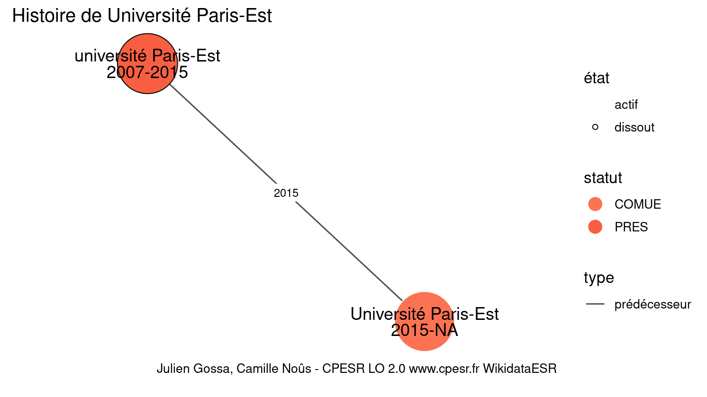

Warnings wikidataESR pour : Université Paris-Est(18/11/2021
================

- Edition wikidata : [Q3551472](https://www.wikidata.org/wiki/Q3551472)
- Guide d'édition : [wikidataESR](https://github.com/cpesr/wikidataESR/)

- Discussion sur le guide d'édition : [github](https://github.com/cpesr/wikidataESR/issues)

## histoire 

 

Problèmes détectés dans les entités :

|entité                                               |alias                |statut |message                |
|:----------------------------------------------------|:--------------------|:------|:----------------------|
|[Q3551472](https://www.wikidata.org/wiki/Q3551472)   |Université Paris-Est |COMUE  |Alias manquant ou long |
|[Q64808631](https://www.wikidata.org/wiki/Q64808631) |Université Paris-Est |PRES   |Alias manquant ou long |

 

## regroupement-court 

 

Problèmes détectés dans les entités :

|entité                                             |alias                |statut       |message                                |
|:--------------------------------------------------|:--------------------|:------------|:--------------------------------------|
|[Q3551472](https://www.wikidata.org/wiki/Q3551472) |Université Paris-Est |COMUE        |Alias manquant ou long                 |
|[Q273523](https://www.wikidata.org/wiki/Q273523)   |ENPC                 |école d'ingé |Statut trop imprécis                   |
|[Q273600](https://www.wikidata.org/wiki/Q273600)   |Enva                 |Grande ecole |Réserver aux écoles non contemporaines |
|[Q3152297](https://www.wikidata.org/wiki/Q3152297) |IFSTTAR              |EPST         |Date de fondation manquante            |

 

## regroupement-etendu 

 

Problèmes détectés dans les entités :

|entité                                                 |alias                |statut                            |message                                |
|:------------------------------------------------------|:--------------------|:---------------------------------|:--------------------------------------|
|[Q3551472](https://www.wikidata.org/wiki/Q3551472)     |Université Paris-Est |COMUE                             |Alias manquant ou long                 |
|[Q3152297](https://www.wikidata.org/wiki/Q3152297)     |IFSTTAR              |EPST                              |Date de fondation manquante            |
|[Q273523](https://www.wikidata.org/wiki/Q273523)       |ENPC                 |école d'ingé                      |Statut trop imprécis                   |
|[Q6038970](https://www.wikidata.org/wiki/Q6038970)     |LIGM                 |institut                          |Statut trop imprécis                   |
|[Q273600](https://www.wikidata.org/wiki/Q273600)       |Enva                 |Grande ecole                      |Réserver aux écoles non contemporaines |
|[Q30261452](https://www.wikidata.org/wiki/Q30261452)   |IMRB                 |site                              |Statut trop imprécis                   |
|[Q30262310](https://www.wikidata.org/wiki/Q30262310)   |LDAR                 |site                              |Statut trop imprécis                   |
|[Q30274354](https://www.wikidata.org/wiki/Q30274354)   |ILF                  |site                              |Statut trop imprécis                   |
|[Q106592020](https://www.wikidata.org/wiki/Q106592020) |UPEC droit           |institut d'enseignement supérieur |Statut trop imprécis                   |
|[Q51785386](https://www.wikidata.org/wiki/Q51785386)   |MIL                  |laboratoire                       |Statut trop imprécis                   |
|[Q108219600](https://www.wikidata.org/wiki/Q108219600) |IEJ Upec             |institut                          |Statut trop imprécis                   |
|[Q108219600](https://www.wikidata.org/wiki/Q108219600) |IEJ Upec             |institut                          |Date de fondation manquante            |

Problèmes détectés dans les relations :

|from                                             |to                                                 |type      |message              |
|:------------------------------------------------|:--------------------------------------------------|:---------|:--------------------|
|[Q273523](https://www.wikidata.org/wiki/Q273523) |[Q1344278](https://www.wikidata.org/wiki/Q1344278) |affilié_à |Date(s) manquante(s) |

NB : les dates manquantes pour les relations de composante ne sont pas remontées. 

## regroupement-superetendu 

 

Problèmes détectés dans les entités :

|entité                                                 |alias                                                            |statut                            |message                                |
|:------------------------------------------------------|:----------------------------------------------------------------|:---------------------------------|:--------------------------------------|
|[Q3551472](https://www.wikidata.org/wiki/Q3551472)     |Université Paris-Est                                             |COMUE                             |Alias manquant ou long                 |
|[Q3152297](https://www.wikidata.org/wiki/Q3152297)     |IFSTTAR                                                          |EPST                              |Date de fondation manquante            |
|[Q273523](https://www.wikidata.org/wiki/Q273523)       |ENPC                                                             |école d'ingé                      |Statut trop imprécis                   |
|[Q6038970](https://www.wikidata.org/wiki/Q6038970)     |LIGM                                                             |institut                          |Statut trop imprécis                   |
|[Q273638](https://www.wikidata.org/wiki/Q273638)       |ESPCI                                                            |institut d'enseignement supérieur |Statut trop imprécis                   |
|[Q30262279](https://www.wikidata.org/wiki/Q30262279)   |Laboratoire de Chimie Organique                                  |site                              |Statut trop imprécis                   |
|[Q30262279](https://www.wikidata.org/wiki/Q30262279)   |Laboratoire de Chimie Organique                                  |site                              |Alias manquant ou long                 |
|[Q30262279](https://www.wikidata.org/wiki/Q30262279)   |Laboratoire de Chimie Organique                                  |site                              |Date de fondation manquante            |
|[Q30262290](https://www.wikidata.org/wiki/Q30262290)   |Laboratory Colloïdes et Matériaux Divisés                        |site                              |Statut trop imprécis                   |
|[Q30262290](https://www.wikidata.org/wiki/Q30262290)   |Laboratory Colloïdes et Matériaux Divisés                        |site                              |Alias manquant ou long                 |
|[Q3151760](https://www.wikidata.org/wiki/Q3151760)     |Institut Langevin                                                |institut de recherche             |Statut trop imprécis                   |
|[Q1163431](https://www.wikidata.org/wiki/Q1163431)     |PSL                                                              |EPE                               |Préférer Q77979904                     |
|[Q30262256](https://www.wikidata.org/wiki/Q30262256)   |Fed PV                                                           |site                              |Statut trop imprécis                   |
|[Q16643681](https://www.wikidata.org/wiki/Q16643681)   |IHPST                                                            |laboratoire                       |Statut trop imprécis                   |
|[Q3214375](https://www.wikidata.org/wiki/Q3214375)     |LKB                                                              |institut de recherche             |Statut trop imprécis                   |
|[Q30262347](https://www.wikidata.org/wiki/Q30262347)   |Laboratoire des biomolécules                                     |UMR                               |Alias manquant ou long                 |
|[Q651337](https://www.wikidata.org/wiki/Q651337)       |Institut Jean Nicod                                              |institut de recherche             |Statut trop imprécis                   |
|[Q62925843](https://www.wikidata.org/wiki/Q62925843)   |Département de physique de l'École normale supérieure            |département universitaire         |Alias manquant ou long                 |
|[Q62925843](https://www.wikidata.org/wiki/Q62925843)   |Département de physique de l'École normale supérieure            |département universitaire         |Date de fondation manquante            |
|[Q2913547](https://www.wikidata.org/wiki/Q2913547)     |UMR 7534                                                         |laboratoire                       |Statut trop imprécis                   |
|[Q30262539](https://www.wikidata.org/wiki/Q30262539)   |LEDA                                                             |site                              |Statut trop imprécis                   |
|[Q461340](https://www.wikidata.org/wiki/Q461340)       |Observatoire de Paris - PSL                                      |Grand Établissement               |Alias manquant ou long                 |
|[Q2868555](https://www.wikidata.org/wiki/Q2868555)     |APC                                                              |institut de recherche             |Statut trop imprécis                   |
|[Q3151749](https://www.wikidata.org/wiki/Q3151749)     |IJM                                                              |laboratoire                       |Statut trop imprécis                   |
|[Q30261427](https://www.wikidata.org/wiki/Q30261427)   |LVTS                                                             |site                              |Statut trop imprécis                   |
|[Q30261444](https://www.wikidata.org/wiki/Q30261444)   |Centre de Recherche sur l'Inflammation                           |site                              |Statut trop imprécis                   |
|[Q30261444](https://www.wikidata.org/wiki/Q30261444)   |Centre de Recherche sur l'Inflammation                           |site                              |Alias manquant ou long                 |
|[Q30261455](https://www.wikidata.org/wiki/Q30261455)   |Skin Research Center                                             |site                              |Statut trop imprécis                   |
|[Q30261455](https://www.wikidata.org/wiki/Q30261455)   |Skin Research Center                                             |site                              |Alias manquant ou long                 |
|[Q30261457](https://www.wikidata.org/wiki/Q30261457)   |Physiopathologie et Épidémiologie des Maladies Respiratoires     |site                              |Statut trop imprécis                   |
|[Q30261457](https://www.wikidata.org/wiki/Q30261457)   |Physiopathologie et Épidémiologie des Maladies Respiratoires     |site                              |Alias manquant ou long                 |
|[Q3152049](https://www.wikidata.org/wiki/Q3152049)     |IMJ-PRG                                                          |institut                          |Statut trop imprécis                   |
|[Q30261570](https://www.wikidata.org/wiki/Q30261570)   |Expression Génétique Microbienne                                 |FRE                               |Alias manquant ou long                 |
|[Q30261576](https://www.wikidata.org/wiki/Q30261576)   |CLILLAC-ARP                                                      |site                              |Statut trop imprécis                   |
|[Q3214402](https://www.wikidata.org/wiki/Q3214402)     |LITP                                                             |institut de recherche             |Statut trop imprécis                   |
|[Q3214366](https://www.wikidata.org/wiki/Q3214366)     |ICT                                                              |institut de recherche             |Statut trop imprécis                   |
|[Q30262271](https://www.wikidata.org/wiki/Q30262271)   |Collège International des Sciences du Territoire                 |site                              |Statut trop imprécis                   |
|[Q30262271](https://www.wikidata.org/wiki/Q30262271)   |Collège International des Sciences du Territoire                 |site                              |Alias manquant ou long                 |
|[Q30262310](https://www.wikidata.org/wiki/Q30262310)   |LDAR                                                             |site                              |Statut trop imprécis                   |
|[Q3214479](https://www.wikidata.org/wiki/Q3214479)     |LPMA                                                             |institut de recherche             |Statut trop imprécis                   |
|[Q3214369](https://www.wikidata.org/wiki/Q3214369)     |LJLL                                                             |institut de recherche             |Statut trop imprécis                   |
|[Q3402795](https://www.wikidata.org/wiki/Q3402795)     |PPS                                                              |institut universitaire            |Statut trop imprécis                   |
|[Q30262507](https://www.wikidata.org/wiki/Q30262507)   |Epigénétique et Destin Cellulaire                                |UMR                               |Alias manquant ou long                 |
|[Q30264372](https://www.wikidata.org/wiki/Q30264372)   |Centre de compétences nanosciences Île-de-France                 |site                              |Statut trop imprécis                   |
|[Q30264372](https://www.wikidata.org/wiki/Q30264372)   |Centre de compétences nanosciences Île-de-France                 |site                              |Alias manquant ou long                 |
|[Q51783269](https://www.wikidata.org/wiki/Q51783269)   |IRIF                                                             |institut de recherche             |Statut trop imprécis                   |
|[Q3152052](https://www.wikidata.org/wiki/Q3152052)     |IMCCE                                                            |institut de recherche             |Statut trop imprécis                   |
|[Q35155796](https://www.wikidata.org/wiki/Q35155796)   |Grand equatorial coudé de Paris                                  |télescope optique                 |Alias manquant ou long                 |
|[Q35155796](https://www.wikidata.org/wiki/Q35155796)   |Grand equatorial coudé de Paris                                  |télescope optique                 |Date de fondation manquante            |
|[Q78478594](https://www.wikidata.org/wiki/Q78478594)   |Lunette Arago                                                    |télescope optique                 |Date de fondation manquante            |
|[Q1189954](https://www.wikidata.org/wiki/Q1189954)     |ENSMP                                                            |école d'ingé                      |Statut trop imprécis                   |
|[Q30262187](https://www.wikidata.org/wiki/Q30262187)   |GEOSCIENCE                                                       |site                              |Statut trop imprécis                   |
|[Q30262191](https://www.wikidata.org/wiki/Q30262191)   |CGS                                                              |institut de recherche             |Statut trop imprécis                   |
|[Q30262201](https://www.wikidata.org/wiki/Q30262201)   |CRI                                                              |site                              |Statut trop imprécis                   |
|[Q30262213](https://www.wikidata.org/wiki/Q30262213)   |Centre Procédés, Energies Renouvelables et Systèmes Energétiques |site                              |Statut trop imprécis                   |
|[Q30262213](https://www.wikidata.org/wiki/Q30262213)   |Centre Procédés, Energies Renouvelables et Systèmes Energétiques |site                              |Alias manquant ou long                 |
|[Q30262213](https://www.wikidata.org/wiki/Q30262213)   |Centre Procédés, Energies Renouvelables et Systèmes Energétiques |site                              |Date de fondation manquante            |
|[Q2994538](https://www.wikidata.org/wiki/Q2994538)     |CNSMD                                                            |école supérieure de musique       |Date de fondation manquante            |
|[Q1135990](https://www.wikidata.org/wiki/Q1135990)     |ENAD                                                             |Grande ecole                      |Réserver aux écoles non contemporaines |
|[Q3361154](https://www.wikidata.org/wiki/Q3361154)     |palais des Études                                                |bâtisse                           |Date de fondation manquante            |
|[Q109586954](https://www.wikidata.org/wiki/Q109586954) |Centre d'imagerie multimodale                                    |UMS                               |Alias manquant ou long                 |
|[Q109586954](https://www.wikidata.org/wiki/Q109586954) |Centre d'imagerie multimodale                                    |UMS                               |Date de fondation manquante            |
|[Q109587071](https://www.wikidata.org/wiki/Q109587071) |CMIB                                                             |UMR                               |Date de fondation manquante            |
|[Q109620211](https://www.wikidata.org/wiki/Q109620211) |Intégrité du génome, ARN et cancer                               |UMR                               |Alias manquant ou long                 |
|[Q109620211](https://www.wikidata.org/wiki/Q109620211) |Intégrité du génome, ARN et cancer                               |UMR                               |Date de fondation manquante            |
|[Q109621785](https://www.wikidata.org/wiki/Q109621785) |SRC                                                              |UMR                               |Date de fondation manquante            |
|[Q30262248](https://www.wikidata.org/wiki/Q30262248)   |G-EAU                                                            |site                              |Statut trop imprécis                   |
|[Q30262478](https://www.wikidata.org/wiki/Q30262478)   |Ingénierie Procédés Aliments                                     |site                              |Statut trop imprécis                   |
|[Q30262478](https://www.wikidata.org/wiki/Q30262478)   |Ingénierie Procédés Aliments                                     |site                              |Alias manquant ou long                 |
|[Q51782089](https://www.wikidata.org/wiki/Q51782089)   |Écologie fonctionnelle et écotoxicologie des agroécosystèmes     |UMR                               |Alias manquant ou long                 |
|[Q109621296](https://www.wikidata.org/wiki/Q109621296) |SayFood                                                          |UMR                               |Date de fondation manquante            |
|[Q109621897](https://www.wikidata.org/wiki/Q109621897) |UMR Agronomie                                                    |UMR                               |Date de fondation manquante            |
|[Q2570220](https://www.wikidata.org/wiki/Q2570220)     |ENSAM                                                            |Grande ecole                      |Réserver aux écoles non contemporaines |
|[Q15967309](https://www.wikidata.org/wiki/Q15967309)   |I2M                                                              |laboratoire                       |Statut trop imprécis                   |
|[Q16508582](https://www.wikidata.org/wiki/Q16508582)   |LSIS                                                             |laboratoire                       |Statut trop imprécis                   |
|[Q30262481](https://www.wikidata.org/wiki/Q30262481)   |GEORGIATECH                                                      |site                              |Statut trop imprécis                   |
|[Q15918389](https://www.wikidata.org/wiki/Q15918389)   |IRENAV                                                           |institut                          |Statut trop imprécis                   |
|[Q2311820](https://www.wikidata.org/wiki/Q2311820)     |ENST                                                             |Grande ecole                      |Réserver aux écoles non contemporaines |
|[Q7885718](https://www.wikidata.org/wiki/Q7885718)     |IMT                                                              |école d'ingé                      |Statut trop imprécis                   |
|[Q3577934](https://www.wikidata.org/wiki/Q3577934)     |ENSTIMAC                                                         |école                             |Statut trop imprécis                   |
|[Q30297078](https://www.wikidata.org/wiki/Q30297078)   |ICA                                                              |laboratoire                       |Statut trop imprécis                   |
|[Q3299074](https://www.wikidata.org/wiki/Q3299074)     |Toulouse Tech                                                    |université                        |Statut trop imprécis                   |
|[Q30262371](https://www.wikidata.org/wiki/Q30262371)   |LTCI                                                             |laboratoire                       |Statut trop imprécis                   |
|[Q27962533](https://www.wikidata.org/wiki/Q27962533)   |IMT Atlantique                                                   |école                             |Statut trop imprécis                   |
|[Q3152091](https://www.wikidata.org/wiki/Q3152091)     |IRISA                                                            |laboratoire                       |Statut trop imprécis                   |
|[Q3214422](https://www.wikidata.org/wiki/Q3214422)     |LINA                                                             |institut de recherche             |Statut trop imprécis                   |
|[Q2460307](https://www.wikidata.org/wiki/Q2460307)     |ENSTB                                                            |école                             |Statut trop imprécis                   |
|[Q3152769](https://www.wikidata.org/wiki/Q3152769)     |Institut Universitaire Européen de la Mer                        |institut                          |Statut trop imprécis                   |
|[Q3152769](https://www.wikidata.org/wiki/Q3152769)     |Institut Universitaire Européen de la Mer                        |institut                          |Alias manquant ou long                 |
|[Q33122110](https://www.wikidata.org/wiki/Q33122110)   |LabexMER                                                         |site                              |Statut trop imprécis                   |
|[Q3152003](https://www.wikidata.org/wiki/Q3152003)     |Institut de Géoarchitecture                                      |école d'urbanisme                 |Alias manquant ou long                 |
|[Q3152003](https://www.wikidata.org/wiki/Q3152003)     |Institut de Géoarchitecture                                      |école d'urbanisme                 |Date de fondation manquante            |
|[Q3151888](https://www.wikidata.org/wiki/Q3151888)     |IAE Brest                                                        |institut universitaire            |Statut trop imprécis                   |
|[Q38372677](https://www.wikidata.org/wiki/Q38372677)   |faculté des lettres et sciences humaines Victor Segalen          |composante                        |Alias manquant ou long                 |
|[Q2945394](https://www.wikidata.org/wiki/Q2945394)     |CRBC                                                             |laboratoire                       |Statut trop imprécis                   |
|[Q3578240](https://www.wikidata.org/wiki/Q3578240)     |ENSIETA                                                          |école                             |Statut trop imprécis                   |
|[Q273564](https://www.wikidata.org/wiki/Q273564)       |ENIB                                                             |Grande ecole                      |Réserver aux écoles non contemporaines |
|[Q24935922](https://www.wikidata.org/wiki/Q24935922)   |Institut des sciences de l'information et de leurs interactions  |institut de recherche             |Statut trop imprécis                   |
|[Q24935922](https://www.wikidata.org/wiki/Q24935922)   |Institut des sciences de l'information et de leurs interactions  |institut de recherche             |Alias manquant ou long                 |
|[Q24935922](https://www.wikidata.org/wiki/Q24935922)   |Institut des sciences de l'information et de leurs interactions  |institut de recherche             |Date de fondation manquante            |
|[Q3214435](https://www.wikidata.org/wiki/Q3214435)     |LIMSI                                                            |laboratoire                       |Statut trop imprécis                   |
|[Q3214408](https://www.wikidata.org/wiki/Q3214408)     |LAAS                                                             |institut de recherche             |Statut trop imprécis                   |
|[Q3214404](https://www.wikidata.org/wiki/Q3214404)     |LIG                                                              |institut de recherche             |Statut trop imprécis                   |
|[Q3214427](https://www.wikidata.org/wiki/Q3214427)     |LIP6                                                             |laboratoire                       |Statut trop imprécis                   |
|[Q2945401](https://www.wikidata.org/wiki/Q2945401)     |CRAN                                                             |laboratoire                       |Statut trop imprécis                   |
|[Q2945399](https://www.wikidata.org/wiki/Q2945399)     |Creatis                                                          |laboratoire                       |Statut trop imprécis                   |
|[Q3117752](https://www.wikidata.org/wiki/Q3117752)     |Greyc                                                            |institut de recherche             |Statut trop imprécis                   |
|[Q3214388](https://www.wikidata.org/wiki/Q3214388)     |Lsv                                                              |institut de recherche             |Statut trop imprécis                   |
|[Q3214481](https://www.wikidata.org/wiki/Q3214481)     |LRI                                                              |laboratoire                       |Statut trop imprécis                   |
|[Q3214420](https://www.wikidata.org/wiki/Q3214420)     |LIRMM                                                            |institut de recherche             |Statut trop imprécis                   |
|[Q828518](https://www.wikidata.org/wiki/Q828518)       |IN2P3                                                            |agence publique                   |Statut trop imprécis                   |
|[Q3214403](https://www.wikidata.org/wiki/Q3214403)     |LAPP                                                             |laboratoire                       |Statut trop imprécis                   |
|[Q30294860](https://www.wikidata.org/wiki/Q30294860)   |LMA                                                              |site                              |Statut trop imprécis                   |
|[Q3152464](https://www.wikidata.org/wiki/Q3152464)     |IPHC                                                             |laboratoire                       |Statut trop imprécis                   |
|[Q2945499](https://www.wikidata.org/wiki/Q2945499)     |CSNSM                                                            |centre de recherche               |Statut trop imprécis                   |
|[Q3214459](https://www.wikidata.org/wiki/Q3214459)     |LAL                                                              |institut de recherche             |Statut trop imprécis                   |
|[Q3214473](https://www.wikidata.org/wiki/Q3214473)     |LPCC                                                             |laboratoire                       |Statut trop imprécis                   |
|[Q3214474](https://www.wikidata.org/wiki/Q3214474)     |Laboratoire de physique corpusculaire de clermont-ferrand        |laboratoire                       |Statut trop imprécis                   |
|[Q3214474](https://www.wikidata.org/wiki/Q3214474)     |Laboratoire de physique corpusculaire de clermont-ferrand        |laboratoire                       |Alias manquant ou long                 |
|[Q6459743](https://www.wikidata.org/wiki/Q6459743)     |LPSC                                                             |institut de recherche             |Statut trop imprécis                   |
|[Q3152061](https://www.wikidata.org/wiki/Q3152061)     |IPNO                                                             |laboratoire                       |Statut trop imprécis                   |
|[Q30261426](https://www.wikidata.org/wiki/Q30261426)   |l'Unité de Recherche de l'Institut du Thorax                     |UMR                               |Alias manquant ou long                 |
|[Q30262452](https://www.wikidata.org/wiki/Q30262452)   |Laboratoire de Thérapie Génique                                  |site                              |Statut trop imprécis                   |
|[Q30262452](https://www.wikidata.org/wiki/Q30262452)   |Laboratoire de Thérapie Génique                                  |site                              |Alias manquant ou long                 |
|[Q1275372](https://www.wikidata.org/wiki/Q1275372)     |ÉNSAÉ                                                            |Grande ecole                      |Réserver aux écoles non contemporaines |
|[Q838454](https://www.wikidata.org/wiki/Q838454)       |ENSTA Paris                                                      |Grande ecole                      |Réserver aux écoles non contemporaines |
|[Q898448](https://www.wikidata.org/wiki/Q898448)       |IOTA                                                             |Grande ecole                      |Réserver aux écoles non contemporaines |
|[Q15407445](https://www.wikidata.org/wiki/Q15407445)   |Laboratoire Hubert-Curien                                        |institut de recherche             |Statut trop imprécis                   |
|[Q15407445](https://www.wikidata.org/wiki/Q15407445)   |Laboratoire Hubert-Curien                                        |institut de recherche             |Alias manquant ou long                 |
|[Q109621906](https://www.wikidata.org/wiki/Q109621906) |UMS IOGS-CNRS                                                    |UMS                               |Date de fondation manquante            |
|[Q273626](https://www.wikidata.org/wiki/Q273626)       |L'X                                                              |Grande ecole                      |Réserver aux écoles non contemporaines |
|[Q16008922](https://www.wikidata.org/wiki/Q16008922)   |CMAP                                                             |institut de recherche             |Statut trop imprécis                   |
|[Q4393524](https://www.wikidata.org/wiki/Q4393524)     |Centre cea de saclay                                             |institut de recherche             |Statut trop imprécis                   |
|[Q4393524](https://www.wikidata.org/wiki/Q4393524)     |Centre cea de saclay                                             |institut de recherche             |Alias manquant ou long                 |
|[Q4393524](https://www.wikidata.org/wiki/Q4393524)     |Centre cea de saclay                                             |institut de recherche             |Date de fondation manquante            |
|[Q3214506](https://www.wikidata.org/wiki/Q3214506)     |LULI                                                             |laboratoire                       |Statut trop imprécis                   |
|[Q16009025](https://www.wikidata.org/wiki/Q16009025)   |LIX                                                              |laboratoire                       |Statut trop imprécis                   |
|[Q273535](https://www.wikidata.org/wiki/Q273535)       |HEC                                                              |Grande ecole                      |Réserver aux écoles non contemporaines |
|[Q59535271](https://www.wikidata.org/wiki/Q59535271)   |École des hautes études commerciales de Paris au Qatar           |institution éducative             |Statut trop imprécis                   |
|[Q59535271](https://www.wikidata.org/wiki/Q59535271)   |École des hautes études commerciales de Paris au Qatar           |institution éducative             |Alias manquant ou long                 |
|[Q1023349](https://www.wikidata.org/wiki/Q1023349)     |Community of European management Schools                         |institut universitaire            |Statut trop imprécis                   |
|[Q1023349](https://www.wikidata.org/wiki/Q1023349)     |Community of European management Schools                         |institut universitaire            |Alias manquant ou long                 |
|[Q273600](https://www.wikidata.org/wiki/Q273600)       |Enva                                                             |Grande ecole                      |Réserver aux écoles non contemporaines |
|[Q30261452](https://www.wikidata.org/wiki/Q30261452)   |IMRB                                                             |site                              |Statut trop imprécis                   |
|[Q30274354](https://www.wikidata.org/wiki/Q30274354)   |ILF                                                              |site                              |Statut trop imprécis                   |
|[Q106592020](https://www.wikidata.org/wiki/Q106592020) |UPEC droit                                                       |institut d'enseignement supérieur |Statut trop imprécis                   |
|[Q51785386](https://www.wikidata.org/wiki/Q51785386)   |MIL                                                              |laboratoire                       |Statut trop imprécis                   |
|[Q108219600](https://www.wikidata.org/wiki/Q108219600) |IEJ Upec                                                         |institut                          |Statut trop imprécis                   |
|[Q108219600](https://www.wikidata.org/wiki/Q108219600) |IEJ Upec                                                         |institut                          |Date de fondation manquante            |

Problèmes détectés dans les relations :

|from                                                 |to                                                   |type       |message              |
|:----------------------------------------------------|:----------------------------------------------------|:----------|:--------------------|
|[Q1637105](https://www.wikidata.org/wiki/Q1637105)   |[Q30262186](https://www.wikidata.org/wiki/Q30262186) |composante |Relation multiple    |
|[Q1637105](https://www.wikidata.org/wiki/Q1637105)   |[Q30262186](https://www.wikidata.org/wiki/Q30262186) |composante |Relation multiple    |
|[Q273523](https://www.wikidata.org/wiki/Q273523)     |[Q1344278](https://www.wikidata.org/wiki/Q1344278)   |affilié_à  |Date(s) manquante(s) |
|[Q273638](https://www.wikidata.org/wiki/Q273638)     |[Q1163431](https://www.wikidata.org/wiki/Q1163431)   |affilié_à  |Date(s) manquante(s) |
|[Q2868555](https://www.wikidata.org/wiki/Q2868555)   |[Q1235608](https://www.wikidata.org/wiki/Q1235608)   |affilié_à  |Date(s) manquante(s) |
|[Q461340](https://www.wikidata.org/wiki/Q461340)     |[Q35155796](https://www.wikidata.org/wiki/Q35155796) |associé    |Date(s) manquante(s) |
|[Q461340](https://www.wikidata.org/wiki/Q461340)     |[Q78478594](https://www.wikidata.org/wiki/Q78478594) |associé    |Date(s) manquante(s) |
|[Q273593](https://www.wikidata.org/wiki/Q273593)     |[Q3361154](https://www.wikidata.org/wiki/Q3361154)   |associé    |Date(s) manquante(s) |
|[Q2311820](https://www.wikidata.org/wiki/Q2311820)   |[Q7885718](https://www.wikidata.org/wiki/Q7885718)   |affilié_à  |Date(s) manquante(s) |
|[Q3577934](https://www.wikidata.org/wiki/Q3577934)   |[Q3299074](https://www.wikidata.org/wiki/Q3299074)   |affilié_à  |Date(s) manquante(s) |
|[Q3299074](https://www.wikidata.org/wiki/Q3299074)   |[Q2992899](https://www.wikidata.org/wiki/Q2992899)   |affilié_à  |Date(s) manquante(s) |
|[Q30262172](https://www.wikidata.org/wiki/Q30262172) |[Q280413](https://www.wikidata.org/wiki/Q280413)     |affilié_à  |Date(s) manquante(s) |
|[Q30262172](https://www.wikidata.org/wiki/Q30262172) |[Q2460307](https://www.wikidata.org/wiki/Q2460307)   |affilié_à  |Date(s) manquante(s) |
|[Q30262172](https://www.wikidata.org/wiki/Q30262172) |[Q1857334](https://www.wikidata.org/wiki/Q1857334)   |affilié_à  |Date(s) manquante(s) |
|[Q30262172](https://www.wikidata.org/wiki/Q30262172) |[Q1125958](https://www.wikidata.org/wiki/Q1125958)   |affilié_à  |Date(s) manquante(s) |
|[Q30262172](https://www.wikidata.org/wiki/Q30262172) |[Q3578240](https://www.wikidata.org/wiki/Q3578240)   |affilié_à  |Date(s) manquante(s) |
|[Q30262172](https://www.wikidata.org/wiki/Q30262172) |[Q273564](https://www.wikidata.org/wiki/Q273564)     |affilié_à  |Date(s) manquante(s) |
|[Q30262172](https://www.wikidata.org/wiki/Q30262172) |[Q24935922](https://www.wikidata.org/wiki/Q24935922) |affilié_à  |Date(s) manquante(s) |
|[Q30262316](https://www.wikidata.org/wiki/Q30262316) |[Q828518](https://www.wikidata.org/wiki/Q828518)     |affilié_à  |Date(s) manquante(s) |
|[Q30262316](https://www.wikidata.org/wiki/Q30262316) |[Q259388](https://www.wikidata.org/wiki/Q259388)     |affilié_à  |Date(s) manquante(s) |
|[Q30262316](https://www.wikidata.org/wiki/Q30262316) |[Q280413](https://www.wikidata.org/wiki/Q280413)     |affilié_à  |Date(s) manquante(s) |
|[Q273535](https://www.wikidata.org/wiki/Q273535)     |[Q1023349](https://www.wikidata.org/wiki/Q1023349)   |affilié_à  |Date(s) manquante(s) |

NB : les dates manquantes pour les relations de composante ne sont pas remontées. 

