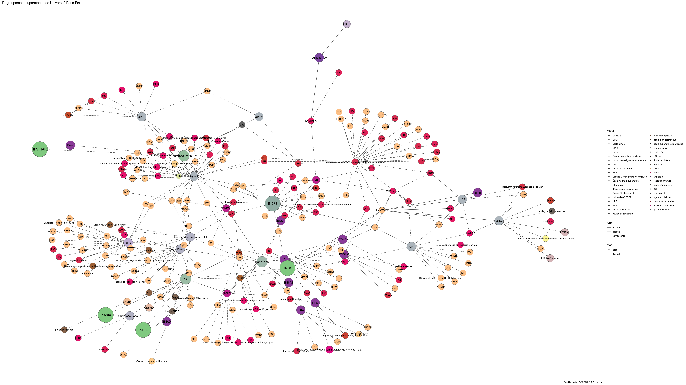

Warnings wikidataESR pour : Université Paris-Est(01/09/2022
================

- Edition wikidata : [Q3551472](https://www.wikidata.org/wiki/Q3551472)
- Guide d'édition : [wikidataESR](https://github.com/cpesr/wikidataESR/)

- Discussion sur le guide d'édition : [github](https://github.com/cpesr/wikidataESR/issues)


## histoire 

 

Problèmes détectés dans les entités :

|entité                                               |alias                |statut |message                |
|:----------------------------------------------------|:--------------------|:------|:----------------------|
|[Q3551472](https://www.wikidata.org/wiki/Q3551472)   |Université Paris-Est |COMUE  |Alias manquant ou long |
|[Q64808631](https://www.wikidata.org/wiki/Q64808631) |université Paris-Est |PRES   |Alias manquant ou long |

 


## regroupement-court 

 

Problèmes détectés dans les entités :

|entité                                             |alias                |statut       |message                                |
|:--------------------------------------------------|:--------------------|:------------|:--------------------------------------|
|[Q3551472](https://www.wikidata.org/wiki/Q3551472) |Université Paris-Est |COMUE        |Alias manquant ou long                 |
|[Q273523](https://www.wikidata.org/wiki/Q273523)   |ENPC                 |école d'ingé |Statut trop imprécis                   |
|[Q273600](https://www.wikidata.org/wiki/Q273600)   |Enva                 |Grande ecole |Réserver aux écoles non contemporaines |
|[Q3152297](https://www.wikidata.org/wiki/Q3152297) |IFSTTAR              |EPST         |Date de fondation manquante            |

 


## regroupement-etendu 

 

Problèmes détectés dans les entités :

|entité                                                 |alias                |statut                            |message                                |
|:------------------------------------------------------|:--------------------|:---------------------------------|:--------------------------------------|
|[Q3551472](https://www.wikidata.org/wiki/Q3551472)     |Université Paris-Est |COMUE                             |Alias manquant ou long                 |
|[Q3152297](https://www.wikidata.org/wiki/Q3152297)     |IFSTTAR              |EPST                              |Date de fondation manquante            |
|[Q273523](https://www.wikidata.org/wiki/Q273523)       |ENPC                 |école d'ingé                      |Statut trop imprécis                   |
|[Q6038970](https://www.wikidata.org/wiki/Q6038970)     |LIGM                 |institut                          |Statut trop imprécis                   |
|[Q273600](https://www.wikidata.org/wiki/Q273600)       |Enva                 |Grande ecole                      |Réserver aux écoles non contemporaines |
|[Q30261452](https://www.wikidata.org/wiki/Q30261452)   |IMRB                 |site                              |Statut trop imprécis                   |
|[Q30262310](https://www.wikidata.org/wiki/Q30262310)   |LDAR                 |site                              |Statut trop imprécis                   |
|[Q3214495](https://www.wikidata.org/wiki/Q3214495)     |LISA                 |laboratoire                       |Statut trop imprécis                   |
|[Q30274354](https://www.wikidata.org/wiki/Q30274354)   |ILF                  |site                              |Statut trop imprécis                   |
|[Q106592020](https://www.wikidata.org/wiki/Q106592020) |UPEC droit           |institut d'enseignement supérieur |Statut trop imprécis                   |
|[Q51785386](https://www.wikidata.org/wiki/Q51785386)   |MIL                  |laboratoire                       |Statut trop imprécis                   |
|[Q108219600](https://www.wikidata.org/wiki/Q108219600) |IEJ Upec             |institut                          |Statut trop imprécis                   |
|[Q108219600](https://www.wikidata.org/wiki/Q108219600) |IEJ Upec             |institut                          |Date de fondation manquante            |

Problèmes détectés dans les relations :

|depuis                                           |vers                                               |type      |message              |
|:------------------------------------------------|:--------------------------------------------------|:---------|:--------------------|
|[Q273523](https://www.wikidata.org/wiki/Q273523) |[Q1344278](https://www.wikidata.org/wiki/Q1344278) |affilié_à |Date(s) manquante(s) |

NB : les dates manquantes pour les relations de composante ne sont pas remontées. 


## regroupement-superetendu 

 


Erreur : les données sont probablement trop partielles.
```
Error in query(url, "pcontent", clean_response, query_param = query_param, : The API returned an error: missingtitle - The page you specified doesn't exist.

``` 

