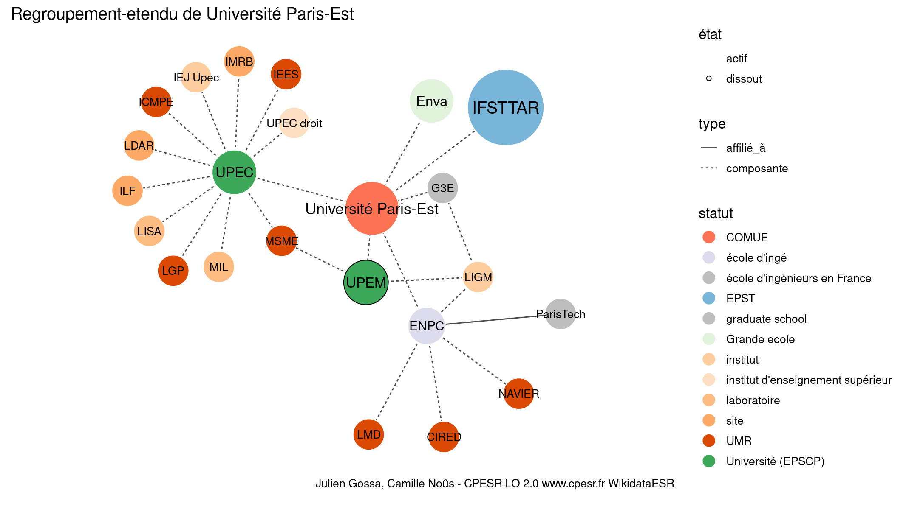

Warnings wikidataESR pour : Université Paris-Est(13/11/2021
================

- Edition wikidata : [Q3551472](https://www.wikidata.org/wiki/Q3551472)
- Guide d'édition : [wikidataESR](https://github.com/cpesr/wikidataESR/)

- Discussion sur le guide d'édition : [github](https://github.com/cpesr/wikidataESR/issues)

## regroupement-court 

 

Problèmes détectés dans les entités :

|entité                                             |alias                |statut       |message                                |
|:--------------------------------------------------|:--------------------|:------------|:--------------------------------------|
|[Q3551472](https://www.wikidata.org/wiki/Q3551472) |Université Paris-Est |COMUE        |Alias manquant ou long                 |
|[Q3152297](https://www.wikidata.org/wiki/Q3152297) |IFSTTAR              |EPST         |Date de fondation manquante            |
|[Q273523](https://www.wikidata.org/wiki/Q273523)   |ENPC                 |école d'ingé |Statut trop imprécis                   |
|[Q273600](https://www.wikidata.org/wiki/Q273600)   |Enva                 |Grande ecole |Réserver aux écoles non contemporaines |

 

## regroupement-etendu 

 

Problèmes détectés dans les entités :

|entité                                                 |alias                |statut                            |message                                |
|:------------------------------------------------------|:--------------------|:---------------------------------|:--------------------------------------|
|[Q3551472](https://www.wikidata.org/wiki/Q3551472)     |Université Paris-Est |COMUE                             |Alias manquant ou long                 |
|[Q3152297](https://www.wikidata.org/wiki/Q3152297)     |IFSTTAR              |EPST                              |Date de fondation manquante            |
|[Q6038970](https://www.wikidata.org/wiki/Q6038970)     |LIGM                 |institut                          |Statut trop imprécis                   |
|[Q30262310](https://www.wikidata.org/wiki/Q30262310)   |LDAR                 |site                              |Statut trop imprécis                   |
|[Q30274354](https://www.wikidata.org/wiki/Q30274354)   |ILF                  |site                              |Statut trop imprécis                   |
|[Q30261452](https://www.wikidata.org/wiki/Q30261452)   |IMRB                 |site                              |Statut trop imprécis                   |
|[Q106592020](https://www.wikidata.org/wiki/Q106592020) |UPEC droit           |institut d'enseignement supérieur |Statut trop imprécis                   |
|[Q51785386](https://www.wikidata.org/wiki/Q51785386)   |MIL                  |laboratoire                       |Statut trop imprécis                   |
|[Q108219600](https://www.wikidata.org/wiki/Q108219600) |IEJ Upec             |institut                          |Statut trop imprécis                   |
|[Q108219600](https://www.wikidata.org/wiki/Q108219600) |IEJ Upec             |institut                          |Date de fondation manquante            |
|[Q273523](https://www.wikidata.org/wiki/Q273523)       |ENPC                 |école d'ingé                      |Statut trop imprécis                   |
|[Q2945821](https://www.wikidata.org/wiki/Q2945821)     |CIRED                |laboratoire                       |Statut trop imprécis                   |
|[Q273600](https://www.wikidata.org/wiki/Q273600)       |Enva                 |Grande ecole                      |Réserver aux écoles non contemporaines |

 

## regroupement-superetendu 

 

Problèmes détectés dans les entités :

|entité                                                 |alias                                                        |statut                            |message                                |
|:------------------------------------------------------|:------------------------------------------------------------|:---------------------------------|:--------------------------------------|
|[Q3551472](https://www.wikidata.org/wiki/Q3551472)     |Université Paris-Est                                         |COMUE                             |Alias manquant ou long                 |
|[Q3152297](https://www.wikidata.org/wiki/Q3152297)     |IFSTTAR                                                      |EPST                              |Date de fondation manquante            |
|[Q6038970](https://www.wikidata.org/wiki/Q6038970)     |LIGM                                                         |institut                          |Statut trop imprécis                   |
|[Q30262310](https://www.wikidata.org/wiki/Q30262310)   |LDAR                                                         |site                              |Statut trop imprécis                   |
|[Q30274354](https://www.wikidata.org/wiki/Q30274354)   |ILF                                                          |site                              |Statut trop imprécis                   |
|[Q30261452](https://www.wikidata.org/wiki/Q30261452)   |IMRB                                                         |site                              |Statut trop imprécis                   |
|[Q106592020](https://www.wikidata.org/wiki/Q106592020) |UPEC droit                                                   |institut d'enseignement supérieur |Statut trop imprécis                   |
|[Q51785386](https://www.wikidata.org/wiki/Q51785386)   |MIL                                                          |laboratoire                       |Statut trop imprécis                   |
|[Q108219600](https://www.wikidata.org/wiki/Q108219600) |IEJ Upec                                                     |institut                          |Statut trop imprécis                   |
|[Q108219600](https://www.wikidata.org/wiki/Q108219600) |IEJ Upec                                                     |institut                          |Date de fondation manquante            |
|[Q273523](https://www.wikidata.org/wiki/Q273523)       |ENPC                                                         |école d'ingé                      |Statut trop imprécis                   |
|[Q2945821](https://www.wikidata.org/wiki/Q2945821)     |CIRED                                                        |laboratoire                       |Statut trop imprécis                   |
|[Q273600](https://www.wikidata.org/wiki/Q273600)       |Enva                                                         |Grande ecole                      |Réserver aux écoles non contemporaines |
|[Q64808631](https://www.wikidata.org/wiki/Q64808631)   |Université Paris-Est                                         |PRES                              |Alias manquant ou long                 |
|[Q273483](https://www.wikidata.org/wiki/Q273483)       |ESTP                                                         |Grande ecole                      |Réserver aux écoles non contemporaines |
|[Q273515](https://www.wikidata.org/wiki/Q273515)       |EIVP                                                         |Grande ecole                      |Réserver aux écoles non contemporaines |
|[Q2946043](https://www.wikidata.org/wiki/Q2946043)     |CSTB                                                         |institut de recherche             |Statut trop imprécis                   |
|[Q3577756](https://www.wikidata.org/wiki/Q3577756)     |Éav&t                                                        |École nationale supérieure        |Confusion avec les ENS                 |
|[Q1665109](https://www.wikidata.org/wiki/Q1665109)     |INA                                                          |institut                          |Statut trop imprécis                   |
|[Q3578184](https://www.wikidata.org/wiki/Q3578184)     |École nationale supérieure d'architecture de Paris-Malaquais |École nationale supérieure        |Confusion avec les ENS                 |
|[Q3578184](https://www.wikidata.org/wiki/Q3578184)     |École nationale supérieure d'architecture de Paris-Malaquais |École nationale supérieure        |Alias manquant ou long                 |
|[Q1665102](https://www.wikidata.org/wiki/Q1665102)     |IGN                                                          |entreprise d'État                 |Statut trop imprécis                   |
|[Q392520](https://www.wikidata.org/wiki/Q392520)       |Ansés                                                        |ODAC                              |Statut trop imprécis                   |
|[Q36875379](https://www.wikidata.org/wiki/Q36875379)   |ZAM                                                          |site                              |Statut trop imprécis                   |
|[Q36875379](https://www.wikidata.org/wiki/Q36875379)   |ZAM                                                          |site                              |Date de fondation manquante            |

Problèmes détectés dans les relations :

|from                                                 |to                                                 |type    |message              |
|:----------------------------------------------------|:--------------------------------------------------|:-------|:--------------------|
|[Q64808631](https://www.wikidata.org/wiki/Q64808631) |[Q273483](https://www.wikidata.org/wiki/Q273483)   |associé |Date(s) manquante(s) |
|[Q64808631](https://www.wikidata.org/wiki/Q64808631) |[Q273515](https://www.wikidata.org/wiki/Q273515)   |associé |Date(s) manquante(s) |
|[Q64808631](https://www.wikidata.org/wiki/Q64808631) |[Q2946043](https://www.wikidata.org/wiki/Q2946043) |associé |Date(s) manquante(s) |
|[Q64808631](https://www.wikidata.org/wiki/Q64808631) |[Q3577756](https://www.wikidata.org/wiki/Q3577756) |associé |Date(s) manquante(s) |
|[Q64808631](https://www.wikidata.org/wiki/Q64808631) |[Q1665109](https://www.wikidata.org/wiki/Q1665109) |associé |Date(s) manquante(s) |
|[Q64808631](https://www.wikidata.org/wiki/Q64808631) |[Q3578187](https://www.wikidata.org/wiki/Q3578187) |associé |Date(s) manquante(s) |
|[Q64808631](https://www.wikidata.org/wiki/Q64808631) |[Q3578184](https://www.wikidata.org/wiki/Q3578184) |associé |Date(s) manquante(s) |
|[Q64808631](https://www.wikidata.org/wiki/Q64808631) |[Q1665102](https://www.wikidata.org/wiki/Q1665102) |associé |Date(s) manquante(s) |
|[Q64808631](https://www.wikidata.org/wiki/Q64808631) |[Q392520](https://www.wikidata.org/wiki/Q392520)   |associé |Date(s) manquante(s) |

NB : les dates manquantes pour les relations de composante ne sont pas remontées. 

