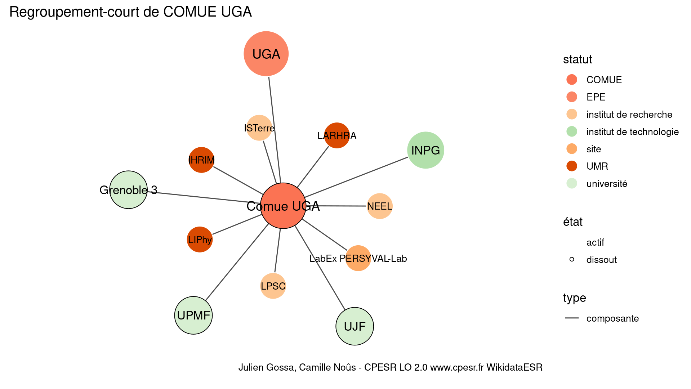
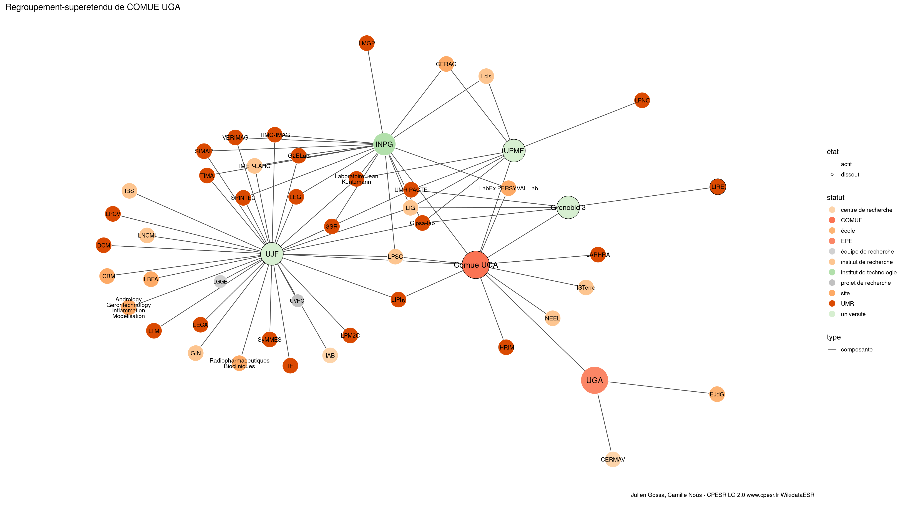

Warnings wikidataESR pour : COMUE UGA(01/09/2022
================

- Edition wikidata : [Q3551589](https://www.wikidata.org/wiki/Q3551589)
- Guide d'édition : [wikidataESR](https://github.com/cpesr/wikidataESR/)

- Discussion sur le guide d'édition : [github](https://github.com/cpesr/wikidataESR/issues)

## histoire 

 

Problèmes détectés dans les entités :

|entité                                               |alias                  |statut |message                |
|:----------------------------------------------------|:----------------------|:------|:----------------------|
|[Q64711640](https://www.wikidata.org/wiki/Q64711640) |université de Grenoble |PRES   |Alias manquant ou long |

 

## regroupement-court 

 

Problèmes détectés dans les entités :

|entité                                               |alias              |statut                  |message                     |
|:----------------------------------------------------|:------------------|:-----------------------|:---------------------------|
|[Q1665121](https://www.wikidata.org/wiki/Q1665121)   |INPG               |institut de technologie |Statut trop imprécis        |
|[Q955647](https://www.wikidata.org/wiki/Q955647)     |UJF                |université              |Statut trop imprécis        |
|[Q2000147](https://www.wikidata.org/wiki/Q2000147)   |UPMF               |université              |Statut trop imprécis        |
|[Q1616573](https://www.wikidata.org/wiki/Q1616573)   |Grenoble 3         |université              |Statut trop imprécis        |
|[Q15968497](https://www.wikidata.org/wiki/Q15968497) |NEEL               |institut de recherche   |Statut trop imprécis        |
|[Q16964698](https://www.wikidata.org/wiki/Q16964698) |ISTerre            |institut de recherche   |Statut trop imprécis        |
|[Q6459743](https://www.wikidata.org/wiki/Q6459743)   |LPSC               |institut de recherche   |Statut trop imprécis        |
|[Q33122106](https://www.wikidata.org/wiki/Q33122106) |LabEx PERSYVAL-Lab |site                    |Statut trop imprécis        |
|[Q33122106](https://www.wikidata.org/wiki/Q33122106) |LabEx PERSYVAL-Lab |site                    |Date de fondation manquante |

 

## regroupement-etendu 

 

Problèmes détectés dans les entités :

|entité                                                 |alias                                               |statut                  |message                     |
|:------------------------------------------------------|:---------------------------------------------------|:-----------------------|:---------------------------|
|[Q1665121](https://www.wikidata.org/wiki/Q1665121)     |INPG                                                |institut de technologie |Statut trop imprécis        |
|[Q3152051](https://www.wikidata.org/wiki/Q3152051)     |IMEP-LAHC                                           |institut de recherche   |Statut trop imprécis        |
|[Q3214404](https://www.wikidata.org/wiki/Q3214404)     |LIG                                                 |institut de recherche   |Statut trop imprécis        |
|[Q30261567](https://www.wikidata.org/wiki/Q30261567)   |CERAG                                               |site                    |Statut trop imprécis        |
|[Q3214448](https://www.wikidata.org/wiki/Q3214448)     |Lcis                                                |institut de recherche   |Statut trop imprécis        |
|[Q30262530](https://www.wikidata.org/wiki/Q30262530)   |Laboratoire Jean Kuntzmann                          |UMR                     |Alias manquant ou long      |
|[Q6459743](https://www.wikidata.org/wiki/Q6459743)     |LPSC                                                |institut de recherche   |Statut trop imprécis        |
|[Q33122106](https://www.wikidata.org/wiki/Q33122106)   |LabEx PERSYVAL-Lab                                  |site                    |Statut trop imprécis        |
|[Q33122106](https://www.wikidata.org/wiki/Q33122106)   |LabEx PERSYVAL-Lab                                  |site                    |Date de fondation manquante |
|[Q955647](https://www.wikidata.org/wiki/Q955647)       |UJF                                                 |université              |Statut trop imprécis        |
|[Q19407044](https://www.wikidata.org/wiki/Q19407044)   |IAB                                                 |centre de recherche     |Statut trop imprécis        |
|[Q21619458](https://www.wikidata.org/wiki/Q21619458)   |IBS                                                 |institut de recherche   |Statut trop imprécis        |
|[Q3116487](https://www.wikidata.org/wiki/Q3116487)     |GIN                                                 |institut de recherche   |Statut trop imprécis        |
|[Q13421865](https://www.wikidata.org/wiki/Q13421865)   |LNCMI                                               |institut de recherche   |Statut trop imprécis        |
|[Q30261613](https://www.wikidata.org/wiki/Q30261613)   |LCBM                                                |site                    |Statut trop imprécis        |
|[Q30262150](https://www.wikidata.org/wiki/Q30262150)   |Andrology Gerontechnology Inflammation Modelisation |site                    |Statut trop imprécis        |
|[Q30262150](https://www.wikidata.org/wiki/Q30262150)   |Andrology Gerontechnology Inflammation Modelisation |site                    |Alias manquant ou long      |
|[Q30262358](https://www.wikidata.org/wiki/Q30262358)   |Radiopharmaceutiques Biocliniques                   |site                    |Statut trop imprécis        |
|[Q30262358](https://www.wikidata.org/wiki/Q30262358)   |Radiopharmaceutiques Biocliniques                   |site                    |Alias manquant ou long      |
|[Q43896459](https://www.wikidata.org/wiki/Q43896459)   |LBFA                                                |site                    |Statut trop imprécis        |
|[Q2000147](https://www.wikidata.org/wiki/Q2000147)     |UPMF                                                |université              |Statut trop imprécis        |
|[Q1616573](https://www.wikidata.org/wiki/Q1616573)     |Grenoble 3                                          |université              |Statut trop imprécis        |
|[Q15968497](https://www.wikidata.org/wiki/Q15968497)   |NEEL                                                |institut de recherche   |Statut trop imprécis        |
|[Q16964698](https://www.wikidata.org/wiki/Q16964698)   |ISTerre                                             |institut de recherche   |Statut trop imprécis        |
|[Q104759458](https://www.wikidata.org/wiki/Q104759458) |EJdG                                                |école                   |Statut trop imprécis        |
|[Q104759458](https://www.wikidata.org/wiki/Q104759458) |EJdG                                                |école                   |Date de fondation manquante |
|[Q17623895](https://www.wikidata.org/wiki/Q17623895)   |CERMAV                                              |centre de recherche     |Statut trop imprécis        |

 

## regroupement-superetendu 

 

Problèmes détectés dans les entités :

|entité                                                 |alias                                               |statut                  |message                     |
|:------------------------------------------------------|:---------------------------------------------------|:-----------------------|:---------------------------|
|[Q1665121](https://www.wikidata.org/wiki/Q1665121)     |INPG                                                |institut de technologie |Statut trop imprécis        |
|[Q3152051](https://www.wikidata.org/wiki/Q3152051)     |IMEP-LAHC                                           |institut de recherche   |Statut trop imprécis        |
|[Q3214404](https://www.wikidata.org/wiki/Q3214404)     |LIG                                                 |institut de recherche   |Statut trop imprécis        |
|[Q30261567](https://www.wikidata.org/wiki/Q30261567)   |CERAG                                               |site                    |Statut trop imprécis        |
|[Q3214448](https://www.wikidata.org/wiki/Q3214448)     |Lcis                                                |institut de recherche   |Statut trop imprécis        |
|[Q30262530](https://www.wikidata.org/wiki/Q30262530)   |Laboratoire Jean Kuntzmann                          |UMR                     |Alias manquant ou long      |
|[Q6459743](https://www.wikidata.org/wiki/Q6459743)     |LPSC                                                |institut de recherche   |Statut trop imprécis        |
|[Q33122106](https://www.wikidata.org/wiki/Q33122106)   |LabEx PERSYVAL-Lab                                  |site                    |Statut trop imprécis        |
|[Q33122106](https://www.wikidata.org/wiki/Q33122106)   |LabEx PERSYVAL-Lab                                  |site                    |Date de fondation manquante |
|[Q955647](https://www.wikidata.org/wiki/Q955647)       |UJF                                                 |université              |Statut trop imprécis        |
|[Q19407044](https://www.wikidata.org/wiki/Q19407044)   |IAB                                                 |centre de recherche     |Statut trop imprécis        |
|[Q21619458](https://www.wikidata.org/wiki/Q21619458)   |IBS                                                 |institut de recherche   |Statut trop imprécis        |
|[Q3116487](https://www.wikidata.org/wiki/Q3116487)     |GIN                                                 |institut de recherche   |Statut trop imprécis        |
|[Q13421865](https://www.wikidata.org/wiki/Q13421865)   |LNCMI                                               |institut de recherche   |Statut trop imprécis        |
|[Q30261613](https://www.wikidata.org/wiki/Q30261613)   |LCBM                                                |site                    |Statut trop imprécis        |
|[Q30262150](https://www.wikidata.org/wiki/Q30262150)   |Andrology Gerontechnology Inflammation Modelisation |site                    |Statut trop imprécis        |
|[Q30262150](https://www.wikidata.org/wiki/Q30262150)   |Andrology Gerontechnology Inflammation Modelisation |site                    |Alias manquant ou long      |
|[Q30262358](https://www.wikidata.org/wiki/Q30262358)   |Radiopharmaceutiques Biocliniques                   |site                    |Statut trop imprécis        |
|[Q30262358](https://www.wikidata.org/wiki/Q30262358)   |Radiopharmaceutiques Biocliniques                   |site                    |Alias manquant ou long      |
|[Q43896459](https://www.wikidata.org/wiki/Q43896459)   |LBFA                                                |site                    |Statut trop imprécis        |
|[Q2000147](https://www.wikidata.org/wiki/Q2000147)     |UPMF                                                |université              |Statut trop imprécis        |
|[Q1616573](https://www.wikidata.org/wiki/Q1616573)     |Grenoble 3                                          |université              |Statut trop imprécis        |
|[Q15968497](https://www.wikidata.org/wiki/Q15968497)   |NEEL                                                |institut de recherche   |Statut trop imprécis        |
|[Q16964698](https://www.wikidata.org/wiki/Q16964698)   |ISTerre                                             |institut de recherche   |Statut trop imprécis        |
|[Q104759458](https://www.wikidata.org/wiki/Q104759458) |EJdG                                                |école                   |Statut trop imprécis        |
|[Q104759458](https://www.wikidata.org/wiki/Q104759458) |EJdG                                                |école                   |Date de fondation manquante |
|[Q17623895](https://www.wikidata.org/wiki/Q17623895)   |CERMAV                                              |centre de recherche     |Statut trop imprécis        |

 

