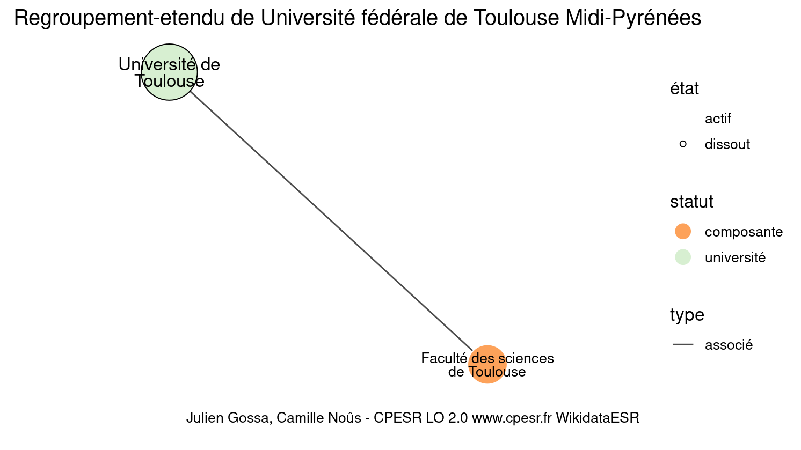

Warnings wikidataESR pour : Université fédérale de Toulouse Midi-Pyrénées(30/12/2021
================

- Edition wikidata : [Q578023](https://www.wikidata.org/wiki/Q578023)
- Guide d'édition : [wikidataESR](https://github.com/cpesr/wikidataESR/)

- Discussion sur le guide d'édition : [github](https://github.com/cpesr/wikidataESR/issues)


## histoire 

 

Problèmes détectés dans les entités :

|entité                                           |alias                  |statut     |message                |
|:------------------------------------------------|:----------------------|:----------|:----------------------|
|[Q578023](https://www.wikidata.org/wiki/Q578023) |université de Toulouse |université |Statut trop imprécis   |
|[Q578023](https://www.wikidata.org/wiki/Q578023) |université de Toulouse |université |Alias manquant ou long |

 


Erreur : les données sont probablement trop partielles.
```
Error in wdesr_ggplot_graph(df, node_size = node_size, label_sizes = label_sizes, : Empty ESR graph: something went wrong with the graph production parameters

``` 


## regroupement-court 

 

Problèmes détectés dans les entités :

|entité                                             |alias                            |statut     |message                     |
|:--------------------------------------------------|:--------------------------------|:----------|:---------------------------|
|[Q578023](https://www.wikidata.org/wiki/Q578023)   |université de Toulouse           |université |Statut trop imprécis        |
|[Q578023](https://www.wikidata.org/wiki/Q578023)   |université de Toulouse           |université |Alias manquant ou long      |
|[Q3064334](https://www.wikidata.org/wiki/Q3064334) |Faculté des sciences de Toulouse |composante |Alias manquant ou long      |
|[Q3064334](https://www.wikidata.org/wiki/Q3064334) |Faculté des sciences de Toulouse |composante |Date de fondation manquante |

Problèmes détectés dans les relations :

|from                                             |to                                                 |type    |message              |
|:------------------------------------------------|:--------------------------------------------------|:-------|:--------------------|
|[Q578023](https://www.wikidata.org/wiki/Q578023) |[Q3064334](https://www.wikidata.org/wiki/Q3064334) |associé |Date(s) manquante(s) |

NB : les dates manquantes pour les relations de composante ne sont pas remontées. 


## regroupement-etendu 

 

Problèmes détectés dans les entités :

|entité                                             |alias                            |statut     |message                     |
|:--------------------------------------------------|:--------------------------------|:----------|:---------------------------|
|[Q578023](https://www.wikidata.org/wiki/Q578023)   |université de Toulouse           |université |Statut trop imprécis        |
|[Q578023](https://www.wikidata.org/wiki/Q578023)   |université de Toulouse           |université |Alias manquant ou long      |
|[Q3064334](https://www.wikidata.org/wiki/Q3064334) |Faculté des sciences de Toulouse |composante |Alias manquant ou long      |
|[Q3064334](https://www.wikidata.org/wiki/Q3064334) |Faculté des sciences de Toulouse |composante |Date de fondation manquante |

Problèmes détectés dans les relations :

|from                                             |to                                                 |type    |message              |
|:------------------------------------------------|:--------------------------------------------------|:-------|:--------------------|
|[Q578023](https://www.wikidata.org/wiki/Q578023) |[Q3064334](https://www.wikidata.org/wiki/Q3064334) |associé |Date(s) manquante(s) |

NB : les dates manquantes pour les relations de composante ne sont pas remontées. 


## regroupement-superetendu 

 

Problèmes détectés dans les entités :

|entité                                             |alias                            |statut     |message                     |
|:--------------------------------------------------|:--------------------------------|:----------|:---------------------------|
|[Q578023](https://www.wikidata.org/wiki/Q578023)   |université de Toulouse           |université |Statut trop imprécis        |
|[Q578023](https://www.wikidata.org/wiki/Q578023)   |université de Toulouse           |université |Alias manquant ou long      |
|[Q3064334](https://www.wikidata.org/wiki/Q3064334) |Faculté des sciences de Toulouse |composante |Alias manquant ou long      |
|[Q3064334](https://www.wikidata.org/wiki/Q3064334) |Faculté des sciences de Toulouse |composante |Date de fondation manquante |

Problèmes détectés dans les relations :

|from                                             |to                                                 |type    |message              |
|:------------------------------------------------|:--------------------------------------------------|:-------|:--------------------|
|[Q578023](https://www.wikidata.org/wiki/Q578023) |[Q3064334](https://www.wikidata.org/wiki/Q3064334) |associé |Date(s) manquante(s) |

NB : les dates manquantes pour les relations de composante ne sont pas remontées. 

