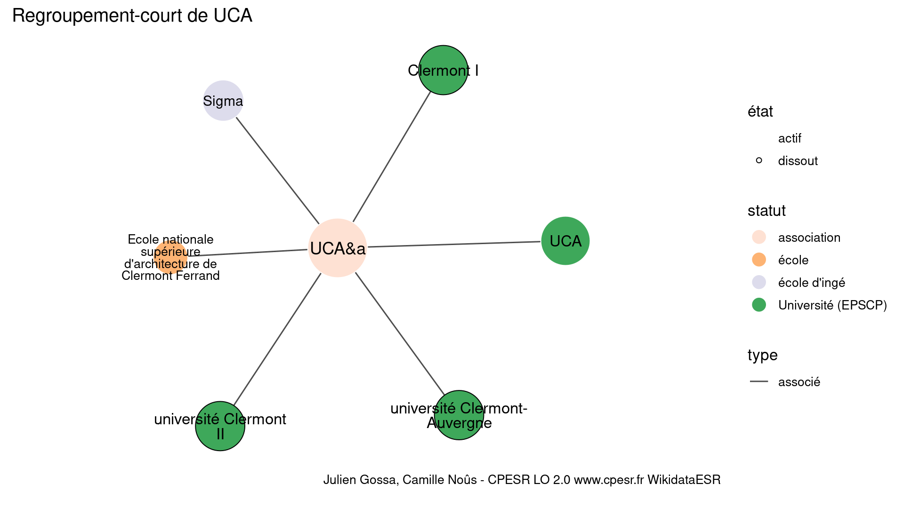
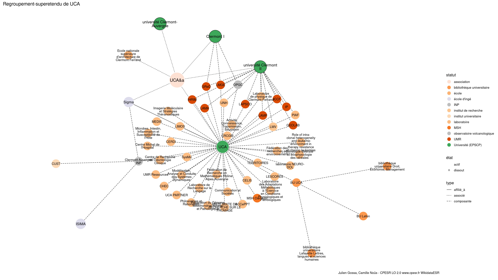

Warnings wikidataESR pour : UCA(01/10/2023
================

- Edition wikidata : [Q61716190](https://www.wikidata.org/wiki/Q61716190)
- Guide d'édition : [wikidataESR](https://github.com/cpesr/wikidataESR/)

- Discussion sur le guide d'édition : [github](https://github.com/cpesr/wikidataESR/issues)


## histoire 

 

Problèmes détectés dans les entités :

|entité                                               |alias |statut      |message              |
|:----------------------------------------------------|:-----|:-----------|:--------------------|
|[Q61716190](https://www.wikidata.org/wiki/Q61716190) |UCA&a |association |Statut trop imprécis |

 


Erreur : les données sont probablement trop partielles.
```
Error in wdesr_ggplot_graph(df, node_size = node_size, label_sizes = label_sizes, : Empty ESR graph: something went wrong with the graph production parameters

``` 


## regroupement-court 

 

Problèmes détectés dans les entités :

|entité                                                 |alias                                                         |statut             |message                |
|:------------------------------------------------------|:-------------------------------------------------------------|:------------------|:----------------------|
|[Q61716190](https://www.wikidata.org/wiki/Q61716190)   |UCA&a                                                         |association        |Statut trop imprécis   |
|[Q612648](https://www.wikidata.org/wiki/Q612648)       |université Clermont II                                        |Université (EPSCP) |Alias manquant ou long |
|[Q21968199](https://www.wikidata.org/wiki/Q21968199)   |Sigma                                                         |école d'ingé       |Statut trop imprécis   |
|[Q3578176](https://www.wikidata.org/wiki/Q3578176)     |Ecole nationale supérieure d'architecture de Clermont Ferrand |école              |Statut trop imprécis   |
|[Q3578176](https://www.wikidata.org/wiki/Q3578176)     |Ecole nationale supérieure d'architecture de Clermont Ferrand |école              |Alias manquant ou long |
|[Q115649685](https://www.wikidata.org/wiki/Q115649685) |université Clermont-Auvergne                                  |Université (EPSCP) |Alias manquant ou long |

Problèmes détectés dans les relations :

|depuis                                               |vers                                                   |type    |message              |
|:----------------------------------------------------|:------------------------------------------------------|:-------|:--------------------|
|[Q61716190](https://www.wikidata.org/wiki/Q61716190) |[Q1319786](https://www.wikidata.org/wiki/Q1319786)     |associé |Date(s) manquante(s) |
|[Q61716190](https://www.wikidata.org/wiki/Q61716190) |[Q1381437](https://www.wikidata.org/wiki/Q1381437)     |associé |Date(s) manquante(s) |
|[Q61716190](https://www.wikidata.org/wiki/Q61716190) |[Q612648](https://www.wikidata.org/wiki/Q612648)       |associé |Date(s) manquante(s) |
|[Q61716190](https://www.wikidata.org/wiki/Q61716190) |[Q21968199](https://www.wikidata.org/wiki/Q21968199)   |associé |Date(s) manquante(s) |
|[Q61716190](https://www.wikidata.org/wiki/Q61716190) |[Q3578176](https://www.wikidata.org/wiki/Q3578176)     |associé |Date(s) manquante(s) |
|[Q61716190](https://www.wikidata.org/wiki/Q61716190) |[Q115649685](https://www.wikidata.org/wiki/Q115649685) |associé |Date(s) manquante(s) |

NB : les dates manquantes pour les relations de composante ne sont pas remontées. 


## regroupement-etendu 

 

Problèmes détectés dans les entités :

|entité                                                 |alias                                                                                                  |statut                |message                     |
|:------------------------------------------------------|:------------------------------------------------------------------------------------------------------|:---------------------|:---------------------------|
|[Q61716190](https://www.wikidata.org/wiki/Q61716190)   |UCA&a                                                                                                  |association           |Statut trop imprécis        |
|[Q51785611](https://www.wikidata.org/wiki/Q51785611)   |CELIS                                                                                                  |laboratoire           |Statut trop imprécis        |
|[Q51781159](https://www.wikidata.org/wiki/Q51781159)   |laboratoire NEURO-DOL                                                                                  |laboratoire           |Statut trop imprécis        |
|[Q51781159](https://www.wikidata.org/wiki/Q51781159)   |laboratoire NEURO-DOL                                                                                  |laboratoire           |Alias manquant ou long      |
|[Q51784438](https://www.wikidata.org/wiki/Q51784438)   |Communication et Sociétés                                                                              |laboratoire           |Statut trop imprécis        |
|[Q51784438](https://www.wikidata.org/wiki/Q51784438)   |Communication et Sociétés                                                                              |laboratoire           |Alias manquant ou long      |
|[Q52557873](https://www.wikidata.org/wiki/Q52557873)   |MEDIS                                                                                                  |laboratoire           |Statut trop imprécis        |
|[Q52557873](https://www.wikidata.org/wiki/Q52557873)   |MEDIS                                                                                                  |laboratoire           |Date de fondation manquante |
|[Q52557874](https://www.wikidata.org/wiki/Q52557874)   |UNITÉ MIXTE DE RECHERCHE SUR LE FROMAGE                                                                |laboratoire           |Statut trop imprécis        |
|[Q52557874](https://www.wikidata.org/wiki/Q52557874)   |UNITÉ MIXTE DE RECHERCHE SUR LE FROMAGE                                                                |laboratoire           |Alias manquant ou long      |
|[Q52557874](https://www.wikidata.org/wiki/Q52557874)   |UNITÉ MIXTE DE RECHERCHE SUR LE FROMAGE                                                                |laboratoire           |Date de fondation manquante |
|[Q3214474](https://www.wikidata.org/wiki/Q3214474)     |Laboratoire de physique de Clermont-Ferrand                                                            |laboratoire           |Statut trop imprécis        |
|[Q3214474](https://www.wikidata.org/wiki/Q3214474)     |Laboratoire de physique de Clermont-Ferrand                                                            |laboratoire           |Alias manquant ou long      |
|[Q3206056](https://www.wikidata.org/wiki/Q3206056)     |LIMOS                                                                                                  |laboratoire           |Statut trop imprécis        |
|[Q3214374](https://www.wikidata.org/wiki/Q3214374)     |LMV                                                                                                    |institut de recherche |Statut trop imprécis        |
|[Q51780004](https://www.wikidata.org/wiki/Q51780004)   |Modélisation, Analyse et Conduite des Systèmes Dynamiques                                              |laboratoire           |Statut trop imprécis        |
|[Q51780004](https://www.wikidata.org/wiki/Q51780004)   |Modélisation, Analyse et Conduite des Systèmes Dynamiques                                              |laboratoire           |Alias manquant ou long      |
|[Q51782306](https://www.wikidata.org/wiki/Q51782306)   |Laboratoire de Recherche sur le Langage                                                                |laboratoire           |Statut trop imprécis        |
|[Q51782306](https://www.wikidata.org/wiki/Q51782306)   |Laboratoire de Recherche sur le Langage                                                                |laboratoire           |Alias manquant ou long      |
|[Q52604651](https://www.wikidata.org/wiki/Q52604651)   |Génétique diversité et écophysiologie des céréales                                                     |laboratoire           |Statut trop imprécis        |
|[Q52604651](https://www.wikidata.org/wiki/Q52604651)   |Génétique diversité et écophysiologie des céréales                                                     |laboratoire           |Alias manquant ou long      |
|[Q52604651](https://www.wikidata.org/wiki/Q52604651)   |Génétique diversité et écophysiologie des céréales                                                     |laboratoire           |Date de fondation manquante |
|[Q51780157](https://www.wikidata.org/wiki/Q51780157)   |CRCGM                                                                                                  |laboratoire           |Statut trop imprécis        |
|[Q111600920](https://www.wikidata.org/wiki/Q111600920) |Imagerie Moléculaire et Stratégies Théranostiques                                                      |laboratoire           |Statut trop imprécis        |
|[Q111600920](https://www.wikidata.org/wiki/Q111600920) |Imagerie Moléculaire et Stratégies Théranostiques                                                      |laboratoire           |Alias manquant ou long      |
|[Q111600920](https://www.wikidata.org/wiki/Q111600920) |Imagerie Moléculaire et Stratégies Théranostiques                                                      |laboratoire           |Date de fondation manquante |
|[Q111600939](https://www.wikidata.org/wiki/Q111600939) |SysMic                                                                                                 |laboratoire           |Statut trop imprécis        |
|[Q111600939](https://www.wikidata.org/wiki/Q111600939) |SysMic                                                                                                 |laboratoire           |Date de fondation manquante |
|[Q111600946](https://www.wikidata.org/wiki/Q111600946) |UCA PARTNER                                                                                            |laboratoire           |Statut trop imprécis        |
|[Q111600946](https://www.wikidata.org/wiki/Q111600946) |UCA PARTNER                                                                                            |laboratoire           |Date de fondation manquante |
|[Q111600950](https://www.wikidata.org/wiki/Q111600950) |ACCePPT                                                                                                |laboratoire           |Statut trop imprécis        |
|[Q111600950](https://www.wikidata.org/wiki/Q111600950) |ACCePPT                                                                                                |laboratoire           |Date de fondation manquante |
|[Q111600956](https://www.wikidata.org/wiki/Q111600956) |LESCORES                                                                                               |laboratoire           |Statut trop imprécis        |
|[Q111600956](https://www.wikidata.org/wiki/Q111600956) |LESCORES                                                                                               |laboratoire           |Date de fondation manquante |
|[Q111600984](https://www.wikidata.org/wiki/Q111600984) |UMR Ressources                                                                                         |laboratoire           |Statut trop imprécis        |
|[Q111600984](https://www.wikidata.org/wiki/Q111600984) |UMR Ressources                                                                                         |laboratoire           |Date de fondation manquante |
|[Q30261518](https://www.wikidata.org/wiki/Q30261518)   |UNH                                                                                                    |laboratoire           |Statut trop imprécis        |
|[Q51781838](https://www.wikidata.org/wiki/Q51781838)   |Centre de Recherche en Odontologie Clinique                                                            |laboratoire           |Statut trop imprécis        |
|[Q51781838](https://www.wikidata.org/wiki/Q51781838)   |Centre de Recherche en Odontologie Clinique                                                            |laboratoire           |Alias manquant ou long      |
|[Q51784454](https://www.wikidata.org/wiki/Q51784454)   |Réparation du Génome Mitochondrial Normal et Pathologique                                              |laboratoire           |Statut trop imprécis        |
|[Q51784454](https://www.wikidata.org/wiki/Q51784454)   |Réparation du Génome Mitochondrial Normal et Pathologique                                              |laboratoire           |Alias manquant ou long      |
|[Q51783626](https://www.wikidata.org/wiki/Q51783626)   |Philosophies et Rationalités                                                                           |laboratoire           |Statut trop imprécis        |
|[Q51783626](https://www.wikidata.org/wiki/Q51783626)   |Philosophies et Rationalités                                                                           |laboratoire           |Alias manquant ou long      |
|[Q51785442](https://www.wikidata.org/wiki/Q51785442)   |Fédération de Recherche en Mathématiques Rhône-Alpes-Auvergne                                          |laboratoire           |Statut trop imprécis        |
|[Q51785442](https://www.wikidata.org/wiki/Q51785442)   |Fédération de Recherche en Mathématiques Rhône-Alpes-Auvergne                                          |laboratoire           |Alias manquant ou long      |
|[Q52604683](https://www.wikidata.org/wiki/Q52604683)   |Fédération des recherches en environnement                                                             |laboratoire           |Statut trop imprécis        |
|[Q52604683](https://www.wikidata.org/wiki/Q52604683)   |Fédération des recherches en environnement                                                             |laboratoire           |Alias manquant ou long      |
|[Q51782286](https://www.wikidata.org/wiki/Q51782286)   |CHEC                                                                                                   |laboratoire           |Statut trop imprécis        |
|[Q51782916](https://www.wikidata.org/wiki/Q51782916)   |Laboratoire des Adaptations Métaboliques à l'Exercice en Conditions Physiologiques et Pathologiques    |laboratoire           |Statut trop imprécis        |
|[Q51782916](https://www.wikidata.org/wiki/Q51782916)   |Laboratoire des Adaptations Métaboliques à l'Exercice en Conditions Physiologiques et Pathologiques    |laboratoire           |Alias manquant ou long      |
|[Q30262506](https://www.wikidata.org/wiki/Q30262506)   |PIAF                                                                                                   |laboratoire           |Statut trop imprécis        |
|[Q51779868](https://www.wikidata.org/wiki/Q51779868)   |Microbes, Intestin, Inflammation et Susceptibilité de l'Hôte                                           |laboratoire           |Statut trop imprécis        |
|[Q51779868](https://www.wikidata.org/wiki/Q51779868)   |Microbes, Intestin, Inflammation et Susceptibilité de l'Hôte                                           |laboratoire           |Alias manquant ou long      |
|[Q51779973](https://www.wikidata.org/wiki/Q51779973)   |Activité, Connaissance, Transmission, Éducation                                                        |laboratoire           |Statut trop imprécis        |
|[Q51779973](https://www.wikidata.org/wiki/Q51779973)   |Activité, Connaissance, Transmission, Éducation                                                        |laboratoire           |Alias manquant ou long      |
|[Q51781081](https://www.wikidata.org/wiki/Q51781081)   |CERDI                                                                                                  |laboratoire           |Statut trop imprécis        |
|[Q51780387](https://www.wikidata.org/wiki/Q51780387)   |Centre Michel de l'Hospital                                                                            |laboratoire           |Statut trop imprécis        |
|[Q51780387](https://www.wikidata.org/wiki/Q51780387)   |Centre Michel de l'Hospital                                                                            |laboratoire           |Alias manquant ou long      |
|[Q52557906](https://www.wikidata.org/wiki/Q52557906)   |TERRITOIRES                                                                                            |laboratoire           |Statut trop imprécis        |
|[Q52557906](https://www.wikidata.org/wiki/Q52557906)   |TERRITOIRES                                                                                            |laboratoire           |Date de fondation manquante |
|[Q52604750](https://www.wikidata.org/wiki/Q52604750)   |Role of intra-clonal heterogeneity and leukemic environment in therapy resistance of chronic leukemias |laboratoire           |Statut trop imprécis        |
|[Q52604750](https://www.wikidata.org/wiki/Q52604750)   |Role of intra-clonal heterogeneity and leukemic environment in therapy resistance of chronic leukemias |laboratoire           |Alias manquant ou long      |
|[Q52604750](https://www.wikidata.org/wiki/Q52604750)   |Role of intra-clonal heterogeneity and leukemic environment in therapy resistance of chronic leukemias |laboratoire           |Date de fondation manquante |
|[Q105809850](https://www.wikidata.org/wiki/Q105809850) |Clermont Auvergne INP                                                                                  |INP                   |Alias manquant ou long      |
|[Q612648](https://www.wikidata.org/wiki/Q612648)       |université Clermont II                                                                                 |Université (EPSCP)    |Alias manquant ou long      |
|[Q21968199](https://www.wikidata.org/wiki/Q21968199)   |Sigma                                                                                                  |école d'ingé          |Statut trop imprécis        |
|[Q3578176](https://www.wikidata.org/wiki/Q3578176)     |Ecole nationale supérieure d'architecture de Clermont Ferrand                                          |école                 |Statut trop imprécis        |
|[Q3578176](https://www.wikidata.org/wiki/Q3578176)     |Ecole nationale supérieure d'architecture de Clermont Ferrand                                          |école                 |Alias manquant ou long      |
|[Q115649685](https://www.wikidata.org/wiki/Q115649685) |université Clermont-Auvergne                                                                           |Université (EPSCP)    |Alias manquant ou long      |

Problèmes détectés dans les relations :

|depuis                                               |vers                                                   |type      |message              |
|:----------------------------------------------------|:------------------------------------------------------|:---------|:--------------------|
|[Q61716190](https://www.wikidata.org/wiki/Q61716190) |[Q1319786](https://www.wikidata.org/wiki/Q1319786)     |associé   |Date(s) manquante(s) |
|[Q61716190](https://www.wikidata.org/wiki/Q61716190) |[Q1381437](https://www.wikidata.org/wiki/Q1381437)     |associé   |Date(s) manquante(s) |
|[Q61716190](https://www.wikidata.org/wiki/Q61716190) |[Q612648](https://www.wikidata.org/wiki/Q612648)       |associé   |Date(s) manquante(s) |
|[Q61716190](https://www.wikidata.org/wiki/Q61716190) |[Q21968199](https://www.wikidata.org/wiki/Q21968199)   |associé   |Date(s) manquante(s) |
|[Q61716190](https://www.wikidata.org/wiki/Q61716190) |[Q3578176](https://www.wikidata.org/wiki/Q3578176)     |associé   |Date(s) manquante(s) |
|[Q61716190](https://www.wikidata.org/wiki/Q61716190) |[Q115649685](https://www.wikidata.org/wiki/Q115649685) |associé   |Date(s) manquante(s) |
|[Q21968199](https://www.wikidata.org/wiki/Q21968199) |[Q1319786](https://www.wikidata.org/wiki/Q1319786)     |affilié_à |Date(s) manquante(s) |

NB : les dates manquantes pour les relations de composante ne sont pas remontées. 


## regroupement-superetendu 

 

Problèmes détectés dans les entités :

|entité                                                 |alias                                                                                                  |statut                     |message                     |
|:------------------------------------------------------|:------------------------------------------------------------------------------------------------------|:--------------------------|:---------------------------|
|[Q61716190](https://www.wikidata.org/wiki/Q61716190)   |UCA&a                                                                                                  |association                |Statut trop imprécis        |
|[Q51785611](https://www.wikidata.org/wiki/Q51785611)   |CELIS                                                                                                  |laboratoire                |Statut trop imprécis        |
|[Q51781159](https://www.wikidata.org/wiki/Q51781159)   |laboratoire NEURO-DOL                                                                                  |laboratoire                |Statut trop imprécis        |
|[Q51781159](https://www.wikidata.org/wiki/Q51781159)   |laboratoire NEURO-DOL                                                                                  |laboratoire                |Alias manquant ou long      |
|[Q51784438](https://www.wikidata.org/wiki/Q51784438)   |Communication et Sociétés                                                                              |laboratoire                |Statut trop imprécis        |
|[Q51784438](https://www.wikidata.org/wiki/Q51784438)   |Communication et Sociétés                                                                              |laboratoire                |Alias manquant ou long      |
|[Q52557873](https://www.wikidata.org/wiki/Q52557873)   |MEDIS                                                                                                  |laboratoire                |Statut trop imprécis        |
|[Q52557873](https://www.wikidata.org/wiki/Q52557873)   |MEDIS                                                                                                  |laboratoire                |Date de fondation manquante |
|[Q52557874](https://www.wikidata.org/wiki/Q52557874)   |UNITÉ MIXTE DE RECHERCHE SUR LE FROMAGE                                                                |laboratoire                |Statut trop imprécis        |
|[Q52557874](https://www.wikidata.org/wiki/Q52557874)   |UNITÉ MIXTE DE RECHERCHE SUR LE FROMAGE                                                                |laboratoire                |Alias manquant ou long      |
|[Q52557874](https://www.wikidata.org/wiki/Q52557874)   |UNITÉ MIXTE DE RECHERCHE SUR LE FROMAGE                                                                |laboratoire                |Date de fondation manquante |
|[Q3214474](https://www.wikidata.org/wiki/Q3214474)     |Laboratoire de physique de Clermont-Ferrand                                                            |laboratoire                |Statut trop imprécis        |
|[Q3214474](https://www.wikidata.org/wiki/Q3214474)     |Laboratoire de physique de Clermont-Ferrand                                                            |laboratoire                |Alias manquant ou long      |
|[Q3206056](https://www.wikidata.org/wiki/Q3206056)     |LIMOS                                                                                                  |laboratoire                |Statut trop imprécis        |
|[Q3214374](https://www.wikidata.org/wiki/Q3214374)     |LMV                                                                                                    |institut de recherche      |Statut trop imprécis        |
|[Q51780004](https://www.wikidata.org/wiki/Q51780004)   |Modélisation, Analyse et Conduite des Systèmes Dynamiques                                              |laboratoire                |Statut trop imprécis        |
|[Q51780004](https://www.wikidata.org/wiki/Q51780004)   |Modélisation, Analyse et Conduite des Systèmes Dynamiques                                              |laboratoire                |Alias manquant ou long      |
|[Q51782306](https://www.wikidata.org/wiki/Q51782306)   |Laboratoire de Recherche sur le Langage                                                                |laboratoire                |Statut trop imprécis        |
|[Q51782306](https://www.wikidata.org/wiki/Q51782306)   |Laboratoire de Recherche sur le Langage                                                                |laboratoire                |Alias manquant ou long      |
|[Q52604651](https://www.wikidata.org/wiki/Q52604651)   |Génétique diversité et écophysiologie des céréales                                                     |laboratoire                |Statut trop imprécis        |
|[Q52604651](https://www.wikidata.org/wiki/Q52604651)   |Génétique diversité et écophysiologie des céréales                                                     |laboratoire                |Alias manquant ou long      |
|[Q52604651](https://www.wikidata.org/wiki/Q52604651)   |Génétique diversité et écophysiologie des céréales                                                     |laboratoire                |Date de fondation manquante |
|[Q51780157](https://www.wikidata.org/wiki/Q51780157)   |CRCGM                                                                                                  |laboratoire                |Statut trop imprécis        |
|[Q111600920](https://www.wikidata.org/wiki/Q111600920) |Imagerie Moléculaire et Stratégies Théranostiques                                                      |laboratoire                |Statut trop imprécis        |
|[Q111600920](https://www.wikidata.org/wiki/Q111600920) |Imagerie Moléculaire et Stratégies Théranostiques                                                      |laboratoire                |Alias manquant ou long      |
|[Q111600920](https://www.wikidata.org/wiki/Q111600920) |Imagerie Moléculaire et Stratégies Théranostiques                                                      |laboratoire                |Date de fondation manquante |
|[Q111600939](https://www.wikidata.org/wiki/Q111600939) |SysMic                                                                                                 |laboratoire                |Statut trop imprécis        |
|[Q111600939](https://www.wikidata.org/wiki/Q111600939) |SysMic                                                                                                 |laboratoire                |Date de fondation manquante |
|[Q111600946](https://www.wikidata.org/wiki/Q111600946) |UCA PARTNER                                                                                            |laboratoire                |Statut trop imprécis        |
|[Q111600946](https://www.wikidata.org/wiki/Q111600946) |UCA PARTNER                                                                                            |laboratoire                |Date de fondation manquante |
|[Q111600950](https://www.wikidata.org/wiki/Q111600950) |ACCePPT                                                                                                |laboratoire                |Statut trop imprécis        |
|[Q111600950](https://www.wikidata.org/wiki/Q111600950) |ACCePPT                                                                                                |laboratoire                |Date de fondation manquante |
|[Q111600956](https://www.wikidata.org/wiki/Q111600956) |LESCORES                                                                                               |laboratoire                |Statut trop imprécis        |
|[Q111600956](https://www.wikidata.org/wiki/Q111600956) |LESCORES                                                                                               |laboratoire                |Date de fondation manquante |
|[Q111600984](https://www.wikidata.org/wiki/Q111600984) |UMR Ressources                                                                                         |laboratoire                |Statut trop imprécis        |
|[Q111600984](https://www.wikidata.org/wiki/Q111600984) |UMR Ressources                                                                                         |laboratoire                |Date de fondation manquante |
|[Q30261518](https://www.wikidata.org/wiki/Q30261518)   |UNH                                                                                                    |laboratoire                |Statut trop imprécis        |
|[Q51781838](https://www.wikidata.org/wiki/Q51781838)   |Centre de Recherche en Odontologie Clinique                                                            |laboratoire                |Statut trop imprécis        |
|[Q51781838](https://www.wikidata.org/wiki/Q51781838)   |Centre de Recherche en Odontologie Clinique                                                            |laboratoire                |Alias manquant ou long      |
|[Q51784454](https://www.wikidata.org/wiki/Q51784454)   |Réparation du Génome Mitochondrial Normal et Pathologique                                              |laboratoire                |Statut trop imprécis        |
|[Q51784454](https://www.wikidata.org/wiki/Q51784454)   |Réparation du Génome Mitochondrial Normal et Pathologique                                              |laboratoire                |Alias manquant ou long      |
|[Q51783626](https://www.wikidata.org/wiki/Q51783626)   |Philosophies et Rationalités                                                                           |laboratoire                |Statut trop imprécis        |
|[Q51783626](https://www.wikidata.org/wiki/Q51783626)   |Philosophies et Rationalités                                                                           |laboratoire                |Alias manquant ou long      |
|[Q51785442](https://www.wikidata.org/wiki/Q51785442)   |Fédération de Recherche en Mathématiques Rhône-Alpes-Auvergne                                          |laboratoire                |Statut trop imprécis        |
|[Q51785442](https://www.wikidata.org/wiki/Q51785442)   |Fédération de Recherche en Mathématiques Rhône-Alpes-Auvergne                                          |laboratoire                |Alias manquant ou long      |
|[Q52604683](https://www.wikidata.org/wiki/Q52604683)   |Fédération des recherches en environnement                                                             |laboratoire                |Statut trop imprécis        |
|[Q52604683](https://www.wikidata.org/wiki/Q52604683)   |Fédération des recherches en environnement                                                             |laboratoire                |Alias manquant ou long      |
|[Q51782286](https://www.wikidata.org/wiki/Q51782286)   |CHEC                                                                                                   |laboratoire                |Statut trop imprécis        |
|[Q51782916](https://www.wikidata.org/wiki/Q51782916)   |Laboratoire des Adaptations Métaboliques à l'Exercice en Conditions Physiologiques et Pathologiques    |laboratoire                |Statut trop imprécis        |
|[Q51782916](https://www.wikidata.org/wiki/Q51782916)   |Laboratoire des Adaptations Métaboliques à l'Exercice en Conditions Physiologiques et Pathologiques    |laboratoire                |Alias manquant ou long      |
|[Q30262506](https://www.wikidata.org/wiki/Q30262506)   |PIAF                                                                                                   |laboratoire                |Statut trop imprécis        |
|[Q51779868](https://www.wikidata.org/wiki/Q51779868)   |Microbes, Intestin, Inflammation et Susceptibilité de l'Hôte                                           |laboratoire                |Statut trop imprécis        |
|[Q51779868](https://www.wikidata.org/wiki/Q51779868)   |Microbes, Intestin, Inflammation et Susceptibilité de l'Hôte                                           |laboratoire                |Alias manquant ou long      |
|[Q51779973](https://www.wikidata.org/wiki/Q51779973)   |Activité, Connaissance, Transmission, Éducation                                                        |laboratoire                |Statut trop imprécis        |
|[Q51779973](https://www.wikidata.org/wiki/Q51779973)   |Activité, Connaissance, Transmission, Éducation                                                        |laboratoire                |Alias manquant ou long      |
|[Q51781081](https://www.wikidata.org/wiki/Q51781081)   |CERDI                                                                                                  |laboratoire                |Statut trop imprécis        |
|[Q51780387](https://www.wikidata.org/wiki/Q51780387)   |Centre Michel de l'Hospital                                                                            |laboratoire                |Statut trop imprécis        |
|[Q51780387](https://www.wikidata.org/wiki/Q51780387)   |Centre Michel de l'Hospital                                                                            |laboratoire                |Alias manquant ou long      |
|[Q52557906](https://www.wikidata.org/wiki/Q52557906)   |TERRITOIRES                                                                                            |laboratoire                |Statut trop imprécis        |
|[Q52557906](https://www.wikidata.org/wiki/Q52557906)   |TERRITOIRES                                                                                            |laboratoire                |Date de fondation manquante |
|[Q52604750](https://www.wikidata.org/wiki/Q52604750)   |Role of intra-clonal heterogeneity and leukemic environment in therapy resistance of chronic leukemias |laboratoire                |Statut trop imprécis        |
|[Q52604750](https://www.wikidata.org/wiki/Q52604750)   |Role of intra-clonal heterogeneity and leukemic environment in therapy resistance of chronic leukemias |laboratoire                |Alias manquant ou long      |
|[Q52604750](https://www.wikidata.org/wiki/Q52604750)   |Role of intra-clonal heterogeneity and leukemic environment in therapy resistance of chronic leukemias |laboratoire                |Date de fondation manquante |
|[Q109544798](https://www.wikidata.org/wiki/Q109544798) |BU Lafon                                                                                               |bibliothèque universitaire |Date de fondation manquante |
|[Q108393092](https://www.wikidata.org/wiki/Q108393092) |bibliothèque universitaire Lafayette Lettres, langues et sciences humaines                             |bibliothèque universitaire |Alias manquant ou long      |
|[Q108393092](https://www.wikidata.org/wiki/Q108393092) |bibliothèque universitaire Lafayette Lettres, langues et sciences humaines                             |bibliothèque universitaire |Date de fondation manquante |
|[Q110453406](https://www.wikidata.org/wiki/Q110453406) |bibliothèque universitaire Droit, Économie, Management                                                 |bibliothèque universitaire |Alias manquant ou long      |
|[Q110453406](https://www.wikidata.org/wiki/Q110453406) |bibliothèque universitaire Droit, Économie, Management                                                 |bibliothèque universitaire |Date de fondation manquante |
|[Q105809850](https://www.wikidata.org/wiki/Q105809850) |Clermont Auvergne INP                                                                                  |INP                        |Alias manquant ou long      |
|[Q21968199](https://www.wikidata.org/wiki/Q21968199)   |Sigma                                                                                                  |école d'ingé               |Statut trop imprécis        |
|[Q3395833](https://www.wikidata.org/wiki/Q3395833)     |CUST                                                                                                   |institut universitaire     |Statut trop imprécis        |
|[Q3152528](https://www.wikidata.org/wiki/Q3152528)     |ISIMA                                                                                                  |école d'ingé               |Statut trop imprécis        |
|[Q612648](https://www.wikidata.org/wiki/Q612648)       |université Clermont II                                                                                 |Université (EPSCP)         |Alias manquant ou long      |
|[Q3578176](https://www.wikidata.org/wiki/Q3578176)     |Ecole nationale supérieure d'architecture de Clermont Ferrand                                          |école                      |Statut trop imprécis        |
|[Q3578176](https://www.wikidata.org/wiki/Q3578176)     |Ecole nationale supérieure d'architecture de Clermont Ferrand                                          |école                      |Alias manquant ou long      |
|[Q115649685](https://www.wikidata.org/wiki/Q115649685) |université Clermont-Auvergne                                                                           |Université (EPSCP)         |Alias manquant ou long      |

Problèmes détectés dans les relations :

|depuis                                               |vers                                                   |type      |message              |
|:----------------------------------------------------|:------------------------------------------------------|:---------|:--------------------|
|[Q61716190](https://www.wikidata.org/wiki/Q61716190) |[Q1319786](https://www.wikidata.org/wiki/Q1319786)     |associé   |Date(s) manquante(s) |
|[Q61716190](https://www.wikidata.org/wiki/Q61716190) |[Q1381437](https://www.wikidata.org/wiki/Q1381437)     |associé   |Date(s) manquante(s) |
|[Q61716190](https://www.wikidata.org/wiki/Q61716190) |[Q612648](https://www.wikidata.org/wiki/Q612648)       |associé   |Date(s) manquante(s) |
|[Q61716190](https://www.wikidata.org/wiki/Q61716190) |[Q21968199](https://www.wikidata.org/wiki/Q21968199)   |associé   |Date(s) manquante(s) |
|[Q61716190](https://www.wikidata.org/wiki/Q61716190) |[Q3578176](https://www.wikidata.org/wiki/Q3578176)     |associé   |Date(s) manquante(s) |
|[Q61716190](https://www.wikidata.org/wiki/Q61716190) |[Q115649685](https://www.wikidata.org/wiki/Q115649685) |associé   |Date(s) manquante(s) |
|[Q21968199](https://www.wikidata.org/wiki/Q21968199) |[Q1319786](https://www.wikidata.org/wiki/Q1319786)     |affilié_à |Date(s) manquante(s) |

NB : les dates manquantes pour les relations de composante ne sont pas remontées. 

