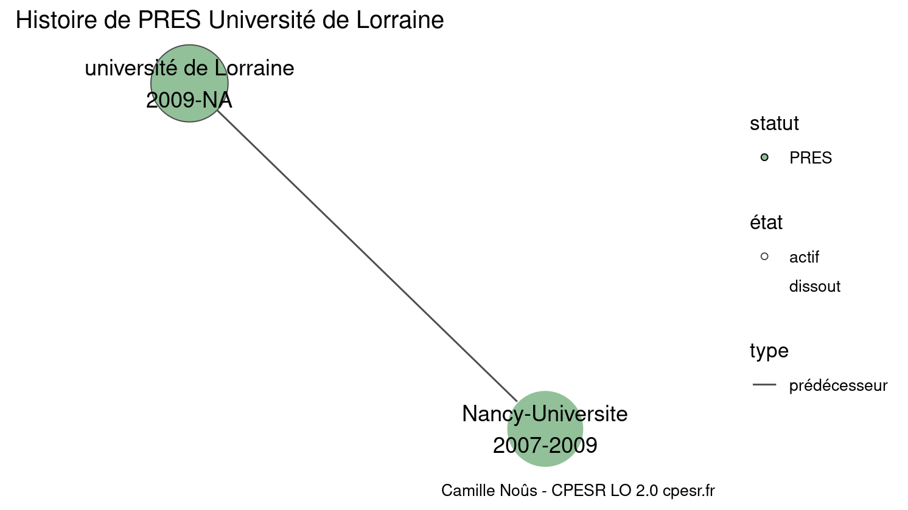

Warnings wikidataESR pour : PRES Université de Lorraine(01/10/2023
================

- Edition wikidata : [Q64590454](https://www.wikidata.org/wiki/Q64590454)
- Guide d'édition : [wikidataESR](https://github.com/cpesr/wikidataESR/)

- Discussion sur le guide d'édition : [github](https://github.com/cpesr/wikidataESR/issues)

## histoire 

 

Problèmes détectés dans les entités :

|entité                                               |alias                  |statut |message                |
|:----------------------------------------------------|:----------------------|:------|:----------------------|
|[Q64590454](https://www.wikidata.org/wiki/Q64590454) |université de Lorraine |PRES   |Alias manquant ou long |

Problèmes détectés dans les relations :

|depuis                                               |vers                                               |type         |message              |
|:----------------------------------------------------|:--------------------------------------------------|:------------|:--------------------|
|[Q64590454](https://www.wikidata.org/wiki/Q64590454) |[Q1249188](https://www.wikidata.org/wiki/Q1249188) |prédécesseur |Date(s) manquante(s) |

NB : les dates manquantes pour les relations de composante ne sont pas remontées. 

## regroupement-court 

 

Problèmes détectés dans les entités :

|entité                                               |alias                  |statut     |message                |
|:----------------------------------------------------|:----------------------|:----------|:----------------------|
|[Q64590454](https://www.wikidata.org/wiki/Q64590454) |université de Lorraine |PRES       |Alias manquant ou long |
|[Q2033673](https://www.wikidata.org/wiki/Q2033673)   |Uhp                    |université |Statut trop imprécis   |
|[Q2473125](https://www.wikidata.org/wiki/Q2473125)   |Nancy 2                |université |Statut trop imprécis   |
|[Q1132955](https://www.wikidata.org/wiki/Q1132955)   |INPL                   |université |Statut trop imprécis   |
|[Q1465237](https://www.wikidata.org/wiki/Q1465237)   |UPV-M                  |université |Statut trop imprécis   |

 

## regroupement-etendu 

 

Problèmes détectés dans les entités :

|entité                                               |alias                  |statut     |message                |
|:----------------------------------------------------|:----------------------|:----------|:----------------------|
|[Q64590454](https://www.wikidata.org/wiki/Q64590454) |université de Lorraine |PRES       |Alias manquant ou long |
|[Q2033673](https://www.wikidata.org/wiki/Q2033673)   |Uhp                    |université |Statut trop imprécis   |
|[Q2473125](https://www.wikidata.org/wiki/Q2473125)   |Nancy 2                |université |Statut trop imprécis   |
|[Q1132955](https://www.wikidata.org/wiki/Q1132955)   |INPL                   |université |Statut trop imprécis   |
|[Q1465237](https://www.wikidata.org/wiki/Q1465237)   |UPV-M                  |université |Statut trop imprécis   |

 

## regroupement-superetendu 

 

Problèmes détectés dans les entités :

|entité                                                 |alias                  |statut              |message                |
|:------------------------------------------------------|:----------------------|:-------------------|:----------------------|
|[Q64590454](https://www.wikidata.org/wiki/Q64590454)   |université de Lorraine |PRES                |Alias manquant ou long |
|[Q2033673](https://www.wikidata.org/wiki/Q2033673)     |Uhp                    |université          |Statut trop imprécis   |
|[Q2473125](https://www.wikidata.org/wiki/Q2473125)     |Nancy 2                |université          |Statut trop imprécis   |
|[Q104776718](https://www.wikidata.org/wiki/Q104776718) |GRAP                   |centre de recherche |Statut trop imprécis   |
|[Q1132955](https://www.wikidata.org/wiki/Q1132955)     |INPL                   |université          |Statut trop imprécis   |
|[Q1465237](https://www.wikidata.org/wiki/Q1465237)     |UPV-M                  |université          |Statut trop imprécis   |

Problèmes détectés dans les relations :

|depuis                                             |vers                                                   |type    |message              |
|:--------------------------------------------------|:------------------------------------------------------|:-------|:--------------------|
|[Q2845219](https://www.wikidata.org/wiki/Q2845219) |[Q104776718](https://www.wikidata.org/wiki/Q104776718) |associé |Date(s) manquante(s) |

NB : les dates manquantes pour les relations de composante ne sont pas remontées. 

