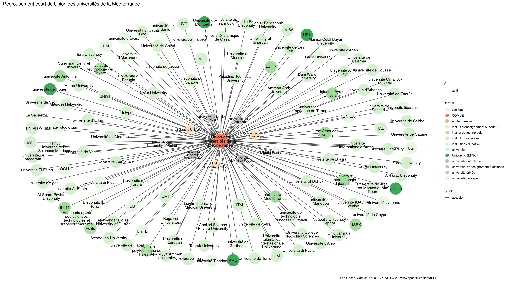

Warnings wikidataESR pour : Union des universités de la Méditerranée(01/09/2022
================

- Edition wikidata : [Q850927](https://www.wikidata.org/wiki/Q850927)
- Guide d'édition : [wikidataESR](https://github.com/cpesr/wikidataESR/)

- Discussion sur le guide d'édition : [github](https://github.com/cpesr/wikidataESR/issues)


## histoire 

 

Problèmes détectés dans les entités :

|entité                                           |alias                                    |statut |message                |
|:------------------------------------------------|:----------------------------------------|:------|:----------------------|
|[Q850927](https://www.wikidata.org/wiki/Q850927) |Union des universités de la Méditerranée |COMUE  |Alias manquant ou long |

 


Erreur : les données sont probablement trop partielles.
```
Error in wdesr_ggplot_graph(df, node_size = node_size, label_sizes = label_sizes, : Empty ESR graph: something went wrong with the graph production parameters

``` 


## regroupement-court 

 

Problèmes détectés dans les entités :

|entité                                           |alias                                    |statut |message                |
|:------------------------------------------------|:----------------------------------------|:------|:----------------------|
|[Q850927](https://www.wikidata.org/wiki/Q850927) |Union des universités de la Méditerranée |COMUE  |Alias manquant ou long |

 


Erreur : les données sont probablement trop partielles.
```
Error in wdesr_ggplot_graph(df, node_size = node_size, label_sizes = label_sizes, : Empty ESR graph: something went wrong with the graph production parameters

``` 


## regroupement-etendu 

 

Problèmes détectés dans les entités :

|entité                                           |alias                                    |statut |message                |
|:------------------------------------------------|:----------------------------------------|:------|:----------------------|
|[Q850927](https://www.wikidata.org/wiki/Q850927) |Union des universités de la Méditerranée |COMUE  |Alias manquant ou long |

 


Erreur : les données sont probablement trop partielles.
```
Error in wdesr_ggplot_graph(df, node_size = node_size, label_sizes = label_sizes, : Empty ESR graph: something went wrong with the graph production parameters

``` 


## regroupement-superetendu 

 

Problèmes détectés dans les entités :

|entité                                           |alias                                    |statut |message                |
|:------------------------------------------------|:----------------------------------------|:------|:----------------------|
|[Q850927](https://www.wikidata.org/wiki/Q850927) |Union des universités de la Méditerranée |COMUE  |Alias manquant ou long |

 


Erreur : les données sont probablement trop partielles.
```
Error in wdesr_ggplot_graph(df, node_size = node_size, label_sizes = label_sizes, : Empty ESR graph: something went wrong with the graph production parameters

``` 

